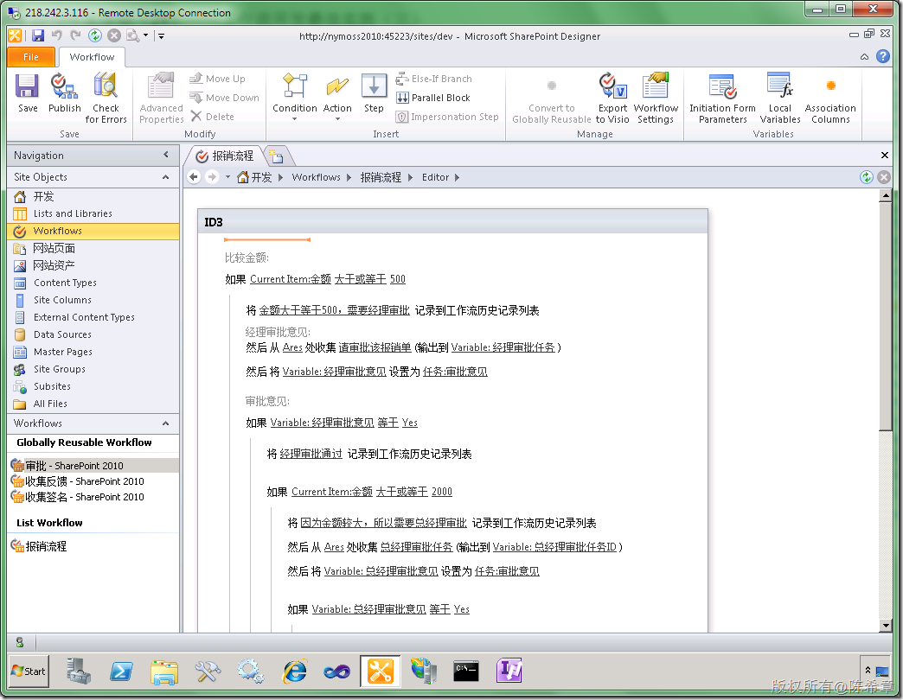
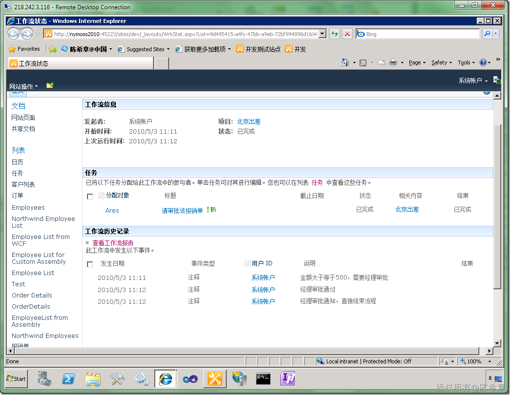
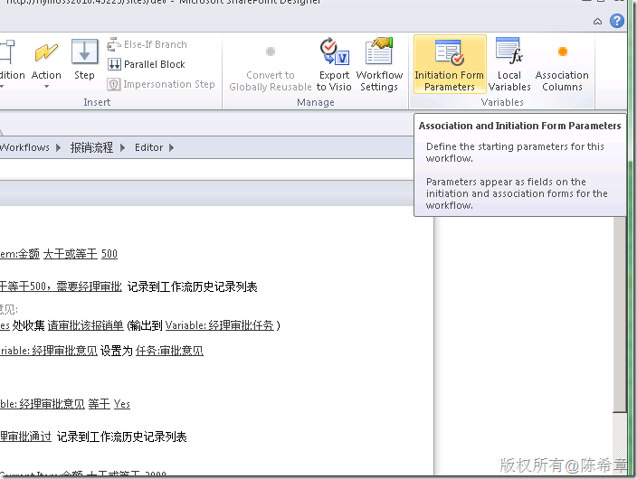
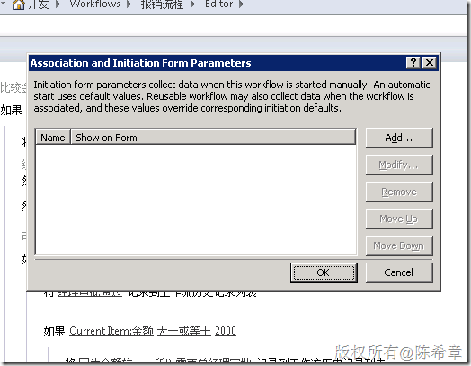
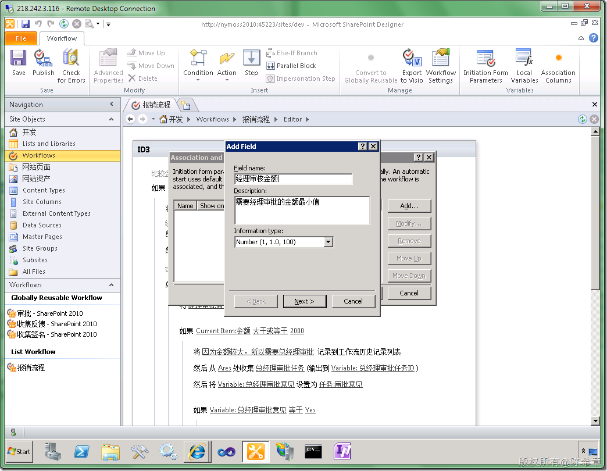
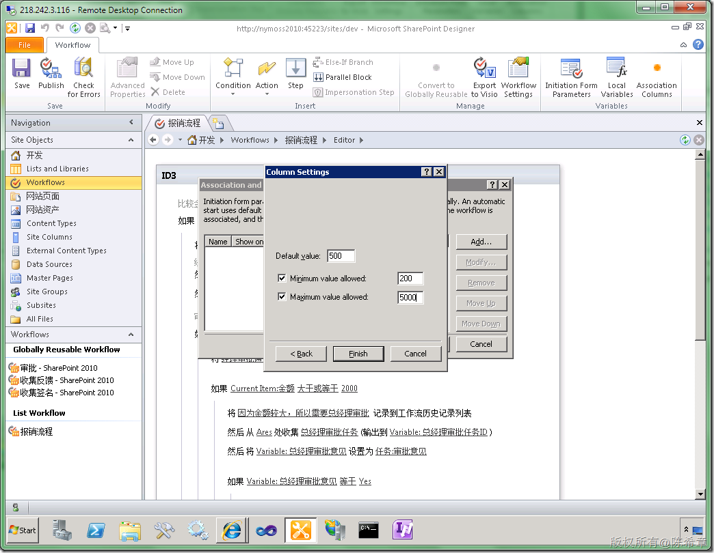
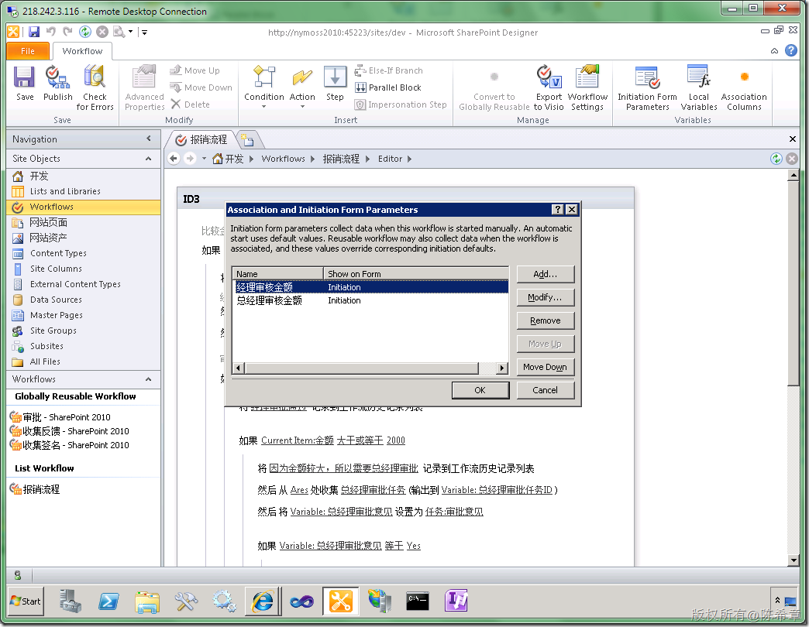
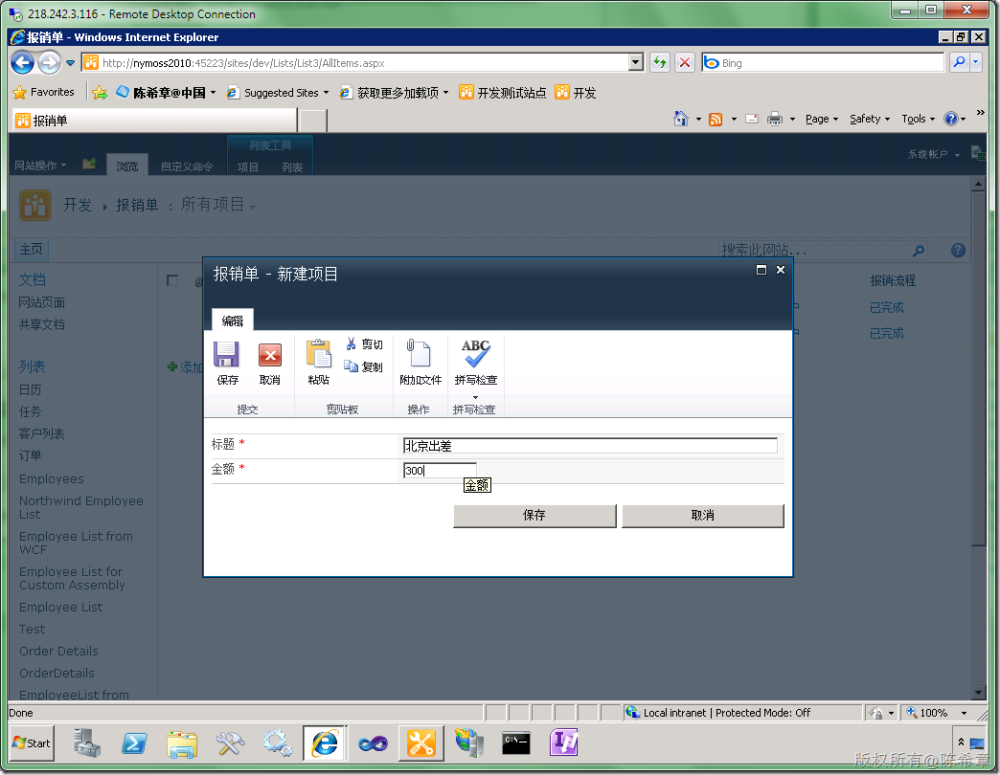
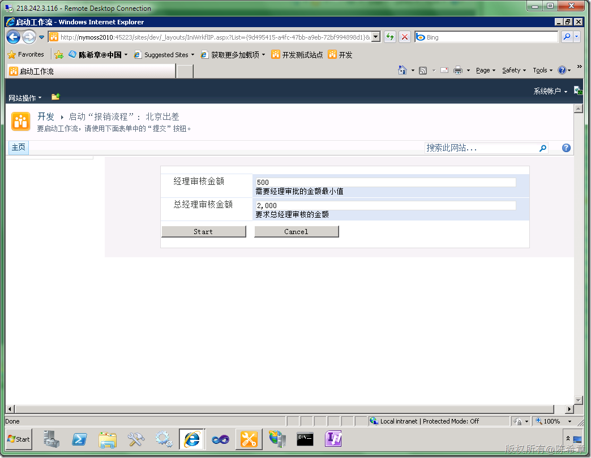
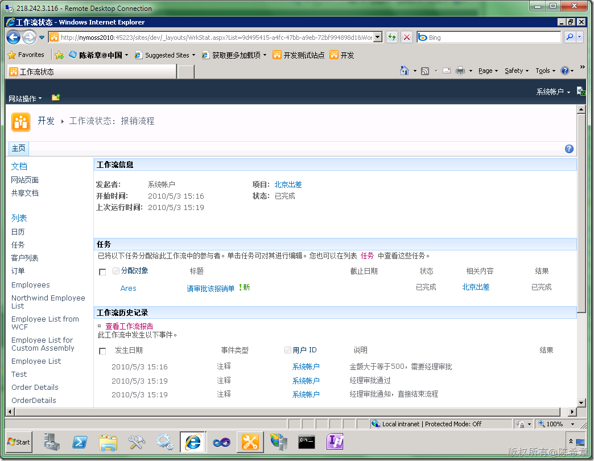

# MOSS 2010:Visual Studio 2010开发体验（29）——工作流开发最佳实践（三） 
> 原文发表于 2010-05-03, 地址: http://www.cnblogs.com/chenxizhang/archive/2010/05/03/1726391.html 

在前面几篇中，我针对工作流基本概念，和最佳实践的前两步做了讲解和演示。他们的链接分别如下

 * 工作流开发概述 <http://www.cnblogs.com/chenxizhang/archive/2010/05/02/1726105.html>* 工作流开发最佳实践（一）：使用Visio设计工作流概念模型 <http://www.cnblogs.com/chenxizhang/archive/2010/05/02/1726154.html>* 工作流开发最佳实践（二）：使用SharePoint Designer实现工作流细节 <http://www.cnblogs.com/chenxizhang/archive/2010/05/03/1726281.html>

  

 到目前为止，我们的成果如下

 我们通过SharePoint Designer定制好的流程大致如下，从我的角度来看，我觉得相当地清晰易懂。说实在话，能够做出这样的设计器来，真是不太容易的一件事情。用英语来说，就俩字：good job](http://images.cnblogs.com/cnblogs_com/chenxizhang/WindowsLiveWriter/MOSS2010VisualStudio201029_1473D/%E5%A4%A7%E7%89%99%E5%A4%B9%E8%8F%9C%E5%8F%B6_2.gif) 

  

 如你在上一篇中看到的那样，这个工作流已经能正常工作了。

  

 看起来还是不错的，不是吗？

  

 但是，用户的需求是不断地变化的。这对于我们来说是一个不能回避的现实。情况是这样：之前我们的流程设定的两个金额的阀值分别是

 * 如果大于等于500的话，需要经理审批 * 如果再大于等于2000的话，需要总经理审批

 到目前为止，我们的流程都工作得很好，因为，我们是将500和2000这两个数值设置好了。

 但是，由于公司规章制度的改变，现在管理部门说是要对费用报销进行更加严格的控制，以节省开支云云 。他们希望改变为下面这样子的

 * 如果大于等于300的话，需要经理审批 * 如果再大于等于1000的话，需要总经理审批

  

 好吧，问题随之而来了。我们是不是要修改原先的流程呢？看起来是的，因为500或者2000都是硬编码在流程内部的。

 但事情远远没有这么简单，管理部门说了，希望有时候可以按照第一种标准报销费用，有时候又可以按照第二种标准报销费用，最好是有时候还可以按照第三种，甚至第四种。。。标准报销费用。同时，可千万要记住的是，他们可像我们自己那样在意这样会给带来多大的工作。

 好吧，问题既然出现了，我们与其怨天尤人，不如想象办法解决才是上策。

 很明显，我们需要将这两个金额的阀值“抽象”出来，让它与工作流本身脱开耦合。最好的方式就是让用户可以自己设置这个金额。

  

 【注意】抽象是面向对象设计的精髓，但我经常在一些课堂上和一些朋友（即便是已经做过开发若干年的朋友）交流这方面的知识或者心得的时候，往往也是得到很多的答案。是的，答案确实是很多的，“抽象”这个东西本身就是抽象的 ，而以我自己的体会，早些年也并非有很深刻的理解，但随着项目经验的增加，会逐渐有领悟。我经常以此勉励大家要多动手写代码，多做一些项目。所谓熟能生巧，此之谓也。

  

 1. 首先，我们先来看一下在SharePoint Designer中是否有办法做到这一点
--------------------------------------------

 我注意到在SharePoint Designer中有如下一个按钮：“Initiation Form Paramters”,看这意思应该与初始化有关

  

  

 我们可以添加两个参数来代表那两个我们希望用户可以设置的金额阀值吧

  

 还可以设置一些默认值和范围

  

 同样的做法，我们添加另外一个参数，最后我们拥有了两个参数

  

 好，我们该如何使用这两个参数呢？其实很简单，我们就只需要在Designer中将用于比较金额的条件，从500修改为我们的参数即可，例如

  

  

 完成如上的操作之后，我们对工作流进行保存，并且重新发布一下。

  

 2. 测试修改之后的流程
------------

  

 【注意】我故意将金额设置为300，这原本是不需要经理审批就直接完成的。

  

 创建好项目后，现在我们再去启动流程的话，会有如下的界面

  

 【注意】请对照之前的第二篇中的界面。那时候是一个空白的页面，只有Start和Cancel按钮而已。

  

 就是说，我们可以在这个界面中对两个关键的金额阀值做设置。例如我们将第一个修改为300. 然后点击Start按钮

  

 我们发现，现在这个金额为300的报销单，也需要经理审批了。因为我们设置了300是作为经理审批的一个起点金额。

  

 

  看起来还不错吧。这样我们的这个流程就比较灵活了，不是吗？

  

 大家可能会有一个疑惑，现在看起来每个人都可以设置这两个金额的阀值，这不就乱套了么？有没有办法做到下面这样的情况

 * 只有管理员可以设置这两个值
* 普通用户无需设置，自动就启动了流程

 答案是可以的，但限于篇幅，我们要在下一篇介绍这个话题了。下一篇我们还会将该流程转换为“Reusable（可复用）”的工作流，并且用Visual Studio对关联和初始化页面做一些定制，而且我们将自动找到当前提交报销单的经理。（而不是全部分配给ares一个人去处理所有的申请），请拭目以待吧

