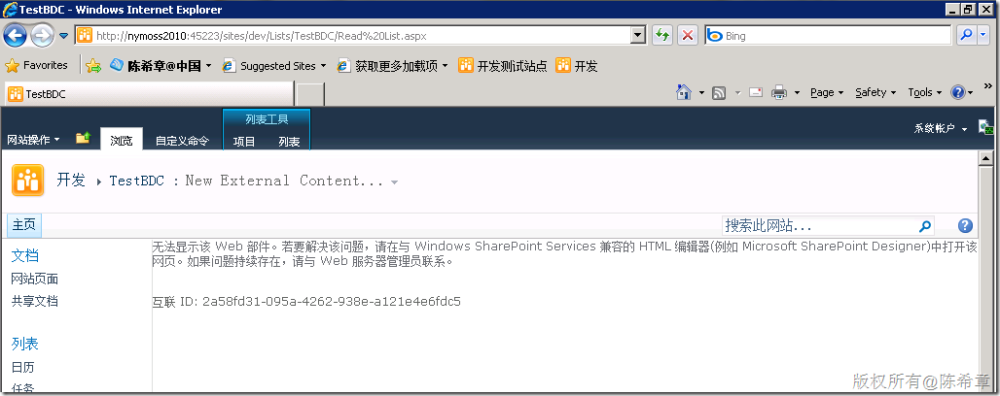
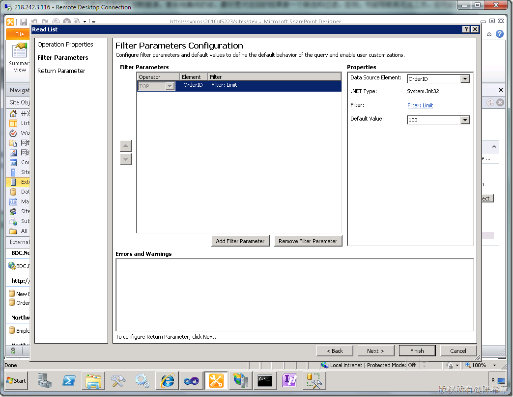
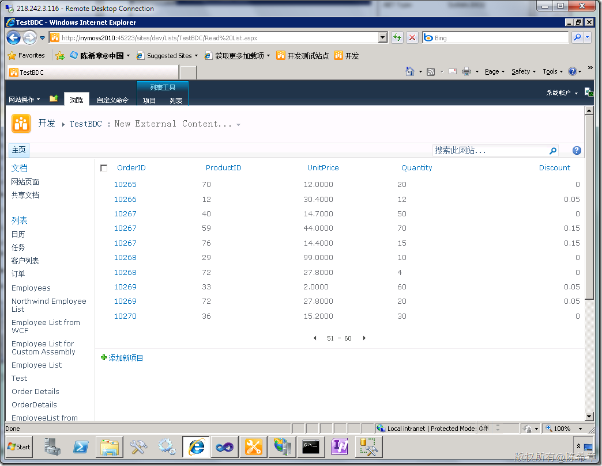
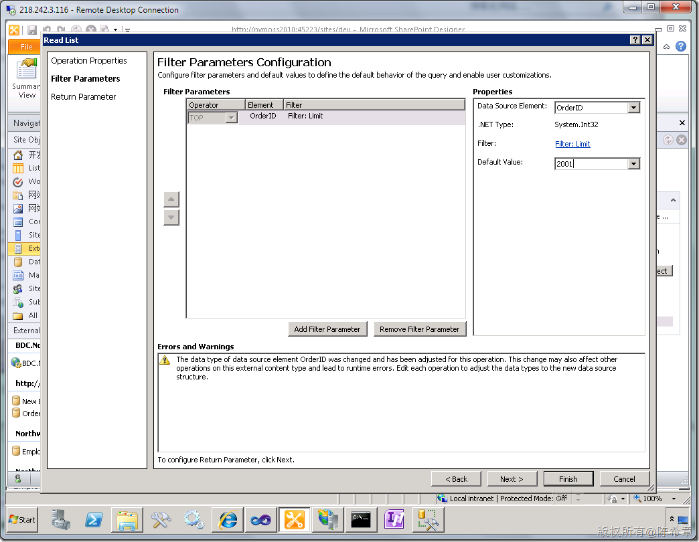

# MOSS 2010:Visual Studio 2010开发体验（30）——Business Data Connectivity(BDC)对数据量的限制 
> 原文发表于 2010-05-05, 地址: http://www.cnblogs.com/chenxizhang/archive/2010/05/05/1727692.html 

在[之前一篇文章](http://www.cnblogs.com/chenxizhang/archive/2010/05/02/1725914.html)中我提到了，使用BDC服务连接到外部数据源做系统集成时（尤其是直接连接到SQL Server的话），最好是对返回的结果做一个筛选和过滤。否则，可能导致其无法工作。你可能会收到如下的错误

  

 那么如何设置筛选过滤条件呢？我们一般都是为Read List这个Operation设置一个Filter Parameter

  

 设置完之后，就可以看到这些数据了。当然是Top 100的

  

 【注意】这个Filter Parameter与分页没有关系。之前有朋友是说，既然数据很多，能不能分页啊。其实分页是在列表中做的事情，与数据源已经无关了。

  

 那么，这个Limit可以设置多大呢？准确地说，你最多可以设置为2000. 之前出现的那个错误页面，就是因为BDC默认情况下，读取数据库的时候，只要大于2000，就会报错的缘故。我们可以试一下，将那个Limit设置为2001

  

    然后，我们去刷新页面的话，又遇到下面的错误了

  

 好吧，看起来这是问题所在。那么，我们有没有办法修改这个上限呢？

 当然是可以的，下面这篇文章是一个例子

 <http://blogs.msdn.com/bcs/archive/2010/02/16/bcs-powershell-introduction-and-throttle-management.aspx>

 这个是官方的介绍。我就不重复描述了

 不过，说实在话，另外一个原因是，我并不喜欢用那个Powershell来做所谓的管理工作。 

 当然，我个人更加推荐要做一定的限制，而且应该小于200行。其实真的有那么大的必要性把那么多数据都读过来吗？

 有吗？。。。没有吗？。。。

