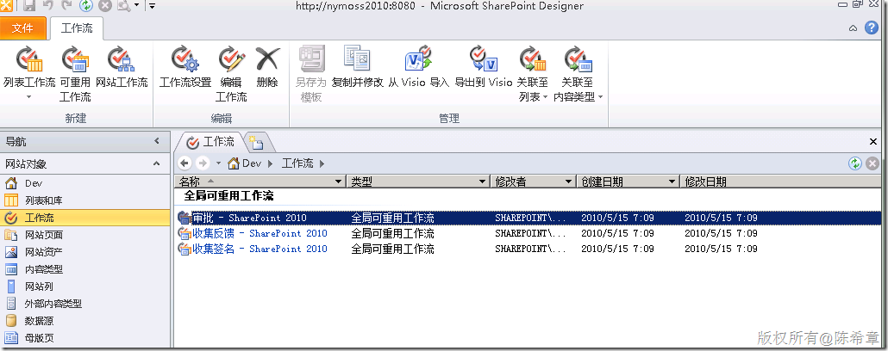
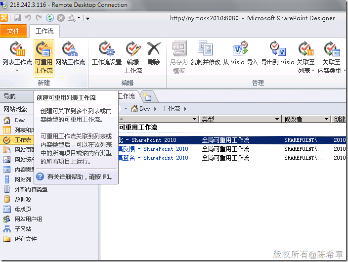
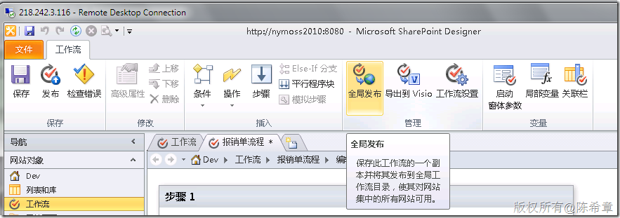
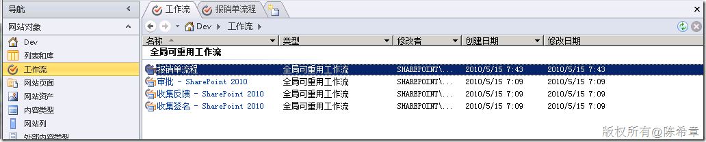
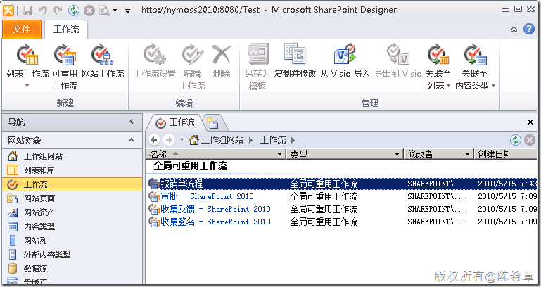
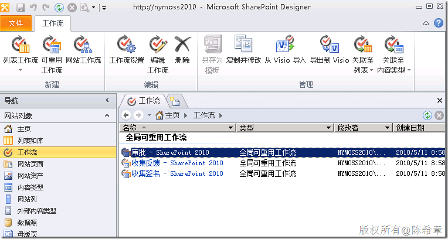

# MOSS 2010:Visual Studio 2010开发体验（33）——工作流开发最佳实践（五）：全局可重用工作流 
> 原文发表于 2010-05-15, 地址: http://www.cnblogs.com/chenxizhang/archive/2010/05/15/1735909.html 

[上一篇](http://www.cnblogs.com/chenxizhang/archive/2010/05/14/1735816.html)我们讨论到了可重用工作流，看起来还不错：现在一个工作流可以比较灵活地根据需要与不同的列表关联了。

 但还是让我们稍作思考这个重用的话题吧，既然说到重用，就自然还要问一下：那么它到底在什么范围之内重用呢？

 **默认情况下，我们通过上一篇创建的可重用工作流只能在当前网站间共用。**

 但我们确实可以设计在更广范围重用的工作流，（例如在整个网站集中重用），现在它有一个专门的称呼：**全局可重用工作流**。

 事实上，MOSS 2010自带了三个所谓的全局可重用工作流。

  

 那么，我们怎么创建自己的“全局可重用工作流”呢？

 【注意】全局可重用工作流必须在网站集的首要站点进行开发。

  

 第一步：创建一个“可重用工作流”
----------------

  

 【备注】至于怎么设计工作流，乃至如何设置可重用工作流，因为之前做过专门的介绍，这里就不重复了

  

 第二步：发布为全局可重用工作流
---------------

  

    

  

 第三步：在子级网站中使用该工作流
----------------

  

   【注意】这是我刚才建立的一个子网站，请注意看地址

  

 总结：
---

 这一篇我通过例子讲解了如何实现全局可重用的工作流。其实，说是全局，并非那么准确的，因为我们通过SharePoint Designer做出来的所谓“全局可重用工作流”其实是只能在一个网站集中重用。例如，假设我们切换到另外一个网站集，你是不可能看到那个工作流的。如下图所示

  

 那么，有没有办法实现在不同网站集都能重用的工作流呢？答案是可以的，只是我们需要用到Visual Studio 。让我们后面的文章专门来讨论一下这个问题吧

