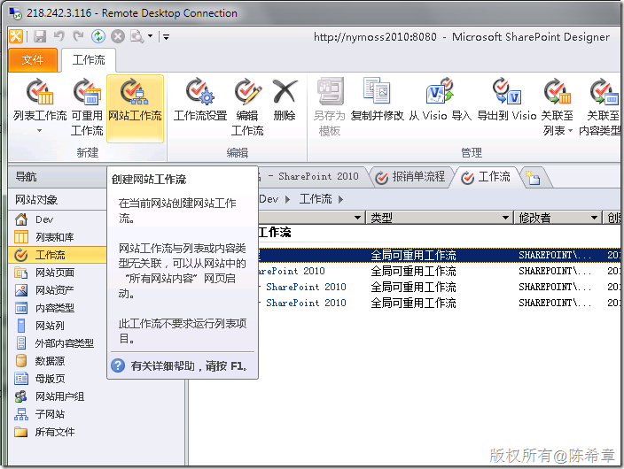

# MOSS 2010:Visual Studio 2010开发体验（34）——工作流开发最佳实践（六）：网站工作流 
> 原文发表于 2010-05-15, 地址: http://www.cnblogs.com/chenxizhang/archive/2010/05/15/1735944.html 

我们前面花了几篇文章介绍了工作流的概念，以及如何设计可重用的工作流（可重用和全局可重用）.如果你对这些话题还不是很清楚，可以先参考的链接

 * #### [MOSS 2010:Visual Studio 2010开发体验（26）——工作流开发概述](http://www.cnblogs.com/chenxizhang/archive/2010/05/02/1726105.html)

* #### [MOSS 2010:Visual Studio 2010开发体验（27）——工作流开发最佳实践（一）](http://www.cnblogs.com/chenxizhang/archive/2010/05/02/1726154.html)

* #### [MOSS 2010:Visual Studio 2010开发体验（28）——工作流开发最佳实践（二）](http://www.cnblogs.com/chenxizhang/archive/2010/05/03/1726281.html)

* #### [MOSS 2010:Visual Studio 2010开发体验（29）——工作流开发最佳实践（三）](http://www.cnblogs.com/chenxizhang/archive/2010/05/03/1726391.html)

* #### [MOSS 2010:Visual Studio 2010开发体验（32）——工作流开发最佳实践（四）:可重用工作流](http://www.cnblogs.com/chenxizhang/archive/2010/05/14/1735816.html)

* #### [MOSS 2010:Visual Studio 2010开发体验（33）——工作流开发最佳实践（五）：全局可重用工作流](http://www.cnblogs.com/chenxizhang/archive/2010/05/15/1735909.html)

 但其实不管他们是否能重用，或者怎么重用，那些工作流都统称为“**列表工作流**”，这就意味这，**他们要运行的话，都必须首先与某个列表关联**。

 仔细想想这个问题吧，通常情况下没有什么问题，但是也许你可能会说：假设我的一个流程，我不希望它与列表绑定，而是直接就可以运行，行不行呢？

 这是一个不错的问题，在MOSS 2010中，这种工作流被称为“**网站工作流**”

 用例子来说明一下总是会比较好的，就让我们开始吧

  

  

 这样，我们就得到了一个空白的“网站工作流”

  

 是不是没有什么特别呢？其实还是有些差别的，因为网站工作流没有关联到某个列表，所以，它能用的“条件”和“操作”会少一些

  

  

  

 接下来，让我们来做一个最简单的吧。

 和前面的流程一样，我们定义了几个变量，和初始窗体

  

  

 【注意】这个关联和启动表单参数是必须的。大家想想看，现在这个工作流没有与具体某个列表进行绑定了，那么如何让用户提供一些信息以便启动流程，这就是一个问题啦。所以需要有一个启动窗口。

  

 我们的流程大致如下

  

  

 保存，发布该流程后，我们来网站中测试一下该流程。

 【注意】我们需要通过“网站操作”=》“查看所有网站内容”。以前beta版的时候，在“网站操作”下面就直接有一个“网站工作流”，不知道为什么拿掉了？

  

  

 点击“网站工作流”

  

 点击“我的报销单流程”，此时会出现一个页面。就是之前提到过的初始窗体。其实这是一个Infopath表单

  

  

 输入必要的信息之后，点击“开始”

 啊哦，很不幸，我们收到了一个严重错误（在玩SharePoint的时候，你要有这样的心理准备 ）

  

               我猜想会不会还有什么bug呢？尝试找了找，也没有找到原因。 

 我将流程修改为更加简单一些（干脆什么都不做），直接点击启动看看

  

 问题却依旧，这实在是让人迷惑的

  

 我推测下来只可能有一个可能性，就是语言版本的问题。这样的苦头我们吃的难道还少么

 【备注】以前在英文测试版的时候倒没有遇到这个问题

  

 现在手头没有英文版的环境，所以这个问题先搁在这吧，如果大家谁有英文的环境，不妨测试一下，并给我一些反馈

