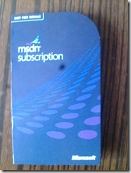

# 《实践与思考》系列连载（6）——IT从业人员工作环境及状态调查 
> 原文发表于 2010-07-19, 地址: http://www.cnblogs.com/chenxizhang/archive/2010/07/19/1780437.html 

本次调查是《实践与思考》既定的活动之一，主要涉及IT从业人员对目前工作环境、工作状态以及业余职业提升等方面的调查。

 请立即参与在线调查

 [http://www.askform.cn/80830-94493.aspx](http://www.askform.cn/80830-94493.aspx "http://www.askform.cn/80830-94493.aspx") 

 【备注】我们这次所使用的调查系统是一个第三方的免费系统。如果有使用上的问题，请让我们知道，谢谢

  

 该调查长期有效，但是我们将在1个月之内评选两位幸运奖。也就是说，

 自该调查发布之日（2010年7月18日）起，截止到2010年8月18日

 凡是参加该调查的朋友中，我们会抽取两位幸运奖，奖品是：

  

 **Visual Studio 2010 Ultimate的正版激活卡，有效期为一年。**

  

  

 **另外，我们还可能在上海、苏州、杭州三个地方举办免费的线下交流活动，活动将邀请陈希章老师及我们的顾问团队作为嘉宾互动交流。活动将主要讨论技术发展和个人职业规划等话题，所有参与该调查的朋友，都可以免费参与活动。**
-----------------------------------------------------------------------------------------------------------

  

 友情提醒：本次调查为不记名制，但为了参与抽奖和活动，您需要留下真实有效的邮件地址。

  

  

 -《实践与思考》服务团队 -官方网站地址: <http://www.xizhang.com/book> -博客连载地址: <http://www.cnblogs.com/chenxizhang/category/250732.html> -服务邮箱地址: [service@xizhang.com](mailto:service@xizhang.com)

