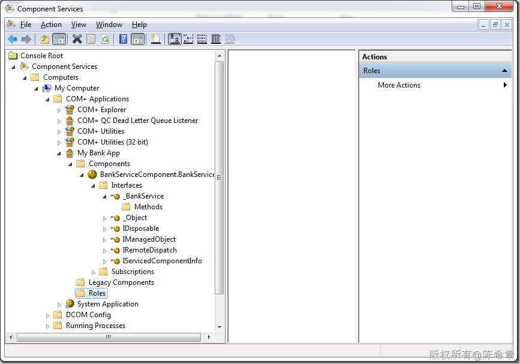
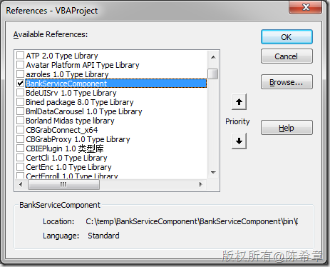
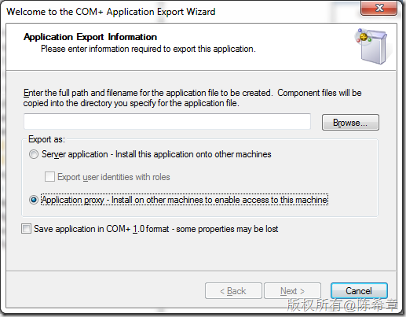

# 关于COM+的一些回顾 
> 原文发表于 2010-07-31, 地址: http://www.cnblogs.com/chenxizhang/archive/2010/07/31/1789639.html 


今天继续在讲解SOA技术实现方面的课程，这一周主要讨论的是WCF。既然讲到WCF，难免要提一下在其之前的有关技术。其中COM+我认为是非常值得回顾的。

  

 COM+技术所能提供的功能
=============

     1、事务服务：它确保了在分布式系统中的数据完整性。     2、安全服务：它的安全模型提供了处理安全性而不用编写任何代码的方法。     3、同步服务：提供了有效管理地解决组件中并发问题的方法，但却不用编写代码。     4、资源管理：（包括资源管理器和资源分配器）管理数据库连接、网络连接和内存等。     5、JIT激活：即（Just In Time）是从MTS继承下来的一项服务，当客户调用时才将该对象的一个实例保持为活跃状态并缓存在服务器内存中，使用完对象后，会通知MTS环境可以释放该对象所占用的资源了，如数据库连接。     6、对象池：提供一个线程池来存放现成的对象，以供下次再用，是系统的一项自动服务。当有应用程序访问COM+组件时，即为应用程序创建该组件的一个实例并存放在对象池中，应用程序关闭后即销毁实例，可以自由配置组件使它的实例在池中的状态，实现了实例的重用性，提高应用程序的性能和伸缩性。     7、基于角色的安全：这个容易理解，即验证角色，给予安全许可，给不同的用户予不同的权限。     8、队列组件（MSMQ）：提供异步消息队列，可以自动按其形式将数据转换成数据包。     9、共享属性管理器（SPM）：用来管理存储在内存中的对象状态信息，在一个服务器进程内可以用来共享多个对象间的状态，并提供并发处理。     10、补偿资源管理器（CRM）：用于在处理事务期间生成日志文件并可处理系统崩溃。包括CRM工作器（是CRM的主要部分，通过CRM的基础设施提供的接口将事务的相关信息写入日志，并在需要时检索日志文件）和CRM补偿器（用于在事务完成后，将事务和生成的日志文件提交给执行事务的用户）。     11、并发：即允许一个应用程序中的多个进程同时运行，进程被分成各组上下文（有相同需求的对象集合）包含在单元（一个进程内的一组上下文）中，一个进程可包含多个上下文，都涉及到不同的需求的对象而且每个上下文都有一个唯一的COM对象来提供COM＋事务处理和JIT激活等服务。利用COM+提供的工具可以创建执行交易的多层应用程序，还可以处理线程分配的问题   如何编写COM+组件（基本）
==============

 1.引用System.EnterpriseService 2.继承ServicedComponent 3.添加程序集声明 * [assembly: ApplicationName("My Bank App")]
* [assembly: ApplicationActivation(ActivationOption.Server)]
* [assembly: ComVisible(true)]

 4.强名称签名 有两种类型的程序，服务器应用程序和类库应用程序，他们的区别如下 * 服务器应用程序是在服务器进程内激活，可以统一做身份和角色的验证、授权，比较便于控制安全性（角色是由管理员在服务器设置的，在代码里面通过SecurityRole来声明要使用哪个角色），还可以作为服务存在，持续稳定提供服务的能力，而且它可以访问本机所有的资源
* 类库应用程序则在创建者进程中被激活，将失去安全性特征。

 如何注册COM+组件（基本）
==============

 最常用的方法是，通过regsvcs工具，可以完成组件的注册 也可以通过RegistrationHelper类型，编程实现注册（自定义installer) 也可以在开发机器安装调试好之后，导出一个msi安装包，然后在生产服务器进行安装     通常情况下，注册成功之后的效果如下 [](http://images.cnblogs.com/cnblogs_com/chenxizhang/WindowsLiveWriter/COM_12017/image_2.png) 如何使用COM+组件（基本）
==============

 **在COM环境中使用** [](http://images.cnblogs.com/cnblogs_com/chenxizhang/WindowsLiveWriter/COM_12017/image_4.png) 
```
Public Sub Test()
    Dim obj As New BankService
    MsgBox obj.HelloWorld()
End Sub

```

.csharpcode, .csharpcode pre
{
 font-size: small;
 color: black;
 font-family: consolas, "Courier New", courier, monospace;
 background-color: #ffffff;
 /*white-space: pre;*/
}
.csharpcode pre { margin: 0em; }
.csharpcode .rem { color: #008000; }
.csharpcode .kwrd { color: #0000ff; }
.csharpcode .str { color: #006080; }
.csharpcode .op { color: #0000c0; }
.csharpcode .preproc { color: #cc6633; }
.csharpcode .asp { background-color: #ffff00; }
.csharpcode .html { color: #800000; }
.csharpcode .attr { color: #ff0000; }
.csharpcode .alt 
{
 background-color: #f4f4f4;
 width: 100%;
 margin: 0em;
}
.csharpcode .lnum { color: #606060; }

  **在.NET环境中使用**
和使用正常的.NET组件没有任何区别。只不过，对象实例是在组件服务的上下文中被创建和管理的，并且具有很多本地对象没有的特性。
  跨机器调用COM+应用程序或者组件
=================


首先，需要将COM+应用程序导出（一般会选择Application Proxy)
[](http://images.cnblogs.com/cnblogs_com/chenxizhang/WindowsLiveWriter/COM_12017/image_6.png)


