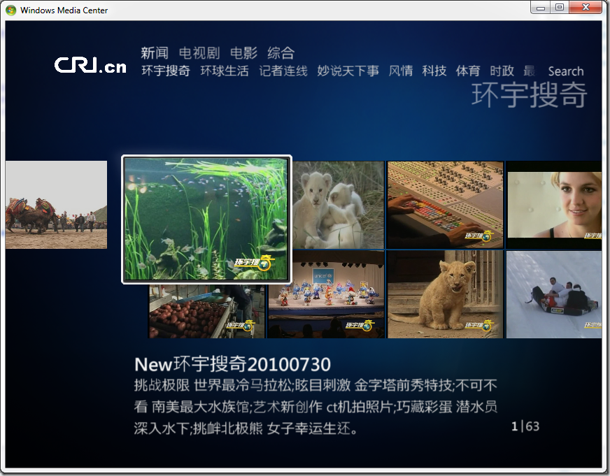

# 分享：微软网络电视Internet TV方面的一些消息 
> 原文发表于 2010-08-02, 地址: http://www.cnblogs.com/chenxizhang/archive/2010/08/02/1790331.html 

这里分享一下微软网络电视Internet TV最新讯息, “Internet TV”服务，让用户可以直接在 Windows Media Center 中观看来自内容提供商网络视频。Internet TV “一键安装包”很快将会被发布，之后您通过点击Internet TV “一键安装包”便可自动进行安装。

 您也可登陆以下网站查看相关讯息。 · WMC web site: * <http://www.microsoft.com/china/windows/windows-media-center/default.aspx>

 · Internet TV articles: * <http://www.cnbeta.com/articles/111555.htm>
* <http://www.duote.com/tech/2/5359_1.html>
* <http://ent.sina.com.cn/f/m/windows7/index.html>

  

 

