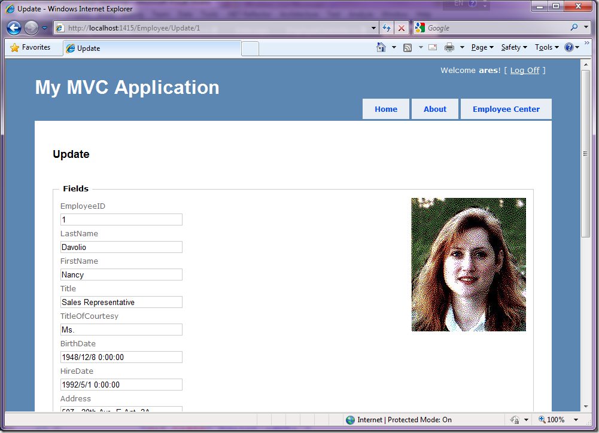

# 在MVC项目中如何显示图片 
> 原文发表于 2010-09-12, 地址: http://www.cnblogs.com/chenxizhang/archive/2010/09/12/1824517.html 


首先,有好一阵没有怎么写博客文章了.实在也是很多事情,确实没有停下来过.

 这两天在讲解MVC方面的知识和项目实践,其中有一个小的细节,是有关于图片显示方面的，记录下来供大家参考

 在MVC项目中，要显示一个图片，尤其是该图片是存放在数据库的话，还是可以继续使用原先Web Forms的那种ashx的方式。但也可以考虑下面的方式

  

 1.创建一个ImageResult


```
using System;
using System.Collections.Generic;
using System.Linq;
using System.Text;
using System.Web.Mvc;
using System.Drawing;
using System.Drawing.Imaging;
using System.Web;

namespace Extensions
{
    public class ImageResult : ActionResult
    {
        public ImageResult() { }
        public Image Image { get; set; }
        public ImageFormat ImageFormat { get; set; }
        public override void ExecuteResult(ControllerContext context)
        {
            // verify properties 
            if (Image == null)
            {
                throw new ArgumentNullException("Image");
            }
            if (ImageFormat == null)
            {
                throw new ArgumentNullException("ImageFormat");
            }
            // output 
            context.HttpContext.Response.Clear();
            if (ImageFormat.Equals(ImageFormat.Bmp)) context.HttpContext.Response.ContentType = "image/bmp";
            if (ImageFormat.Equals(ImageFormat.Gif)) context.HttpContext.Response.ContentType = "image/gif";
            if (ImageFormat.Equals(ImageFormat.Icon)) context.HttpContext.Response.ContentType = "image/vnd.microsoft.icon";
            if (ImageFormat.Equals(ImageFormat.Jpeg)) context.HttpContext.Response.ContentType = "image/jpeg";
            if (ImageFormat.Equals(ImageFormat.Png)) context.HttpContext.Response.ContentType = "image/png";
            if (ImageFormat.Equals(ImageFormat.Tiff)) context.HttpContext.Response.ContentType = "image/tiff";
            if (ImageFormat.Equals(ImageFormat.Wmf)) context.HttpContext.Response.ContentType = "image/wmf";
            Image.Save(context.HttpContext.Response.OutputStream, ImageFormat);
        }
    }

}

```


.csharpcode, .csharpcode pre
{
 font-size: small;
 color: black;
 font-family: consolas, "Courier New", courier, monospace;
 background-color: #ffffff;
 /*white-space: pre;*/
}
.csharpcode pre { margin: 0em; }
.csharpcode .rem { color: #008000; }
.csharpcode .kwrd { color: #0000ff; }
.csharpcode .str { color: #006080; }
.csharpcode .op { color: #0000c0; }
.csharpcode .preproc { color: #cc6633; }
.csharpcode .asp { background-color: #ffff00; }
.csharpcode .html { color: #800000; }
.csharpcode .attr { color: #ff0000; }
.csharpcode .alt 
{
 background-color: #f4f4f4;
 width: 100%;
 margin: 0em;
}
.csharpcode .lnum { color: #606060; }


2,创建一个Action


 


```
        private string connection =ConfigurationManager.ConnectionStrings["northwind"].ConnectionString;


        public ActionResult Image(int id)
        {
            var db = new NorthwindDataContext(connection);
            var found = db.Employees.FirstOrDefault(e => e.EmployeeID == id);


            if (found != null)
            {
                var buffer = found.Photo.ToArray();
                ImageConverter converter = new ImageConverter();
                var image = (Image)converter.ConvertFrom(buffer);
                return new Extensions.ImageResult()
                {
                    Image = image,
                    ImageFormat = System.Drawing.Imaging.ImageFormat.Jpeg
                };

            }
            else
            {
                ViewData["message"] = "员工不存在";
                return View("Error");
            }

        }
```

.csharpcode, .csharpcode pre
{
 font-size: small;
 color: black;
 font-family: consolas, "Courier New", courier, monospace;
 background-color: #ffffff;
 /*white-space: pre;*/
}
.csharpcode pre { margin: 0em; }
.csharpcode .rem { color: #008000; }
.csharpcode .kwrd { color: #0000ff; }
.csharpcode .str { color: #006080; }
.csharpcode .op { color: #0000c0; }
.csharpcode .preproc { color: #cc6633; }
.csharpcode .asp { background-color: #ffff00; }
.csharpcode .html { color: #800000; }
.csharpcode .attr { color: #ff0000; }
.csharpcode .alt 
{
 background-color: #f4f4f4;
 width: 100%;
 margin: 0em;
}
.csharpcode .lnum { color: #606060; }

 


3.在页面（View）中调用


```
<%@ Page Title="" Language="C#" MasterPageFile="~/Views/Shared/Site.Master" Inherits="System.Web.Mvc.ViewPage<Models.Employee>" %>

<asp:Content ID="Content1" ContentPlaceHolderID="TitleContent" runat="server">
    Update
</asp:Content>

<asp:Content ID="Content2" ContentPlaceHolderID="MainContent" runat="server">

    <h2>Update</h2>

    <% using (Html.BeginForm()) {%>
        <%: Html.ValidationSummary(true) %>

        <fieldset>
            <legend>Fields</legend>
            <div style="float:right">

                **" alt="" />**
            </div>
            <div class="editor-label">
                <%: Html.LabelFor(model => model.EmployeeID) %>
            </div>
            <div class="editor-field">
                <%: Html.TextBoxFor(model => model.EmployeeID) %>
                <%: Html.ValidationMessageFor(model => model.EmployeeID) %>
            </div>
            
            <div class="editor-label">
                <%: Html.LabelFor(model => model.LastName) %>
            </div>
            <div class="editor-field">
                <%: Html.TextBoxFor(model => model.LastName) %>
                <%: Html.ValidationMessageFor(model => model.LastName) %>
            </div>
            
            <div class="editor-label">
                <%: Html.LabelFor(model => model.FirstName) %>
            </div>
            <div class="editor-field">
                <%: Html.TextBoxFor(model => model.FirstName) %>
                <%: Html.ValidationMessageFor(model => model.FirstName) %>
            </div>
            
            <div class="editor-label">
                <%: Html.LabelFor(model => model.Title) %>
            </div>
            <div class="editor-field">
                <%: Html.TextBoxFor(model => model.Title) %>
                <%: Html.ValidationMessageFor(model => model.Title) %>
            </div>
            
            <div class="editor-label">
                <%: Html.LabelFor(model => model.TitleOfCourtesy) %>
            </div>
            <div class="editor-field">
                <%: Html.TextBoxFor(model => model.TitleOfCourtesy) %>
                <%: Html.ValidationMessageFor(model => model.TitleOfCourtesy) %>
            </div>
            
            <div class="editor-label">
                <%: Html.LabelFor(model => model.BirthDate) %>
            </div>
            <div class="editor-field">
                <%: Html.TextBoxFor(model => model.BirthDate, String.Format("{0:g}", Model.BirthDate)) %>
                <%: Html.ValidationMessageFor(model => model.BirthDate) %>
            </div>
            
            <div class="editor-label">
                <%: Html.LabelFor(model => model.HireDate) %>
            </div>
            <div class="editor-field">
                <%: Html.TextBoxFor(model => model.HireDate, String.Format("{0:g}", Model.HireDate)) %>
                <%: Html.ValidationMessageFor(model => model.HireDate) %>
            </div>
            
            <div class="editor-label">
                <%: Html.LabelFor(model => model.Address) %>
            </div>
            <div class="editor-field">
                <%: Html.TextBoxFor(model => model.Address) %>
                <%: Html.ValidationMessageFor(model => model.Address) %>
            </div>
            
            <div class="editor-label">
                <%: Html.LabelFor(model => model.City) %>
            </div>
            <div class="editor-field">
                <%: Html.TextBoxFor(model => model.City) %>
                <%: Html.ValidationMessageFor(model => model.City) %>
            </div>
            
            <div class="editor-label">
                <%: Html.LabelFor(model => model.Region) %>
            </div>
            <div class="editor-field">
                <%: Html.TextBoxFor(model => model.Region) %>
                <%: Html.ValidationMessageFor(model => model.Region) %>
            </div>
            
            <div class="editor-label">
                <%: Html.LabelFor(model => model.PostalCode) %>
            </div>
            <div class="editor-field">
                <%: Html.TextBoxFor(model => model.PostalCode) %>
                <%: Html.ValidationMessageFor(model => model.PostalCode) %>
            </div>
            
            <div class="editor-label">
                <%: Html.LabelFor(model => model.Country) %>
            </div>
            <div class="editor-field">
                <%: Html.TextBoxFor(model => model.Country) %>
                <%: Html.ValidationMessageFor(model => model.Country) %>
            </div>
            
            <div class="editor-label">
                <%: Html.LabelFor(model => model.HomePhone) %>
            </div>
            <div class="editor-field">
                <%: Html.TextBoxFor(model => model.HomePhone) %>
                <%: Html.ValidationMessageFor(model => model.HomePhone) %>
            </div>
            
            <div class="editor-label">
                <%: Html.LabelFor(model => model.Extension) %>
            </div>
            <div class="editor-field">
                <%: Html.TextBoxFor(model => model.Extension) %>
                <%: Html.ValidationMessageFor(model => model.Extension) %>
            </div>
            
            <div class="editor-label">
                <%: Html.LabelFor(model => model.Notes) %>
            </div>
            <div class="editor-field">
                <%: Html.TextBoxFor(model => model.Notes) %>
                <%: Html.ValidationMessageFor(model => model.Notes) %>
            </div>
            
            <div class="editor-label">
                <%: Html.LabelFor(model => model.ReportsTo) %>
            </div>
            <div class="editor-field">
                <%: Html.TextBoxFor(model => model.ReportsTo) %>
                <%: Html.ValidationMessageFor(model => model.ReportsTo) %>
            </div>
            
            <div class="editor-label">
                <%: Html.LabelFor(model => model.PhotoPath) %>
            </div>
            <div class="editor-field">
                <%: Html.TextBoxFor(model => model.PhotoPath) %>
                <%: Html.ValidationMessageFor(model => model.PhotoPath) %>
            </div>
            
            <p>
                <input type="submit" value="Save" />
            </p>
        </fieldset>

    <% } %>

    <div>
        <%: Html.ActionLink("Back to List", "Index") %>
    </div>

</asp:Content>

```

```
最后的结果如下，大家可以参考参考

```

.csharpcode, .csharpcode pre
{
 font-size: small;
 color: black;
 font-family: consolas, "Courier New", courier, monospace;
 background-color: #ffffff;
 /*white-space: pre;*/
}
.csharpcode pre { margin: 0em; }
.csharpcode .rem { color: #008000; }
.csharpcode .kwrd { color: #0000ff; }
.csharpcode .str { color: #006080; }
.csharpcode .op { color: #0000c0; }
.csharpcode .preproc { color: #cc6633; }
.csharpcode .asp { background-color: #ffff00; }
.csharpcode .html { color: #800000; }
.csharpcode .attr { color: #ff0000; }
.csharpcode .alt 
{
 background-color: #f4f4f4;
 width: 100%;
 margin: 0em;
}
.csharpcode .lnum { color: #606060; }

[](http://images.cnblogs.com/cnblogs_com/chenxizhang/WindowsLiveWriter/MVC_11046/image_2.png)

