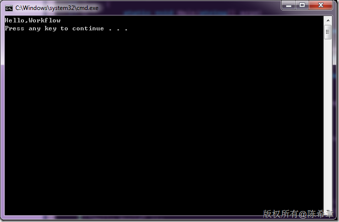

# 通过XOML或者XAML的方式创建和启动工作流 
> 原文发表于 2010-10-01, 地址: http://www.cnblogs.com/chenxizhang/archive/2010/10/01/1840629.html 


在Workflow Foundation中，提供了多种设计工作流的方式。例如

 1. 纯代码的方式（C#） - 代码分离的方式（XOML+C#）

 以上两种，可以从Visual Studio提供的项目模板中选择

 [](http://images.cnblogs.com/cnblogs_com/chenxizhang/Windows-Live-Writer/35b07a03cf61_1101A/image_2.png)

 他们在设计器中看起来是如下的

 [](http://images.cnblogs.com/cnblogs_com/chenxizhang/Windows-Live-Writer/35b07a03cf61_1101A/image_4.png)

 xoml是一种特殊的XML格式，它可以描述流程。例如下面这样的一个流程

 [](http://images.cnblogs.com/cnblogs_com/chenxizhang/Windows-Live-Writer/35b07a03cf61_1101A/image_6.png)

 它用XOML描述的话，大致如下


```
<SequentialWorkflowActivity x:Class="WorkflowConsoleApplication1.Workflow2" x:Name="Workflow2" xmlns:x="http://schemas.microsoft.com/winfx/2006/xaml" xmlns="http://schemas.microsoft.com/winfx/2006/xaml/workflow">
    <CodeActivity x:Name="codeActivity1" />
    <IfElseActivity x:Name="ifElseActivity1">
        <IfElseBranchActivity x:Name="ifElseBranchActivity1">
            <CodeActivity x:Name="codeActivity2" />
        </IfElseBranchActivity>
        <IfElseBranchActivity x:Name="ifElseBranchActivity2">
            <CodeActivity x:Name="codeActivity3" />
        </IfElseBranchActivity>
    </IfElseActivity>
</SequentialWorkflowActivity>
```

.csharpcode, .csharpcode pre
{
 font-size: small;
 color: black;
 font-family: consolas, "Courier New", courier, monospace;
 background-color: #ffffff;
 /*white-space: pre;*/
}
.csharpcode pre { margin: 0em; }
.csharpcode .rem { color: #008000; }
.csharpcode .kwrd { color: #0000ff; }
.csharpcode .str { color: #006080; }
.csharpcode .op { color: #0000c0; }
.csharpcode .preproc { color: #cc6633; }
.csharpcode .asp { background-color: #ffff00; }
.csharpcode .html { color: #800000; }
.csharpcode .attr { color: #ff0000; }
.csharpcode .alt 
{
 background-color: #f4f4f4;
 width: 100%;
 margin: 0em;
}
.csharpcode .lnum { color: #606060; }

 


虽然上面这样的XML确实可以描述流程，但流程所涉及的一些特殊逻辑，则可能还是需要写代码。这两个部分，最终还是需要编译成一个类型出来。


所以，实际上上面的两种方式没有本质的区别。


 


这里要介绍的是一种纯XOML的方式：**我们能不能全部用XOML来实现对流程的定义？如果这样的话，我们就可以实现更加动态化的流程，因为如果存在额外的代码，就无需编译，而是可以通过直接修改XOML文件就完成流程的修改**。


 


答案是：**可以的。但有一个前提，既然我们不想用代码，那么流程中所使用的Activity就应该都是可以通过配置即可完成工作的**。


 


通常，我们需要编写自定义Activity来实现这样的需求。


例如，我们可以做一个最简单的Activity，它只是根据用户输入的一个参数，负责在屏幕上打印一个消息。


```
using System;
using System.ComponentModel;
using System.ComponentModel.Design;
using System.Collections;
using System.Linq;
using System.Workflow.ComponentModel;
using System.Workflow.ComponentModel.Design;
using System.Workflow.ComponentModel.Compiler;
using System.Workflow.ComponentModel.Serialization;
using System.Workflow.Runtime;
using System.Workflow.Activities;
using System.Workflow.Activities.Rules;

namespace WorkflowConsoleApplication1
{
    public partial class MyActivity :Activity
    {
        public MyActivity()
        {
            InitializeComponent();
        }

        public string Message { get; set; }

        protected override ActivityExecutionStatus Execute(ActivityExecutionContext executionContext)
        {
            Console.WriteLine(Message);
            return base.Execute(executionContext);
        }
    }
}


```

为了演示如何直接通过XOML定义的方式使用这个自定义Activity，我们可以通过下面的代码生成一段XOML


```
                var workflow = new SequenceActivity();
                workflow.Activities.Add(new MyActivity() { Message = "Hello,World" });
                var serializer = new WorkflowMarkupSerializer();
                serializer.Serialize(
                    XmlWriter.Create("test.xoml",new XmlWriterSettings(){CloseOutput=true}), workflow);

```


.csharpcode, .csharpcode pre
{
 font-size: small;
 color: black;
 font-family: consolas, "Courier New", courier, monospace;
 background-color: #ffffff;
 /*white-space: pre;*/
}
.csharpcode pre { margin: 0em; }
.csharpcode .rem { color: #008000; }
.csharpcode .kwrd { color: #0000ff; }
.csharpcode .str { color: #006080; }
.csharpcode .op { color: #0000c0; }
.csharpcode .preproc { color: #cc6633; }
.csharpcode .asp { background-color: #ffff00; }
.csharpcode .html { color: #800000; }
.csharpcode .attr { color: #ff0000; }
.csharpcode .alt 
{
 background-color: #f4f4f4;
 width: 100%;
 margin: 0em;
}
.csharpcode .lnum { color: #606060; }


以上代码的意思是，创建一个SequenceActivity，并且在其中添加我们自定义的这个Activity。


代码执行完成之后，生成的那个test.xoml的内容如下


```
<?xml version="1.0" encoding="utf-8"?><SequenceActivity x:Name="SequenceActivity" xmlns:ns0="clr-namespace:WorkflowConsoleApplication1;Assembly=WorkflowConsoleApplication1, Version=1.0.0.0, Culture=neutral, PublicKeyToken=null" xmlns:x="http://schemas.microsoft.com/winfx/2006/xaml" xmlns="http://schemas.microsoft.com/winfx/2006/xaml/workflow">
    <ns0:MyActivity Message="Hello,World" x:Name="myActivity1" />
</SequenceActivity>
```

```
 
```

.csharpcode, .csharpcode pre
{
 font-size: small;
 color: black;
 font-family: consolas, "Courier New", courier, monospace;
 background-color: #ffffff;
 /*white-space: pre;*/
}
.csharpcode pre { margin: 0em; }
.csharpcode .rem { color: #008000; }
.csharpcode .kwrd { color: #0000ff; }
.csharpcode .str { color: #006080; }
.csharpcode .op { color: #0000c0; }
.csharpcode .preproc { color: #cc6633; }
.csharpcode .asp { background-color: #ffff00; }
.csharpcode .html { color: #800000; }
.csharpcode .attr { color: #ff0000; }
.csharpcode .alt 
{
 background-color: #f4f4f4;
 width: 100%;
 margin: 0em;
}
.csharpcode .lnum { color: #606060; }

这里请仔细观察一下与之前那段xoml的区别
1. 顶层的Activity，不再包含x:Class定义。（因为现在没有了代码文件，Class就无从说起了）
2. 内部所有的自定义Activity，都需要预先定义有关的namespace，引用到它们所在的Assembly
3. 自定义Activity的设置，直接通过属性完成


那么，如何利用上面这样的定义，去创建并运行流程呢？


```
                var instance2 = workflowRuntime.CreateWorkflow(
                    XmlReader.Create("test.xoml"));
                instance2.Start();
```


.csharpcode, .csharpcode pre
{
 font-size: small;
 color: black;
 font-family: consolas, "Courier New", courier, monospace;
 background-color: #ffffff;
 /*white-space: pre;*/
}
.csharpcode pre { margin: 0em; }
.csharpcode .rem { color: #008000; }
.csharpcode .kwrd { color: #0000ff; }
.csharpcode .str { color: #006080; }
.csharpcode .op { color: #0000c0; }
.csharpcode .preproc { color: #cc6633; }
.csharpcode .asp { background-color: #ffff00; }
.csharpcode .html { color: #800000; }
.csharpcode .attr { color: #ff0000; }
.csharpcode .alt 
{
 background-color: #f4f4f4;
 width: 100%;
 margin: 0em;
}
.csharpcode .lnum { color: #606060; }


如果我们需要修改流程定义，则直接可以修改那个XOML文件，而无需编译程序。例如我们将Message修改为“Hello,Workflow”


[](http://images.cnblogs.com/cnblogs_com/chenxizhang/Windows-Live-Writer/35b07a03cf61_1101A/image_8.png)


则运行结果如下


[](http://images.cnblogs.com/cnblogs_com/chenxizhang/Windows-Live-Writer/35b07a03cf61_1101A/image_10.png)


 


其实，只要我们愿意，我们甚至可以将这些定义的字符串保存在爱数据库中，然后通过下面代码创建并启动流程


```
                var definition ="<?xml version=\"1.0\" encoding=\"utf-8\"?><SequenceActivity x:Name=\"SequenceActivity\" xmlns:ns0=\"clr-namespace:WorkflowConsoleApplication1;Assembly=WorkflowConsoleApplication1, Version=1.0.0.0, Culture=neutral, PublicKeyToken=null\" xmlns:x=\"http://schemas.microsoft.com/winfx/2006/xaml\" xmlns=\"http://schemas.microsoft.com/winfx/2006/xaml/workflow\"><ns0:MyActivity Message=\"Hello,Workflow\" x:Name=\"myActivity1\" /></SequenceActivity>";
                //这里还可以从数据库将该定义读取出来

                var reader = XmlReader.Create(new StringReader(definition));
                var workflow = workflowRuntime.CreateWorkflow(reader);
                workflow.Start();
```

.csharpcode, .csharpcode pre
{
 font-size: small;
 color: black;
 font-family: consolas, "Courier New", courier, monospace;
 background-color: #ffffff;
 /*white-space: pre;*/
}
.csharpcode pre { margin: 0em; }
.csharpcode .rem { color: #008000; }
.csharpcode .kwrd { color: #0000ff; }
.csharpcode .str { color: #006080; }
.csharpcode .op { color: #0000c0; }
.csharpcode .preproc { color: #cc6633; }
.csharpcode .asp { background-color: #ffff00; }
.csharpcode .html { color: #800000; }
.csharpcode .attr { color: #ff0000; }
.csharpcode .alt 
{
 background-color: #f4f4f4;
 width: 100%;
 margin: 0em;
}
.csharpcode .lnum { color: #606060; }

 


【总结】


本篇我通过实例讲解了如何基于XOML完成工作流的定义和创建。

