# Workflow Foundation 4.0中的事件驱动流程设计和应用（二） 
> 原文发表于 2010-10-07, 地址: http://www.cnblogs.com/chenxizhang/archive/2010/10/07/1845136.html 


[上一篇](http://www.cnblogs.com/chenxizhang/archive/2010/10/07/1845104.html)，我介绍到了WF4的全新事件驱动工作流设计的第一部分。我们可以大致总结几个重点

 1. WF4的事件机制与WF3有了革命性的不同。WF3是基于ExternalDataExchange服务的。而WF4是基于WCF的。这种设计相对来说，对于开发人员而言，简便了很多。

 2. WF3中是使用所谓的EventDriven这样的Activity，而WF4则使用了Receive这样的Activity.其实，从WF 3.5的时候就可以看到这样的端倪。

 3. 如果需要进行事件的监听，则不能使用WorkflowInvoker或者WorkflowApplication来启动流程，而是需要通过WorkflowServiceHost来启动监听即可。（这里有个根本区别，WorkflowServiceHost只是启动监听，并不立即创建Workflow的实例。）

  

 上一篇我们讲到了如何接收客户端的请求，并且做出响应。这种响应我们仅限于在服务端打印有关的消息。

 但显然这样是不够的。我们创建好流程整合，至少希望将流程的最新编号通知客户端吧。那么，如何进行这样的设计呢？

 本文代码，可以通过 [这里](http://files.cnblogs.com/chenxizhang/WFEventDriven(2).rar) 下载

  

 1.修改工作流设计
=========

 WF4中对这种需求已经考虑得很周全了，我们可以选择Receive这个Activity，然后在右键菜单中找到Create SendReply

 [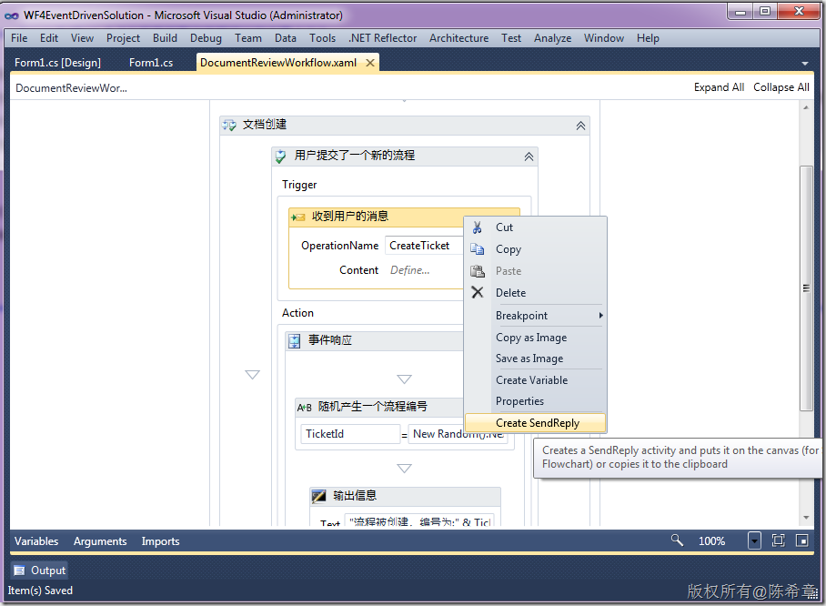](http://images.cnblogs.com/cnblogs_com/chenxizhang/Windows-Live-Writer/5d5552d4291c_CDA2/image_2.png)

 点击该菜单，会有一个提示

 [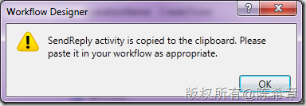](http://images.cnblogs.com/cnblogs_com/chenxizhang/Windows-Live-Writer/5d5552d4291c_CDA2/image_4.png)

  

 我们可以选择将其粘贴到任何地方，例如

 [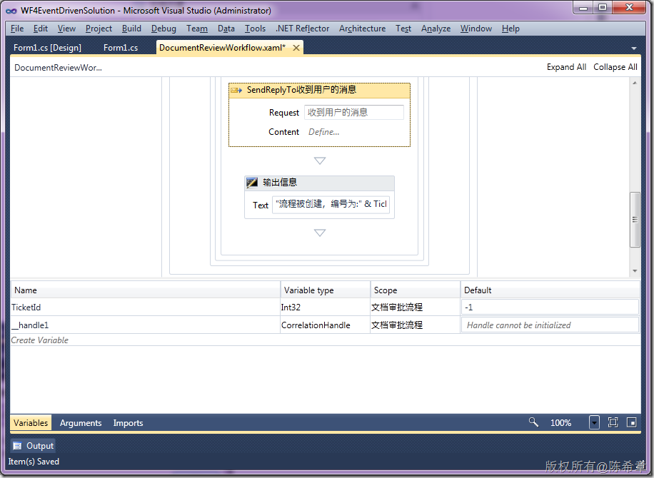](http://images.cnblogs.com/cnblogs_com/chenxizhang/Windows-Live-Writer/5d5552d4291c_CDA2/image_6.png)

 请注意，此时会多出来一个变量，叫\_\_handler1，它的类型是CorrelationHandler，这个东西我们后面一篇会详细介绍，这里可以不关注它的细节。

  

 粘贴过来的这个Activity，它是自动与之前的Receive这个Activity进行关联的

 [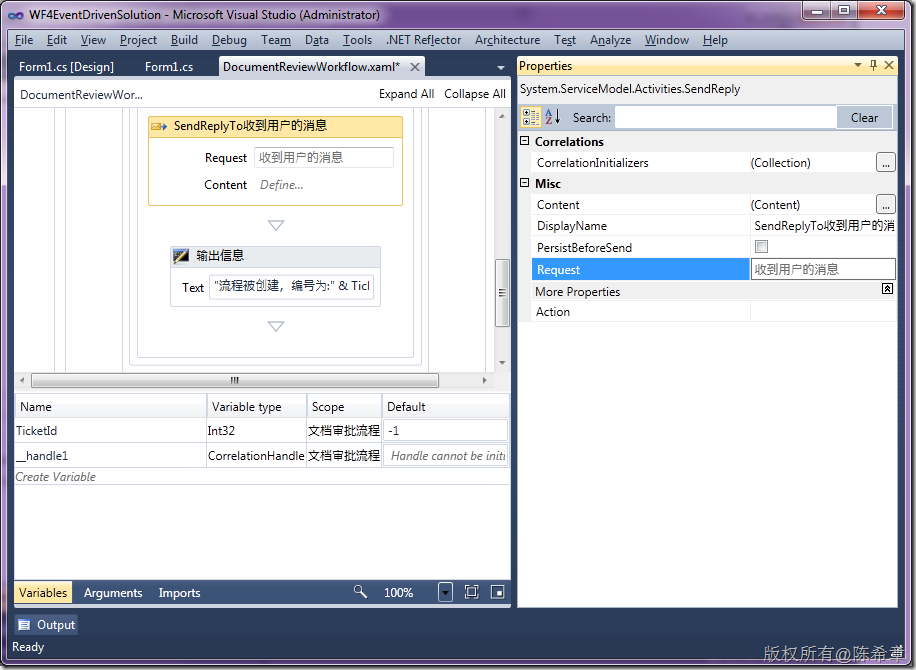](http://images.cnblogs.com/cnblogs_com/chenxizhang/Windows-Live-Writer/5d5552d4291c_CDA2/image_8.png)

 那么，我们到底要发送什么数据给用户呢？可以点击Activity上面的Content这个地方

 [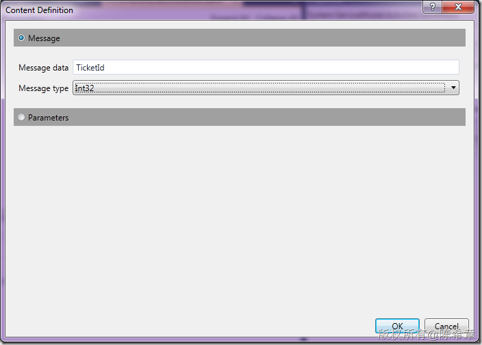](http://images.cnblogs.com/cnblogs_com/chenxizhang/Windows-Live-Writer/5d5552d4291c_CDA2/image_10.png)

 将Message data绑定到我们之前的那个TicketId变量，并且设置Type为INT 32

  

 这样，我们就将流程设计好了。重新编译一下吧

  

 2. 重新生成客户端代码类
=============

 流程发生了此类变化，通常客户端代理类也要有所变化。我们先启动服务器程序

 [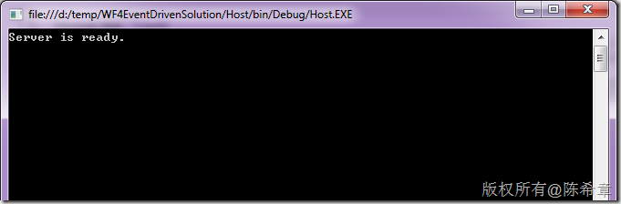](http://images.cnblogs.com/cnblogs_com/chenxizhang/Windows-Live-Writer/5d5552d4291c_CDA2/image_14.png)

 确认在浏览器中可以看到下面的结果

 [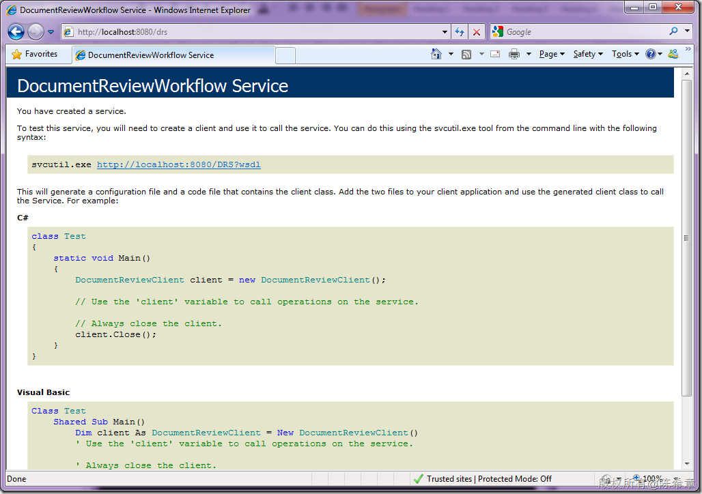](http://images.cnblogs.com/cnblogs_com/chenxizhang/Windows-Live-Writer/5d5552d4291c_CDA2/image_16.png)

 生成客户端代码文件

 [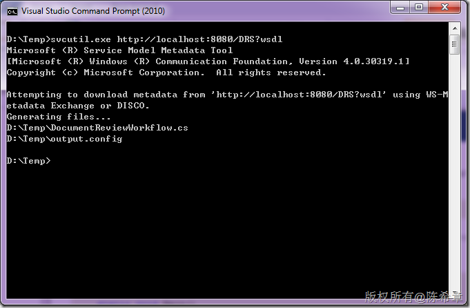](http://images.cnblogs.com/cnblogs_com/chenxizhang/Windows-Live-Writer/5d5552d4291c_CDA2/image_18.png)

  

 3. 修改客户端
========

 将生成好的DocumentReviewWorkflow.cs文件，添加到客户端项目中，替换掉原先那个文件。

 这里无需添加output.config,因为这个文件内容其实没有啥变化 。

 修改窗口如下，添加了一个ListBox

 [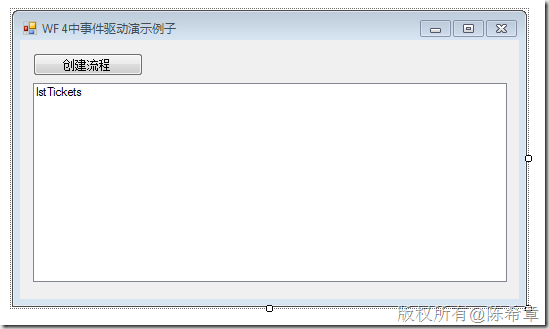](http://images.cnblogs.com/cnblogs_com/chenxizhang/Windows-Live-Writer/5d5552d4291c_CDA2/image_20.png)

  

 修改代码如下


```
        private void btCreate\_Click(object sender, EventArgs e)
        {
            var proxy = new DocumentReviewClient();
            var result = proxy.CreateTicket();

            lstTickets.Items.Add(result);
        }
```

.csharpcode, .csharpcode pre
{
 font-size: small;
 color: black;
 font-family: consolas, "Courier New", courier, monospace;
 background-color: #ffffff;
 /*white-space: pre;*/
}
.csharpcode pre { margin: 0em; }
.csharpcode .rem { color: #008000; }
.csharpcode .kwrd { color: #0000ff; }
.csharpcode .str { color: #006080; }
.csharpcode .op { color: #0000c0; }
.csharpcode .preproc { color: #cc6633; }
.csharpcode .asp { background-color: #ffff00; }
.csharpcode .html { color: #800000; }
.csharpcode .attr { color: #ff0000; }
.csharpcode .alt 
{
 background-color: #f4f4f4;
 width: 100%;
 margin: 0em;
}
.csharpcode .lnum { color: #606060; }

 


请注意，现在CreateTicket方法是有返回值的(int?)，而在上一篇，它没有返回值，是void.


 


4. 调试程序
=======


按下F5键进行调试，在窗口上多次点击“创建流程”的话，会怎么样呢


[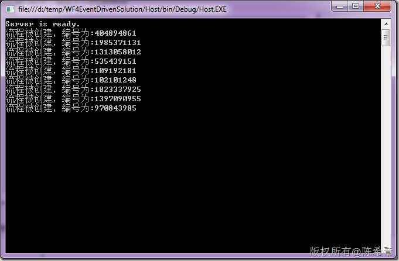](http://images.cnblogs.com/cnblogs_com/chenxizhang/Windows-Live-Writer/5d5552d4291c_CDA2/image_22.png)


不光是服务端有消息输出，我们在客户端也可以看到一个TicketId的列表


[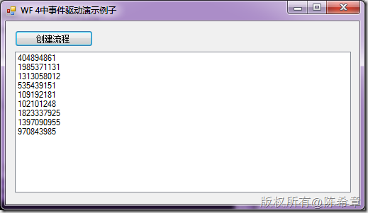](http://images.cnblogs.com/cnblogs_com/chenxizhang/Windows-Live-Writer/5d5552d4291c_CDA2/image_24.png)


 


本文代码，可以通过 [这里](http://files.cnblogs.com/chenxizhang/WFEventDriven(2).rar) 下载


 


下一篇，我们将完成这个流程的例子，我们将添加经理审批的事件。通过这样一个例子，你可以理解如何设计基于事件驱动的流程。

