# Workflow Foundation 4.0中的事件驱动流程设计和应用（三） 
> 原文发表于 2010-10-07, 地址: http://www.cnblogs.com/chenxizhang/archive/2010/10/07/1845164.html 


前面两篇已经实现了最简单的基于事件的工作流程，用户可以在客户端（任意类型的客户端）发出流程操作的指令，通过WCF的通讯，驱动后台的工作流工作。

 [Workflow Foundation 4.0中的事件驱动流程设计和应用（一）](http://www.cnblogs.com/chenxizhang/archive/2010/10/07/1845104.html "Workflow Foundation 4.0中的事件驱动流程设计和应用（一）")

  

 但之前的例子只有一个事件，就是“创建流程”的事件，显然这是不够的。这一篇就来把这个例子完善一下，通过这个练习之后，大家应该可以大致了解在WF4中如何设计基于事件的流程了

 我们将为这个流程添加一个“审批流程”的事件。

 本文代码，请通过 [这里](http://files.cnblogs.com/chenxizhang/WFEventDriven(3).rar) 下载

 1. 修改工作流设计
==========

 很显然地，我们会在下面添加另外一个Pick Activity，然后里面也添加一个Receive来实现事件监听

 [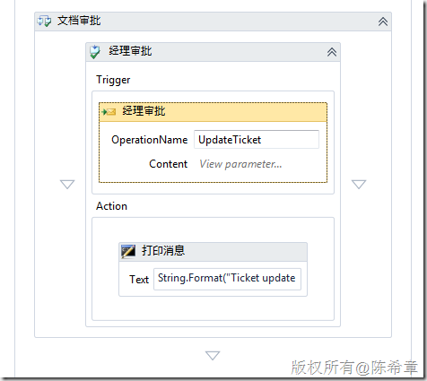](http://images.cnblogs.com/cnblogs_com/chenxizhang/Windows-Live-Writer/Workflow-Foundation-4.0_D5A0/image_2.png)

  

 同时，我们定义了三个变量用来接收用户传递过来的数据

 [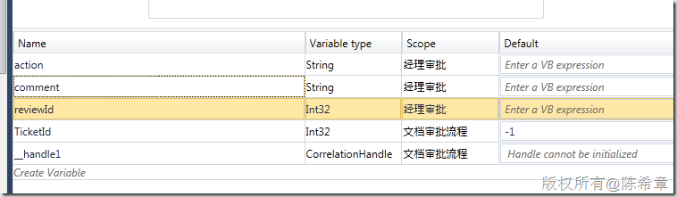](http://images.cnblogs.com/cnblogs_com/chenxizhang/Windows-Live-Writer/Workflow-Foundation-4.0_D5A0/image_8.png)

  

 我们在Receive上面设置了参数与这些变量之间的映射

 [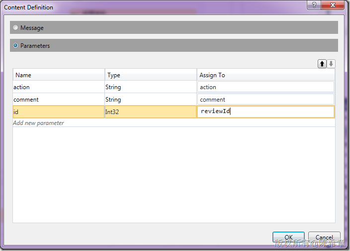](http://images.cnblogs.com/cnblogs_com/chenxizhang/Windows-Live-Writer/Workflow-Foundation-4.0_D5A0/image_10.png)

 一切看起来都还是挺自然的。请注意，这个Receive，因为是第二个事件，所以无需创建新的工作流实例（如果每个事件都创建新的实例，那就乱套了），也就是说CanCreateInstance不需要设置为true

 [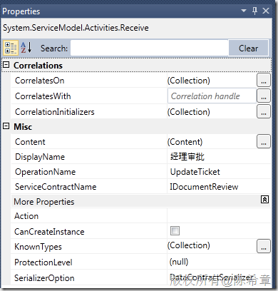](http://images.cnblogs.com/cnblogs_com/chenxizhang/Windows-Live-Writer/Workflow-Foundation-4.0_D5A0/image_12.png)

  

 这个工作流的xaml文件代码如下


```
<Activity mc:Ignorable="sap" x:Class="DocumentReviewLib.DocumentReviewWorkflow" sap:VirtualizedContainerService.HintSize="483,1245" mva:VisualBasic.Settings="Assembly references and imported namespaces for internal implementation" xmlns="http://schemas.microsoft.com/netfx/2009/xaml/activities" xmlns:mc="http://schemas.openxmlformats.org/markup-compatibility/2006" xmlns:mv="clr-namespace:Microsoft.VisualBasic;assembly=System" xmlns:mva="clr-namespace:Microsoft.VisualBasic.Activities;assembly=System.Activities" xmlns:p="http://schemas.microsoft.com/netfx/2009/xaml/servicemodel" xmlns:s="clr-namespace:System;assembly=mscorlib" xmlns:s1="clr-namespace:System;assembly=System" xmlns:s2="clr-namespace:System;assembly=System.Xml" xmlns:s3="clr-namespace:System;assembly=System.Core" xmlns:s4="clr-namespace:System;assembly=System.ServiceModel" xmlns:sa="clr-namespace:System.Activities;assembly=System.Activities" xmlns:sad="clr-namespace:System.Activities.Debugger;assembly=System.Activities" xmlns:sap="http://schemas.microsoft.com/netfx/2009/xaml/activities/presentation" xmlns:scg="clr-namespace:System.Collections.Generic;assembly=System" xmlns:scg1="clr-namespace:System.Collections.Generic;assembly=System.ServiceModel" xmlns:scg2="clr-namespace:System.Collections.Generic;assembly=System.Core" xmlns:scg3="clr-namespace:System.Collections.Generic;assembly=mscorlib" xmlns:sd="clr-namespace:System.Data;assembly=System.Data" xmlns:sl="clr-namespace:System.Linq;assembly=System.Core" xmlns:ssa="clr-namespace:System.ServiceModel.Activities;assembly=System.ServiceModel.Activities" xmlns:st="clr-namespace:System.Text;assembly=mscorlib" xmlns:x="http://schemas.microsoft.com/winfx/2006/xaml">
  <Sequence DisplayName="文档审批流程" sad:XamlDebuggerXmlReader.FileName="d:\temp\WF4EventDrivenSolution\DocumentReviewLib\DocumentReviewWorkflow.xaml" sap:VirtualizedContainerService.HintSize="443,1205">
    <Sequence.Variables>
      <Variable x:TypeArguments="x:Int32" Default="-1" Name="TicketId" />
      <Variable x:TypeArguments="p:CorrelationHandle" Name="\_\_handle1" />
    </Sequence.Variables>
    <sap:WorkflowViewStateService.ViewState>
      <scg3:Dictionary x:TypeArguments="x:String, x:Object">
        <x:Boolean x:Key="IsExpanded">True</x:Boolean>
      </scg3:Dictionary>
    </sap:WorkflowViewStateService.ViewState>
    <Pick DisplayName="文档创建" sap:VirtualizedContainerService.HintSize="421,677">
      <PickBranch DisplayName="用户提交了一个新的流程" sap:VirtualizedContainerService.HintSize="307,631">
        <PickBranch.Trigger>
          <p:Receive x:Name="\_\_ReferenceID0" CanCreateInstance="True" DisplayName="收到用户的消息" sap:VirtualizedContainerService.HintSize="277,100" OperationName="CreateTicket" ServiceContractName="IDocumentReview">
            <p:Receive.CorrelationInitializers>
              <p:RequestReplyCorrelationInitializer CorrelationHandle="[\_\_handle1]" />
            </p:Receive.CorrelationInitializers>
          </p:Receive>
        </PickBranch.Trigger>
        <Sequence DisplayName="事件响应" sap:VirtualizedContainerService.HintSize="277,413">
          <sap:WorkflowViewStateService.ViewState>
            <scg3:Dictionary x:TypeArguments="x:String, x:Object">
              <x:Boolean x:Key="IsExpanded">True</x:Boolean>
            </scg3:Dictionary>
          </sap:WorkflowViewStateService.ViewState>
          <Assign DisplayName="随机产生一个流程编号" sap:VirtualizedContainerService.HintSize="255,58">
            <Assign.To>
              <OutArgument x:TypeArguments="x:Int32">[TicketId]</OutArgument>
            </Assign.To>
            <Assign.Value>
              <InArgument x:TypeArguments="x:Int32">[New Random().Next()]</InArgument>
            </Assign.Value>
          </Assign>
          <p:SendReply Request="{x:Reference \_\_ReferenceID0}" DisplayName="SendReplyTo收到用户的消息" sap:VirtualizedContainerService.HintSize="255,90">
            <p:SendMessageContent DeclaredMessageType="x:Int32">
              <InArgument x:TypeArguments="x:Int32">[TicketId]</InArgument>
            </p:SendMessageContent>
          </p:SendReply>
          <WriteLine DisplayName="输出信息" sap:VirtualizedContainerService.HintSize="255,61" Text="[&quot;流程被创建，编号为:&quot; &amp; TicketId]" />
        </Sequence>
      </PickBranch>
    </Pick>
    <Pick DisplayName="文档审批" sap:VirtualizedContainerService.HintSize="421,364">
      <PickBranch DisplayName="经理审批" sap:VirtualizedContainerService.HintSize="285,318">
        <PickBranch.Variables>
          <Variable x:TypeArguments="x:String" Name="action" />
          <Variable x:TypeArguments="x:String" Name="comment" />
          <Variable x:TypeArguments="x:Int32" Name="reviewId" />
        </PickBranch.Variables>
        <PickBranch.Trigger>
          <p:Receive DisplayName="经理审批" sap:VirtualizedContainerService.HintSize="255,100" OperationName="UpdateTicket" ServiceContractName="IDocumentReview">
            <p:ReceiveParametersContent>
              <OutArgument x:TypeArguments="x:String" x:Key="action">[action]</OutArgument>
              <OutArgument x:TypeArguments="x:String" x:Key="comment">[comment]</OutArgument>
              <OutArgument x:TypeArguments="x:Int32" x:Key="id">[reviewId]</OutArgument>
            </p:ReceiveParametersContent>
          </p:Receive>
        </PickBranch.Trigger>
        <WriteLine DisplayName="打印消息" sap:VirtualizedContainerService.HintSize="255,100" Text="[String.Format(&quot;Ticket update --- action : {0}, comment :{1} &quot;, action, comment)]" />
      </PickBranch>
    </Pick>
  </Sequence>
</Activity>
```

.csharpcode, .csharpcode pre
{
 font-size: small;
 color: black;
 font-family: consolas, "Courier New", courier, monospace;
 background-color: #ffffff;
 /*white-space: pre;*/
}
.csharpcode pre { margin: 0em; }
.csharpcode .rem { color: #008000; }
.csharpcode .kwrd { color: #0000ff; }
.csharpcode .str { color: #006080; }
.csharpcode .op { color: #0000c0; }
.csharpcode .preproc { color: #cc6633; }
.csharpcode .asp { background-color: #ffff00; }
.csharpcode .html { color: #800000; }
.csharpcode .attr { color: #ff0000; }
.csharpcode .alt 
{
 background-color: #f4f4f4;
 width: 100%;
 margin: 0em;
}
.csharpcode .lnum { color: #606060; }

 


2. 更新客户端代码和设计
=============


工作流已经进行了修改，相应地，客户端代码也需要有一些更新


启动宿主程序，然后通过下面的方式再次得到客户端代码文件。


[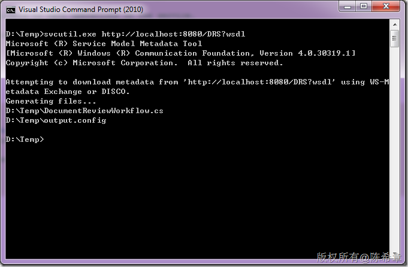](http://images.cnblogs.com/cnblogs_com/chenxizhang/Windows-Live-Writer/Workflow-Foundation-4.0_D5A0/image_14.png)


同样，我们只需要添加那个DocumentReviewWorkflow.cs到项目中来


 


我们修改窗口如下，添加审批的工具按钮


[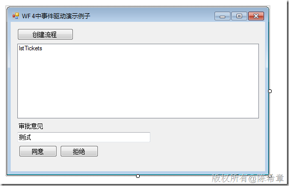](http://images.cnblogs.com/cnblogs_com/chenxizhang/Windows-Live-Writer/Workflow-Foundation-4.0_D5A0/image_16.png)


有关代码如下


```
        private void btApproval\_Click(object sender, EventArgs e)
        {
            //同意某个流程
            var action = "approval";
            UpdateTicket(action);

        }

        private void UpdateTicket(string action)
        {
            if (lstTickets.SelectedIndex > -1)
            {
                var id = int.Parse(lstTickets.SelectedItem.ToString());
                var comment = txtComment.Text;

                var proxy = new DocumentReviewClient();
                proxy.UpdateTicket(action, comment, id);

            }
        }

        private void btReject\_Click(object sender, EventArgs e)
        {
            var action = "Reject";
            UpdateTicket(action);
        }
```


.csharpcode, .csharpcode pre
{
 font-size: small;
 color: black;
 font-family: consolas, "Courier New", courier, monospace;
 background-color: #ffffff;
 /*white-space: pre;*/
}
.csharpcode pre { margin: 0em; }
.csharpcode .rem { color: #008000; }
.csharpcode .kwrd { color: #0000ff; }
.csharpcode .str { color: #006080; }
.csharpcode .op { color: #0000c0; }
.csharpcode .preproc { color: #cc6633; }
.csharpcode .asp { background-color: #ffff00; }
.csharpcode .html { color: #800000; }
.csharpcode .attr { color: #ff0000; }
.csharpcode .alt 
{
 background-color: #f4f4f4;
 width: 100%;
 margin: 0em;
}
.csharpcode .lnum { color: #606060; }


代码也是很好理解的，几乎无需特别的解释。


 


3. 调试程序
=======


 


[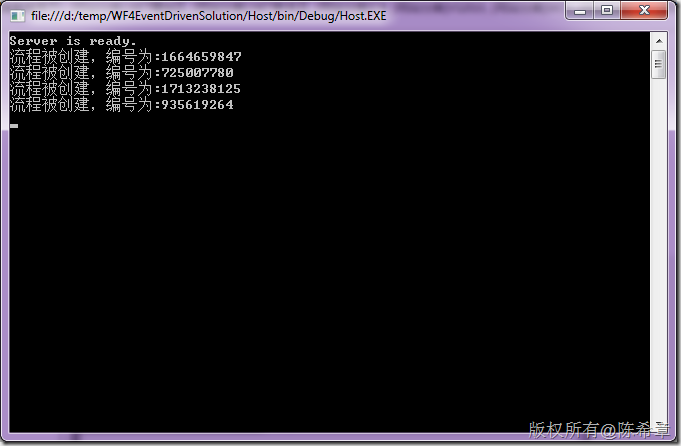](http://images.cnblogs.com/cnblogs_com/chenxizhang/Windows-Live-Writer/Workflow-Foundation-4.0_D5A0/image_20.png)[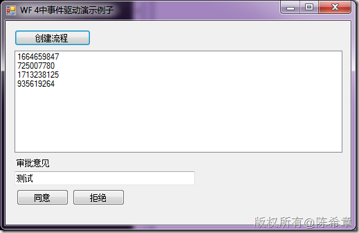](http://images.cnblogs.com/cnblogs_com/chenxizhang/Windows-Live-Writer/Workflow-Foundation-4.0_D5A0/image_18.png)


我几乎迫不及待地想要看一下效果了。选择某个Ticket之后，点击“同意”按钮，激动人心的时刻到了。晕，又是什么也没有发生。


你猜对了，这又是我预先埋下的一个“陷阱”。放心吧，如果那么容易做出来，我是不会专门写一篇来介绍的。


 


4.修改流程设计
========


有点沮丧吗？其实大可不必。淡定，淡定


静下心来想一下，为什么它不能工作呢？很显然，客户端的请求是发送到了服务端的，那么就是说服务端不知道该怎么处理？这样解释是合理的吧。


那么服务端为什么不知道该怎么处理呢？你可能会说，我都告诉他TicketId了，为什么它不会找到那个Instance，然后触发里面的事件呢？


症结点就在于这里，你光是传递TicketId过来是不够的，还需要在工作流中将这个Id标识为一个上下文事件关联的依据。


还记得第二篇提到的CorrelationHandler吗？既然事件需要被定位到，那么它就需要有一定的机制可以区分。不同实例之间就是通过不同的CorrelationHandler来区别的。


 


那么，我们既然想让UpdateTicket事件与相应的CreateTicket事件所创建的那个实例关联起来，就需要定义一个特殊的Handler。


[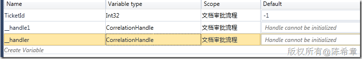](http://images.cnblogs.com/cnblogs_com/chenxizhang/Windows-Live-Writer/Workflow-Foundation-4.0_D5A0/image_22.png)


注意，这个\_\_handler是我们定义的，而上面的那个\_\_handler1是之前第二个练习时自动创建的


 


接下来，我们需要对这个handler进行初始化。这个可以通过一个InitializeCorrelation的Activity来完成


[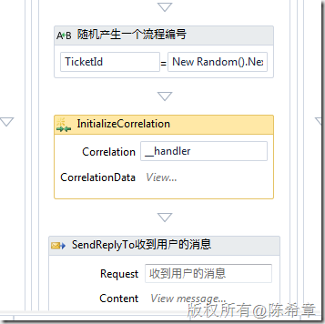](http://images.cnblogs.com/cnblogs_com/chenxizhang/Windows-Live-Writer/Workflow-Foundation-4.0_D5A0/image_28.png)


我们让这个初始化好的handler具有一个属性，Id，保存当前这个TicketId


[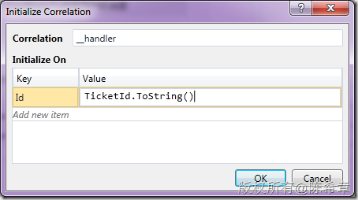](http://images.cnblogs.com/cnblogs_com/chenxizhang/Windows-Live-Writer/Workflow-Foundation-4.0_D5A0/image_26.png)


 


然后，我们修改”UpdateTicket”这个事件


 


设置CorrelatesWith属性


[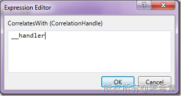](http://images.cnblogs.com/cnblogs_com/chenxizhang/Windows-Live-Writer/Workflow-Foundation-4.0_D5A0/image_30.png)


设置CorrelatesOn属性


[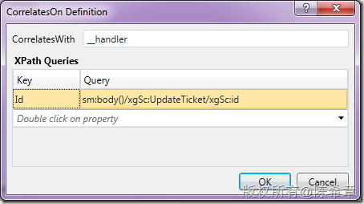](http://images.cnblogs.com/cnblogs_com/chenxizhang/Windows-Live-Writer/Workflow-Foundation-4.0_D5A0/image_32.png)


这个设置，也就是说，让UpdateTicket方法传入的id参数，自动作为查找CorrelationHandler的依据


**【注意】这一步至关重要**


 


保存流程，编译即可。因为这种更改，不涉及到与客户端的合约更改，所以无需重新生成客户端代码。这也是用WF来做流程设计的好处之一。


最终版xaml如下


```
<Activity mc:Ignorable="sap" x:Class="DocumentReviewLib.DocumentReviewWorkflow" sap:VirtualizedContainerService.HintSize="483,1378" mva:VisualBasic.Settings="Assembly references and imported namespaces for internal implementation" xmlns="http://schemas.microsoft.com/netfx/2009/xaml/activities" xmlns:mc="http://schemas.openxmlformats.org/markup-compatibility/2006" xmlns:mv="clr-namespace:Microsoft.VisualBasic;assembly=System" xmlns:mva="clr-namespace:Microsoft.VisualBasic.Activities;assembly=System.Activities" xmlns:p="http://schemas.microsoft.com/netfx/2009/xaml/servicemodel" xmlns:s="clr-namespace:System;assembly=mscorlib" xmlns:s1="clr-namespace:System;assembly=System" xmlns:s2="clr-namespace:System;assembly=System.Xml" xmlns:s3="clr-namespace:System;assembly=System.Core" xmlns:s4="clr-namespace:System;assembly=System.ServiceModel" xmlns:sa="clr-namespace:System.Activities;assembly=System.Activities" xmlns:sad="clr-namespace:System.Activities.Debugger;assembly=System.Activities" xmlns:sap="http://schemas.microsoft.com/netfx/2009/xaml/activities/presentation" xmlns:scg="clr-namespace:System.Collections.Generic;assembly=System" xmlns:scg1="clr-namespace:System.Collections.Generic;assembly=System.ServiceModel" xmlns:scg2="clr-namespace:System.Collections.Generic;assembly=System.Core" xmlns:scg3="clr-namespace:System.Collections.Generic;assembly=mscorlib" xmlns:sd="clr-namespace:System.Data;assembly=System.Data" xmlns:sl="clr-namespace:System.Linq;assembly=System.Core" xmlns:ssa="clr-namespace:System.ServiceModel.Activities;assembly=System.ServiceModel.Activities" xmlns:ssx="clr-namespace:System.ServiceModel.XamlIntegration;assembly=System.ServiceModel" xmlns:st="clr-namespace:System.Text;assembly=mscorlib" xmlns:x="http://schemas.microsoft.com/winfx/2006/xaml">
  <Sequence DisplayName="文档审批流程" sad:XamlDebuggerXmlReader.FileName="d:\temp\WF4EventDrivenSolution\DocumentReviewLib\DocumentReviewWorkflow.xaml" sap:VirtualizedContainerService.HintSize="443,1338">
    <Sequence.Variables>
      <Variable x:TypeArguments="x:Int32" Default="-1" Name="TicketId" />
      <Variable x:TypeArguments="p:CorrelationHandle" Name="\_\_handle1" />
      <Variable x:TypeArguments="p:CorrelationHandle" Name="\_\_handler" />
    </Sequence.Variables>
    <sap:WorkflowViewStateService.ViewState>
      <scg3:Dictionary x:TypeArguments="x:String, x:Object">
        <x:Boolean x:Key="IsExpanded">True</x:Boolean>
      </scg3:Dictionary>
    </sap:WorkflowViewStateService.ViewState>
    <Pick DisplayName="文档创建" sap:VirtualizedContainerService.HintSize="421,810">
      <PickBranch DisplayName="用户提交了一个新的流程" sap:VirtualizedContainerService.HintSize="307,764">
        <PickBranch.Trigger>
          <p:Receive x:Name="\_\_ReferenceID0" CanCreateInstance="True" DisplayName="收到用户的消息" sap:VirtualizedContainerService.HintSize="277,100" OperationName="CreateTicket" ServiceContractName="IDocumentReview">
            <p:Receive.CorrelationInitializers>
              <p:RequestReplyCorrelationInitializer CorrelationHandle="[\_\_handle1]" />
            </p:Receive.CorrelationInitializers>
          </p:Receive>
        </PickBranch.Trigger>
        <Sequence DisplayName="事件响应" sap:VirtualizedContainerService.HintSize="277,546">
          <sap:WorkflowViewStateService.ViewState>
            <scg3:Dictionary x:TypeArguments="x:String, x:Object">
              <x:Boolean x:Key="IsExpanded">True</x:Boolean>
            </scg3:Dictionary>
          </sap:WorkflowViewStateService.ViewState>
          <Assign DisplayName="随机产生一个流程编号" sap:VirtualizedContainerService.HintSize="255,58">
            <Assign.To>
              <OutArgument x:TypeArguments="x:Int32">[TicketId]</OutArgument>
            </Assign.To>
            <Assign.Value>
              <InArgument x:TypeArguments="x:Int32">[New Random().Next()]</InArgument>
            </Assign.Value>
          </Assign>
          <p:InitializeCorrelation Correlation="[\_\_handler]" sap:VirtualizedContainerService.HintSize="255,93">
            <InArgument x:TypeArguments="x:String" x:Key="Id">[TicketId.ToString()]</InArgument>
          </p:InitializeCorrelation>
          <p:SendReply Request="{x:Reference \_\_ReferenceID0}" DisplayName="SendReplyTo收到用户的消息" sap:VirtualizedContainerService.HintSize="255,90">
            <p:SendMessageContent DeclaredMessageType="x:Int32">
              <InArgument x:TypeArguments="x:Int32">[TicketId]</InArgument>
            </p:SendMessageContent>
          </p:SendReply>
          <WriteLine DisplayName="输出信息" sap:VirtualizedContainerService.HintSize="255,61" Text="[&quot;流程被创建，编号为:&quot; &amp; TicketId]" />
        </Sequence>
      </PickBranch>
    </Pick>
    <Pick DisplayName="文档审批" sap:VirtualizedContainerService.HintSize="421,364">
      <PickBranch DisplayName="经理审批" sap:VirtualizedContainerService.HintSize="285,318">
        <PickBranch.Variables>
          <Variable x:TypeArguments="x:String" Name="action" />
          <Variable x:TypeArguments="x:String" Name="comment" />
          <Variable x:TypeArguments="x:Int32" Name="reviewId" />
        </PickBranch.Variables>
        <PickBranch.Trigger>
          <p:Receive CorrelatesWith="[\_\_handler]" DisplayName="经理审批" sap:VirtualizedContainerService.HintSize="255,100" OperationName="UpdateTicket" ServiceContractName="IDocumentReview">
            <p:Receive.CorrelatesOn>
              <p:XPathMessageQuery x:Key="Id">
                <p:XPathMessageQuery.Namespaces>
                  <ssx:XPathMessageContextMarkup>
                    <x:String x:Key="xgSc">http://tempuri.org/</x:String>
                  </ssx:XPathMessageContextMarkup>
                </p:XPathMessageQuery.Namespaces>sm:body()/xgSc:UpdateTicket/xgSc:id</p:XPathMessageQuery>
            </p:Receive.CorrelatesOn>
            <p:ReceiveParametersContent>
              <OutArgument x:TypeArguments="x:String" x:Key="action">[action]</OutArgument>
              <OutArgument x:TypeArguments="x:String" x:Key="comment">[comment]</OutArgument>
              <OutArgument x:TypeArguments="x:Int32" x:Key="id">[reviewId]</OutArgument>
            </p:ReceiveParametersContent>
          </p:Receive>
        </PickBranch.Trigger>
        <WriteLine DisplayName="打印消息" sap:VirtualizedContainerService.HintSize="255,100" Text="[String.Format(&quot;Ticket update --- Ticketid :{0} , action : {1}, comment :{2} &quot;, reviewId, action, comment)]" />
      </PickBranch>
    </Pick>
  </Sequence>
</Activity>
```

.csharpcode, .csharpcode pre
{
 font-size: small;
 color: black;
 font-family: consolas, "Courier New", courier, monospace;
 background-color: #ffffff;
 /*white-space: pre;*/
}
.csharpcode pre { margin: 0em; }
.csharpcode .rem { color: #008000; }
.csharpcode .kwrd { color: #0000ff; }
.csharpcode .str { color: #006080; }
.csharpcode .op { color: #0000c0; }
.csharpcode .preproc { color: #cc6633; }
.csharpcode .asp { background-color: #ffff00; }
.csharpcode .html { color: #800000; }
.csharpcode .attr { color: #ff0000; }
.csharpcode .alt 
{
 background-color: #f4f4f4;
 width: 100%;
 margin: 0em;
}
.csharpcode .lnum { color: #606060; }

5.测试程序
======


发起流程后，分别选择不同的编号，进行审批。结果如下


[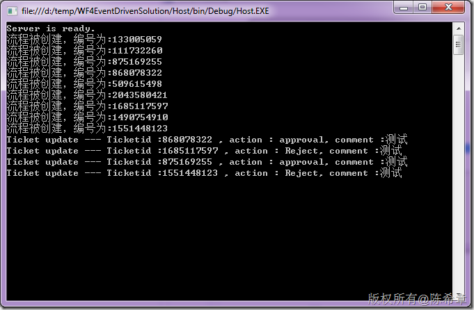](http://images.cnblogs.com/cnblogs_com/chenxizhang/Windows-Live-Writer/Workflow-Foundation-4.0_D5A0/image_34.png)


大功告成，收工


 


总结：


 


利用WF 4的全新框架，可以快速设计基于事件驱动的工作流。它提高了开发效率，简化了开发流程，而更重要的是，这对于广大开发人员的身心健康有着很有益地帮助


 


本文代码，请通过 [这里](http://files.cnblogs.com/chenxizhang/WFEventDriven(3).rar) 下载

