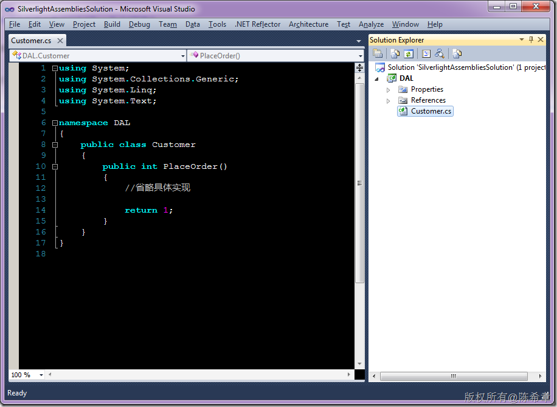
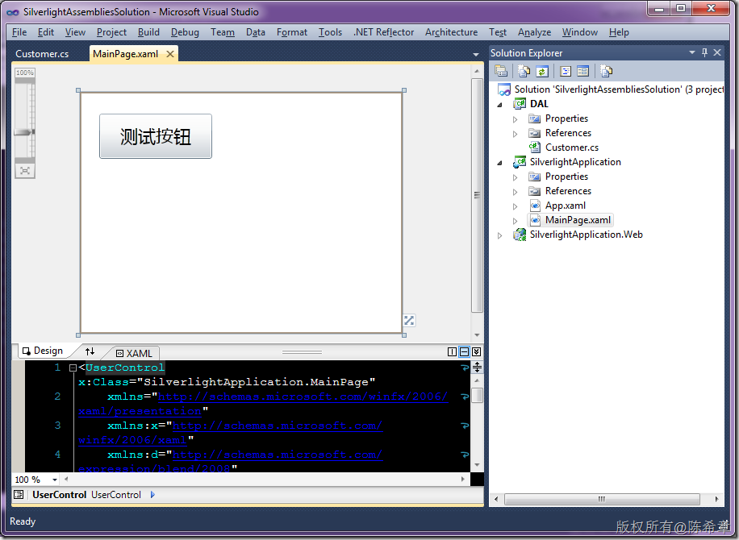
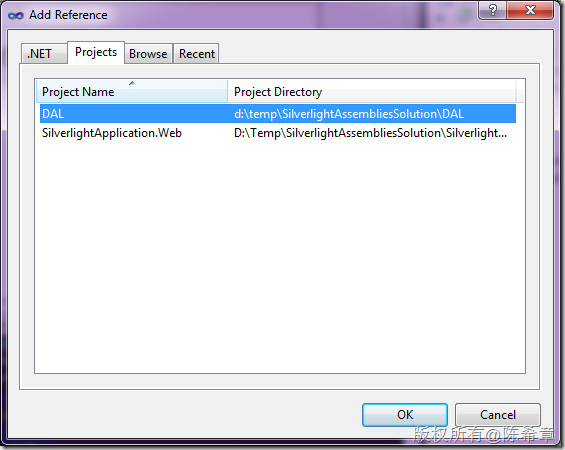
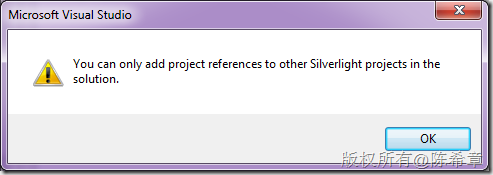
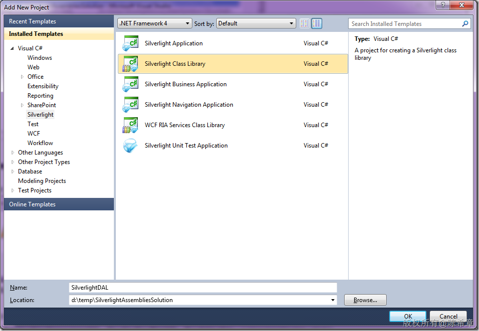
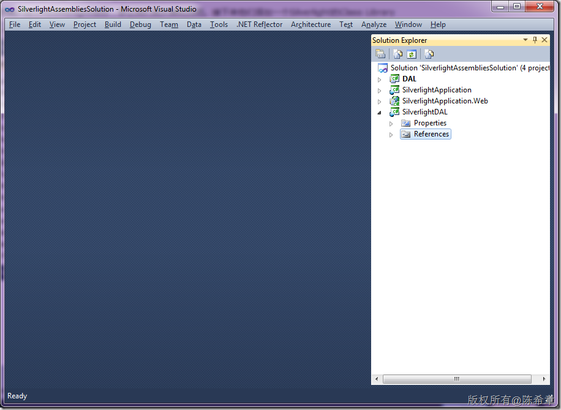
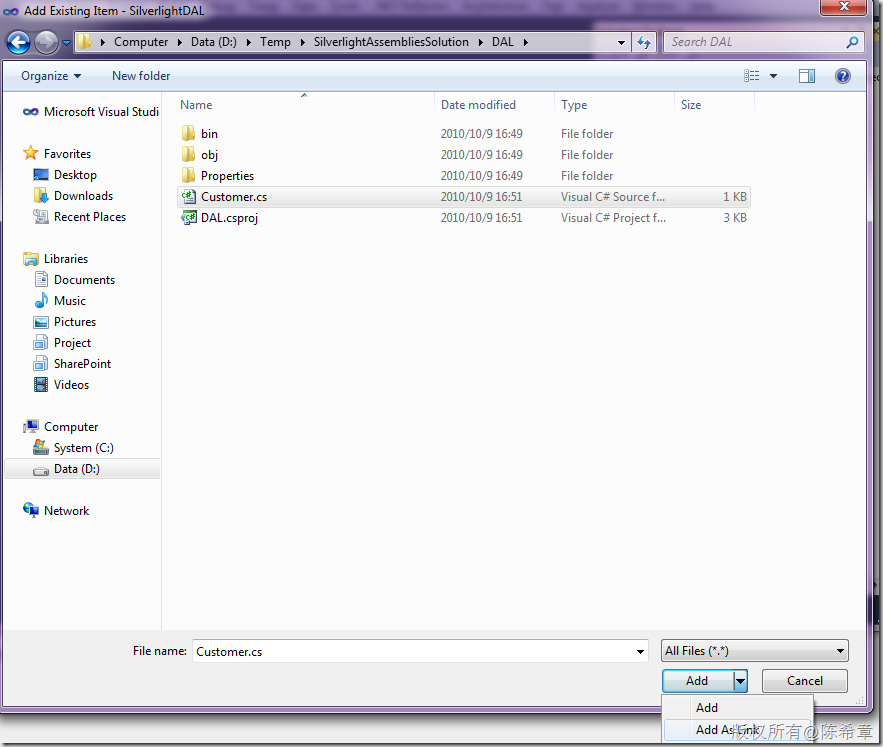
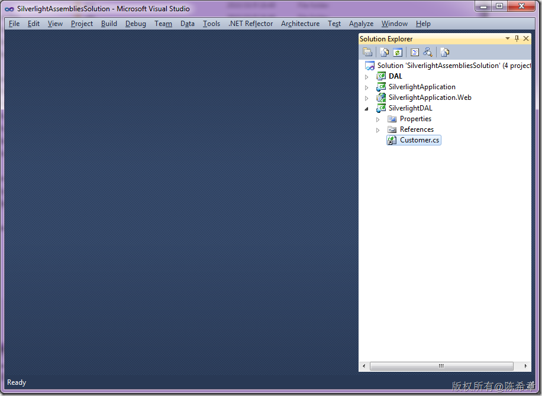
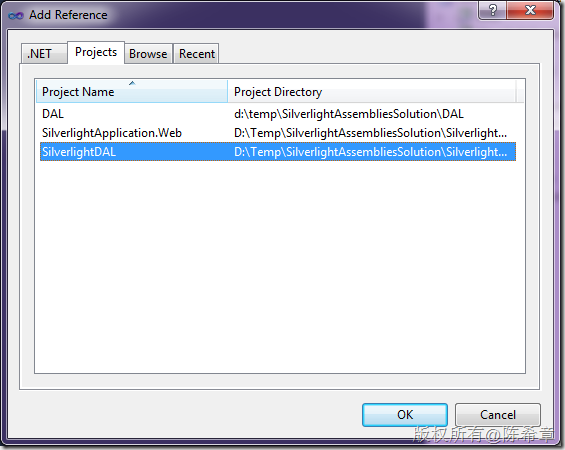

# 如何让一个现有的程序集运行在Silverlight环境中 
> 原文发表于 2010-10-09, 地址: http://www.cnblogs.com/chenxizhang/archive/2010/10/09/1846781.html 


故事是这样的：我们有一个组件，是一个标准的Class Library，里面有一些代码是实现了某些计算或者业务逻辑。例如下面这样

 [](http://images.cnblogs.com/cnblogs_com/chenxizhang/Windows-Live-Writer/Silverlight_F208/image_6.png)

 然后，我们做了一个Silverlight的应用程序，和一个用于运行该程序的网站

 [](http://images.cnblogs.com/cnblogs_com/chenxizhang/Windows-Live-Writer/Silverlight_F208/image_8.png)

 我们想让这个按钮，能调用DAL中Customer的PlaceOrder方法。这样的要求很自然不过了吧

 我们马上会想到，要在SilverlightApplication中添加对DAL项目的引用。

 [](http://images.cnblogs.com/cnblogs_com/chenxizhang/Windows-Live-Writer/Silverlight_F208/image_10.png)

  

 很不幸，我们居然会遇到一个错误  
[](http://images.cnblogs.com/cnblogs_com/chenxizhang/Windows-Live-Writer/Silverlight_F208/image_12.png)

 这个错误提示的意思是说，你只能引用Silverlight项目。

  

 我们先来说一下如何解决这个问题吧，最后会解释具体的原因。

 好吧，既然说只能引用Silverlight项目，那么我们就从善如流吧。接下来他们添加一个Silverlight的Class Library

 [](http://images.cnblogs.com/cnblogs_com/chenxizhang/Windows-Live-Writer/Silverlight_F208/image_14.png)

 [](http://images.cnblogs.com/cnblogs_com/chenxizhang/Windows-Live-Writer/Silverlight_F208/image_16.png)

  

 那么，我们要思考一个问题，既然我们在DAL中写好了那些代码，是否可以在这个项目中进行重用呢？

 有的童鞋马上会说，把那些cs文件复制过来吧。嗯，脑筋动得还是挺快的，不过。。

 下面要出绝招了。我们可以将DAL项目中的那些cs文件链接过来，这样就只要维护一份cs文件了，而不要复制多份。

 [](http://images.cnblogs.com/cnblogs_com/chenxizhang/Windows-Live-Writer/Silverlight_F208/image_18.png)

 请注意，这里选择“Add as link”

 [](http://images.cnblogs.com/cnblogs_com/chenxizhang/Windows-Live-Writer/Silverlight_F208/image_20.png)

  

 赶紧编译一下吧。然后，我们在Silverlight Application中添加对这个DAL的引用

 [](http://images.cnblogs.com/cnblogs_com/chenxizhang/Windows-Live-Writer/Silverlight_F208/image_22.png)

  

 然后编写按钮代码如下


```
using System;
using System.Collections.Generic;
using System.Linq;
using System.Net;
using System.Windows;
using System.Windows.Controls;
using System.Windows.Documents;
using System.Windows.Input;
using System.Windows.Media;
using System.Windows.Media.Animation;
using System.Windows.Shapes;

using DAL;

namespace SilverlightApplication
{
    public partial class MainPage : UserControl
    {
        public MainPage()
        {
            InitializeComponent();
        }

        private void btTest\_Click(object sender, RoutedEventArgs e)
        {
            var customer = new Customer();
            MessageBox.Show(customer.PlaceOrder().ToString());
        }
    }
}

```

.csharpcode, .csharpcode pre
{
 font-size: small;
 color: black;
 font-family: consolas, "Courier New", courier, monospace;
 background-color: #ffffff;
 /*white-space: pre;*/
}
.csharpcode pre { margin: 0em; }
.csharpcode .rem { color: #008000; }
.csharpcode .kwrd { color: #0000ff; }
.csharpcode .str { color: #006080; }
.csharpcode .op { color: #0000c0; }
.csharpcode .preproc { color: #cc6633; }
.csharpcode .asp { background-color: #ffff00; }
.csharpcode .html { color: #800000; }
.csharpcode .attr { color: #ff0000; }
.csharpcode .alt 
{
 background-color: #f4f4f4;
 width: 100%;
 margin: 0em;
}
.csharpcode .lnum { color: #606060; }

 


看起来还不错，不是吗？


 


那么，这是为什么呢？这里的根本原因是**Silverlight的运行时（CLR)其实是一个独立的版本，它与所有标准的.NET FRAMEWORK版本下面的CLR都不一样。它只能做一部分事情，而不是全部的事情。（上述的DAL是很简单的一个示例，如果涉及到一些复杂操作，添加为link的方式不一定能编译通过）**


当然，事实上说起来，真的有必要在Silverlight的程序里面嵌入什么很复杂的程序集吗？我想未必。


尤其是在企业或者商业应用开发的场景下，Silverlight大多是作为一个UI的载体而已，几乎所有的功能（例如与外界资源的交互）都是通过服务来实现的。这里的服务主要指的是WCF服务，当然也不限于此。

