# Workflow Foundation 4.0中的事件驱动流程设计和应用（四） 
> 原文发表于 2010-10-10, 地址: http://www.cnblogs.com/chenxizhang/archive/2010/10/10/1847465.html 


前面三篇，我介绍到了如何在WF 4中设计简单的审批流程，没有什么特别出奇的技术，只不过WF4对于事件机制有了不小的改进吧。

 [Workflow Foundation 4.0中的事件驱动流程设计和应用（一）](http://www.cnblogs.com/chenxizhang/archive/2010/10/07/1845104.html "Workflow Foundation 4.0中的事件驱动流程设计和应用（一）")

 [Workflow Foundation 4.0中的事件驱动流程设计和应用（二）](http://www.cnblogs.com/chenxizhang/archive/2010/10/07/1845136.html "Workflow Foundation 4.0中的事件驱动流程设计和应用（二）")

 [Workflow Foundation 4.0中的事件驱动流程设计和应用（三）](http://www.cnblogs.com/chenxizhang/archive/2010/10/07/1845164.html "Workflow Foundation 4.0中的事件驱动流程设计和应用（三）")

  

 这一篇要来谈谈更加深入一点的话题：如果我们的流程需要长时间才能完成（这是很常见的），那么如何在这些流程空闲（例如等待经理审批）的时候，更好地管理它们呢？

 我们都知道，默认情况下，所有流程实例都是在内存中被创建的一个对象。那么这里提到的管理，有两个层面的意思：

 1. 如果某些实例处于空闲状态，那么他们所占用的内存可能是浪费的。 - 由于可能因意外情况导致的宕机（例如停电，或者被某个恶作剧者按下了重启按钮），所以放在内存中的实例是很不保险的

 所以，为了达到上面的两个目的，WF 提供了所谓的“持久化”的功能。就是支持我们将工作流实例通过一定的方式保存起来，等需要的时候再取出来即可。

 WF3就开始支持这种特性，那时候称之为“持久化服务”。WF4对此做了进一步的改进和完善。本文主要就是讨论WF4下面如何做持久化。

  

 完整代码，请通过 [这里](http://files.cnblogs.com/chenxizhang/WF4EventDrivenSolution.rar) 下载

  

 1. 准备持久化数据库
===========

 WF的持久化功能默认是用一个SQL Server的数据库来保存数据的。当然，在此基础上我们可以扩展。但通常使用默认的这个数据库是明智的选择。

 WF4提供了两个脚本，可以让我们来生成这个数据库。这两个脚本通常在下面的目录

 C:\Windows\Microsoft.NET\Framework64\v4.0.30319\SQL\en

 【注意】如果你不是x64的系统，则可能是C:\Windows\Microsoft.NET\Framework\v4.0.30319\SQL\en

 [](http://images.cnblogs.com/cnblogs_com/chenxizhang/Windows-Live-Writer/Workflow-Foundation-4.0_886F/image_2.png)

 我们可以手工先在SQL Server Management Studio中创建一个数据库，例如叫WF4

 [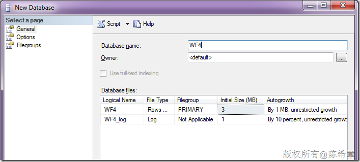](http://images.cnblogs.com/cnblogs_com/chenxizhang/Windows-Live-Writer/Workflow-Foundation-4.0_886F/image_4.png)

 然后，将数据库上下文切换到WF4，依次运行两个脚本

 SqlWorkflowInstanceStoreSchema.sql

 SqlWorkflowInstanceStoreLogic.sql

  

 这个数据库的结构如果有兴趣，可以研究一下。这里就不过多展开了

 [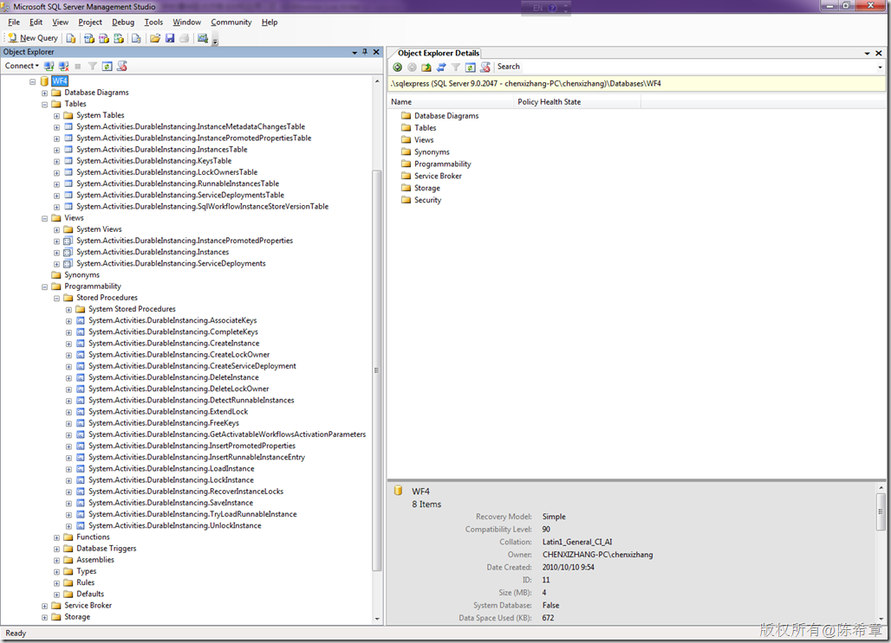](http://images.cnblogs.com/cnblogs_com/chenxizhang/Windows-Live-Writer/Workflow-Foundation-4.0_886F/image_6.png)

  

 2. 修改宿主程序，添加持久化服务的功能
====================

 数据库准备好之后，我们需要对宿主稍做修改，就可以完成持久化功能的配置

 首先，我们需要在宿主程序中添加两个程序集引用

 [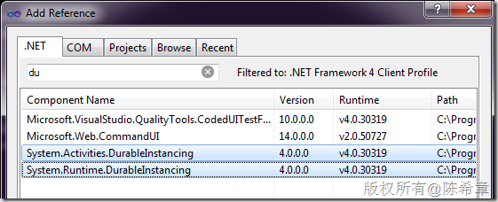](http://images.cnblogs.com/cnblogs_com/chenxizhang/Windows-Live-Writer/Workflow-Foundation-4.0_886F/image_8.png)

 修改Main方法代码如下 (请注意红色字体）


```
using System;
using System.Collections.Generic;
using System.Linq;
using System.Text;
using System.ServiceModel;
using System.Activities;
using System.ServiceModel.Activities;
using System.ServiceModel.Description;

using System.Activities.DurableInstancing;
using System.Runtime.DurableInstancing;
using System.Activities.Persistence;
using System.ServiceModel.Activities.Description;
using System.Xml.Linq;

namespace Host
{
    class Program
    {
        static void Main(string[] args)
        {
            var host = new WorkflowServiceHost(
                new DocumentReviewLib.DocumentReviewWorkflow(),
                new Uri("http://localhost:8080/DRS"));

            host.AddDefaultEndpoints();//这个方法是添加了一些标准的端点

            host.Description.Behaviors.Add(
                new ServiceMetadataBehavior() { HttpGetEnabled = true });

            host.AddServiceEndpoint(
                "IMetadataExchange",
                MetadataExchangeBindings.CreateMexHttpBinding(),
                "mex");


 **var store = new SqlWorkflowInstanceStore(
 "server=(local)\\sqlexpress;database=WF4;integrated security=true");
 
 host.DurableInstancingOptions.InstanceStore = store;**

            host.Open();
            Console.WriteLine("Server is ready.");
            Console.Read();

        }
    }
}

```

.csharpcode, .csharpcode pre
{
 font-size: small;
 color: black;
 font-family: consolas, "Courier New", courier, monospace;
 background-color: #ffffff;
 /*white-space: pre;*/
}
.csharpcode pre { margin: 0em; }
.csharpcode .rem { color: #008000; }
.csharpcode .kwrd { color: #0000ff; }
.csharpcode .str { color: #006080; }
.csharpcode .op { color: #0000c0; }
.csharpcode .preproc { color: #cc6633; }
.csharpcode .asp { background-color: #ffff00; }
.csharpcode .html { color: #800000; }
.csharpcode .attr { color: #ff0000; }
.csharpcode .alt 
{
 background-color: #f4f4f4;
 width: 100%;
 margin: 0em;
}
.csharpcode .lnum { color: #606060; }

 


这样就可以完成服务的配置了。当然，我们这里仅仅是为了直观期间，用了代码的方式(而且用的是最简单的做法）。在生产环境下，我们可能会倾向于用配置文件的方式，而不是代码。


事实上，我个人认为WCF，WF中一个很大的亮点就是减少了对代码的依赖度，确实还是做得不错的。


 


 


3. 调试程序
=======


按下F5进行调试


[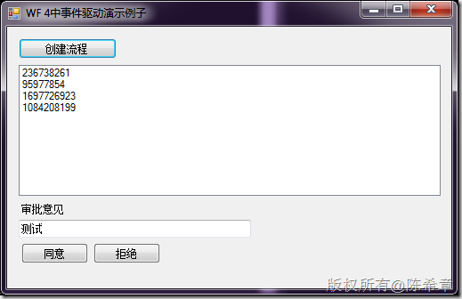](http://images.cnblogs.com/cnblogs_com/chenxizhang/Windows-Live-Writer/Workflow-Foundation-4.0_886F/image_10.png)


[](http://images.cnblogs.com/cnblogs_com/chenxizhang/Windows-Live-Writer/Workflow-Foundation-4.0_886F/image_12.png)


我们回到数据库看一下情况，请注意看那个InstancesTable


[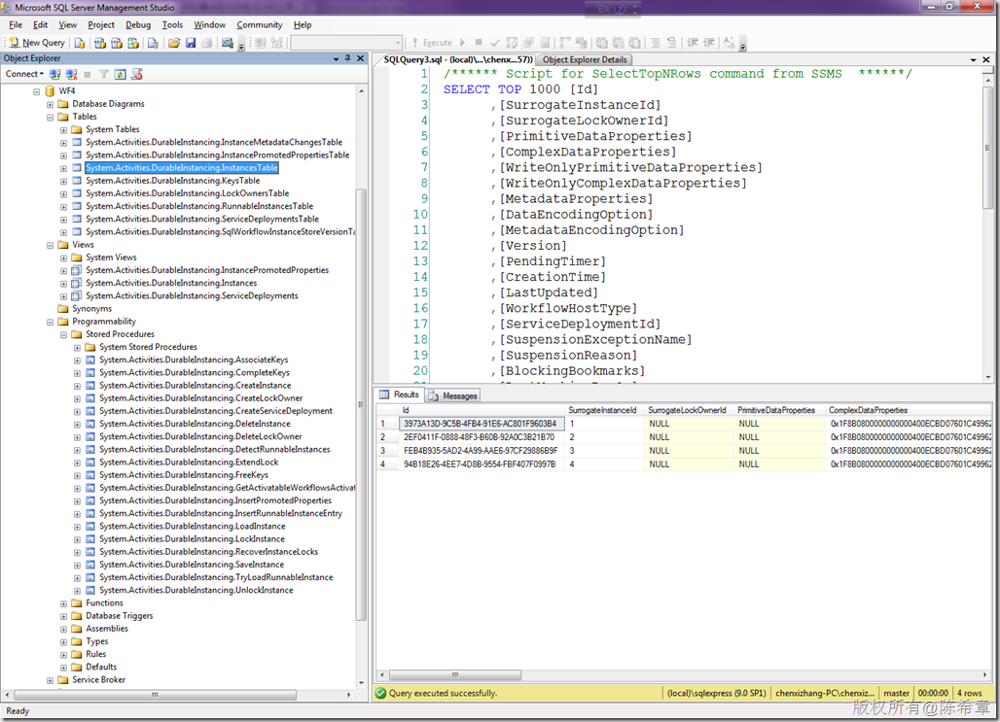](http://images.cnblogs.com/cnblogs_com/chenxizhang/Windows-Live-Writer/Workflow-Foundation-4.0_886F/image_14.png)


也就是说，它已经把这四个实例保存到了数据库中。


 


然后，我们接下来对流程进行审批


[](http://images.cnblogs.com/cnblogs_com/chenxizhang/Windows-Live-Writer/Workflow-Foundation-4.0_886F/image_16.png)


很显然，236738261这个流程已经结束了，我们再来看一下数据库中的记录


[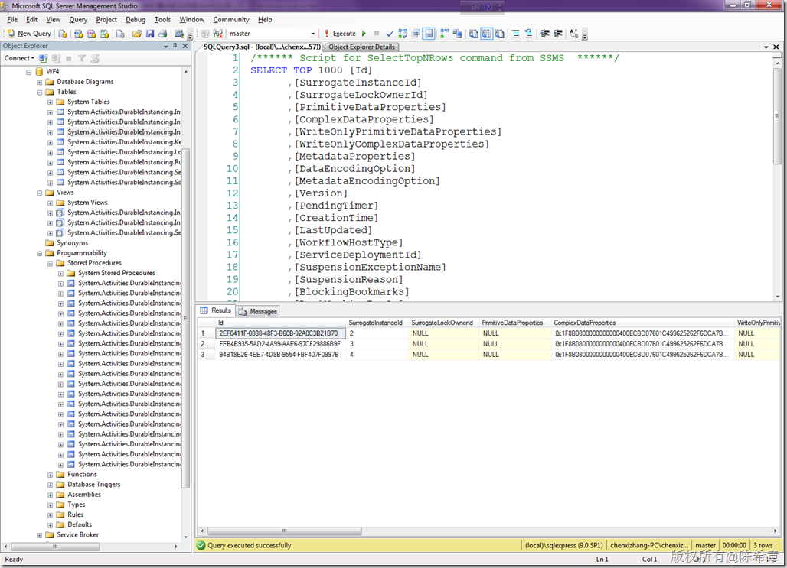](http://images.cnblogs.com/cnblogs_com/chenxizhang/Windows-Live-Writer/Workflow-Foundation-4.0_886F/image_18.png)


我们看到，现在数据库中的记录数也变为了3条。


 


 


4.如何加载已经保存好的实例
==============


既然有这样一个数据库保存好了我们的实例，那么就可以放心大胆地将宿主程序关闭掉。


我们来看，数据库中的记录仍然是在的。请注意，我因为做了其他一些测试，所以现在实例有5个


[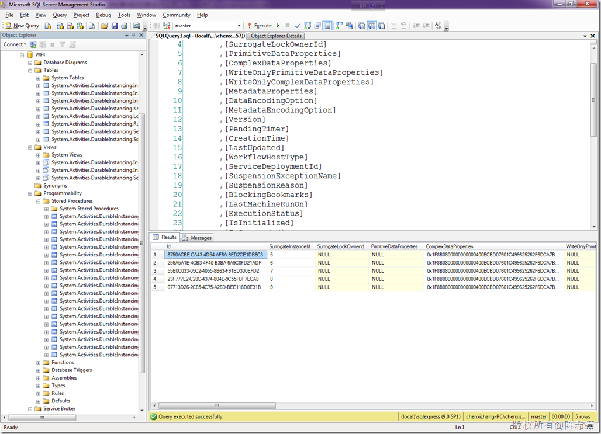](http://images.cnblogs.com/cnblogs_com/chenxizhang/Windows-Live-Writer/Workflow-Foundation-4.0_886F/image_20.png)


 


看起来很不错，不是吗？


但是有一个问题随之而来，当我们再次打开应用程序的时候，我们可能希望宿主程序能自动地加载这些实例的信息，或者说我们仍然能够对这些实例进行操作。这要如何来完成呢？


**请大家按照我的步骤来做练习**


4.1 将宿主程序开起来
------------


[](http://images.cnblogs.com/cnblogs_com/chenxizhang/Windows-Live-Writer/Workflow-Foundation-4.0_886F/image_22.png)


4.2 将客户端开起来
-----------


[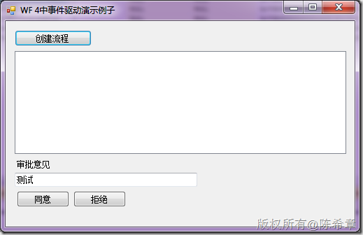](http://images.cnblogs.com/cnblogs_com/chenxizhang/Windows-Live-Writer/Workflow-Foundation-4.0_886F/image_24.png)


点击“创建流程”按钮，可以多点几次


[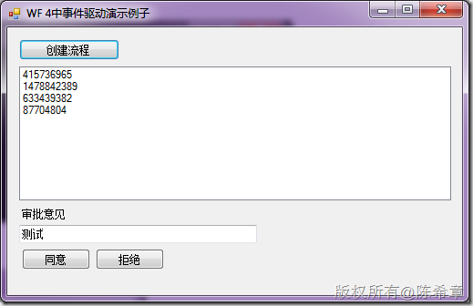](http://images.cnblogs.com/cnblogs_com/chenxizhang/Windows-Live-Writer/Workflow-Foundation-4.0_886F/image_26.png)


[](http://images.cnblogs.com/cnblogs_com/chenxizhang/Windows-Live-Writer/Workflow-Foundation-4.0_886F/image_28.png)


4.3 将宿主程序关闭掉
------------


这样做的目的，是模拟一下服务器突然停电了或者类似这样的情况。


**请不要将客户端关闭**


4.4 重新开启宿主程序
------------


这样做就模拟服务器重启的场景。那么，问题就是，此时客户端还能继续处理那些未完成的流程吗？


[](http://images.cnblogs.com/cnblogs_com/chenxizhang/Windows-Live-Writer/Workflow-Foundation-4.0_886F/image_31.png)


我们可以选择一个编号之后，还是和以前那样，点击“同意”或者“拒绝”按钮


[](http://images.cnblogs.com/cnblogs_com/chenxizhang/Windows-Live-Writer/Workflow-Foundation-4.0_886F/image_33.png)


我们发现，这个流程还是可以继续处理的。而且，我们并不需要在服务端做任何特殊的设计。


所以，我们可以这么总结一下：**当一个流程的请求被发送到服务端，WorkflowServiceHost会收到，它先在内存中查找看是否有合适的实例，如果没有，则会尝试查看数据库中是否有合适的实例，如果有，则会加载它**。


 


那么，如果在内存和数据库都没有实例的话，会怎么样呢？（例如某个流程已经被处理完了，你还是硬要继续审批）。这种情况下，WorkflowServiceHost会将这个请求列为所谓的错误的消息。


为了证明这一点，我们对服务器代码稍作修改(请注意红色部分）


```
using System;
using System.Collections.Generic;
using System.Linq;
using System.Text;
using System.ServiceModel;
using System.Activities;
using System.ServiceModel.Activities;
using System.ServiceModel.Description;

using System.Activities.DurableInstancing;
using System.Runtime.DurableInstancing;
using System.Activities.Persistence;
using System.ServiceModel.Activities.Description;
using System.Xml.Linq;

namespace Host
{
    class Program
    {
        static void Main(string[] args)
        {
            var host = new WorkflowServiceHost(
                new DocumentReviewLib.DocumentReviewWorkflow(),
                new Uri("http://localhost:8080/DRS"));

            host.AddDefaultEndpoints();//这个方法是添加了一些标准的端点

            host.Description.Behaviors.Add(
                new ServiceMetadataBehavior() { HttpGetEnabled = true });

            host.AddServiceEndpoint(
                "IMetadataExchange",
                MetadataExchangeBindings.CreateMexHttpBinding(),
                "mex");


            var store = new SqlWorkflowInstanceStore("server=(local)\\sqlexpress;database=WF4;integrated security=true");
            host.DurableInstancingOptions.InstanceStore = store;

 **host.UnknownMessageReceived += (o, e) =>
 {
 Console.WriteLine("\n"+e.Message+"\n");
 };**
            host.Open();


            Console.WriteLine("Server is ready.");
            Console.Read();

        }


    }
}

```

.csharpcode, .csharpcode pre
{
 font-size: small;
 color: black;
 font-family: consolas, "Courier New", courier, monospace;
 background-color: #ffffff;
 /*white-space: pre;*/
}
.csharpcode pre { margin: 0em; }
.csharpcode .rem { color: #008000; }
.csharpcode .kwrd { color: #0000ff; }
.csharpcode .str { color: #006080; }
.csharpcode .op { color: #0000c0; }
.csharpcode .preproc { color: #cc6633; }
.csharpcode .asp { background-color: #ffff00; }
.csharpcode .html { color: #800000; }
.csharpcode .attr { color: #ff0000; }
.csharpcode .alt 
{
 background-color: #f4f4f4;
 width: 100%;
 margin: 0em;
}
.csharpcode .lnum { color: #606060; }

调试的时候，可以对一个编号连续点击两次“同意”，则第二次会被视为不合法的请求。如下图所示


 


[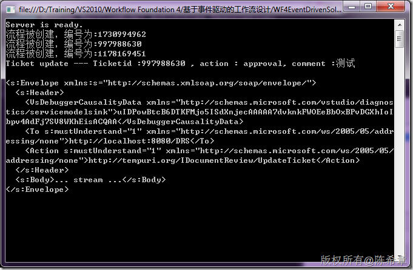](http://images.cnblogs.com/cnblogs_com/chenxizhang/Windows-Live-Writer/Workflow-Foundation-4.0_886F/image_35.png)


 


5. 如何在客户端获取待处理任务列表
==================


在上一个练习中，我们为了测试服务器端会自动检索那些未完成的流程实例，我们将宿主程序关闭后再打开了，但是我也特别提醒大家，不要将客户端程序关闭。


为什么呢？因为如果你关闭了，那些编号就没有了，而我们UpdateTicket操作是要根据TicketId进行操作的。


那么，就引申出来一个更大的问题，客户端不可能永远开着的，那么这些未完成流程的TicketId要保存在哪里？而客户端又如何能获取到这个列表呢？


 


有的朋友可能会说，我们可以单独搞一个数据库吧，用一个表来保存这些信息好了。那当然是可以的，但并不见得是很好的一个做法。


在WF4所提供的持久化功能中，考虑到了这种问题。它可以用一个特殊的表保存我们流程运转期间的一些数据。这里姑且称为“流程数据”吧


为了实现这样的功能，需要对持久化进行必要的扩展，请大家按照我下面的步骤来操作。


5.1 创建一个PersistenceParticipant
------------------------------


这是所谓的持久化参与者。它将在持久化的过程中起一定的作用。


为了便于复用，我们单独创建了一个ClassLibrary，取名为Extensions


 


```
using System;
using System.Collections.Generic;
using System.Linq;
using System.Text;
using System.Activities.Persistence;
using System.Xml.Linq;

namespace Extensions
{
    public class MyInstanceStoreParticpant : PersistenceParticipant
    {

        public int TicketId { get; set; }
        XNamespace xNS = XNamespace.Get("http://xizhang.com/DocumentReview");
       
        /// <summary>
        /// 这个方法会在工作流实例被持久化的时候自动调用
        /// 这些数据是会被保存到InstancePromotedPropertiesTable这个表的
        /// </summary>
        /// <param name="readWriteValues"></param>
        /// <param name="writeOnlyValues"></param>
        protected override void CollectValues(out IDictionary<XName, object> readWriteValues, out IDictionary<XName, object> writeOnlyValues)
        {
            readWriteValues = new Dictionary<XName, object>();
            readWriteValues.Add(xNS.GetName("TicketId"), this.TicketId);

            writeOnlyValues = null;
        }

    }
}

```

[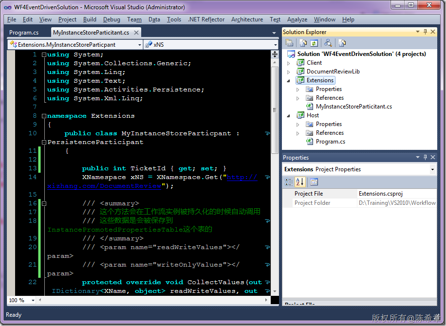](http://images.cnblogs.com/cnblogs_com/chenxizhang/Windows-Live-Writer/Workflow-Foundation-4.0_886F/image_39.png)
.csharpcode, .csharpcode pre
{
 font-size: small;
 color: black;
 font-family: consolas, "Courier New", courier, monospace;
 background-color: #ffffff;
 /*white-space: pre;*/
}
.csharpcode pre { margin: 0em; }
.csharpcode .rem { color: #008000; }
.csharpcode .kwrd { color: #0000ff; }
.csharpcode .str { color: #006080; }
.csharpcode .op { color: #0000c0; }
.csharpcode .preproc { color: #cc6633; }
.csharpcode .asp { background-color: #ffff00; }
.csharpcode .html { color: #800000; }
.csharpcode .attr { color: #ff0000; }
.csharpcode .alt 
{
 background-color: #f4f4f4;
 width: 100%;
 margin: 0em;
}
.csharpcode .lnum { color: #606060; }


这里提到一个特殊的表：InstancePromotedPropertiesTable（就是在持久化那个数据库中，本例为WF4），大家如果有时间可以看一下结构。它有66个字段。


同时，在这个项目中，我们还添加一个自定义的Activity，来实现真正的数据保存


[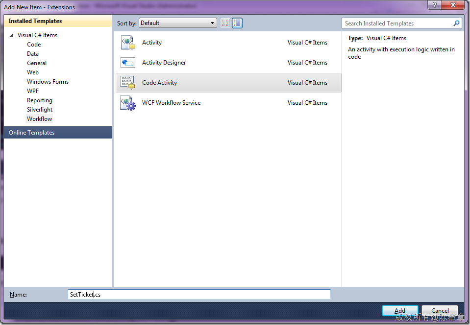](http://images.cnblogs.com/cnblogs_com/chenxizhang/Windows-Live-Writer/Workflow-Foundation-4.0_886F/image_41.png)


 


```
using System;
using System.Collections.Generic;
using System.Linq;
using System.Text;
using System.Activities;

namespace Extensions
{

    public sealed class SetTicket : CodeActivity
    {
        public InArgument<int> TicketId { get; set; }
        protected override void Execute(CodeActivityContext context)
        {
            var extension = context.GetExtension<MyInstanceStoreParticpant>();
            extension.TicketId = TicketId.Get(context);
        }
    }
}

```

.csharpcode, .csharpcode pre
{
 font-size: small;
 color: black;
 font-family: consolas, "Courier New", courier, monospace;
 background-color: #ffffff;
 /*white-space: pre;*/
}
.csharpcode pre { margin: 0em; }
.csharpcode .rem { color: #008000; }
.csharpcode .kwrd { color: #0000ff; }
.csharpcode .str { color: #006080; }
.csharpcode .op { color: #0000c0; }
.csharpcode .preproc { color: #cc6633; }
.csharpcode .asp { background-color: #ffff00; }
.csharpcode .html { color: #800000; }
.csharpcode .attr { color: #ff0000; }
.csharpcode .alt 
{
 background-color: #f4f4f4;
 width: 100%;
 margin: 0em;
}
.csharpcode .lnum { color: #606060; }

 


5.2 在宿主中使用该扩展，并且设定要保存的信息
------------------------


[](http://images.cnblogs.com/cnblogs_com/chenxizhang/Windows-Live-Writer/Workflow-Foundation-4.0_886F/image_37.png)


 


代码也要做相应的修改，请注意红色部分


```
using System;
using System.Collections.Generic;
using System.Linq;
using System.Text;
using System.ServiceModel;
using System.Activities;
using System.ServiceModel.Activities;
using System.ServiceModel.Description;

using System.Activities.DurableInstancing;
using System.Runtime.DurableInstancing;
using System.Activities.Persistence;
using System.ServiceModel.Activities.Description;
using System.Xml.Linq;

namespace Host
{
    class Program
    {
        static void Main(string[] args)
        {
            var host = new WorkflowServiceHost(
                new DocumentReviewLib.DocumentReviewWorkflow(),
                new Uri("http://localhost:8080/DRS"));

            host.AddDefaultEndpoints();//这个方法是添加了一些标准的端点

            host.Description.Behaviors.Add(
                new ServiceMetadataBehavior() { HttpGetEnabled = true });

            var store = new SqlWorkflowInstanceStore("server=(local)\\sqlexpress;database=WF4;integrated security=true");

            host.UnknownMessageReceived += (o, e) =>
            {
                Console.WriteLine("\n"+e.Message+"\n");
            };


 **host.Description.Behaviors.Add(
 new WorkflowIdleBehavior()
 {
 TimeToPersist = TimeSpan.FromSeconds(0)
 });

 XNamespace xNS = XNamespace.Get("http://xizhang.com/DocumentReview");
 store.Promote("DocumentReview",
 new List<XName>() { xNS.GetName("TicketId") },
 null);


 host.WorkflowExtensions.Add(new Extensions.MyInstanceStoreParticpant());**


            host.DurableInstancingOptions.InstanceStore = store;
            host.Open();


            Console.WriteLine("Server is ready.");
            Console.Read();

        }


    }
}

```

.csharpcode, .csharpcode pre
{
 font-size: small;
 color: black;
 font-family: consolas, "Courier New", courier, monospace;
 background-color: #ffffff;
 /*white-space: pre;*/
}
.csharpcode pre { margin: 0em; }
.csharpcode .rem { color: #008000; }
.csharpcode .kwrd { color: #0000ff; }
.csharpcode .str { color: #006080; }
.csharpcode .op { color: #0000c0; }
.csharpcode .preproc { color: #cc6633; }
.csharpcode .asp { background-color: #ffff00; }
.csharpcode .html { color: #800000; }
.csharpcode .attr { color: #ff0000; }
.csharpcode .alt 
{
 background-color: #f4f4f4;
 width: 100%;
 margin: 0em;
}
.csharpcode .lnum { color: #606060; }

.csharpcode, .csharpcode pre
{
 font-size: small;
 color: black;
 font-family: consolas, "Courier New", courier, monospace;
 background-color: #ffffff;
 /*white-space: pre;*/
}
.csharpcode pre { margin: 0em; }
.csharpcode .rem { color: #008000; }
.csharpcode .kwrd { color: #0000ff; }
.csharpcode .str { color: #006080; }
.csharpcode .op { color: #0000c0; }
.csharpcode .preproc { color: #cc6633; }
.csharpcode .asp { background-color: #ffff00; }
.csharpcode .html { color: #800000; }
.csharpcode .attr { color: #ff0000; }
.csharpcode .alt 
{
 background-color: #f4f4f4;
 width: 100%;
 margin: 0em;
}
.csharpcode .lnum { color: #606060; }

.csharpcode, .csharpcode pre
{
 font-size: small;
 color: black;
 font-family: consolas, "Courier New", courier, monospace;
 background-color: #ffffff;
 /*white-space: pre;*/
}
.csharpcode pre { margin: 0em; }
.csharpcode .rem { color: #008000; }
.csharpcode .kwrd { color: #0000ff; }
.csharpcode .str { color: #006080; }
.csharpcode .op { color: #0000c0; }
.csharpcode .preproc { color: #cc6633; }
.csharpcode .asp { background-color: #ffff00; }
.csharpcode .html { color: #800000; }
.csharpcode .attr { color: #ff0000; }
.csharpcode .alt 
{
 background-color: #f4f4f4;
 width: 100%;
 margin: 0em;
}
.csharpcode .lnum { color: #606060; }

 


5.3 使用工作流设计，使用自定义的Activity
--------------------------


请确保在DocumentReviewLib中添加了如下三个引用


[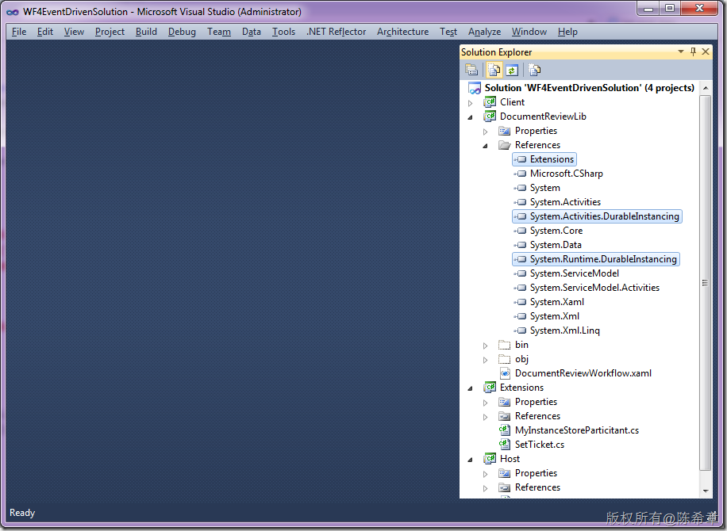](http://images.cnblogs.com/cnblogs_com/chenxizhang/Windows-Live-Writer/Workflow-Foundation-4.0_886F/image_45.png)


将自定义的Activity拖放咋合适位置，并且让它的属性TicketId绑定到变量


[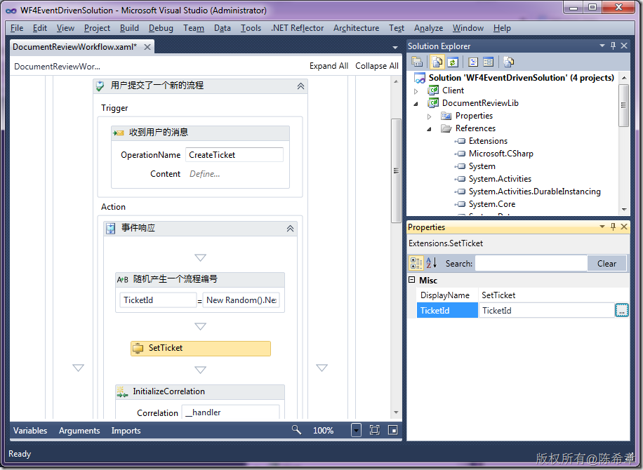](http://images.cnblogs.com/cnblogs_com/chenxizhang/Windows-Live-Writer/Workflow-Foundation-4.0_886F/image_47.png)


5.4 调试程序
--------


启动服务器和客户端，点击多次后，到SSMS中查看 [WF4].[System.Activities.DurableInstancing].[InstancePromotedPropertiesTable]这个表的数据


[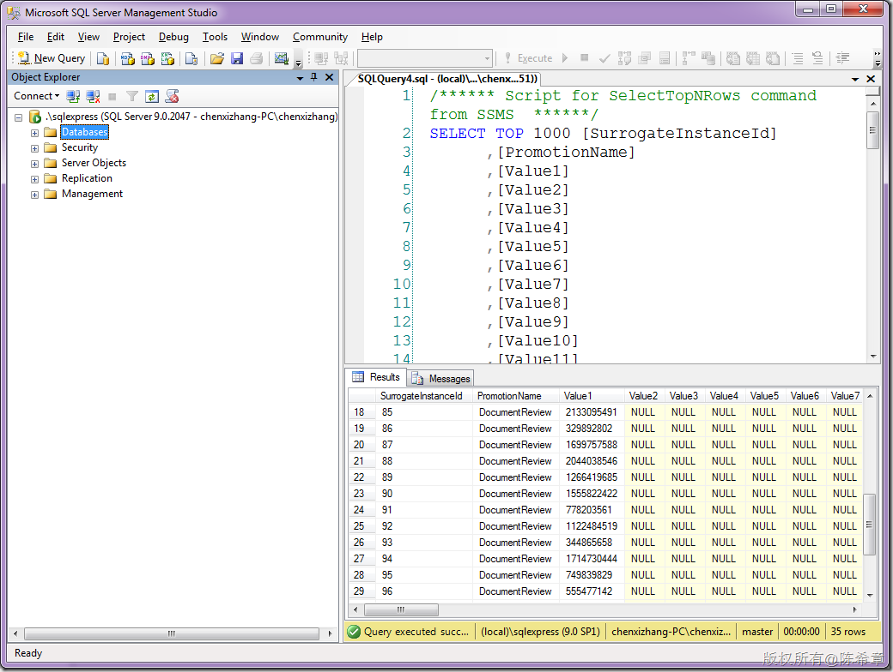](http://images.cnblogs.com/cnblogs_com/chenxizhang/Windows-Live-Writer/Workflow-Foundation-4.0_886F/image_49.png)


那么，怎么查询这些数据呢？


其实也不难，我们一般推荐在数据库中做一个视图，如


```
USE WF4
GO

CREATE VIEW DocumentReviewTask
AS
SELECT [SurrogateInstanceId]
      ,[PromotionName]
      ,[Value1] AS TicketId
FROM [WF4].[System.Activities.DurableInstancing].[InstancePromotedPropertiesTable]
```

.csharpcode, .csharpcode pre
{
 font-size: small;
 color: black;
 font-family: consolas, "Courier New", courier, monospace;
 background-color: #ffffff;
 /*white-space: pre;*/
}
.csharpcode pre { margin: 0em; }
.csharpcode .rem { color: #008000; }
.csharpcode .kwrd { color: #0000ff; }
.csharpcode .str { color: #006080; }
.csharpcode .op { color: #0000c0; }
.csharpcode .preproc { color: #cc6633; }
.csharpcode .asp { background-color: #ffff00; }
.csharpcode .html { color: #800000; }
.csharpcode .attr { color: #ff0000; }
.csharpcode .alt 
{
 background-color: #f4f4f4;
 width: 100%;
 margin: 0em;
}
.csharpcode .lnum { color: #606060; }

 


查询这个视图的结果如下


[](http://images.cnblogs.com/cnblogs_com/chenxizhang/Windows-Live-Writer/Workflow-Foundation-4.0_886F/image_51.png)


 


5.5 在宿主程序中通过一个特殊的服务，提供这个列表给客户端
------------------------------


因为涉及到数据访问，我们这里用一个LINQ to SQL Class来简化开发


[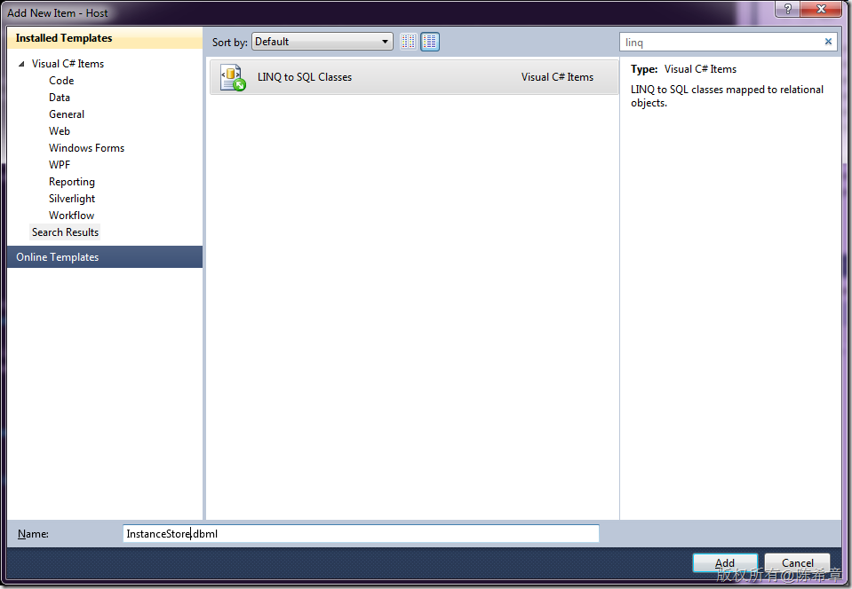](http://images.cnblogs.com/cnblogs_com/chenxizhang/Windows-Live-Writer/Workflow-Foundation-4.0_886F/image_53.png)


从数据库中将那个视图托拽到设计器中


[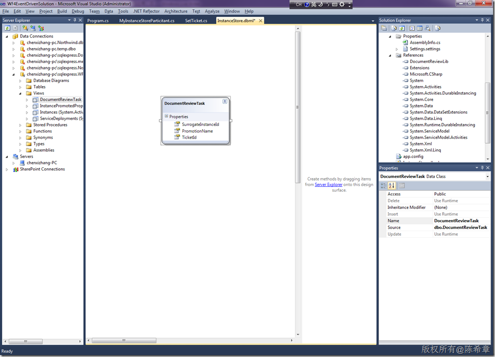](http://images.cnblogs.com/cnblogs_com/chenxizhang/Windows-Live-Writer/Workflow-Foundation-4.0_886F/image_55.png)


将宿主代码修改如下，请注意红色部分


```
using System;
using System.Collections.Generic;
using System.Linq;
using System.Text;
using System.ServiceModel;
using System.Activities;
using System.ServiceModel.Activities;
using System.ServiceModel.Description;

using System.Activities.DurableInstancing;
using System.Runtime.DurableInstancing;
using System.Activities.Persistence;
using System.ServiceModel.Activities.Description;
using System.Xml.Linq;

namespace Host
{
    class Program
    {
        static void Main(string[] args)
        {
            var host = new WorkflowServiceHost(
                new DocumentReviewLib.DocumentReviewWorkflow(),
                new Uri("http://localhost:8080/DRS"));

            host.AddDefaultEndpoints();//这个方法是添加了一些标准的端点

            host.Description.Behaviors.Add(
                new ServiceMetadataBehavior() { HttpGetEnabled = true });

            var store = new SqlWorkflowInstanceStore("server=(local)\\sqlexpress;database=WF4;integrated security=true");

            host.UnknownMessageReceived += (o, e) =>
            {
                Console.WriteLine("\n"+e.Message+"\n");
            };


            host.Description.Behaviors.Add(
                new WorkflowIdleBehavior()
                {
                    TimeToPersist = TimeSpan.FromSeconds(0)
                });

            XNamespace xNS = XNamespace.Get("http://xizhang.com/DocumentReview");
            store.Promote("DocumentReview",
                new List<XName>() { xNS.GetName("TicketId") },
                null);


            host.WorkflowExtensions.Add(new Extensions.MyInstanceStoreParticpant());


            host.DurableInstancingOptions.InstanceStore = store;
            host.Open();

**```
 var common = new ServiceHost(
 typeof(CommonService),
 new Uri("http://localhost:8080/Common"));

 common.AddServiceEndpoint(
 typeof(ICommonService).FullName,
 new BasicHttpBinding(),
 "");

 common.Open();
```
.csharpcode, .csharpcode pre
{
 font-size: small;
 color: black;
 font-family: consolas, "Courier New", courier, monospace;
 background-color: #ffffff;
 /*white-space: pre;*/
}
.csharpcode pre { margin: 0em; }
.csharpcode .rem { color: #008000; }
.csharpcode .kwrd { color: #0000ff; }
.csharpcode .str { color: #006080; }
.csharpcode .op { color: #0000c0; }
.csharpcode .preproc { color: #cc6633; }
.csharpcode .asp { background-color: #ffff00; }
.csharpcode .html { color: #800000; }
.csharpcode .attr { color: #ff0000; }
.csharpcode .alt 
{
 background-color: #f4f4f4;
 width: 100%;
 margin: 0em;
}
.csharpcode .lnum { color: #606060; }**
            Console.WriteLine("Server is ready.");
            Console.Read();

        }


    }


 **[ServiceContract]
 public interface ICommonService
 {
 [OperationContract]
 int[] GetTicketIds();
 }


 public class CommonService : ICommonService
 {

 public int[] GetTicketIds()
 {
 var ctx = new InstanceStoreDataContext();
 return ctx.DocumentReviewTasks.Select(r => (int)r.TicketId).ToArray();
 }
 }**

}

```

.csharpcode, .csharpcode pre
{
 font-size: small;
 color: black;
 font-family: consolas, "Courier New", courier, monospace;
 background-color: #ffffff;
 /*white-space: pre;*/
}
.csharpcode pre { margin: 0em; }
.csharpcode .rem { color: #008000; }
.csharpcode .kwrd { color: #0000ff; }
.csharpcode .str { color: #006080; }
.csharpcode .op { color: #0000c0; }
.csharpcode .preproc { color: #cc6633; }
.csharpcode .asp { background-color: #ffff00; }
.csharpcode .html { color: #800000; }
.csharpcode .attr { color: #ff0000; }
.csharpcode .alt 
{
 background-color: #f4f4f4;
 width: 100%;
 margin: 0em;
}
.csharpcode .lnum { color: #606060; }

 


5.6 修改客户端，使用该服务
---------------


```
using System;
using System.Collections.Generic;
using System.ComponentModel;
using System.Data;
using System.Drawing;
using System.Linq;
using System.Text;
using System.Windows.Forms;
using System.ServiceModel.Activities;
using System.ServiceModel;


namespace Client
{
 **[ServiceContract]
 public interface ICommonService
 {
 [OperationContract]
 int[] GetTicketIds();
 }**


    public partial class Form1 : Form
    {
        public Form1()
        {
            InitializeComponent();

            Load += new EventHandler(Form1\_Load);
        }


 **void Form1\_Load(object sender, EventArgs e)
 {
 LoadTaskList();

 }

 private void LoadTaskList()
 {
 //加载所有没有完成的流程
 var factory = new ChannelFactory<ICommonService>(
 new BasicHttpBinding(), new EndpointAddress("http://localhost:8080/Common"));


 var proxy = factory.CreateChannel();

 var ids = proxy.GetTicketIds();
 foreach (var item in ids)
 {
 lstTickets.Items.Add(item);
 }
 }**

        private void btCreate\_Click(object sender, EventArgs e)
        {
            var proxy = new DocumentReviewClient();
            var result = proxy.CreateTicket();

            lstTickets.Items.Add(result);
        }

        private void btApproval\_Click(object sender, EventArgs e)
        {
            //同意某个流程
            var action = "approval";
            UpdateTicket(action);

        }

        private void UpdateTicket(string action)
        {
            if (lstTickets.SelectedIndex > -1)
            {
                var id = int.Parse(lstTickets.SelectedItem.ToString());
                var comment = txtComment.Text;
                var proxy = new DocumentReviewClient();
                proxy.UpdateTicket(action, comment, id);

            }
        }

        private void btReject\_Click(object sender, EventArgs e)
        {
            var action = "Reject";
            UpdateTicket(action);
        }

    }
}

```

5.7 调试程序
--------


[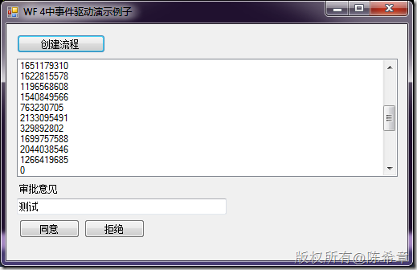](http://images.cnblogs.com/cnblogs_com/chenxizhang/Windows-Live-Writer/Workflow-Foundation-4.0_886F/image_57.png)


```
 
```

```
[](http://images.cnblogs.com/cnblogs_com/chenxizhang/Windows-Live-Writer/Workflow-Foundation-4.0_886F/image_59.png)
```

```
 
```

总结：我用了四篇文章介绍了基于WF4实现审批流程的一个例子，通过实例可以帮助大家更好地理解有关的技术。
---------------------------------------------------


完整代码，请通过 [这里](http://files.cnblogs.com/chenxizhang/WF4EventDrivenSolution.rar) 下载


.csharpcode, .csharpcode pre
{
 font-size: small;
 color: black;
 font-family: consolas, "Courier New", courier, monospace;
 background-color: #ffffff;
 /*white-space: pre;*/
}
.csharpcode pre { margin: 0em; }
.csharpcode .rem { color: #008000; }
.csharpcode .kwrd { color: #0000ff; }
.csharpcode .str { color: #006080; }
.csharpcode .op { color: #0000c0; }
.csharpcode .preproc { color: #cc6633; }
.csharpcode .asp { background-color: #ffff00; }
.csharpcode .html { color: #800000; }
.csharpcode .attr { color: #ff0000; }
.csharpcode .alt 
{
 background-color: #f4f4f4;
 width: 100%;
 margin: 0em;
}
.csharpcode .lnum { color: #606060; }
