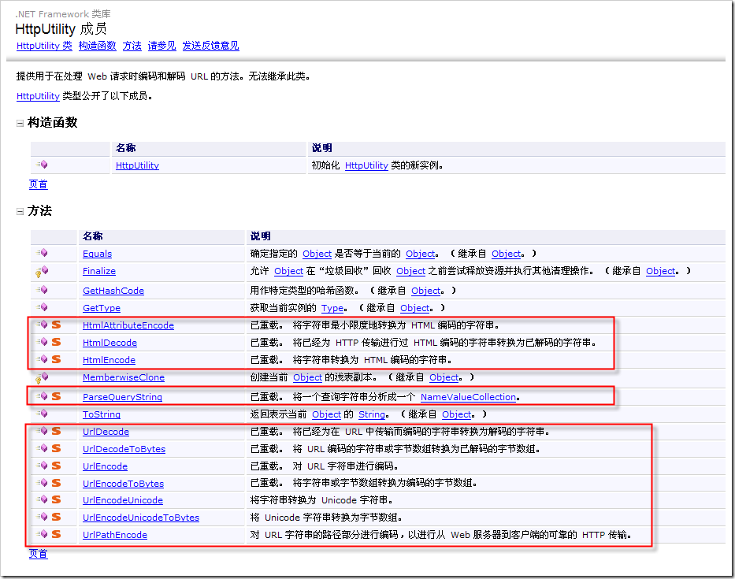

# 网页编程中的几个有意思的字符串编码解码方法 
> 原文发表于 2009-06-01, 地址: http://www.cnblogs.com/chenxizhang/archive/2009/06/01/1493669.html 

1. 服务端代码

  

 2. 客户端代码

 escape()

 unescape()

 encodeURI()

 decodeURI()

 [encodeURIComponent()](http://www.w3school.com.cn/js/jsref_encodeURIComponent.asp)

 [decodeURIComponent()](http://www.w3school.com.cn/js/jsref_decodeURIComponent.asp)

