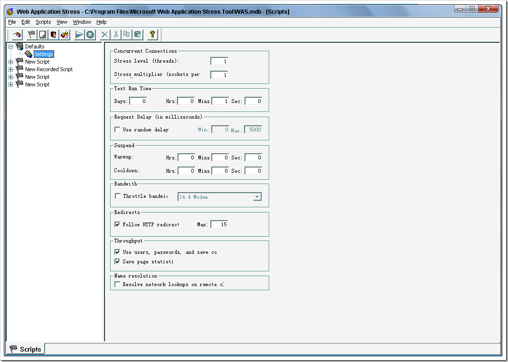
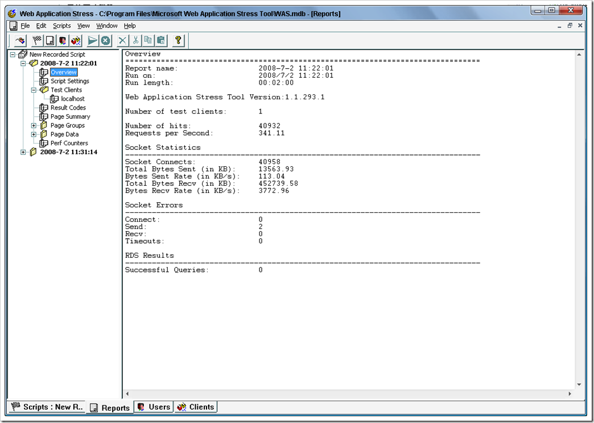
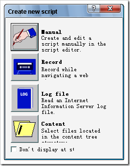
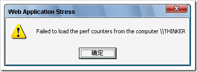
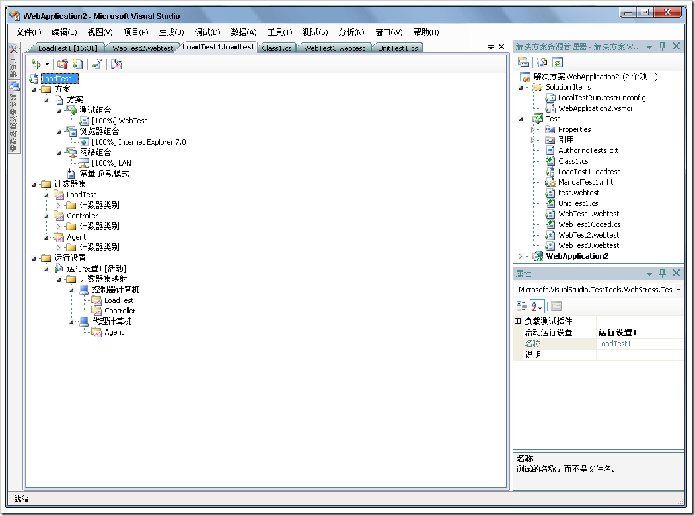
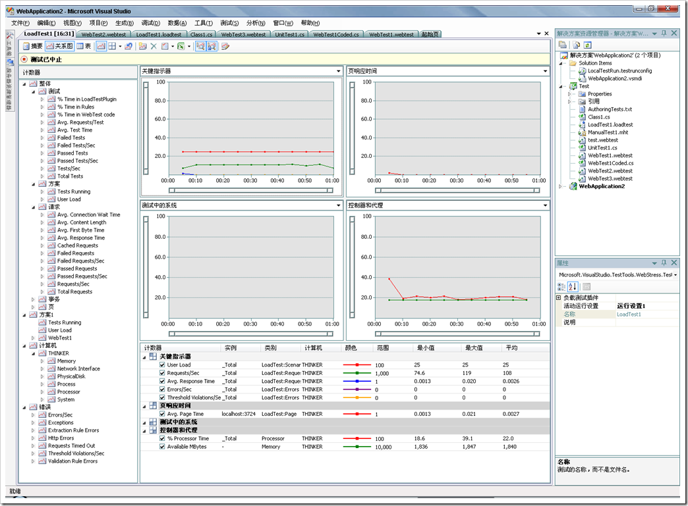

# 如何搭建大型网站的压力测试环境 
> 原文发表于 2009-06-02, 地址: http://www.cnblogs.com/chenxizhang/archive/2009/06/02/1494635.html 

很多朋友都想做压力测试，其实并不是特别难。现在各类工具都比较多。我介绍两个微软的工具吧

 1. WAS： Web Application Strees Tool（免费的）

 ### 应用WAS对web进行压力测试实例详解

 <http://servers.pconline.com.cn/skills/0709/1119109.html>

 官方的文档（很详细，建议看英文版）

 [http://support.microsoft.com/kb/313559/en-us](http://support.microsoft.com/kb/313559/en-us "http://support.microsoft.com/kb/313559/en-us")

  

 以前做过的一个测试结果报告

  

 创建WAS的测试，一般都通过录制，因为如果要你手工写那些请求点击的操作，那简直是噩梦。

  

 除此之外，还可以根据IIS的日志文件（这个太有用了），和一个文件夹目录（这个也很有意思）

 其实，这还不是关键问题，关键大家要知道的是，既然做压力测试，那么到底测的是什么？不要被这些界面搞晕了。

 压力测试主要测试的是服务器在大量负载的情况下会不会有性能瓶颈？如果有，那么在哪里？

 要想回答这个问题，从两方面来说

 1. 页面的执行效率（通常有几个指标是我们比较关心的）

 TTFB:Time To Fisrt Byte 收到第一个字节的时间。

 TTLB:Time to Last Byte 收到最后一个字节的时间

  

 2. 

 添加性能计数器的时候，弹出“failed to load perf counters from the computer xxx”

  

 在xp和windows 2003中都遇到该问题，反正就没有成功过。网上搜，人家说是只能在windows 2000中用该功能，狂晕

  

  

 除了WAS之外，微软还提供了更加强大的负载测试工具，这是包含在所谓的VSTS for Tester版本中的。

  

  

  

 一般，在大型的网站测试环境中，会有这么几台机器

 **1. 控制器（可以是开发人员的笔记本）**

 **2. 代理（一般都是桌面机器），可以有多个**

 **3. 测试服务器（部署了应用程序）**

  

 三种机器都要在一个域环境中，控制器和代理必须要有访问测试服务器的性能计数器的能力。工作的时候，控制器定义好测试任务和脚本后，启动测试时，会根据各个代理的权重分配任务，由代理去发起针对测试服务器的请求。

  

 最后，不管用WAS还是VSTS，都有两个基本原则

 * **不要针对生产服务器做测试** * **不要直接在服务器上面运行测试**
