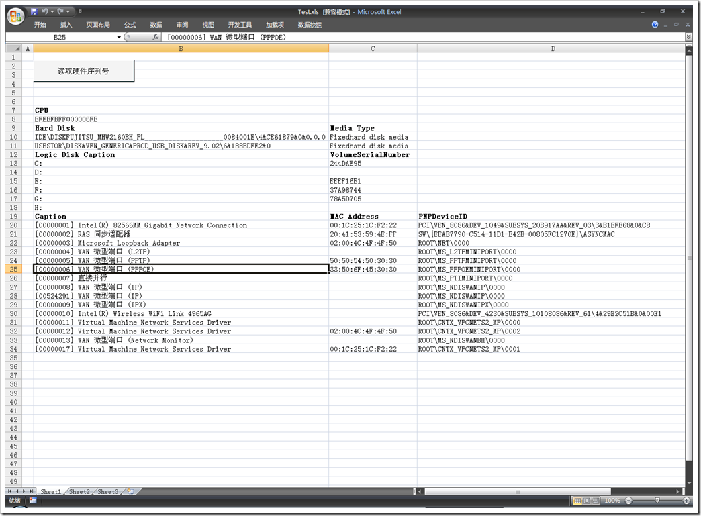

# 读取本机硬件信息的VBA代码 
> 原文发表于 2009-06-02, 地址: http://www.cnblogs.com/chenxizhang/archive/2009/06/02/1494812.html 

今天被朋友问到，如何在VB或者VBA代码中读取诸如硬盘或者CPU等硬件设备的序列号这一类信息。我写了一个范例如下

 1. 在我的机器上运行的效果。我这个例子读取了四部分信息（CPU,物理硬盘，逻辑磁盘，网卡）

  

 2.代码如下。代码的原理是使用WMI接口。需要管理员权限才能执行该代码

 Private Type OSVERSIONINFO  
                  dwOSVersionInfoSize   As Long  
                  dwMajorVersion   As Long  
                  dwMinorVersion   As Long  
                  dwBuildNumber   As Long  
                  dwPlatformId   As Long  
                  szCSDVersion   As String * 128                   '     Maintenance   string   for   PSS   usage  
  End Type  
  Private Declare Function GetVersionEx Lib "kernel32" Alias "GetVersionExA" (lpVersionInformation As OSVERSIONINFO) As Long  
  Private Declare Function GetComputerName Lib "kernel32" Alias "GetComputerNameA" (ByVal lpBuffer As String, nSize As Long) As Long  
  Private Const VER\_PLATFORM\_WIN32\_NT = 2  
  Private Const VER\_PLATFORM\_WIN32\_WINDOWS = 1  
  Private Const VER\_PLATFORM\_WIN32s = 0  
'''这个范例程序是读取CPU，物理硬盘，逻辑磁盘，和网卡的有关序列号的  
'''作者：陈希章  
'''时间：2009年6月2日  
Sub Test()  
         Dim len5     As Long, aa       As Long  
          Dim cmprName     As String  
          Dim osver     As OSVERSIONINFO  
          '取得Computer   Name  
          cmprName = String(255, 0)  
          len5 = 256  
          aa = GetComputerName(cmprName, len5)  
          cmprName = Left(cmprName, InStr(1, cmprName, Chr(0)) - 1)  
          Computer = cmprName                     '取得CPU端口号  
            ActiveCell.Worksheet.Cells.Clear  
            Dim rng As Range  
            Set rng = Range("B7")  
            rng.Font.Bold = True  
            rng.Value = "CPU"  
            Set rng = rng.Offset(1)  
          Set CPUs = GetObject("winmgmts:{impersonationLevel=impersonate}!\\" & Computer & "\root\cimv2").ExecQuery("select   *   from   Win32\_Processor")  
          For Each mycpu In CPUs  
              rng.Value = mycpu.processorid  
              Set rng = rng.Offset(1)  
          Next             rng.Value = "Hard Disk"  
            rng.Offset(, 1).Value = "Media Type"  
            rng.Resize(, 2).Font.Bold = True  
            Set rng = rng.Offset(1)             Set disks = GetObject("winmgmts:{impersonationLevel=impersonate}!\\" & Computer & "\root\cimv2").ExecQuery("select   *   from   Win32\_DiskDrive")  
            For Each disk In disks  
            rng.Value = disk.pnpdeviceid  
            rng.Offset(, 1).Value = disk.mediatype  
            Set rng = rng.Offset(1)  
            Next  
            Set hds = GetObject("winmgmts:{impersonationLevel=impersonate}!\\" & Computer & "\root\cimv2").ExecQuery("select   *   from  Win32\_LogicalDisk")  
            rng.Value = "Logic Disk Caption"  
            rng.Offset(, 1).Value = "VolumeSerialNumber"  
            rng.Resize(, 2).Font.Bold = True  
            Set rng = rng.Offset(1)  
            For Each hd In hds  
            rng.Value = hd.Caption  
            rng.Offset(, 1).Value = hd.VolumeSerialNumber  
            Set rng = rng.Offset(1)  
            Next  
            Set networks = GetObject("winmgmts:{impersonationLevel=impersonate}!\\" & Computer & "\root\cimv2").ExecQuery("select   *   from  Win32\_NetworkAdapter")  
            rng.Value = "Caption"  
            rng.Offset(, 1).Value = "MAC Address"  
            rng.Offset(, 2).Value = "PNPDeviceID"             rng.Resize(, 3).Font.Bold = True  
            Set rng = rng.Offset(1)  
            For Each network In networks  
                rng.Value = network.Caption  
                rng.Offset(, 1).Value = network.macaddress  
                rng.Offset(, 2).Value = network.pnpdeviceid  
                Set rng = rng.Offset(1)  
            Next  
End Sub 

