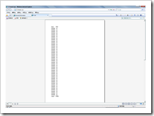
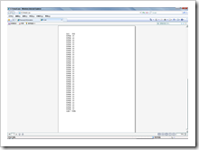

# 使用thead,tbody,tfoot来实现表格的分页打印 
> 原文发表于 2009-06-03, 地址: http://www.cnblogs.com/chenxizhang/archive/2009/06/03/1495248.html 

当我们的页面中有一个很长的表格时，我们通常都希望在每页中都显示表头，或者一个表尾。那么该如何来控制打印的时候这样的行为呢？

 HTML 4.01支持几个新的元素thead,tbody,tfoot，顾名思义，他们分别代表了表格的头，主体和尾。

 下面我们来看一个例子

 <table>  
    **<thead>  
    <tr><td>姓名</td><td>年龄</td></tr>  
    </thead>**

    
    <tbody>  
    <tr>  
        <td>陈希章</td>  
        <td>100</td>  
    </tr>  
    <tr>  
        <td>陈希章</td>  
        <td>100</td>  
    </tr>  
    <tr>  
        <td>陈希章</td>  
        <td>100</td>  
    </tr>  
    </tbody>  

  

 **<tfoot>  
        <tr>  
            <td colspan="2">这是一个表尾</td>  
        </tr>  
    </tfoot>**  
</table>

  

 如果有了这样的内容，那么在打印的时候就会出现下面的效果（请注意看，第一页和第二页都有表头和表尾）

   

 是不是很酷啊？呵呵

  

 需要注意的是：**该功能仅在IE中受支持，其他浏览器不一定能有这个效果**

 同时，如果说我们需要使用局部打印的功能，上次我们提到用脚本的方式

 //打印某个内容 function PrintContent(el) {         var iframe = document.createElement('IFRAME'); var content=document.getElementById(el);         var doc = null; iframe.style.position="absolute"; iframe.style.width="0px"; iframe.style.height="0px"; iframe.style.left="-500px"; iframe.style.top="-500px";         //$(iframe).attr('style', 'position:absolute;width:0px;height:0px;left:-500px;top:-500px;');         document.body.appendChild(iframe);         doc = iframe.contentWindow.document;         var links = window.document.getElementsByTagName('link');         for (var i = 0; i < links.length; i++)             if (links[i].rel.toLowerCase() == 'stylesheet')             doc.write('<link type="text/css" rel="stylesheet" href="' + links[i].href + '"></link>'); //        doc.write('
' + $(el).html() + '
'); 
>  doc.write('
' + content.innerHTML + '
');                  
> 
> 

         doc.close();         iframe.contentWindow.focus();         iframe.contentWindow.print();         document.body.removeChild(iframe); } 该代码的确可以实现打印，但会丢失thead等特性，我们需要修改成下面这样

 //打印某个内容  
function PrintContent(el) {   
        var iframe = document.createElement('IFRAME');  
        var content=document.getElementById(el);  
        var doc = null;  
        iframe.style.position="absolute";  
        iframe.style.width="0px";  
        iframe.style.height="0px";  
        iframe.style.left="-500px";  
        iframe.style.top="-500px";         //$(iframe).attr('style', 'position:absolute;width:0px;height:0px;left:-500px;top:-500px;');  
        document.body.appendChild(iframe);  
        doc = iframe.contentWindow.document;         **doc.write('<!DOCTYPE html PUBLIC "-//W3C//DTD XHTML 1.0 Transitional//EN" "**[**http://www.w3.org/TR/xhtml1/DTD/xhtml1-transitional.dtd"**](http://www.w3.org/TR/xhtml1/DTD/xhtml1-transitional.dtd")**><html xmlns="**[**http://www.w3.org/1999/xhtml"**](http://www.w3.org/1999/xhtml")**><head><meta http-equiv="Content-Type" content="text/html; charset=utf-8" />');**        var links = window.document.getElementsByTagName('link');  
        for (var i = 0; i < links.length; i++)  
            if (links[i].rel.toLowerCase() == 'stylesheet')  
            doc.write('<link type="text/css" rel="stylesheet" href="' + links[i].href + '"></link>');  
//        doc.write('
' + $(el).html() + '
');         **doc.write('</head><body>');**        doc.write('
' + content.innerHTML + '
');   
        **doc.write('</body></html>');**          doc.close();  
        iframe.contentWindow.focus();  
        iframe.contentWindow.print();  
        document.body.removeChild(iframe);   
}  如此，整个世界就清净了

