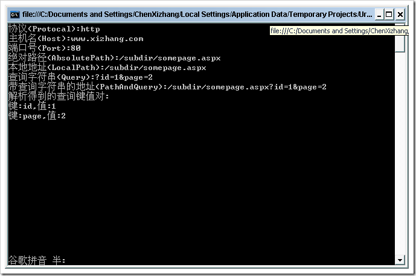

# 有关网络地址的解析图例 
> 原文发表于 2009-06-03, 地址: http://www.cnblogs.com/chenxizhang/archive/2009/06/03/1495331.html 

这是一个很简单的例子，我讲解了如何根据一个网路的地址，解析各部分的内容 using System;  
using System.Collections.Generic;  
using System.Text;  
using System.Collections.Specialized; //需要预先添加对System.Web程序集的引用  
using System.Web; namespace UrlParser  
{  
    class Program  
    {  
        static void Main(string[] args)  
        {  
            string url = "<http://www.xizhang.com/subdir/somepage.aspx?id=1&page=2";>             Uri uri = new Uri(url);             Console.WriteLine("协议(Protocal):{0}", uri.Scheme);  
            Console.WriteLine("主机名(Host):{0}", uri.Host);  
            Console.WriteLine("端口号(Port):{0}", uri.Port);             Console.WriteLine("绝对路径(AbsolutePath):{0}", uri.AbsolutePath);  
            Console.WriteLine("本地地址(LocalPath):{0}", uri.LocalPath);             Console.WriteLine("查询字符串(Query):{0}", uri.Query);  
            Console.WriteLine("带查询字符串的地址(PathAndQuery):{0}", uri.PathAndQuery);             Console.WriteLine("解析得到的查询键值对:");  
            NameValueCollection nvc = GetQueryStringParameters(uri.Query);  
            foreach (string item in nvc.Keys)  
            {  
                Console.WriteLine("键:{0},值:{1}", item, nvc[item]);  
            }             Console.Read();         }         private static NameValueCollection GetQueryStringParameters(string query)  
        {  
            NameValueCollection col = new NameValueCollection();  
            col = HttpUtility.ParseQueryString(query);  
            return col;  
        }      }  
} 下面是输出的结果 

