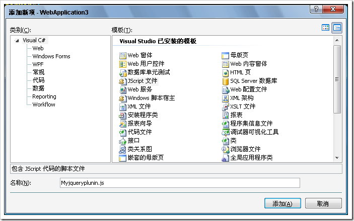
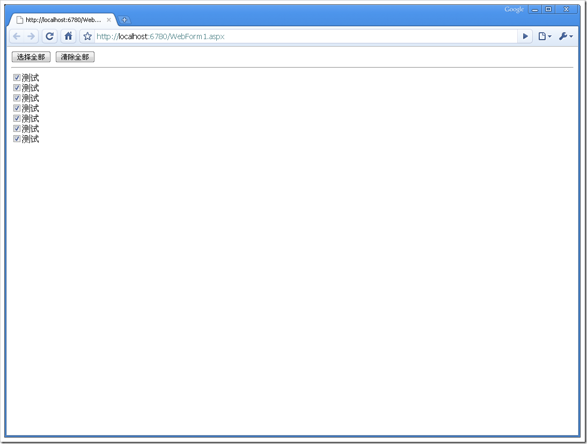

# 编写jquery扩展插件 
> 原文发表于 2009-06-05, 地址: http://www.cnblogs.com/chenxizhang/archive/2009/06/05/1496864.html 

第一步：创建一个js文件

  

 第二步：编写有关代码

 jQuery.fn.extend({  
    ///这个函数是全部选择所有的元素  
    check: function() {  
        return this.each(function() { this.checked = true; }); //必须return回一个jquery对象  
    },  
    uncheck: function() {  
        return this.each(function() { this.checked = false; });  
    }  
});  

 第三步：在页面中使用该扩展方法

 <%@ Page Language="C#" AutoEventWireup="true" CodeBehind="WebForm1.aspx.cs" Inherits="WebApplication3.WebForm1" %> <!DOCTYPE html PUBLIC "-//W3C//DTD XHTML 1.0 Transitional//EN" "<http://www.w3.org/TR/xhtml1/DTD/xhtml1-transitional.dtd">> <html xmlns="<http://www.w3.org/1999/xhtml"> >  
<head runat="server">  
    <title></title>  
      
      
      
</head>  
<body>     
  
    <button onclick="CheckAll();">选择全部</button>   
    <button onclick="UnCheckAll();">清除全部</button>  
    
  
    <input type="checkbox"  id="c1" /><label for="c1">测试</label>   
    <input type="checkbox"  id="Checkbox1" /><label for="c1">测试</label>   
    <input type="checkbox"  id="Checkbox2" /><label for="c1">测试</label>   
    <input type="checkbox"  id="Checkbox3" /><label for="c1">测试</label>   
    <input type="checkbox"  id="Checkbox4" /><label for="c1">测试</label>   
    <input type="checkbox"  id="Checkbox5" /><label for="c1">测试</label>   
    <input type="checkbox"  id="Checkbox6" /><label for="c1">测试</label>   
    
  
</body>  
</html> **这里有一个细节：div是不可以放在runat=server的form里面的**

  

 第四步：在浏览器中查看效果

  

  

 下面这个博客也提供了另外一些介绍 <http://ioryioryzhan.javaeye.com/blog/232971>

 jQuery为开发插件提拱了两个方法，分别是： **jQuery.fn.extend(object);** **jQuery.extend(object);** jQuery.extend(object); 为扩展jQuery类本身.为类添加新的方法。 jQuery.fn.extend(object);给jQuery对象添加方法。 fn 是什么东西呢。查看jQuery代码，就不难发现。 jQuery.fn = jQuery.prototype = { 　　　init: function( selector, context ) {//....　 　　　//...... }; 原来 jQuery.fn = jQuery.prototype.对prototype肯定不会陌生啦。 虽然 javascript　没有明确的类的概念，但是用类来理解它，会更方便。 jQuery便是一个封装得非常好的类，比如我们用 语句　$("#btn1") 会生成一个 jQuery类的实例。 jQuery.extend(object);　为jQuery类添加添加类方法，可以理解为添加静态方法。如： $.extend({ 　　add:function(a,b){return a+b;} }); 便为　jQuery　添加一个为 add　的　“静态方法”，之后便可以在引入 jQuery　的地方，使用这个方法了， $.add(3,4);  //return 7 jQuery.fn.extend(object); 对jQuery.prototype进得扩展，就是为jQuery类添加“成员函数”。jQuery类的实例可以使用这个“成员函数”。 比如我们要开发一个插件，做一个特殊的编辑框，当它被点击时，便alert 当前编辑框里的内容。可以这么做： Java代码 1. $.fn.extend({     - - alertWhileClick:function(){     - - $(this).click(function(){     - - alert($(this).val());     - });     - - }     - - });     - - $("#input1").alertWhileClick(); //页面上为：<input id="input1" type="text"/>

 $("#input1")　为一个jQuery实例，当它调用成员方法 alertWhileClick后，便实现了扩展，每次被点击时它会先弹出目前编辑里的内容。 真实的开发过程中，当然不会做这么小白的插件，事实上jQuery提拱了丰富的操作文档，事件，CSS ,Ajax、效果的方法，结合这些方法，便可以开发出更加 Niubility 的插件。 

