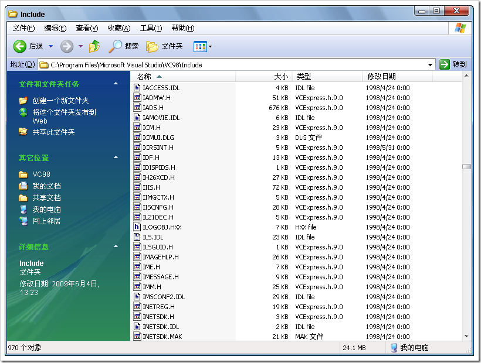
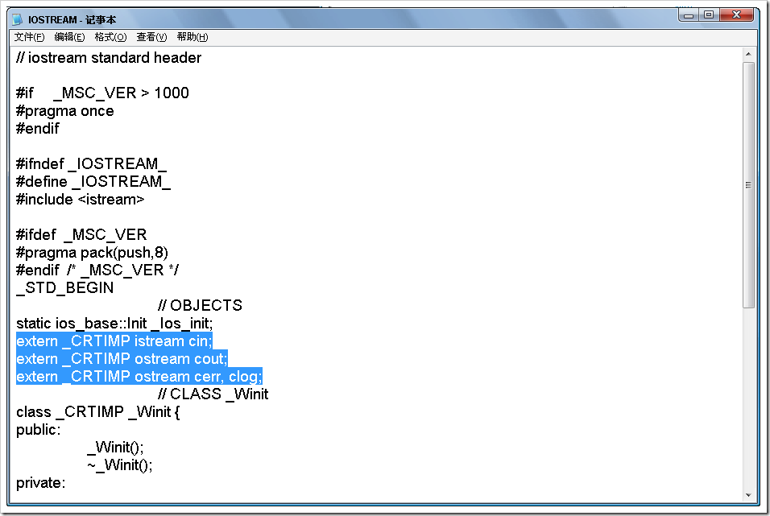

# C++标准库 
> 原文发表于 2009-06-05, 地址: http://www.cnblogs.com/chenxizhang/archive/2009/06/05/1496865.html 

对于C++初学者来说，第一个接触到的标准库就是iostream。然后，我们会自然地想到，那么其他还有哪些标准库，然后他们又是干什么用的呢？

  

 例如我们用得最多的iostream,它定义了四个基本的输入输出对象 cin,cout,cerr,clog

  

   

 C++标准库的所有头文件都没有扩展名。C++标准库的内容总共在50个标准头文件中定义，其中18个提供了C库的功能。 <cname>形式的标准头文件【 <complex>例外】其内容与ISO标准C包含的name.h头文件相同，但容纳了C++扩展的功能。在 <cname>形式标准的头文件中，与宏相关的名称在全局作用域中定义，其他名称在std命名空间中声明。在C++中还可以使用name.h形式的标准C库头文件名。  
C++标准库的内容分为10类：  
C1.语言支持 C2.输入/输出 C3.诊断 C4.一般工具 C5.字符串  
C6.容器 C7.迭代器支持 C8.算法 C9.数值操作 C10.本地化

   
C1 标准库中与语言支持功能相关的头文件 头文件  描述   
<cstddef> 定义宏NULL和offsetof，以及其他标准类型size\_t和ptrdiff\_t。与对应的标准C头文件的区别是，NULL是C++空指针常量的补充定义，宏offsetof接受结构或者联合类型参数，只要他们没有成员指针类型的非静态成员即可。  
<limits> 提供与基本数据类型相关的定义。例如，对于每个数值数据类型，它定义了可以表示出来的最大值和最小值以及二进制数字的位数。  
<climits> 提供与基本整数数据类型相关的C样式定义。这些信息的C++样式定义在 <limits>中  
<cfloat> 提供与基本浮点型数据类型相关的C样式定义。这些信息的C++样式定义在 <limits>中  
<cstdlib> 提供支持程序启动和终止的宏和函数。这个头文件还声明了许多其他杂项函数，例如搜索和排序函数，从字符串转换为数值等函数。它与对应的标准C头文件stdlib.h不同，定义了abort(void)。abort()函数还有额外的功能，它不为静态或自动对象调用析构函数，也不调用传给atexit()函数的函数。它还定义了exit()函数的额外功能，可以释放静态对象，以注册的逆序调用用atexit()注册的函数。清除并关闭所有打开的C流，把控制权返回给主机环境。  
<new> 支持动态内存分配  
<typeinfo> 支持变量在运行期间的类型标识  
<exception> 支持异常处理，这是处理程序中可能发生的错误的一种方式  
<cstdarg> 支持接受数量可变的参数的函数。即在调用函数时，可以给函数传送数量不等的数据项。它定义了宏va\_arg、va\_end、va\_start以及va\_list类型  
<csetjmp> 为C样式的非本地跳跃提供函数。这些函数在C++中不常用  
<csignal> 为中断处理提供C样式支持

   
C2 支持流输入/输出的头文件 头文件  描述   
< iostream> 支持标准流cin、cout、cerr和clog的输入和输出，它还支持多字节字符标准流wcin、wcout、wcerr和wclog。  
<iomanip> 提供操纵程序，允许改变流的状态，从而改变输出的格式。  
<ios> 定义iostream的基类  
<istream> 为管理输出流缓存区的输入定义模板类  
<ostream> 为管理输出流缓存区的输出定义模板类  
<sstream> 支持字符串的流输入输出  
<fstream> 支持文件的流输入输出  
<iosfwd> 为输入输出对象提供向前的声明  
<streambuf> 支持流输入和输出的缓存  
<cstdio> 为标准流提供C样式的输入和输出  
<cwchar> 支持多字节字符的C样式输入输出

   
C3 与诊断功能相关的头文件 头文件 描述  
<stdexcept> 定义标准异常。异常是处理错误的方式  
<cassert> 定义断言宏，用于检查运行期间的情形  
<cerrno> 支持C样式的错误信息

   
C4 定义工具函数的头文件 头文件 描述  
<utility> 定义重载的关系运算符，简化关系运算符的写入，它还定义了pair类型，该类型是一种模板类型，可以存储一对值。这些功能在库的其他地方使用  
<functional> 定义了许多函数对象类型和支持函数对象的功能，函数对象是支持operator()()函数调用运算符的任意对象  
<memory> 给容器、管理内存的函数和auto\_ptr模板类定义标准内存分配器  
<ctime> 支持系统时钟函数

   
C5 支持字符串处理的头文件 头文件 描述  
<string> 为字符串类型提供支持和定义，包括单字节字符串(由char组成)的string和多字节字符串(由wchar\_t组成)  
<cctype> 单字节字符类别  
<cwctype> 多字节字符类别  
<cstring> 为处理非空字节序列和内存块提供函数。这不同于对应的标准C库头文件，几个C样式字符串的一般C库函数被返回值为const和非const的函数对替代了  
<cwchar> 为处理、执行I/O和转换多字节字符序列提供函数，这不同于对应的标准C库头文件，几个多字节C样式字符串操作的 一般C库函数被返回值为const和非const的函数对替代了。  
<cstdlib> 为把单字节字符串转换为数值、在多字节字符和多字节字符串之间转换提供函数  

 C6 定义容器类的模板的头文件 头文件 描述  
<vector> 定义vector序列模板，这是一个大小可以重新设置的数组类型，比普通数组更安全、更灵活  
<list> 定义list序列模板，这是一个序列的链表，常常在任意位置插入和删除元素  
<deque> 定义deque序列模板，支持在开始和结尾的高效插入和删除操作  
<queue> 为队列(先进先出)数据结构定义序列适配器queue和priority\_queue  
<stack> 为堆栈(后进先出)数据结构定义序列适配器stack  
<map> map是一个关联容器类型，允许根据键值是唯一的，且按照升序存储。multimap类似于map，但键不是唯一的。  
<set> set是一个关联容器类型，用于以升序方式存储唯一值。multiset类似于set，但是值不必是唯一的。  
<bitset> 为固定长度的位序列定义bitset模板，它可以看作固定长度的紧凑型bool数组  

 C7 支持迭代器的头文件 头文件 描述  
<iterator> 给迭代器提供定义和支持  

 C8 有关算法的头文件 头文件 描述  
<algorithm> 提供一组基于算法的函数，包括置换、排序、合并和搜索  
<cstdlib> 声明C标准库函数bsearch()和qsort()，进行搜索和排序  
<ciso646> 允许在代码中使用and代替&&  

 C9 有关数值操作的头文件 头文件 描述  
<complex> 支持复杂数值的定义和操作  
<valarray> 支持数值矢量的操作  
<numeric> 在数值序列上定义一组一般数学操作，例如accumulate和inner\_product  
<cmath> 这是C数学库，其中还附加了重载函数，以支持C++约定  
<cstdlib> 提供的函数可以提取整数的绝对值，对整数进行取余数操作  

 C10 有关本地化的头文件 头文件 描述  
<locale> 提供的本地化包括字符类别、排序序列以及货币和日期表示。  
<clocale> 对本地化提供C样式支持

  

 另外一个很不错的介绍 <http://www.diybl.com/course/3_program/c++/cppsl/200861/118760.html>

