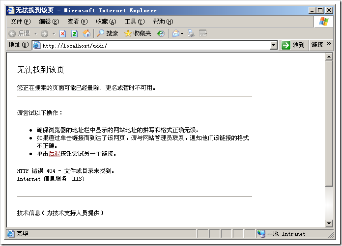
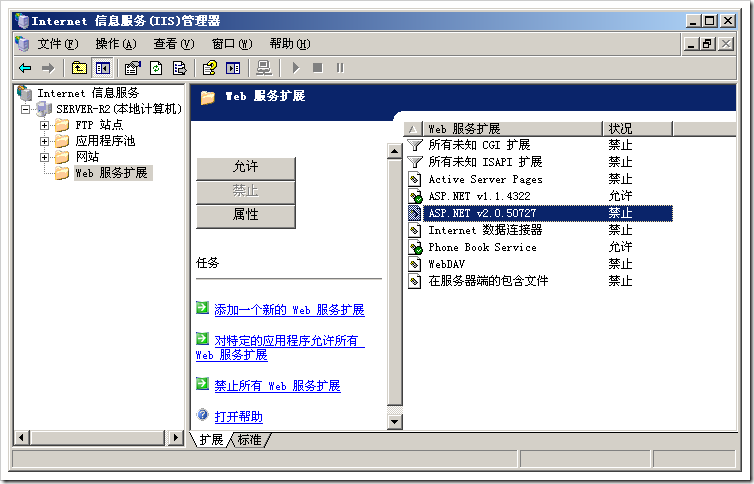

# 为IIS启用ASP.NET 2.0 
> 原文发表于 2009-06-05, 地址: http://www.cnblogs.com/chenxizhang/archive/2009/06/05/1497240.html 

如果你安装好服务器，也安装了.NET Framework 2.0。然后你部署了一个网站到IIS，却发现不管访问什么网页地址，都报告错误是：404，文件或目录未找到

  

 那么，这个原因可能是

  

 在这里将ASP.NET v2.0.50727选择“允许”即可

