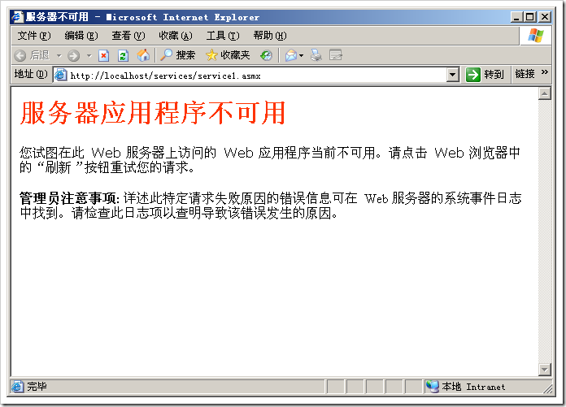
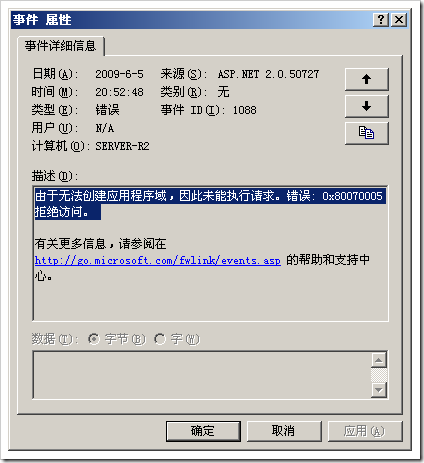
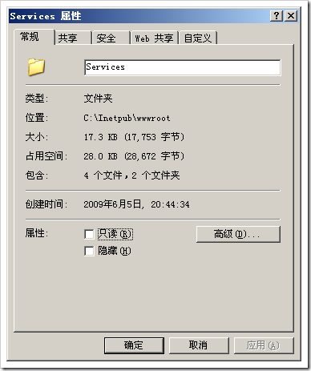
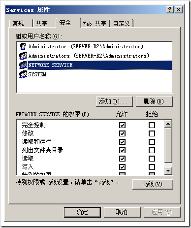
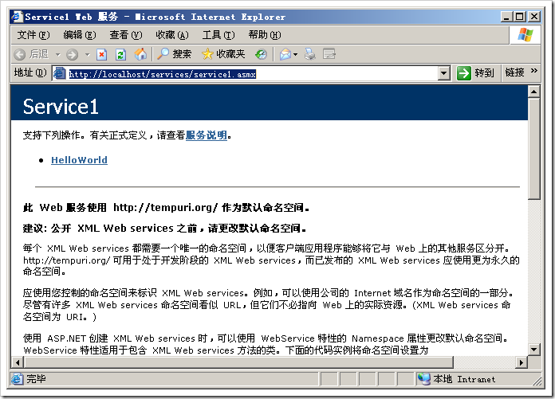

# 服务器应用程序不可用的问题 
> 原文发表于 2009-06-05, 地址: http://www.cnblogs.com/chenxizhang/archive/2009/06/05/1497249.html 

真是怪事年年有，今年特别多。这几天重新装了一台服务器，遇到一堆问题。下面这个：明明是一个最简单的服务，部署上去，楞是没有成功。

  

 查看事件日志的信息如下

  

 原因在于NETWORK SERVICE帐号没有这个目录的权限

   

 这样就可以了

 

