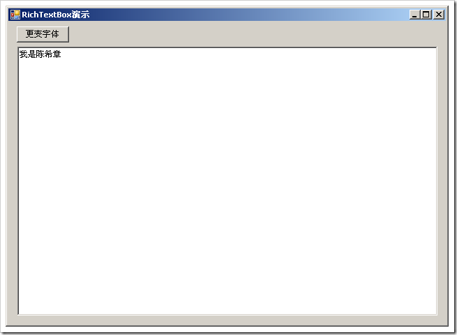
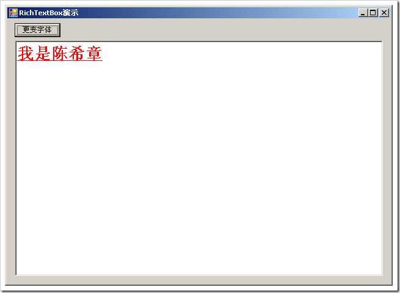
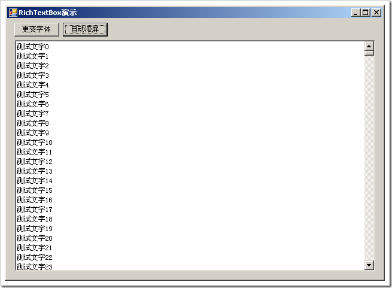
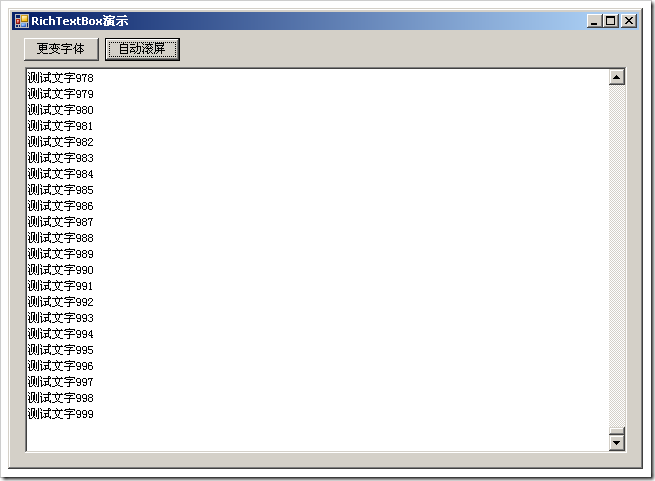
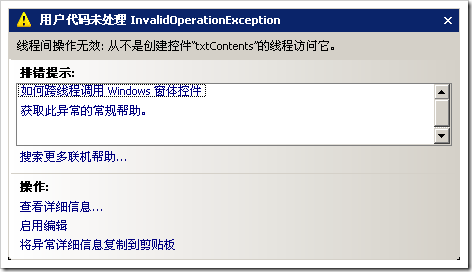
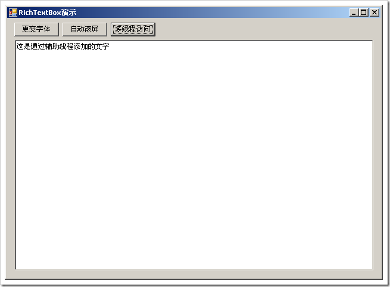

# RichTextBox控件的几点有意思的东西 
> 原文发表于 2009-06-07, 地址: http://www.cnblogs.com/chenxizhang/archive/2009/06/07/1498110.html 

今天在改一个之前项目中的前端客户端工具，是一个Windows Forms的程序。里面用到了RichTextBox控件，也就是所谓的富文本框。这里总结几个有意思的东西

 1. 富文本框的字体样式修改

  

 private void btChangeFont\_Click(object sender, EventArgs e)  
{  
    Font originalFont = txtContents.SelectionFont;  
    Font newFont = new Font(originalFont.FontFamily, 20, FontStyle.Bold | FontStyle.Underline);  
    txtContents.SelectionFont = newFont;  
    txtContents.SelectionColor = Color.Red;  
}  

  

 2. 当内容在不断添加到时候，怎么样让它自动滚动到底部？

  

 private void btAutoScroll\_Click(object sender, EventArgs e)  
{  
    for (int i = 0; i < 1000; i++)  
    {  
        txtContents.AppendText("测试文字" + i.ToString() + Environment.NewLine);  
        txtContents.ScrollToCaret();  
    }  
}  

 3. 在多线程中如何访问它

 默认情况下，如果我们在辅助线程中是不可以访问RichTextBox的。（其他控件其实也是一样）

 private void btAsync\_Click(object sender, EventArgs e)  
{  
    EventHandler handler = new EventHandler(SomeMethod);  
    handler.BeginInvoke(sender, e, null, null); } void SomeMethod(object sender, EventArgs e)  
{  
    txtContents.AppendText("这是通过辅助线程添加的文字");  
} 如果点击我们的按钮，就会异步调用SomeMethod方法，该方法试图去添加一行文字到RichTextBox中 

 这个问题是普遍存在的，它有他的合理性。那么，如果你硬是要这么做，咋办呢

 第一个做法很简单，但不是很推荐

 在窗体初始化中，Control.CheckForIllegalCrossThreadCalls = false;//禁用掉线程访问之间的检查 public Form1()  
{  
    InitializeComponent();  
    Control.CheckForIllegalCrossThreadCalls = false;  
}  各位同学注意了，CheckForIllegalCrossThreadCalls这个方法是点不出来的，就是没有智能感知。因为这确实不是很推荐的，跨线程操作，会有安全问题。所以。。。 那么，该怎么办呢？事实上，这没有什么大不了的。如果你对多线程编程了解的话 void SomeMethod(object sender, EventArgs e)  
{     this.Invoke(new UpdateUIHandler(UpdateUI));  
**}**

  **delegate void UpdateUIHandler();  
void UpdateUI()  
{  
    txtContents.AppendText("这是通过辅助线程添加的文字");  
}**

   4. 如何让它支持Tab键

 这个问题比较简单，设置一个属性

 txtContents.AcceptsTab = true;

  

 5.打开和保存rtf文件

 txtContents.LoadFile();  
txtContents.SaveFile(); 

