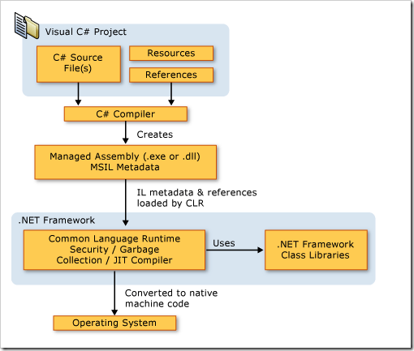

# C# 与 C 和 C++ 比较 
> 原文发表于 2009-06-07, 地址: http://www.cnblogs.com/chenxizhang/archive/2009/06/07/1498177.html 

### 

 1. 内存用垃圾收集系统来管理：**没有用来撤消 new 调用的 Delete 方法**。

- **不使用 (.h) 头文件**，此类文件也不是必需的。现在将存储于头文件中的信息作为程序集的一部分存储。

- 在 C# 程序中，**类定义中右大括号后不必使用分号。**

- **Main 方法的首字母大写，而且是静态类的成员**。Main 返回 int 或 void。

- 每个程序都必须包括 Main 方法，否则该程序不能编译。

	1. ASP.NET应用程序是个例外，因为其实我们编写的ASP.NET应用程序或者网站，只不过是一些待执行的资源而已，它们都是通过ASP.NET引擎进行处理的- switch 语句的 break 语句不是可选的。

	1. 要么break
	
	- 要么continue
	
	- 要么return- 条件必须为 Boolean。

	1. 这是明确的要求
	
	- 1不等于true，0也不等于false- 默认值由编译器分配（引用类型为 null，值类型为 0）。

  

 

