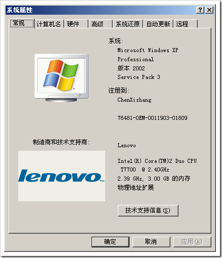
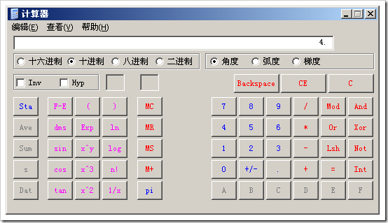
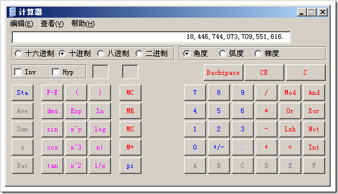
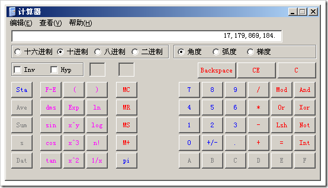

# 为什么说32位操作系统的寻址空间是4G 
> 原文发表于 2009-06-07, 地址: http://www.cnblogs.com/chenxizhang/archive/2009/06/07/1498191.html 

 1. 什么是寻址空间

 寻址空间一般指的是CPU对于内存寻址的能力。通俗地说，就是能最多用到多少内存的一个问题

  

 2. 我们经常听说32位操作系统最多能用4G内存。大部分情况下，这个上限都达不到。例如我的机器，虽然是4G物理内存，但实际上识别的只有3G。有的朋友说是可以识别到3.2G或者3.5G不等，我想这跟人品是没有什么关系的

   

 那么，这剩下的1个G左右的内存不是浪费了吗？可不是嘛，太心痛了。所有很多朋友都用一个软件将这部分内存转换为硬盘用

 <http://blog.miniasp.com/post/2008/04/Useful-tools-Gavotte-Ramdisk.aspx>

 【备注】我自己还没有这么用，要想试用该功能的同学，自己需要慎重。如果你用的好，记得反馈一下给我，呵呵

  

 3. 为什么说只能寻址到这个大小呢？我今天是要从程序的角度来解说一下

 首先说什么是32位？32位是针对CPU的一个术语

 对于程序员来说，这表示了我们在与计算机打交道的时候，能够使用的最大数字是2的32次方。这等于多少呢？

  

 那么这个数字是什么为单位呢？bit ，也可以称为比特，或者位。这是计算机可以理解的东西。这个bit里面包含的值，只有两个，就是0和1

 好了，那么这个bit怎么样能转换为GB呢，很简单：将它连续除以3次1024.

 4294967296/1024/1024/1024

 结果等于多少呢？

  

 为什么除3次？第一次转换为KB，第二次转换为MB，第三次就转换为GB了

  

 4. 那么64位的CPU的寻址空间可以到多大呢？

  

 我算一算，可以到多少GB呢？

  

 额的神啊，根据摩尔定律的计算，我想我的有生之年是不需要担心内存不够用的问题的

