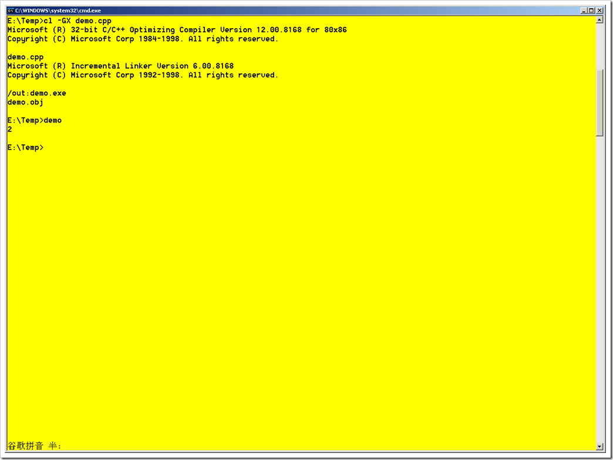

# C#和C++中char类型的区别 
> 原文发表于 2009-06-07, 地址: http://www.cnblogs.com/chenxizhang/archive/2009/06/07/1498270.html 

对于char，这个字符类型。我们一般都认为就是一个字节。今天在仔细比较发现，C#的char和C++的char是有区别的。

 1.首先来看C#中char占多大空间

 using System;  
using System.Collections.Generic;  
using System.Text; namespace ConsoleApplication1  
{  
    class Program  
    {  
        static void Main(string[] args)  
        {  
            Console.WriteLine(sizeof(char));  
            Console.Read();  
        }  
    }  
}  

  

 **居然是返回2.也就是说两个字节。**

  

 2. 在C++中呢？

 #include <iostream>  
using namespace std;  
int main()  
{  
    cout << sizeof(char)<<endl;  
    return 0;  
}  

 这里看到的结果是显示为1个字节

  

 但是同时，我又想起来，C++里面还有另外一个char类型，也就是所谓的wchar\_t，通常用来表示unicode char，它的空间是多少呢？

 #include <iostream>  
using namespace std;  
int main()  
{  
    cout << sizeof(wchar\_t)<<endl;  
    return 0;  
}  

  

 3. 那么，是不是说C#中的char都是表示unicode字符的呢？

 没错，就是这样.  如此才能解释得通嘛

 <http://msdn.microsoft.com/zh-cn/library/x9h8tsay.aspx>

 char 关键字用于声明下表所示范围内的 Unicode 字符。Unicode 字符是 16 位字符，用于表示世界上大多数已知的书面语言。

   

| 类型 | 范围 | 大小 | .NET Framework 类型 |
| --- | --- | --- | --- |
| char | U+0000 到 U+ffff | 16 位 Unicode 字符 | [System.Char](http://msdn.microsoft.com/zh-cn/library/system.char.aspx) |

  

    4. 题外话：SQL Server 中的字符类型

 我还想到，在SQL Server的类型系统中有下面几个字符类型，大家也要有所比较

 

| 定长 | char |
| 定长(unicode) | nchar |
| 变长 | varchar |
| 变长(unicode) | nvarchar |

 也就是说，在SQL Server中也是明确地区分unicode和非unicode的

