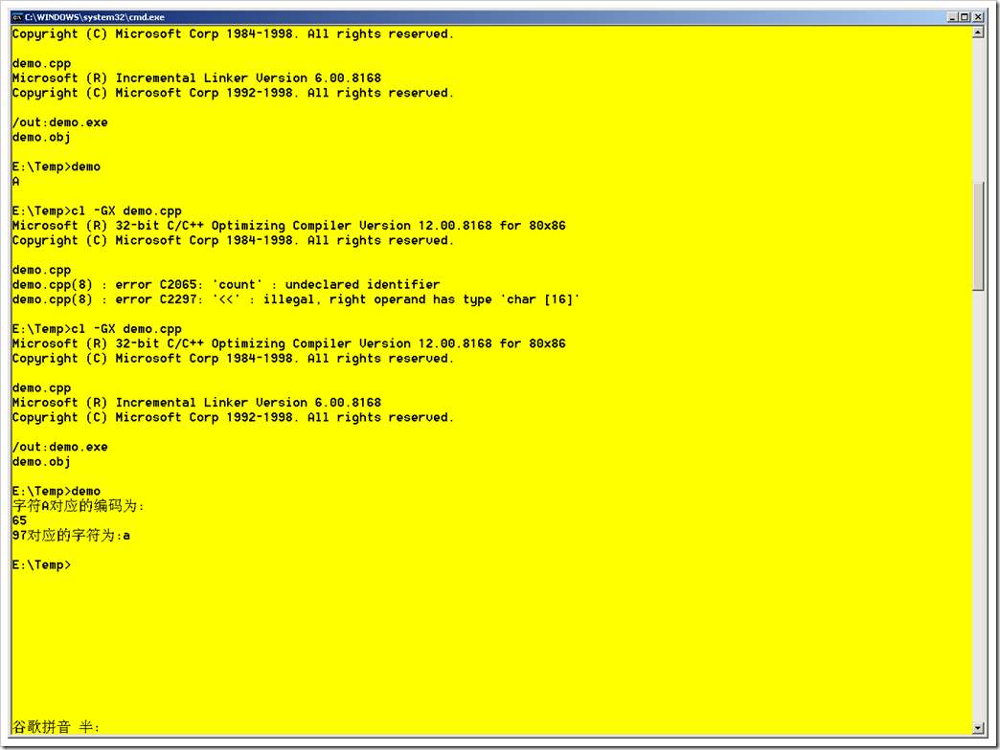

# char类型和string类型（C++,C#) 
> 原文发表于 2009-06-07, 地址: http://www.cnblogs.com/chenxizhang/archive/2009/06/07/1498312.html 

这一篇要讲一个非常重要的话题：char类型与string类型的区别。从字面上说，他们是有区别的

 1. char是**字符**类型

 2. string是**字符串**类型

  

 虽然一字之差，但其本质是很大的。

 1. char属于基础类型（C++)，在C#中它属于值类型（Value Type)。char类型的长度是固定的，上一篇讲到，在C++中它可能是1个字节，或者2个字节（取决于是否为Unicode Char），而在C#中，它永远是2个字节。

 2. string是一个模板类型，也就是一个class（C++)。在C#中它属于引用类型（Reference Type)。string的长度是无法明确取得的。也就是无法通过sizeof来取得，因为它不是一个基础类型，它本身并不固定长度，而取决于内部包含的字符。

  

 说完了本质区别，我们再来看一下从用户角度来看

 1. char类型：用单引号，例如：‘陈’,’A’

 
>  要表示多个字符怎么办？那么就用char[]，也就是数组
> 
>  【注意】如果在C++中，将’陈’赋值给一个char类型，而不是wchar\_t类型，会有问题，因为汉字是两个字节的，char是一个字节的。
> 
> 

 2.string类型：用双引号，例如：”我是陈希章”

  

 除此之外，还有一些很重要的区别

 1. char类型虽然听起来是字符类型，但其他它可以隐式地转换为包括short, int,long等整数类型。为什么这么说呢？我们不是说了它要么占1个字节，要么占2个字节吗？

 下面来看一个例子，如何对Char转换为short，以及如何从short转换为Char

  

  

 这也就是我们经常说的，字符对应的编码：大写A编号为65，小写a编号为97

  

 相关知识：在Excel中，可以通过Char函数根据一个数字返回字符，通过Code函数返回某个字符对应的编码，如下

 
>  =CHAR(97)  会返回“a" =CHAR(98)  会返回“b" =CHAR(99)  会返回“c" =CHAR(100)  会返回“d" 以此类推。。。。。 反向返回 =Code(“a")  会返回“97" =Code(“b")  会返回“98" =Code(“c")  会返回“99" =Code(“d")  会返回“100"
> 
> 
> 
> 
> 
> 
> 
> 
> 
> 
> 
> 
> 
> 
> 
> 
> 
> 
> 
> 

  

 2.  char类型既然是一个基础类型，它有signed char和unsigned char的区分

 * signed char 有符号的char，取值范围是-128到127
* unsigned char 无符号的char，取值范围是0到255

 你可能会问，一个字符跟符号有什么关系呢？

 没错，字符是没有关系。但你要知道，char类型可以用来表示整数的。既然是可以用来表示整数，就有正负之分了。例如，我们要表示一个整数，它的取值范围比较小，不会超过255.那么此时，我们就可以直接用unsigned char，而不必用short(2个字节），更没有必要用int(4个字节）了

 但是，到了C#里面，所有的char都是无符号的

 
>  **1、Byte   变量以无符号的   8   位（1   个字节）数字的形式存储，取值范围为   0   到   255。    
>   Byte   数据类型用于存放二进制数据。    
>   注意       Byte   数据类型可以转换为   Short、Integer、Long、Single、Double   或   Decimal   数据类型，而不会出现   System.OverflowException   错误。    
>   2、Char   变量以无符号的   16   位（2   个字节）数字的形式存储，取值范围为   0   到   65535。每个数字代表一个   Unicode   字符。不能直接在   Char   数据类型和数值类型之间进行转换，但可以使用   AscW   和   ChrW   函数来完成。**
> 
> 

 相关知识：SQL Server中类似整数类型的联想

 我又联想到在SQL Server中几个特殊的数据类型

 

| bit | 取值：0，1 |
| tinyint | 取值：0～255。相当于C++中的unsigned char，或者C#中的byte |
| smallint | 取值：-32768～32767。其实相当于C++中的short类型 |
| int | 取值：正负20多亿，也就是正负2的32次方 |

  

 最后谈一谈，string这个类型到底是怎么存储数据的，它需要占用多少空间？

 1. string中没过字符都用2个字节保存

 2. string的最后还有一个特殊的字符，是不可见的，\0 。它也是占两个字节

 3. string的大小是不可以通过sizeof来获得的。如果尝试通过sizeof取得string的大小，会遇到编译错误

  

 上面的错误提示说，要用System.Runtime里面的一个类型去做。不要这么做，因为没有用。请参考下面的代码

 using System;  
using System.Collections.Generic;  
using System.Text; namespace ConsoleApplication1  
{  
    class Program  
    {  
        static void Main(string[] args)  
        {             string input = "你好,我是陈希章";  
**byte[] bytes = Encoding.Default.GetBytes(input);  
            Console.WriteLine(bytes.Length);//返回15，每个汉字占两个字节（7×2=14），标准的占1个字节**  **byte[] bytes2 = Encoding.Unicode.GetBytes(input);  
            Console.WriteLine(bytes2.Length);//返回16，所有字符都用两个字节**             byte[] bytes3 = Encoding.ASCII.GetBytes(input);  
            Console.WriteLine(bytes3.Length);//返回8，所有字符都用一个字节（有点诡异）             Console.Read();  
        }  
    }  
}   也就是说，一个字符串具体占多大空间，还取决于字符的编码。到了这里，大家应该就有更好的认识了。最后说两个与string 有关的技巧 1. C#中，string是不可变的。在动态构造字符串的时候（例如：result=result+”Test” )，其实会产生一个新的字符串,原有的result还会保留，新创建的一个的result是旧的result和“Test”连起来的结果。所以，为了更好的使用资源，应该使用StringBuilder 2. string有没有上限呢？理论上是受内存限制。但一般可以认为是2G（2的31次方）     另外，在使用char或者string的时候，不要忘记有一些字符是比较特殊的，也就是所谓的“转义字符”，例如\n表示换行，\t表示tab键等

 \b:回退：向后退一格  
\f:换页   
\n:换行，光标到下行行首  
\r:回车，光标到本行行首   
\t:水平制表   
\v:垂直制表   
\\:反斜杠  
\‘:单引号  
\":双引号   
\?:问号  
\ddd:三位八进制   
\xhh:二位十六进制   
\0:空字符(NULL),什么都不做。换行只是换一行，不改变光标的横坐标；回车只是回到行首，不改变光标的纵坐标。  

