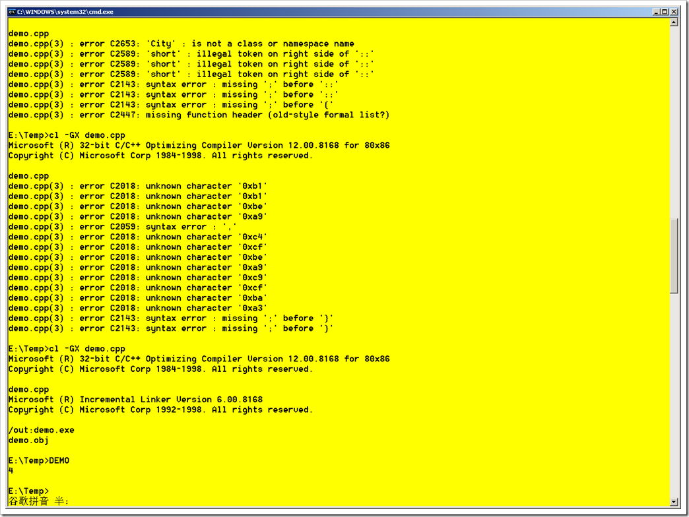
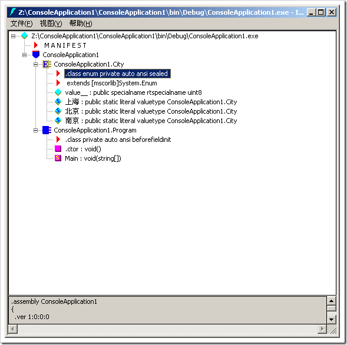
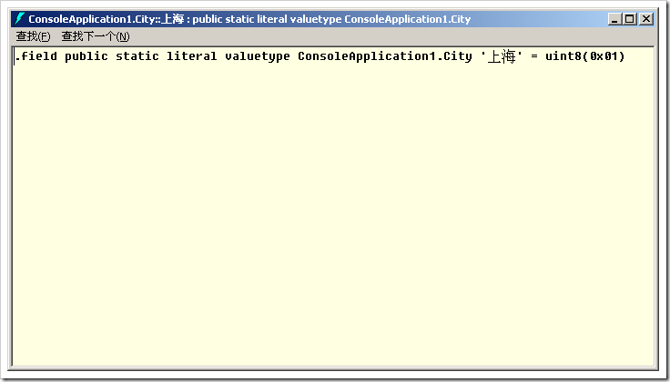

# 定义枚举类型时指定其使用的大小 (C++,C#) 
> 原文发表于 2009-06-08, 地址: http://www.cnblogs.com/chenxizhang/archive/2009/06/08/1498365.html 

我们应该都用过枚举类型(enum)，在C++中这个被称为自定义类型，在C#中，它是值类型的一种。

 枚举的特殊之处在于它总是（也必须）可以转换为一个整数。默认情况下，它是一个int的整数。为什么这么说呢？就是每一个枚举的项都会有一个对应的整数。例如下面的例子

 enum City{北京,上海,南京}

 上述语句定义了一个叫做City的枚举，包含了三个城市，其中北京（或者表示为City.北京）对应的值是0，上海为1，以此类推

 **【备注】在C++中定义枚举，如果用了以上的汉字，就会通不过编译。我还没有找到解释，有知道的同学请给我反馈一下。这也许就是说C++对unicode支持不好的地方吧**

  

 当然，我们还可以为某些Item明确指定对应的整数值，例如

 enum City{北京=5,上海=10,南京}

 需要注意的是，此时南京并没有指定值，但它的值为11.就是说，如果自己没有定义，则等于前面的值加1

  

 还有一个有意思的地方，假设我还有一个item，明确设置了11,那么会怎么样呢？例如

 enum City{北京=5,上海=10,南京,杭州=11}

 你会怎么考虑这个问题？会通不过编译吗？不，能通过，而且能使用。也就是说编译器或者运行环境都不会检查这种冲突。当然，实际上，这个问题很容易避免，因为枚举是我们自己定义的，你怎么会去这样做呢？给我一个理由先

  

 如果我们来看这个类型的大小的话（sizeof），可以得到它是4个字节。

 那么这里就有一个问题，我们只有三个值，凭什么要占4个字节呢？我就在想，当初设计这样一种默认行为是有问题的，哪一个枚举要有这么大呢？

  

 如果我们想改变这种默认的行为，让枚举类型占用空间小一点，怎么办呢？

 在C#中，可以像下面这样做

 class Program  
{  
    static void Main(string[] args)  
    {  
        Console.WriteLine(sizeof(City));  
        Console.Read();  
    }  
} enum City : byte//byte只占一个字节（取值范围0～255），char占两个字节（取值范围0～65536），short也占两个字节（在c#中，无符号的short和char是一样的，但short可以有符号——short,ushort）  
{   
    北京,  
    上海,  
    南京  
} 这样是不是更加好一些呢

 **【注意】我还没有搞清楚在C++中定义的方式，同样，有知道的同学请给我一些反馈。**

 我最近就是在整理C++和C#的一些基础理论知识。因为C++对我来说不是很熟悉，所以很多时候都是用C#的思路带着去学习。

  

 另外，在C#中使用枚举的方式也和C++不大一样

 C#代码

 class Program  
 {  
     static void Main(string[] args)  
     {  
         Console.WriteLine(**City.北京**);  
         Console.Read();  
     }  
 }  enum City : byte//byte只占一个字节，char占两个字节，short也占两个字节（short有符号，无符号之分）  
 {   
     北京,  
     上海,  
     南京  
 } 注意，我们并不需要实例化这个City枚举，而是可以使用静态的方式：City.北京

  

 C++代码

 #include <iostream>  
using namespace std;  
enum City{A=1,B=2,C=2}; int main()  
{     cout<< sizeof(City)<<endl;  
**City var =A;  
    cout << A<<endl;**      return 0;  
}  

 也就是说，在C++中，它需要先实例化一个变量，然后才能使用

  

 我还观察了一下，C#中其实是把枚举的每个项都编译成了一个静态变量

  

 

