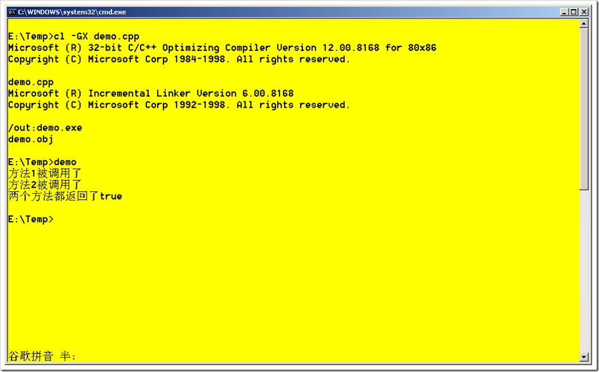
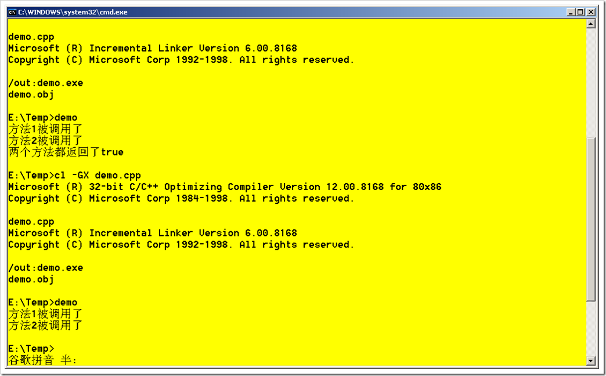
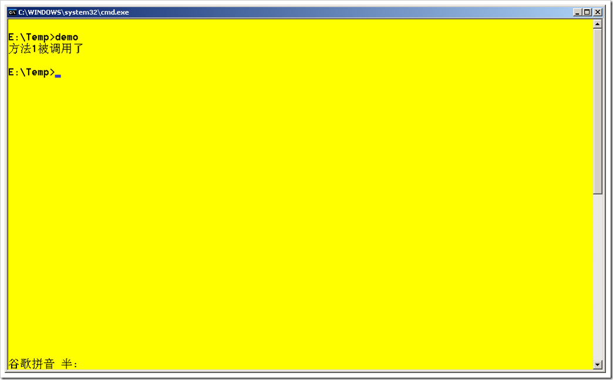

# 位运算符和逻辑运算符(C++,C#)：与和逻辑与，非和逻辑非 
> 原文发表于 2009-06-08, 地址: http://www.cnblogs.com/chenxizhang/archive/2009/06/08/1498500.html 

为什么需要说这个话题呢？因为很多朋友搞不大清楚他们的区别。

 * 与运算，在编程中表示为&
* 非运算，在编程中表示为|
* 逻辑与运算：在编程中表示为&&
* 逻辑非运算：在编程中表示为||

 前面两个是所谓的位运算符，后面两个是所谓的逻辑运算符

 与运算和逻辑与运算的规则是：

 * 运算符左右两个操作数都为true(1)，才为true(1)。否则为false(0)

 非运算和逻辑非运算的规则是：

 * 运算符左右两个操作数只要有任何一个为false（0），就为false(0),否则就为true(1)

  

 那么，他们到底有什么区别呢？我们还是用一个例子来说明吧，例如

 我们需要计算两个函数的返回值运算的结果

 bool Method1(){  
    cout<<"方法1被调用了"<<endl;  
    return true;  
} bool Method2()  
{  
    cout<<"方法2被调用了"<<endl;  
    return true;  
} 我们要对这两个方法的返回值进行与运算。 int main()  
{  
    if(Method1() & Method2())  
        cout<<"两个方法都返回了true"<<endl;  
    return 0;  
}  

 运行起来的效果如下

  

 很简单，对吧？我们现在把Method1的返回值改为false

 bool Method1(){  
    cout<<"方法1被调用了"<<endl;  
    return false;  
}  

 因为Method1返回了false,所以if(Method1() & Method2()) 返回了false,所以下面这一句是不会被执行的

 cout<<"两个方法都返回了true"<<endl;

 这是我们预期的结果，看起来没有什么问题嘛

  

 但是，我们发现即便Method1是false了，但Method2也还是被调用了。但我们知道，因为Method1已经返回了false，所以不管Method2无论是返回true还是false，那么结果都将是false.那么，这样的话，Method2再进行运算就没有任何意义。假设Method2的代码很复杂，则更加是不符合成本的考虑的。

 那么，如何解决这个问题呢？

 int main()  
{  
    if(Method1() **&&** Method2())  
        cout<<"两个方法都返回了true"<<endl;  
    return 0;  
} 这样的话，返回的结果就是

  

 你会发现，现在只是调用了Method1。而根本没有调用Method2

 所以，我们总结一下，虽然位运算符也可以做类似于逻辑运算的功能，但其实它并不是，它还是专门用于二进制里面的位运算吧。所有进行逻辑运算的情况，都应该使用逻辑运算符。

 这个特性在C#里面是一模一样的。但有一点要注意：**在C#里面，bool值与整数型是不能转换的**，这就更加严格地要求我们遵循上面的原则。

  

 本例完整代码如下

 #include <iostream>  
using namespace std; bool Method1(){  
    cout<<"方法1被调用了"<<endl;  
    return false;  
} bool Method2()  
{  
    cout<<"方法2被调用了"<<endl;  
    return true;  
} int main()  
{  
    if(Method1() && Method2())  
        cout<<"两个方法都返回了true"<<endl;  
    return 0;  
} 

