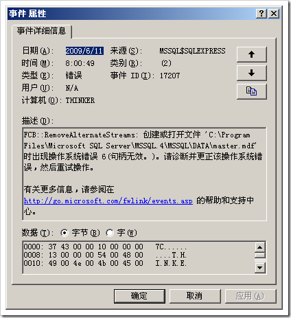

# 如何在tempdb出错的情况下修复数据库服务器 
> 原文发表于 2009-06-11, 地址: http://www.cnblogs.com/chenxizhang/archive/2009/06/11/1501057.html 

在数据库服务器规划中，一般我们都建议tempdb要移动到独立的磁盘中去，这样可以提高整个服务器的运行速度。

 如果tempdb所在的磁盘，由于某个什么原因而无法重新定位到，此时服务器将无法启动。

  

 那么，怎么解决这个问题呢

 1. 将服务器使用特殊模式启动起来

 net start MSSQLSERVER /f /T3608

 2. 修改tempdb数据库的位置

 新建一个sql文件(例如temp.sql)，包含以下内容

 USE master;  
GO  
ALTER DATABASE tempdb   
MODIFY FILE (NAME = tempdev, FILENAME = 'D:\tempdb.mdf');  
GO  
ALTER DATABASE tempdb   
MODIFY FILE (NAME = templog, FILENAME = 'D:\templog.ldf');  
GO 然后，使用sqlcmd –itemp.sql 3.重新启动服务器即可   这里的关键点是启动服务器时使用的跟踪标记（T3608）,意思是说跳过所有数据库的恢复检查 关于sql server所支持的一些跟踪标记，请参考联机帮助    

| 跟踪标志  | 说明  |
| --- | --- |
| **260**  | 打印有关扩展存储过程动态链接库 (DLL) 的版本控制信息。有关 **\_\_GetXpVersion()** 的详细信息，请参阅XML:NAMESPACE PREFIX = MSHelp /创建扩展存储过程。 **作用域：**全局或会话 |
| **1204**  | 返回参与死锁的锁的资源和类型，以及受影响的当前命令。 **作用域：**仅全局 |
| **1211**  | 基于内存不足或基于锁数禁用锁升级。SQL Server 数据库引擎不会将行锁或页锁升级到表锁。 使用此跟踪标志可生成过多的锁数目。这样会降低数据库引擎的性能，或因为内存不足而导致 1204 错误（无法分配锁资源）。有关详细信息，请参阅锁升级（数据库引擎）。 如果同时设置了跟踪标志 1211 和 1224，则 1211 优先于 1224。但由于在所有情况下（甚至在内存紧张的情况下）跟踪标志 1211 都会禁止升级，因此建议使用 1224。这有助于在使用很多锁时避免出现“锁不足”错误。 **作用域**：全局或会话 |
| **1222**  | 以不符合任何 XSD 架构的 XML 格式，返回参与死锁的锁的资源和类型，以及受影响的当前命令。 **作用域**：仅全局 |
| **1224**  | 基于锁数禁用锁升级。但是，内存不足仍可激活锁升级。如果锁对象使用的内存量超出下列条件之一，数据库引擎会将行锁或页锁升级为表（或分区）锁：* 数据库引擎所用内存的 40%，使用地址窗口化扩展插件 (AWE) 的内存分配除外。只有在 **sp\_configure** 的 **locks** 参数设置为 0 时，这才适用。* 使用 **sp\_configure** 的 **locks** 参数配置的锁内存的 40%。有关详细信息，请参阅设置服务器配置选项。

如果同时设置了跟踪标志 1211 和 1224，则 1211 优先于 1224。但由于在所有情况下（甚至在内存紧张的情况下）跟踪标志 1211 都会禁止升级，因此建议使用 1224。这有助于在使用很多锁时避免出现“锁不足”错误。  

| 注意： |
| --- |
| 也可以使用 ALTER TABLE 语句的 LOCK\_ESCALATION 选项控制到表级或 HoBT 级粒度的锁升级。  |

  **作用域：**全局或会话 |
| **2528**  | 禁用 DBCC CHECKDB、DBCC CHECKFILEGROUP 和 DBCC CHECKTABLE 执行的对象并行检查。默认情况下，并行度由查询处理器自动确定。最大并行度的配置就像并行查询的最大并行度一样。有关详细信息，请参阅 max degree of parallelism 选项。 通常应使并行 DBCC 保持启用状态。对于 DBCC CHECKDB，查询处理器重新求值，并对检查的每个表或每批表自动调整并行度。有时，检查可能在服务器几乎处于空闲状态时启动。如果管理员知道在检查完成前负载将增加，则可能需要手动减小并行度或禁用并行度。 禁用对 DBCC 的并行检查可能导致 DBCC 的完成时间变长，如果运行 DBCC 时启用了 TABLOCK 功能并关闭了并行度，则表可能被锁定更长时间。 **作用域**：全局或会话 |
| **3205**  | 默认情况下，如果磁带机支持硬件压缩，则 DUMP 或 BACKUP 语句会使用该功能。利用此跟踪标志，可以禁用磁带机的硬件压缩。此选项在您需要与不支持压缩的其他站点或磁带机交换磁带时很有用。 **作用域**：全局或会话 |
| **3608**  | 禁止 SQL Server 自动启动和恢复除 **master** 数据库之外的任何数据库。在访问数据库时将启动并恢复该数据库。可能无法运行某些功能，如快照隔离和读提交快照。用于移动系统数据库和移动用户数据库。请不要在正常操作中使用。 |
| **3226**  | 默认情况下，每个成功的备份操作都会在 SQL Server 错误日志和系统事件日志中添加一个条目。如果非常频繁地创建日志备份，这些成功消息会迅速累积，从而产生一个巨大的错误日志，使查找其他消息变得非常困难。 使用这一跟踪标志，可以取消这些日志条目。如果您频繁地运行日志备份，并且没有任何脚本依赖于这些条目，则这种做法非常有用。 |
| **3625**  | 限制错误消息中返回的信息量。有关详细信息，请参阅元数据可见性配置。 **作用域：**仅全局 |
| **4616**  | 使应用程序角色可以看到服务器级元数据。在 SQL Server 中，应用程序角色无法访问自身数据库以外的元数据，因为应用程序角色与服务器级主体不相关联。这是对早期版本的 SQL Server 的行为的更改。设置此全局标志将禁用新的限制，并允许应用程序角色访问服务器级元数据。 **作用域**：仅全局 |
| **6527**  | 禁止在 CLR 集成中第一次发生内存不足异常时生成内存转储。默认情况下，SQL Server 在 CLR 中第一次发生内存不足异常时会生成小内存转储。该跟踪标志的行为如下所示：* 如果用作一个启动跟踪标志，则永远不生成内存转储。但是，如果使用了其他跟踪标志，则可能会生成内存转储。* 如果在正在运行的服务器上启用此跟踪标志，则从此时开始不会自动生成内存转储。但是，如果已经由于 CLR 中的内存不足异常生成了内存转储，则此跟踪标志将没有任何效果。

**作用域：**仅全局 |
| **7806**  | 在 SQL Server Express 上启用专用管理员连接 (DAC)。默认情况下，在 SQL Server Express 上不保留 DAC 资源。有关详细信息，请参阅使用专用管理员连接。 **作用域：**仅全局 |

  

  

    在 SQL Server 中，有两种跟踪标志：会话跟踪标志和全局跟踪标志。会话跟踪标志对某个连接是有效的，只对该连接可见。全局跟踪标志在服务器级别上进行设置，对服务器上的每一个连接都可见。某些标志只能作为全局标志启用，而某些标志在全局或会话作用域都可以启用。

 应遵循以下规则：

 * 全局跟踪标志必须全局启用。否则，跟踪标志无效。建议您在启动时通过使用 **-T** 命令行选项启用全局跟踪标志。  
  
* 如果跟踪标志有全局或会话作用域，则可以用合适的作用域来启用它。在会话级别启用的跟踪标志永远不会影响另一个会话，并且当打开会话的 SPID 注销时，该跟踪标志将失效。

 使用以下方法之一可将跟踪标志设置为开或关：

 * 使用 DBCC TRACEON 和 DBCC TRACEOFF 命令。  
  
以 DBCC TRACEON 2528 为例，若要在全局作用域内启用跟踪标志，请在使用 DBCC TRACEON 时使用 -1 参数：`DBCC TRACEON (2528, -1)`。若要关闭全局跟踪标志，请在使用 DBCC TRACEOFF 时使用 -1 参数。  
  
* 使用 **-T** 启动选项可以指定跟踪标志在启动期间设置为开。  
  
**-T** 启动选项将全局启用跟踪标志。使用启动选项无法启动会话级别的跟踪标志。有关启动选项的详细信息，请参阅使用 SQL Server 服务启动选项。

 使用 DBCC TRACESTATUS 命令确定哪些跟踪标志当前是活动的。

 ### 行为更改

  在 SQL Server 2000 中，通过简单的 DBCC TRACEON (1204) 足以将死锁报表记录到错误日志中。在 SQL Server 2008 中，则必须全局启用标志，这是因为会话级别的标志对死锁监视器线程不可见。

