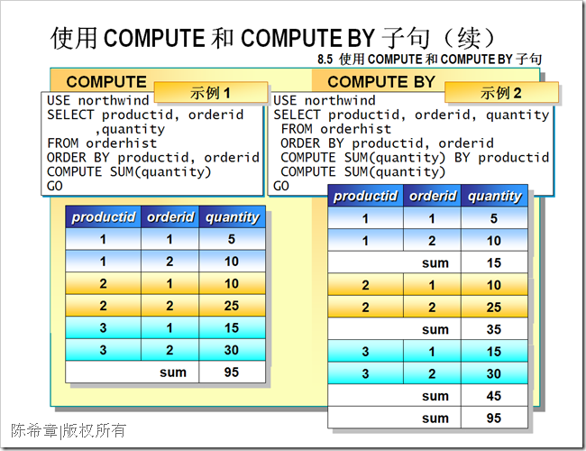
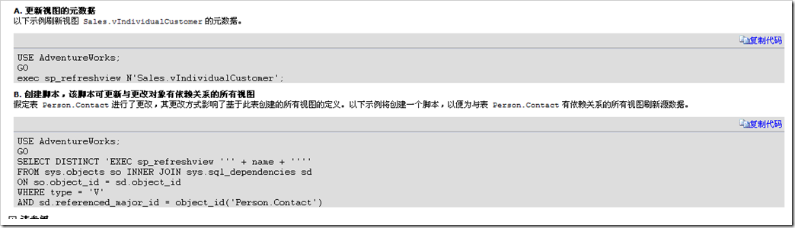

# SQL Server基础知识之:设计和实现视图 
> 原文发表于 2009-06-15, 地址: http://www.cnblogs.com/chenxizhang/archive/2009/06/15/1503770.html 

设计和实现视图可谓是数据库物理设计中的一个非常重要的步骤。从一般意义上说，设计和实现视图应该遵循下面的一些建议和原则。

 以下内容摘在文档，我对某些重点进行了补充说明（红色部分）

 - 只能在当前数据库中创建视图。 但是，如果使用分布式查询定义视图，则新视图所引用的表和视图可以存在于其他数据库甚至其他服务器中。
	* **分布式视图是可行的，但随着SQL Server本身能力的提高，例如SQL Server 2005开始支持表分区等技术之后，分布式视图应该尽量少用。*** **所谓分布式视图的一个最大的问题就是将表物理上分开在多个数据库甚至服务器中，这增加了维护和查询的难度**- 视图名称必须遵循标识符的规则，且对每个架构都必须唯一。 此外，该名称不得与该架构包含的任何表的名称相同。
	* **一个可以借鉴的做法是：在视图名称之前添加一个前缀 vw**- 您可以对其他视图创建视图。Microsoft SQL Server 允许嵌套视图。但嵌套不得超过 32 层。 根据视图的复杂性及可用内存，视图嵌套的实际限制可能低于该值。
	* **一般不建议超过2层**- 不能将规则或 DEFAULT 定义与视图相关联。 - 不能将 AFTER 触发器与视图相关联，只有 INSTEAD OF 触发器可以与之相关联。
	* **除非万不得已，一般不建议使用触发器**- 定义视图的查询不能包含 COMPUTE 子句、COMPUTE BY 子句或 INTO 关键字。
	* **很多朋友不知道：COMPUTER和COMPUTER BY语句仅仅用于一些特殊场合，用于生成总计行。大致有如下的效果** 

 该特性不能用于视图，但可以直接用于查询

  

- 定义视图的查询不能包含 ORDER BY 子句，除非在 SELECT 语句的选择列表中还有一个 TOP 子句。
	* **这个很有意思，如果要访问所有的呢，还必须是写TOP 100 PERCENT**- 定义视图的查询不能包含指定查询提示的 OPTION 子句。 - 定义视图的查询不能包含 TABLESAMPLE 子句。
	* **关于TABLESAMPLE语句，大家可能也比较陌生，这是一个用于对数据进行抽样的。它和TOP语句不同，TOP语句是有固定大小的，而TABLESAMPLE返回的数据，可能多，可能少，甚至可能没有*** **我之前有一篇文章讲述这个语法** [**http://www.cnblogs.com/chenxizhang/archive/2009/05/19/1460040.html**](http://www.cnblogs.com/chenxizhang/archive/2009/05/19/1460040.html "http://www.cnblogs.com/chenxizhang/archive/2009/05/19/1460040.html")- 不能为视图定义全文索引定义。 - 不能创建临时视图，也不能对临时表创建视图。
	* **在SQL Server 2005中，可以通过CTE（Common Table Expression)来实现该功能*** **之前的版本，大致的做法是使用临时表，表变量，函数等等**- 不能删除参与到使用 SCHEMABINDING 子句创建的视图中的视图、表或函数，除非该视图已被删除或更改而不再具有架构绑定。 另外，如果对参与具有架构绑定的视图的表执行 ALTER TABLE 语句，而这些语句又会影响该视图的定义，则这些语句将会失败。
	* **如果未使用 SCHEMABINDING 子句创建视图，则对视图下影响视图定义的对象进行更改时，应运行** [**sp\_refreshview**](http://msdn.microsoft.com/zh-cn/library/ms187821.aspx)**。 否则，当查询视图时，可能会生成意外结果**。
		+ **如果你修改了一个表，那么如何刷新所有与该表有关的视图呢**
			- [http://msdn.microsoft.com/zh-cn/library/ms187821(SQL.90).aspx](http://msdn.microsoft.com/zh-cn/library/ms187821(SQL.90).aspx "http://msdn.microsoft.com/zh-cn/library/ms187821(SQL.90).aspx")* **强烈建议对某些非常重要的视图，添加SCHEMABINDING 子句。** 

- 尽管查询引用一个已配置全文索引的表时，视图定义可以包含全文查询，仍然不能对视图执行全文查询。 - 下列情况下必须指定视图中每列的名称：
	* 视图中的任何列都是从算术表达式、内置函数或常量派生而来。 * 视图中有两列或多列原应具有相同名称（通常由于视图定义包含联接，因此来自两个或多个不同表的列具有相同的名称）。 * 希望为视图中的列指定一个与其源列不同的名称。 （也可以在视图中重命名列。） 无论重命名与否，视图列都会继承其源列的数据类型。 若要创建视图，您必须获取由数据库所有者授予的此操作执行权限，如果使用 SCHEMABINDING 子句创建视图，则必须对视图定义中引用的任何表或视图具有相应的权限。 
	
	 默认情况下，由于行通过视图进行添加或更新，当其不再符合定义视图的查询的条件时，它们即从视图范围中消失。 例如，创建一个定义视图的查询，该视图从表中检索员工的薪水低于 $30,000 的所有行。如果员工的薪水涨到 $32,000，因其薪水不符合视图所设条件，查询时视图不再显示该特定员工。 但是，WITH CHECK OPTION 子句强制所有数据修改语句均根据视图执行，以符合定义视图的 SELECT 语句中所设条件。 如果使用该子句，则对行的修改不能导致行从视图中消失。 任何可能导致行消失的修改都会被取消，并显示错误。
 本文由作者：[陈希章](http://www.xizhang.com) 于 2009/6/15 17:31:29 发布在：<http://www.cnblogs.com/chenxizhang/>  
 本文版权归作者所有，可以转载，但未经作者同意必须保留此段声明，且在文章页面明显位置给出原文连接，否则保留追究法律责任的权利。   
 更多博客文章，以及作者对于博客引用方面的完整声明以及合作方面的政策，请参考以下站点：[陈希章的博客中心](http://www.xizhang.com/blog.htm)
