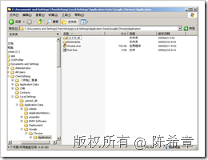
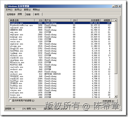
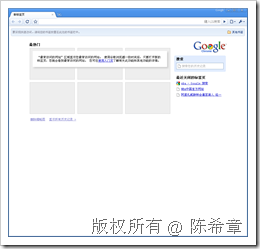
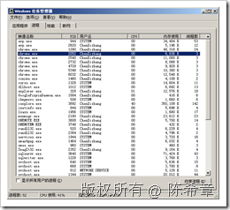
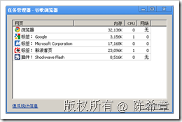

# 浏览器的比较(IE和Chrome) 
> 原文发表于 2009-06-19, 地址: http://www.cnblogs.com/chenxizhang/archive/2009/06/19/1506415.html 

这是我目前在用的两款浏览器，今天大致比较一下。我目前使用的版本是IE 7和Chrome 2.0

 ### 1. 名称由来

 * IE: Intenet Explore (顾名思义：因特网资源管理器，这名够霸气，起得很不错） * Chrome：发音为 [krəum] 。意思是一种金属元素：铬。

 Chrome，化学里称之为“铬”，铬是第24号元素，原子量为52。铬的名称来自希腊文Chroma，意为颜色。因为铬元素以多种不同颜色的化合物存在，故被称为“多彩的元素”。此外，铬在人体的总量约为6毫克，它分布在人体各部，血清中的铬浓度约在5—10微克／毫升。铬的浓度随年龄增加而减少。随着体内铬的减少，衰老也逐渐发生，因此体内铬若能维持到一定水平，就会使你青春常在，所以似可称为“葆你青春的铬”

 下面这一段是Google自己说的为什么要推出Chrome : [http://www.google.com/chrome/intl/zh-CN/why.html](http://www.google.com/chrome/intl/zh-CN/why.html "http://www.google.com/chrome/intl/zh-CN/why.html")

 
>  在谷歌，我们每天绝大部份时间里都是通过网页浏览器来工作的。我们用浏览器搜索，聊天，收发Email和协同工作。和大家一样，工作之余我们会用浏览器进行网上购物，使用电子银行，阅读网络新闻以及和朋友保持联系。人们将越来越多的时间用来上网，如今的网络应用是15年前互联网刚刚出现时无法想象的。 因为我们将大量时间都花在了网络上，于是我们开始认真思考什么样的浏览器是最合适的，特别是当众多的优秀应用都是构建在浏览器的基础上。我们认识到网络已经从简单的文本页面进化到富媒体和互动应用广泛普及的新时代。我们应该彻底地重新认识浏览器。我们需要的不仅仅是一个"浏览"器，而是一个现代化的平台，可以浏览网页，使用网络应用，并支持那些我们刚刚开始着手的功能。 所以今天，我们发布了一个**崭新的开源浏览器**：谷歌浏览器测试版。 从界面来看，我们设计了一个简单而高效的浏览器窗口。对大多数人来说，浏览器本身并不重要，它只是一个能够运行互联网网页、网站和网络应用等重要程序的工具。正如谷歌的经典主页，谷歌浏览器延续了简洁、快速的设计理念，帮助用户快速准确地到达目的地。 从根本上讲，我们提供了一个能更好地支持各种复杂网络应用的浏览器基础平台。通过让每一个标签相互独立开来，从而避免了两个标签页产生冲突的可能，同时对来自恶意网站的攻击我们提供了更好的保护。我们提高了浏览器整体上的速度和响应度。我们还建立了一个更强大的JavaScript引擎V8，以便为下一代网络应用技术提供支持，这些网络应用在目前的浏览器上几乎不可能实现。 一切都刚刚开始，谷歌浏览器也刚刚起步。我们将这个测试版发布在Windows操作平台上，以便大家展开更广泛的讨论，希望能尽快地听到大家的建议。目前，谷歌还在努力开发应用于Mac和Linux的谷歌浏览器，我们会不断改进，使它更快、更稳定。 我们对很多开发开源项目的人心存感激，我们承诺会沿着前人的路继续前行。我们借鉴了一些源自Apple WebKit和 Mozilla Firefox的技术，怀着同样开源的精神，谷歌浏览器所有的代码全部开源。我们希望能与整个业界合作从而促进互联网的健康发展。 伴随着众多选择和不断创新，互联网会越来越好。谷歌浏览器就是一个很好的选择，我们希望它能为互联网的发展做出贡献。 
> 
> 
> 
> 
> 
> 
> 
> 
> 
> 
> 
> 
> 
> 
> 
> 

   ### 2. 安装

 * IE一般都是随着Windows安装的，微软一再声称IE是Windows的一部分。当年也是靠这个打败了Netscape（网景）公司。而且IE的升级过程有些诡异，一般都需要重新启动Windows。同时，IE几乎是无法删除的，你不要尝试那样去做，因为你做不到。 * Chrome的安装也是特别诡异，它不安装在Program Files目录，而是直接安装在用户的目录下(例如：C:\Documents and Settings\ChenXizhang\Local Settings\Application Data\Google\Chrome\Application）

   

 3. 内核机制

 * IE从7.0终于开始对多选项卡进行支持。并且支持一个概览视图（CTRL+Q)，就是可以看到多个选项卡的缩略图。

   

 * 但直到IE 7为止，不管开多少个选项卡，他们都是运行在一个进程里面的。所以，你可能会发现，如果选项卡开的比较多，那么IE所占用的内存是惊人的.下面的截图，是我开了25个选项卡的情况下，IE占的内存（大约350MB）。我是仗着内存多所以才做这样的实验，机器内存不充裕的同学不要轻易模仿，呵呵

  

 * 反过来看Chrome呢？它天生就是多选项卡的。这也难怪，它是后来者嘛，我们也知道IE之外其他浏览器（例如opera等）早就有多选项卡了。如果Chrome推出来，不用多选项卡，那才叫怪事呢。Chrome每次打开新的选项卡，都可以有一个类似之前Opera那种快速访问的链接。如下图

  

 * Chrome自从一推出，就鲜明地提出一个新的创意，就是每个选项卡使用独立的进程(很奇怪的是，以前的浏览器为什么都没有想到这一点），这样做的结果就是某个选项卡出错甚至崩溃不会影响到其他选项卡。当然，这也是用内存作为代价的.下面这个截图是我在开了5个选项卡的时候，任务管理器中就出现了5个chrome的进程了。

  

 * 另外有意思的是，Chrome自带了一个任务管理器和傻瓜统计工具，可以很直观地看到每个选项卡占了多少内存和CPU的资源

   

 总的来说，我觉得Chrome与IE在内存方面使用是差不多的，有时候甚至还要大。但同样是使用内存，因为它的选项卡进程是隔离的，稳定性稍好一些。同时，Chrome速度确实快一些。要说到速度，就不得不提下面这一点

  

 * Chrome还有一个大的动作，就是开发了一套全新的javascript引擎（v8），并且将其开源。我本人对开源的理解不深，只是粗浅的觉得，但凡是刚推出来的东西，为了引起大家的注意，一般都采用开源的方法，开源是让大家的智慧免费地贡献出来。例如著名的开源数据库mysql，也是号称开源领袖的，但后来也开始收费。让人反胃。mysql后来被sun收购，然后sun又被oracle收购，我想mysql应该就要消失了，可惜啊，可惜
	+ 【注】我并不反对开源，只是不喜欢那些假惺惺的所谓开源。

 ### 4. 缓存机制

 我们知道，网页要能够在浏览器中显示出来，或者进行一些交互性操作。那么相关的资源（例如js,css 文件，图片等等）是需要缓存在用户的本地的。这一点上，不管是什么浏览器都一样。

 * IE 是缓存到下面的目录的C:\Documents and Settings\ChenXizhang\Local Settings\Temporary Internet Files

 【注】下图路径不同的原因是我移动了该文件夹，目的是为了提高速度。

  

 * Chrome是缓存到下面目录的:C:\Documents and Settings\ChenXizhang\Local Settings\Application Data\Google\Chrome\User Data\Default\Cache

 【注】下图路径不同的原因是我移动了该文件夹，目的是为了提高速度。

  

 值得一提的是，Chrome缓存的文件是一些特殊格式，而不是我们能够直观看到的js,css等格式。我估计是做了压缩或者加密

  

 ### 5. 对开发人员的支持

 这一点上，IE 7没有什么支持，而Chrome提供几个工具稍微介绍一下

 * 审查元素（这个工具不错）

  

 * javascript调试工具(比较粗错）

  

 我知道IE 8也开始加入类似的一些功能，之前也用过，貌似还比较强悍。但我自己主要还是用另外一个工具进行分析：Fiddler 

  

 我倒是建议，微软也好，谷歌也好，没有必要在这方面下什么大的功夫。增加了浏览器的负担，得不偿失

 ### 6. 对HTML5的支持

            * 前不久据说HTML5的草案已经在开始讨论了。我有一个文章专门写了这个问题： [http://www.cnblogs.com/chenxizhang/archive/2009/06/01/1493349.html](http://www.cnblogs.com/chenxizhang/archive/2009/06/01/1493349.html "http://www.cnblogs.com/chenxizhang/archive/2009/06/01/1493349.html")* Chrome已经开始部分支持HTML 5了，而IE 在这方面是有些落后的。这一点都不奇怪，Chrome要想真的战胜IE ，HTML 5的确是一个很好的契机。HTML 5将大家拉回到一个起跑线，而赢家将赢得全部

        

 先分析这两个方面，供大家参考参考

 本文由作者：[陈希章](http://www.xizhang.com) 于 2009/6/19 8:29:33 发布在：<http://www.cnblogs.com/chenxizhang/>  
 本文版权归作者所有，可以转载，但未经作者同意必须保留此段声明，且在文章页面明显位置给出原文连接，否则保留追究法律责任的权利。   
 更多博客文章，以及作者对于博客引用方面的完整声明以及合作方面的政策，请参考以下站点：[陈希章的博客中心](http://www.xizhang.com/blog.htm) 

