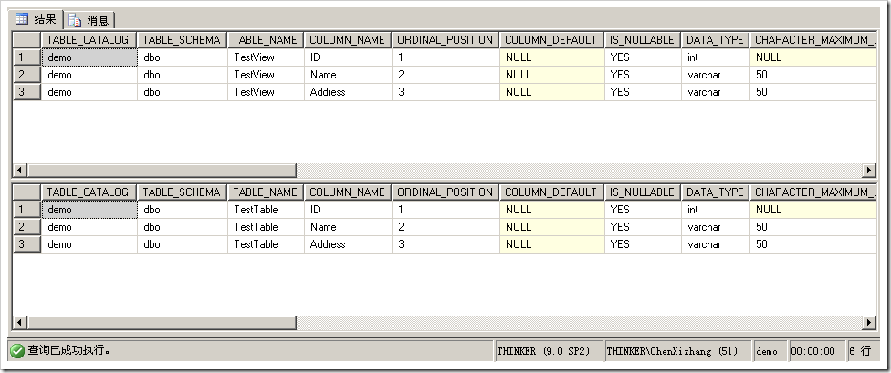
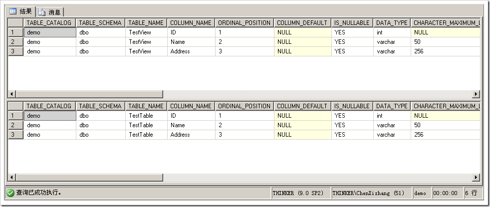
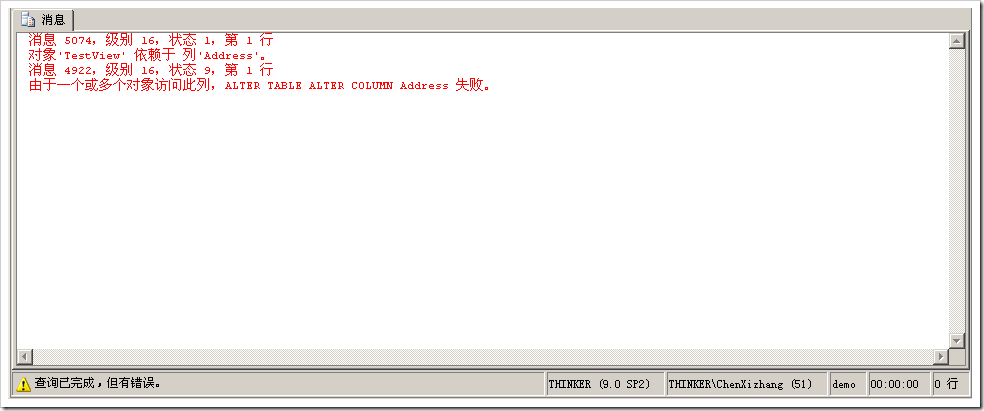

# 视图的架构刷新和绑定 
> 原文发表于 2009-06-19, 地址: http://www.cnblogs.com/chenxizhang/archive/2009/06/19/1506627.html 


在数据库设计过程中，我们经常会有这样的情况下

 1. 某个基础表会被多个视图或者存储过程引用

 2. 修改基础表的时候，我们必须小心翼翼地，因为不会有任何提示告诉我们，如果继续修改，会不会造成视图或者存储过程有问题

 3. 即便我们知道有问题，我们也没有办法去让视图和存储过程刷新得到表最新的信息

  

 要解决这个问题，我这篇文章来详细讲解一下有关的技术

  


```
--第一步：切换当前数据库上下文为master
USE MASTER
GO
--第二步：创建一个范例数据库
CREATE DATABASE demo
GO
--第三步：切换当前数据库上下文为demo
USE demo
GO

--第四步：创建一个范例表格，包含了三个字段
CREATE TABLE TestTable(ID INT,Name VARCHAR(50),Address VARCHAR(50))
GO

--第五步：创建一个视图
CREATE VIEW TestView
AS
SELECT ID,Name,Address FROM TestTable

--第六步：查看表和视图的架构信息
SELECT * FROM INFORMATION\_SCHEMA.COLUMNS WHERE TABLE\_NAME='TestView'
SELECT * FROM INFORMATION\_SCHEMA.COLUMNS WHERE TABLE\_NAME='TestTable'
--此时会发现视图三个字段与表的三个字段是一致的

```

```
[](http://images.cnblogs.com/cnblogs_com/chenxizhang/WindowsLiveWriter/af12c647a8e8_A055/image_6.png) 
```

```

--第七步：假设我们需要对表的字段进行修改，例如修改Address字段的长度为256
ALTER TABLE TestTable ALTER COLUMN Address VARCHAR(256)

--第八步：我们再来查看表和视图的架构信息
SELECT * FROM INFORMATION\_SCHEMA.COLUMNS WHERE TABLE\_NAME='TestView'
SELECT * FROM INFORMATION\_SCHEMA.COLUMNS WHERE TABLE\_NAME='TestTable'
--此时会发现，表中的Address已经修改为了256长度，而视图仍然是50.
--这种情况将导致针对视图的查询出现一些意外情况
--那么，怎么样让视图的架构信息得到刷新呢？
```

```
[](http://images.cnblogs.com/cnblogs_com/chenxizhang/WindowsLiveWriter/af12c647a8e8_A055/image_8.png)  
```


  
 


```
--第九步：通过系统存储过程刷新视图
EXEC SP\_REFRESHVIEW 'TestView'


--第十步：我们再来查看表和视图的架构信息
SELECT * FROM INFORMATION\_SCHEMA.COLUMNS WHERE TABLE\_NAME='TestView'
SELECT * FROM INFORMATION\_SCHEMA.COLUMNS WHERE TABLE\_NAME='TestTable'
--此时会发现，视图和表的架构信息是一致的

[](http://images.cnblogs.com/cnblogs_com/chenxizhang/WindowsLiveWriter/af12c647a8e8_A055/image_10.png) 
```

```

--第十一步：假设我们为了避免视图因为没有刷新而出现问题，希望限制TestTable的架构修改。该怎么办呢
--我们可以通过绑定架构的选项，将视图绑定到表的架构
ALTER VIEW TestView
WITH SCHEMABINDING
AS
SELECT ID,Name,Address FROM dbo.TestTable  --这里的表名字必须写两个部分，就是包含了架构名(dbo)


--第十二步：此时如果再次尝试修改TestTable就会得到错误提示.因为它已经被一个视图绑定了
ALTER TABLE TestTable ALTER COLUMN Address VARCHAR(2000)
```

```
[](http://images.cnblogs.com/cnblogs_com/chenxizhang/WindowsLiveWriter/af12c647a8e8_A055/image_12.png) 
```

.csharpcode, .csharpcode pre
{
 font-size: small;
 color: black;
 font-family: consolas, "Courier New", courier, monospace;
 background-color: #ffffff;
 /*white-space: pre;*/
}
.csharpcode pre { margin: 0em; }
.csharpcode .rem { color: #008000; }
.csharpcode .kwrd { color: #0000ff; }
.csharpcode .str { color: #006080; }
.csharpcode .op { color: #0000c0; }
.csharpcode .preproc { color: #cc6633; }
.csharpcode .asp { background-color: #ffff00; }
.csharpcode .html { color: #800000; }
.csharpcode .attr { color: #ff0000; }
.csharpcode .alt 
{
 background-color: #f4f4f4;
 width: 100%;
 margin: 0em;
}
.csharpcode .lnum { color: #606060; }


 


 


题外话：


* 如果想要刷新存储过程或者函数等其他编程呢？请参考sp\_refreshsqlmodule这个存储过程
* 如果要自动刷新所有的视图或者存储过程呢？


```
--第十三步：生成刷新所有视图的脚本
SELECT DISTINCT 'EXEC SP\_REFRESHVIEW ''' + name + '''' FROM sys.objects WHERE type='V'
```

.csharpcode, .csharpcode pre
{
 font-size: small;
 color: black;
 font-family: consolas, "Courier New", courier, monospace;
 background-color: #ffffff;
 /*white-space: pre;*/
}
.csharpcode pre { margin: 0em; }
.csharpcode .rem { color: #008000; }
.csharpcode .kwrd { color: #0000ff; }
.csharpcode .str { color: #006080; }
.csharpcode .op { color: #0000c0; }
.csharpcode .preproc { color: #cc6633; }
.csharpcode .asp { background-color: #ffff00; }
.csharpcode .html { color: #800000; }
.csharpcode .attr { color: #ff0000; }
.csharpcode .alt 
{
 background-color: #f4f4f4;
 width: 100%;
 margin: 0em;
}
.csharpcode .lnum { color: #606060; }

本文由作者：[陈希章](http://www.xizhang.com) 于 2009/6/19 11:24:06 
发布在：<http://www.cnblogs.com/chenxizhang/>  

本文版权归作者所有，可以转载，但未经作者同意必须保留此段声明，且在文章页面明显位置给出原文连接，否则保留追究法律责任的权利。   
