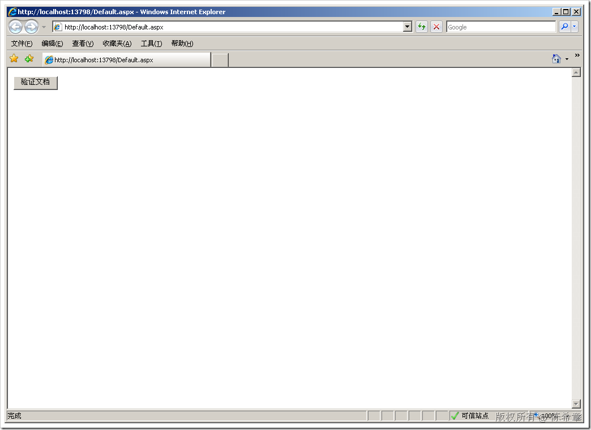
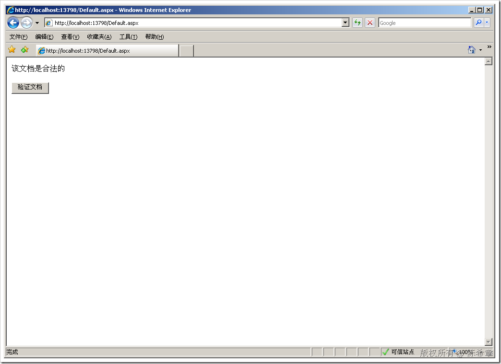
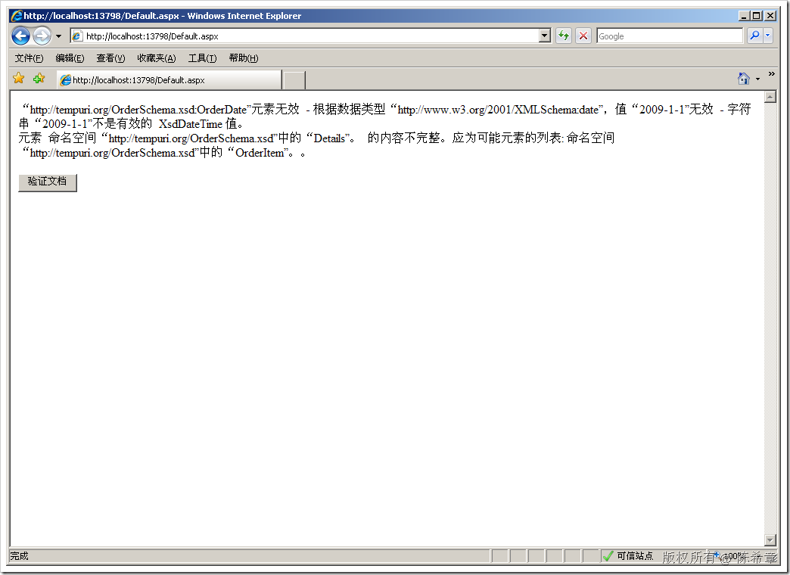
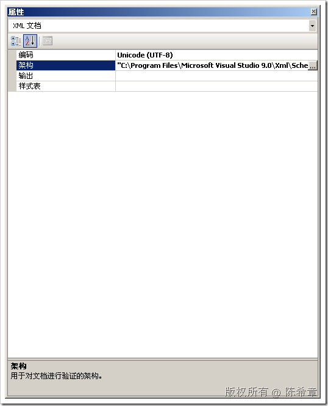
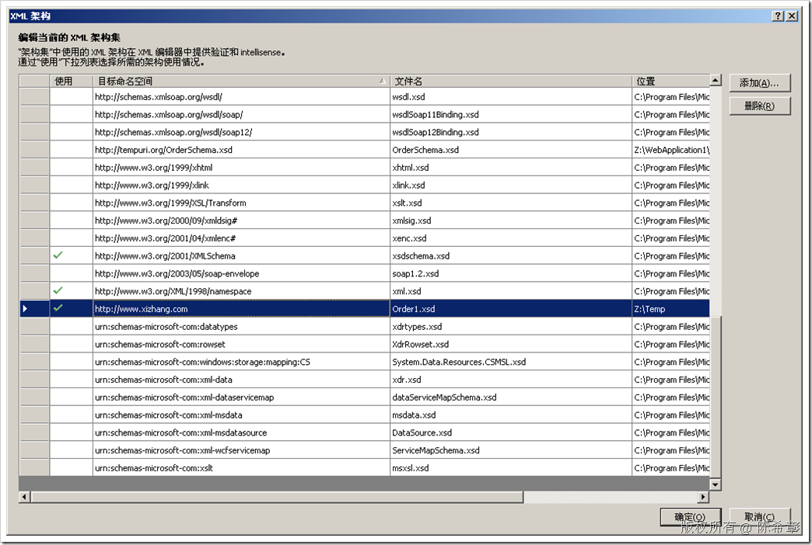
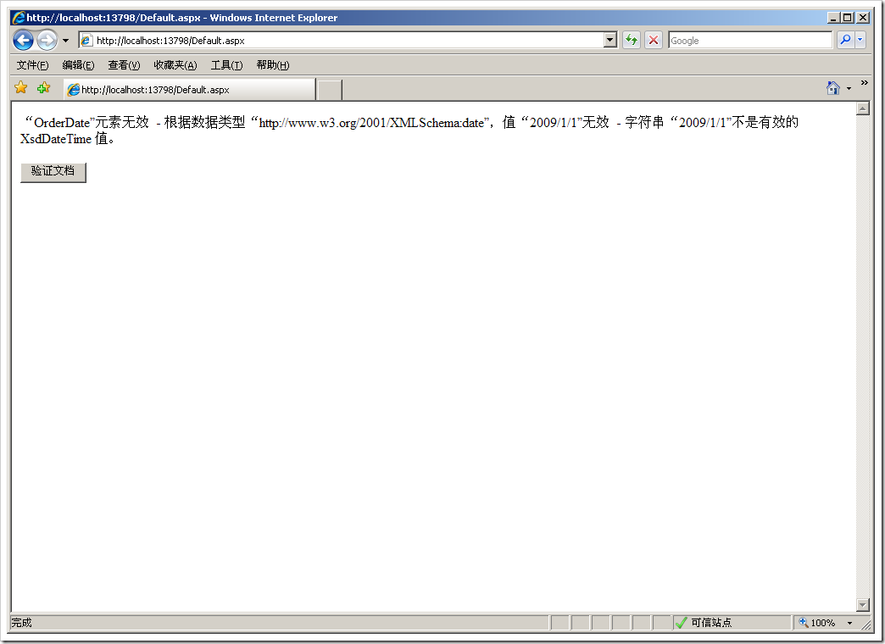

# 使用架构(XSD)验证XML文件 
> 原文发表于 2009-06-19, 地址: http://www.cnblogs.com/chenxizhang/archive/2009/06/19/1507121.html 


假使说XML是一个数据库，那么XSD就是这个数据库的结构。由此可见，XSD是如此重要，如果没有它，我们如何声明以及验证我们需要的XML数据文件的格式和合法性呢？那是不可能完成的任务，如果你将XML数据文件当作普通的文本文件去验证的话。

 我用下面一个例子来解释如何定义XSD以及如何使用它来验证

 1. 首先来看一下我们的数据文件


```
<?xml version="1.0" encoding="utf-8" ?>
<Order>
  <OrderID>10248</OrderID>
  <OrderDate>2009-01-01</OrderDate>
  <Details>
    <OrderItem>
      <ItemNumber>1</ItemNumber>
      <ProductID>1</ProductID>
      <Quantity>2</Quantity>
      <UnitPrice>20</UnitPrice>
    </OrderItem>
    <OrderItem>
      <ItemNumber>1</ItemNumber>
      <ProductID>1</ProductID>
      <Quantity>2</Quantity>
      <UnitPrice>20</UnitPrice>
    </OrderItem>
    <OrderItem>
      <ItemNumber>1</ItemNumber>
      <ProductID>1</ProductID>
      <Quantity>2</Quantity>
      <UnitPrice>20</UnitPrice>
    </OrderItem>
    <OrderItem>
      <ItemNumber>1</ItemNumber>
      <ProductID>1</ProductID>
      <Quantity>2</Quantity>
      <UnitPrice>20</UnitPrice>
    </OrderItem>
  </Details>
</Order>

```

.csharpcode, .csharpcode pre
{
 font-size: small;
 color: black;
 font-family: consolas, "Courier New", courier, monospace;
 background-color: #ffffff;
 /*white-space: pre;*/
}
.csharpcode pre { margin: 0em; }
.csharpcode .rem { color: #008000; }
.csharpcode .kwrd { color: #0000ff; }
.csharpcode .str { color: #006080; }
.csharpcode .op { color: #0000c0; }
.csharpcode .preproc { color: #cc6633; }
.csharpcode .asp { background-color: #ffff00; }
.csharpcode .html { color: #800000; }
.csharpcode .attr { color: #ff0000; }
.csharpcode .alt 
{
 background-color: #f4f4f4;
 width: 100%;
 margin: 0em;
}
.csharpcode .lnum { color: #606060; }

这是一个典型的订单数据。我们来分析一下这份文档


* 必须有OrderID，而且必须是整数型,integer
* 必须有OrderDate，而且必须是日期型，datetime
* 必须有至少一个OrderItem，这个Item必须包含四部分信息
+ ItemNumber，integer
+ ProductID，integer
+ Quantity,double
+ UnitPrice,double


 


2. 我们来定义一个XSD文件。有关XSD的知识很多，有兴趣的朋友可以参考下面这个链接


[http://www.w3school.com.cn/schema/index.asp](http://www.w3school.com.cn/schema/index.asp "http://www.w3school.com.cn/schema/index.asp")


```
<?xml version="1.0" encoding="utf-8"?>
<xs:schema id="OrderSchema"
    targetNamespace="http://tempuri.org/OrderSchema.xsd"
    elementFormDefault="qualified"
    xmlns="http://tempuri.org/OrderSchema.xsd"
    xmlns:mstns="http://tempuri.org/OrderSchema.xsd"
    xmlns:xs="http://www.w3.org/2001/XMLSchema"
>

  <xs:element name="Order">
    <xs:complexType>
      <xs:sequence>
        <xs:element name="OrderID" type="xs:integer"></xs:element>
        <xs:element name="OrderDate" type="xs:date"></xs:element>
        <xs:element name="Details">
          <xs:complexType>
            <xs:group ref="OrderItemGroup" minOccurs="1" maxOccurs="unbounded"></xs:group>
          </xs:complexType>
        </xs:element>
      </xs:sequence>
    </xs:complexType>
  </xs:element>

  <!-- 定义一个OrderItem的复杂类型 -->
  <xs:group name="OrderItemGroup">
    <xs:sequence>
      <xs:element name="OrderItem">
        <xs:complexType>
          <xs:sequence>
            <xs:element name="ItemNumber" type="xs:integer"></xs:element>
            <xs:element name="ProductID" type="xs:integer"></xs:element>
            <xs:element name="Quantity" type="xs:double"></xs:element>
            <xs:element name="UnitPrice" type="xs:double"></xs:element>
          </xs:sequence>
        </xs:complexType>
      </xs:element>
    </xs:sequence>
  </xs:group>
</xs:schema>
```

```
 
```

```
【备注】这个架构也可以通过Visual Studio的“XML”菜单=》“创建架构”得到。

```


.csharpcode, .csharpcode pre
{
 font-size: small;
 color: black;
 font-family: consolas, "Courier New", courier, monospace;
 background-color: #ffffff;
 /*white-space: pre;*/
}
.csharpcode pre { margin: 0em; }
.csharpcode .rem { color: #008000; }
.csharpcode .kwrd { color: #0000ff; }
.csharpcode .str { color: #006080; }
.csharpcode .op { color: #0000c0; }
.csharpcode .preproc { color: #cc6633; }
.csharpcode .asp { background-color: #ffff00; }
.csharpcode .html { color: #800000; }
.csharpcode .attr { color: #ff0000; }
.csharpcode .alt 
{
 background-color: #f4f4f4;
 width: 100%;
 margin: 0em;
}
.csharpcode .lnum { color: #606060; }

3. 下面来看看如何使用该架构对数据文件进行验证


.NET Framework并没有提供简单易行的验证方法，我们需要写一些代码


```
<%@ Page Language="C#" AutoEventWireup="true" CodeBehind="Default.aspx.cs" Inherits="WebApplication1.\_Default"%>

<!DOCTYPE html PUBLIC "-//W3C//DTD XHTML 1.0 Transitional//EN" "http://www.w3.org/TR/xhtml1/DTD/xhtml1-transitional.dtd">

<html xmlns="http://www.w3.org/1999/xhtml" >
<head runat="server">
    <title></title>
</head>
<body>
    <form id="form1" runat="server">
    <div>
    
     <asp:Button ID="btValidateFile" runat="server" Text="验证文档" OnClick="ValidateFile" />
    </div>
    </form>
</body>
</html>

```

.csharpcode, .csharpcode pre
{
 font-size: small;
 color: black;
 font-family: consolas, "Courier New", courier, monospace;
 background-color: #ffffff;
 /*white-space: pre;*/
}
.csharpcode pre { margin: 0em; }
.csharpcode .rem { color: #008000; }
.csharpcode .kwrd { color: #0000ff; }
.csharpcode .str { color: #006080; }
.csharpcode .op { color: #0000c0; }
.csharpcode .preproc { color: #cc6633; }
.csharpcode .asp { background-color: #ffff00; }
.csharpcode .html { color: #800000; }
.csharpcode .attr { color: #ff0000; }
.csharpcode .alt 
{
 background-color: #f4f4f4;
 width: 100%;
 margin: 0em;
}
.csharpcode .lnum { color: #606060; }

代码文件


```
using System;
using System.Text;
using System.Xml;

namespace WebApplication1
{
    public partial class \_Default : System.Web.UI.Page
    {
        protected void Page\_Load(object sender, EventArgs e)
        {

        }
        StringBuilder sb = null;
        protected void ValidateFile(object sender, EventArgs e)
        {
            string dataFile = Server.MapPath("Order.xml");
            string schemaFile = Server.MapPath("OrderSchema.xsd");
            string namespaceUrl = "http://tempuri.org/OrderSchema.xsd";

            XmlReaderSettings settings = new XmlReaderSettings();
            settings.ValidationType = ValidationType.Schema;
            settings.Schemas.Add(namespaceUrl, schemaFile);
            settings.ValidationEventHandler += new System.Xml.Schema.ValidationEventHandler(settings\_ValidationEventHandler);

            string errorMessage="这不是一个合乎规范的数据文件";
            sb = new StringBuilder();

            XmlReader reader = XmlReader.Create(dataFile, settings);
            try
            {
                reader.MoveToContent();
                while (reader.Read())
                {
                    if (reader.NodeType == XmlNodeType.Document && reader.NamespaceURI != namespaceUrl)
                    {
                        Response.Write(errorMessage);
                        break;
                    }
                }
            }
            catch (XmlException ex)
            {
                sb.AppendFormat("{0}<br />", ex.Message);
            }
            finally
            {
                reader.Close();
            }

            if (sb.Length == 0)
                Response.Write("该文档是合法的");
            else
                Response.Write(sb.ToString());
        }

        void settings\_ValidationEventHandler(object sender, System.Xml.Schema.ValidationEventArgs e)
        {
            sb.AppendFormat("{0}<br />", e.Message);
        }
    }
}

```

.csharpcode, .csharpcode pre
{
 font-size: small;
 color: black;
 font-family: consolas, "Courier New", courier, monospace;
 background-color: #ffffff;
 /*white-space: pre;*/
}
.csharpcode pre { margin: 0em; }
.csharpcode .rem { color: #008000; }
.csharpcode .kwrd { color: #0000ff; }
.csharpcode .str { color: #006080; }
.csharpcode .op { color: #0000c0; }
.csharpcode .preproc { color: #cc6633; }
.csharpcode .asp { background-color: #ffff00; }
.csharpcode .html { color: #800000; }
.csharpcode .attr { color: #ff0000; }
.csharpcode .alt 
{
 background-color: #f4f4f4;
 width: 100%;
 margin: 0em;
}
.csharpcode .lnum { color: #606060; }

准备就绪之后，我们可以立即按下F5键进行调试。因为现在文档确实是合法的，所以点击按钮之后，会输出一个正确的消息。


[](http://images.cnblogs.com/cnblogs_com/chenxizhang/WindowsLiveWriter/XSDXML_12191/image_6.png) [](http://images.cnblogs.com/cnblogs_com/chenxizhang/WindowsLiveWriter/XSDXML_12191/image_8.png) 


我们故意将文档改成下面这样子


```
<?xml version="1.0" encoding="utf-8" ?>
<Order xmlns="http://tempuri.org/OrderSchema.xsd">
  <OrderID>1</OrderID>
  <OrderDate>2009-1-1</OrderDate>
  <Details>
  </Details>
</Order> 
```

```
我们没有提供OrderItem,同时，OrderDate的格式是不正确的。（XML里面的日期必须是类似这样的格式：YYYY-MM-DD)
```

```
此时我们去点击页面中的按钮，就会发现下面这样的错误提示
```

```
[](http://images.cnblogs.com/cnblogs_com/chenxizhang/WindowsLiveWriter/XSDXML_12191/image_10.png) 
```

```
 
```

```
小结一下：我们可以通过XMLReader的读取，验证XML文档的合法性。关键点在于我们指定给这个XMLReader一些Settings
```

```
这些代码还可以封装一下，以免更好的重复利用。
```

```
之前有一位XML方面的MVP也专门写了一个组件，可以方便地做验证。请参考[http://msdn.microsoft.com/zh-cn/library/aa468554.aspx](http://msdn.microsoft.com/zh-cn/library/aa468554.aspx "http://msdn.microsoft.com/zh-cn/library/aa468554.aspx")
```

.csharpcode, .csharpcode pre
{
 font-size: small;
 color: black;
 font-family: consolas, "Courier New", courier, monospace;
 background-color: #ffffff;
 /*white-space: pre;*/
}
.csharpcode pre { margin: 0em; }
.csharpcode .rem { color: #008000; }
.csharpcode .kwrd { color: #0000ff; }
.csharpcode .str { color: #006080; }
.csharpcode .op { color: #0000c0; }
.csharpcode .preproc { color: #cc6633; }
.csharpcode .asp { background-color: #ffff00; }
.csharpcode .html { color: #800000; }
.csharpcode .attr { color: #ff0000; }
.csharpcode .alt 
{
 background-color: #f4f4f4;
 width: 100%;
 margin: 0em;
}
.csharpcode .lnum { color: #606060; }

 


4. 对于有命名空间的情况，则会复杂很多


我已经多次提到如果有命名空间的情况，XML的操作（包括验证和转换等等）都会变得更加复杂。但仍然需要面对这个现实


我们假设，XML数据文件是类似下面的格式


```
<?xml version="1.0" encoding="utf-8" ?>
<Order xmlns:d="http://www.xizhang.com">
  <d:OrderID>1</d:OrderID>
  <OrderDate>2009-01-01</OrderDate>
  <Details>
    <OrderItem>
      <ItemNumber>1</ItemNumber>
      <ProductID>2</ProductID>
      <Quantity>3</Quantity>
      <UnitPrice>3</UnitPrice>
    </OrderItem>
    <OrderItem>
      <ItemNumber>1</ItemNumber>
      <ProductID>2</ProductID>
      <Quantity>3</Quantity>
      <UnitPrice>3</UnitPrice>
    </OrderItem>
    <OrderItem>
      <ItemNumber>1</ItemNumber>
      <ProductID>2</ProductID>
      <Quantity>3</Quantity>
      <UnitPrice>3</UnitPrice>
    </OrderItem>
  </Details>
</Order> 
```


.csharpcode, .csharpcode pre
{
 font-size: small;
 color: black;
 font-family: consolas, "Courier New", courier, monospace;
 background-color: #ffffff;
 /*white-space: pre;*/
}
.csharpcode pre { margin: 0em; }
.csharpcode .rem { color: #008000; }
.csharpcode .kwrd { color: #0000ff; }
.csharpcode .str { color: #006080; }
.csharpcode .op { color: #0000c0; }
.csharpcode .preproc { color: #cc6633; }
.csharpcode .asp { background-color: #ffff00; }
.csharpcode .html { color: #800000; }
.csharpcode .attr { color: #ff0000; }
.csharpcode .alt 
{
 background-color: #f4f4f4;
 width: 100%;
 margin: 0em;
}
.csharpcode .lnum { color: #606060; }


与之前的文档相比，这个文档多了一个命名空间的信息，在OrderID上面，我们加上了命名空间的限定


我们通过点击菜单：“XML”=》“创建架构”来生成架构。它会生成两个文件，分别如下


Order.xsd


```
<?xml version="1.0" encoding="utf-8"?>
<xs:schema **xmlns:d="http://www.xizhang.com"** attributeFormDefault="unqualified" elementFormDefault="qualified" xmlns:xs="http://www.w3.org/2001/XMLSchema">
 **<xs:import namespace="http://www.xizhang.com" />**
  <xs:element name="Order">
    <xs:complexType>
      <xs:sequence>
        **<xs:element ref="d:OrderID" />**
        <xs:element name="OrderDate" type="xs:date" />
        <xs:element name="Details">
          <xs:complexType>
            <xs:sequence>
              <xs:element maxOccurs="unbounded" name="OrderItem">
                <xs:complexType>
                  <xs:sequence>
                    <xs:element name="ItemNumber" type="xs:unsignedByte" />
                    <xs:element name="ProductID" type="xs:unsignedByte" />
                    <xs:element name="Quantity" type="xs:unsignedByte" />
                    <xs:element name="UnitPrice" type="xs:unsignedByte" />
                  </xs:sequence>
                </xs:complexType>
              </xs:element>
            </xs:sequence>
          </xs:complexType>
        </xs:element>
      </xs:sequence>
    </xs:complexType>
  </xs:element>
</xs:schema>
```

.csharpcode, .csharpcode pre
{
 font-size: small;
 color: black;
 font-family: consolas, "Courier New", courier, monospace;
 background-color: #ffffff;
 /*white-space: pre;*/
}
.csharpcode pre { margin: 0em; }
.csharpcode .rem { color: #008000; }
.csharpcode .kwrd { color: #0000ff; }
.csharpcode .str { color: #006080; }
.csharpcode .op { color: #0000c0; }
.csharpcode .preproc { color: #cc6633; }
.csharpcode .asp { background-color: #ffff00; }
.csharpcode .html { color: #800000; }
.csharpcode .attr { color: #ff0000; }
.csharpcode .alt 
{
 background-color: #f4f4f4;
 width: 100%;
 margin: 0em;
}
.csharpcode .lnum { color: #606060; }

 


还有一个Order1.xsd


```
<?xml version="1.0" encoding="utf-8"?>
<xs:schema xmlns:tns="http://www.xizhang.com" attributeFormDefault="unqualified" 
```

```
elementFormDefault="qualified" **targetNamespace="http://www.xizhang.com"** xmlns:xs="http://www.w3.org/2001/XMLSchema">
  <xs:element name="OrderID" type="xs:unsignedByte" />
</xs:schema>
```

.csharpcode, .csharpcode pre
{
 font-size: small;
 color: black;
 font-family: consolas, "Courier New", courier, monospace;
 background-color: #ffffff;
 /*white-space: pre;*/
}
.csharpcode pre { margin: 0em; }
.csharpcode .rem { color: #008000; }
.csharpcode .kwrd { color: #0000ff; }
.csharpcode .str { color: #006080; }
.csharpcode .op { color: #0000c0; }
.csharpcode .preproc { color: #cc6633; }
.csharpcode .asp { background-color: #ffff00; }
.csharpcode .html { color: #800000; }
.csharpcode .attr { color: #ff0000; }
.csharpcode .alt 
{
 background-color: #f4f4f4;
 width: 100%;
 margin: 0em;
}
.csharpcode .lnum { color: #606060; }


我们注意到，在Order.xsd中，用了一个ref的方式，实现了一个元素的引用。其他它是引用了Order1.xsd中的OrderID元素。


但是，我们怎么知道是这样的引用关系呢？我们并没有在Order.XSD中看到这个关系呢


其实是有的。你可以在Order.xsd文件中，按下F4键，查看属性


[](http://images.cnblogs.com/cnblogs_com/chenxizhang/WindowsLiveWriter/XSDXML_12191/image_12.png) 


点击架构右侧的那个按钮


[](http://images.cnblogs.com/cnblogs_com/chenxizhang/WindowsLiveWriter/XSDXML_12191/image_14.png) 


下面我们来测试一下，带有命名空间的情况下如何验证


* 首先，你应该选中Order.xsd和Order1.xsd，并将它们保存到项目根目录。因为他们默认是被创建在临时文件夹的
* 为Order.xsd添加一个TargetNamespace


```
<?xml version="1.0" encoding="utf-8"?>
<xs:schema xmlns:d="http://www.xizhang.com" attributeFormDefault="unqualified" elementFormDefault="qualified" xmlns:xs=<http://www.w3.org/2001/XMLSchema> 
```

```
**targetNamespace="http://www.xizhang.com"**>
  <xs:import namespace="http://www.xizhang.com" />
  <xs:element name="Order">
    <xs:complexType>
      <xs:sequence>
        <xs:element ref="d:OrderID" />
        <xs:element name="OrderDate" type="xs:date" />
        <xs:element name="Details">
          <xs:complexType>
            <xs:sequence>
              <xs:element maxOccurs="unbounded" name="OrderItem">
                <xs:complexType>
                  <xs:sequence>
                    <xs:element name="ItemNumber" type="xs:unsignedByte" />
                    <xs:element name="ProductID" type="xs:unsignedByte" />
                    <xs:element name="Quantity" type="xs:unsignedByte" />
                    <xs:element name="UnitPrice" type="xs:unsignedByte" />
                  </xs:sequence>
                </xs:complexType>
              </xs:element>
            </xs:sequence>
          </xs:complexType>
        </xs:element>
      </xs:sequence>
    </xs:complexType>
  </xs:element>
</xs:schema>
```

.csharpcode, .csharpcode pre
{
 font-size: small;
 color: black;
 font-family: consolas, "Courier New", courier, monospace;
 background-color: #ffffff;
 /*white-space: pre;*/
}
.csharpcode pre { margin: 0em; }
.csharpcode .rem { color: #008000; }
.csharpcode .kwrd { color: #0000ff; }
.csharpcode .str { color: #006080; }
.csharpcode .op { color: #0000c0; }
.csharpcode .preproc { color: #cc6633; }
.csharpcode .asp { background-color: #ffff00; }
.csharpcode .html { color: #800000; }
.csharpcode .attr { color: #ff0000; }
.csharpcode .alt 
{
 background-color: #f4f4f4;
 width: 100%;
 margin: 0em;
}
.csharpcode .lnum { color: #606060; }

 


* 修改一下代码


 


```
            string dataFile = Server.MapPath("Order.xml");
            string schemaFile = Server.MapPath("Order.xsd");
            string namespaceUrl = "http://www.xizhang.com";

            XmlReaderSettings settings = new XmlReaderSettings();
            settings.ValidationType = ValidationType.Schema;
            settings.Schemas.Add(namespaceUrl, schemaFile);
 **settings.Schemas.Add(namespaceUrl, Server.MapPath("Order1.xsd"));//这里要加第二个文件**
```

```
 
```

```
 
```

```
[](http://images.cnblogs.com/cnblogs_com/chenxizhang/WindowsLiveWriter/XSDXML_12191/image_16.png) 
```

```
同样道理，我们故意去修改一下数据文件
```

```
<?xml version="1.0" encoding="utf-8" ?>
<Order xmlns:d="http://www.xizhang.com">
  <d:OrderID>1</d:OrderID>
 **<OrderDate>2009/1/1</OrderDate>**
  <Details>
    <OrderItem>
      <ItemNumber>1</ItemNumber>
      <ProductID>2</ProductID>
      <Quantity>3</Quantity>
      <UnitPrice>3</UnitPrice>
    </OrderItem>
    <OrderItem>
      <ItemNumber>1</ItemNumber>
      <ProductID>2</ProductID>
      <Quantity>3</Quantity>
      <UnitPrice>3</UnitPrice>
    </OrderItem>
    <OrderItem>
      <ItemNumber>1</ItemNumber>
      <ProductID>2</ProductID>
      <Quantity>3</Quantity>
      <UnitPrice>3</UnitPrice>
    </OrderItem>
  </Details>
</Order> 
```

.csharpcode, .csharpcode pre
{
 font-size: small;
 color: black;
 font-family: consolas, "Courier New", courier, monospace;
 background-color: #ffffff;
 /*white-space: pre;*/
}
.csharpcode pre { margin: 0em; }
.csharpcode .rem { color: #008000; }
.csharpcode .kwrd { color: #0000ff; }
.csharpcode .str { color: #006080; }
.csharpcode .op { color: #0000c0; }
.csharpcode .preproc { color: #cc6633; }
.csharpcode .asp { background-color: #ffff00; }
.csharpcode .html { color: #800000; }
.csharpcode .attr { color: #ff0000; }
.csharpcode .alt 
{
 background-color: #f4f4f4;
 width: 100%;
 margin: 0em;
}
.csharpcode .lnum { color: #606060; }


```
[](http://images.cnblogs.com/cnblogs_com/chenxizhang/WindowsLiveWriter/XSDXML_12191/image_18.png) 
```

.csharpcode, .csharpcode pre
{
 font-size: small;
 color: black;
 font-family: consolas, "Courier New", courier, monospace;
 background-color: #ffffff;
 /*white-space: pre;*/
}
.csharpcode pre { margin: 0em; }
.csharpcode .rem { color: #008000; }
.csharpcode .kwrd { color: #0000ff; }
.csharpcode .str { color: #006080; }
.csharpcode .op { color: #0000c0; }
.csharpcode .preproc { color: #cc6633; }
.csharpcode .asp { background-color: #ffff00; }
.csharpcode .html { color: #800000; }
.csharpcode .attr { color: #ff0000; }
.csharpcode .alt 
{
 background-color: #f4f4f4;
 width: 100%;
 margin: 0em;
}
.csharpcode .lnum { color: #606060; }


小结：


这样我们就完成了对包含有命名空间的XML数据文件的验证工作。这个操作需要两个XML架构文件，他们之间形成一个引用关系。如果有多个不同的命名空间，则可能会有多个辅助的架构文件。


 


需要注意的是，在Order.xsd中，最好是用下面的语法去定义schemaLocation


<xs:import namespace="<http://www.xizhang.com"> schemaLocation="Order1.xsd" />


如果这样定义了，代码中就可以省略掉添加第二个架构文件的代码


//settings.Schemas.Add(namespaceUrl, Server.MapPath("Order1.xsd"));//这里要加第二个文件


本文由作者：[陈希章](http://www.xizhang.com) 于 2009/6/19 23:17:33 
发布在：<http://www.cnblogs.com/chenxizhang/>  

本文版权归作者所有，可以转载，但未经作者同意必须保留此段声明，且在文章页面明显位置给出原文连接，否则保留追究法律责任的权利。   

更多博客文章，以及作者对于博客引用方面的完整声明以及合作方面的政策，请参考以下站点：[陈希章的博客中心](http://www.xizhang.com/blog.htm)
