# 在SSIS中使用XML任务处理XML数据或文档 
> 原文发表于 2009-06-20, 地址: http://www.cnblogs.com/chenxizhang/archive/2009/06/20/1507287.html 


上一篇，我们讲到了通过Web服务任务将异构系统中的数据保存为一个XML文件。它们看起来是这样

 [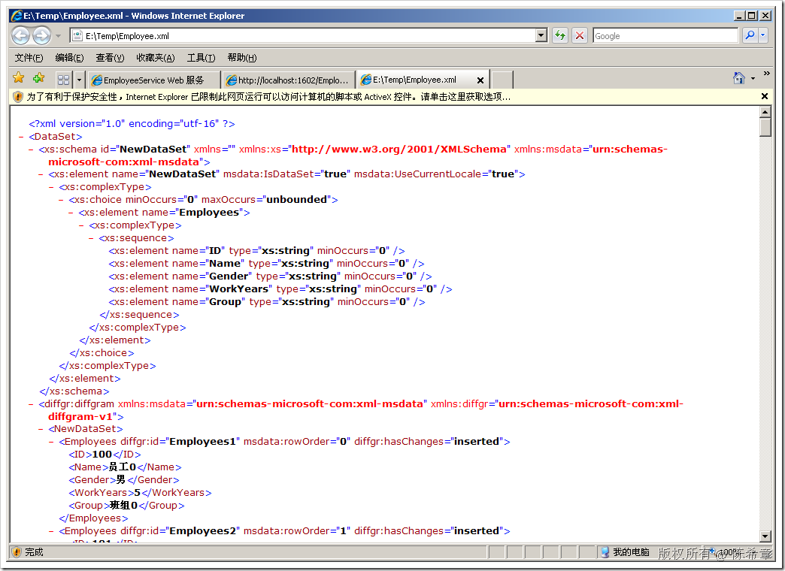](http://images.cnblogs.com/cnblogs_com/chenxizhang/WindowsLiveWriter/SSISXMLXML_A113/image_2.png) 

 但问题在于，我们如何处理该XML文件，并将其提交到我们的数据库中去呢？我们这一篇文章会用到XML任务和XML源对其进行转换和加载

 1. 首先，拖拽一个“XML任务”到控制流中，并且设置好它与“Web服务任务”的优先约束

 [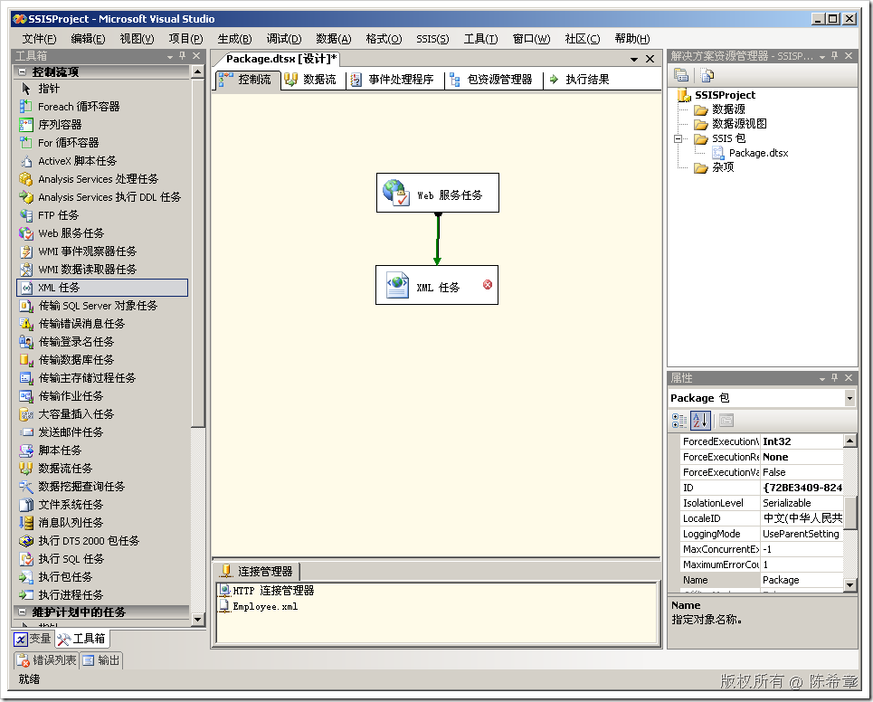](http://images.cnblogs.com/cnblogs_com/chenxizhang/WindowsLiveWriter/SSISXMLXML_A113/image_4.png) 

 2. 编辑该任务（右键=》“编辑”

 [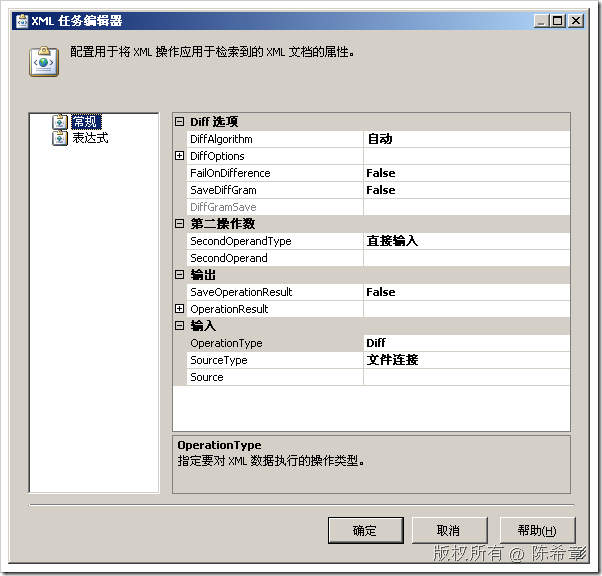](http://images.cnblogs.com/cnblogs_com/chenxizhang/WindowsLiveWriter/SSISXMLXML_A113/image_6.png) 

 XML任务是很强大的，它可以做如下的事情

 * 验证文档
* 比较文档
* 合并文档
* 转换文档
* 查找数据或者运算

 这五个操作分别就对应了几个不同的OperationType

 [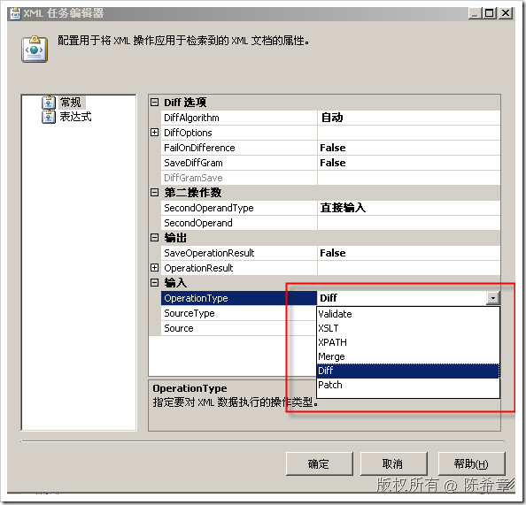](http://images.cnblogs.com/cnblogs_com/chenxizhang/WindowsLiveWriter/SSISXMLXML_A113/image_8.png) 

 我们这里选择XSLT,因为我们想对数据进行一些转换，现在下载下来的数据太复杂了：有命名空间，而且有很多没必要的元素。

 [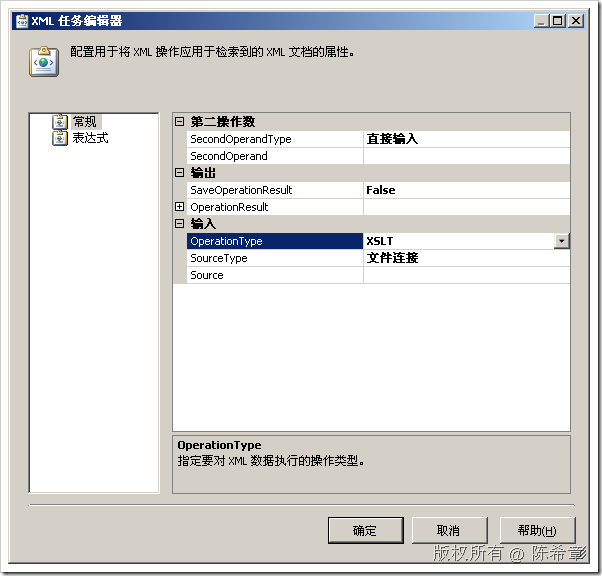](http://images.cnblogs.com/cnblogs_com/chenxizhang/WindowsLiveWriter/SSISXMLXML_A113/image_10.png) 

 在继续操作之前，我们需要准备一个XSLT文件。

  

 3. 编写一个XSLT文件

 [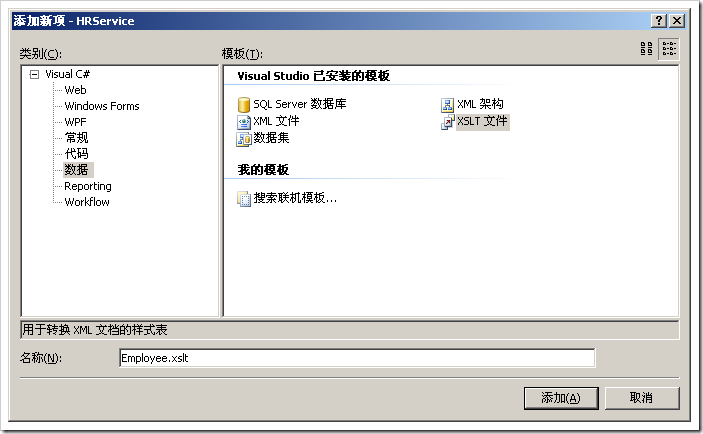](http://images.cnblogs.com/cnblogs_com/chenxizhang/WindowsLiveWriter/SSISXMLXML_A113/image_14.png) 


```
<?xml version="1.0" encoding="utf-8"?>
<xsl:stylesheet version="1.0" xmlns:xsl="http://www.w3.org/1999/XSL/Transform"
    xmlns:msxsl="urn:schemas-microsoft-com:xslt" exclude-result-prefixes="msxsl" 
                xmlns:diffgr="urn:schemas-microsoft-com:xml-diffgram-v1"
><!--这里添加一个特殊的命名空间，因为来源XML文件中有这个名称-->
    <xsl:output method="xml" indent="yes"/><!--我们仍然输出为XML-->

    <xsl:template match="/DataSet/diffgr:diffgram/NewDataSet">
      <Employees><!--这是我们自定义输出文档里面的根元素-->
        <xsl:for-each select="Employees">
        <!--循环/DataSet/diffgr:diffgram/NewDataSet下面所有的Employees元素-->
          <Employee>
            <ID>
              <xsl:value-of select="ID"/>
            </ID>
            <Name>
              <xsl:value-of select="Name"/>
            </Name>
            <Gender>
              <xsl:value-of select="Gender"/>
            </Gender>
            <WorkYears>
              <xsl:value-of select="WorkYears"/>
            </WorkYears>
            <Group>
              <xsl:value-of select="Group"/>
            </Group>
          </Employee>
        </xsl:for-each>
      </Employees>
    </xsl:template>
</xsl:stylesheet>
```

```
将该文件保存到一个目录，例如E:\Temp目录
```

```
 
```

```
4. 使用该文件对Employee.XML进行转换。
```

```
我们回到SSIS包的设计器中。
```

```
[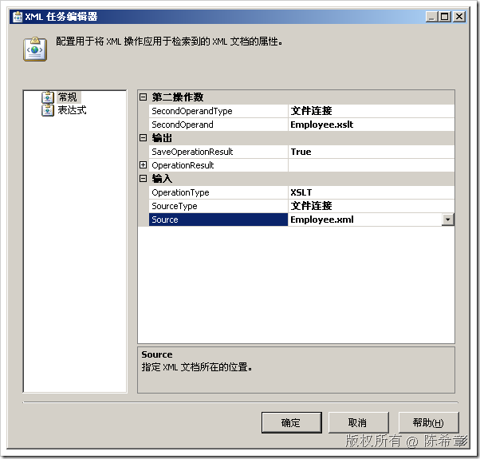](http://images.cnblogs.com/cnblogs_com/chenxizhang/WindowsLiveWriter/SSISXMLXML_A113/image_26.png) 
```

```
【注意】Source这里设置的是数据来源文件
```

```
 
```

```
将“SaveOperationResult”设置为true
```

```
展开“OperationResult”这个节点
```

```
 
```

```
设置Destination
```

```
[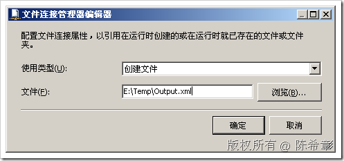](http://images.cnblogs.com/cnblogs_com/chenxizhang/WindowsLiveWriter/SSISXMLXML_A113/image_22.png) 
```

点击“确定”


在“第二操作数”处，选择“SecondOperatedType”为文件连接，并选择SecondOperand为“Employee.xslt”。其实就是我们的转换文件


[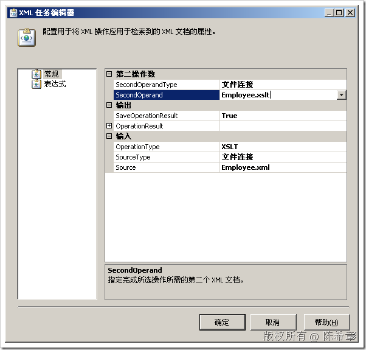](http://images.cnblogs.com/cnblogs_com/chenxizhang/WindowsLiveWriter/SSISXMLXML_A113/image_28.png) 


 


点击“确定”


 


5. 调试该任务。选中它，右键，执行任务


[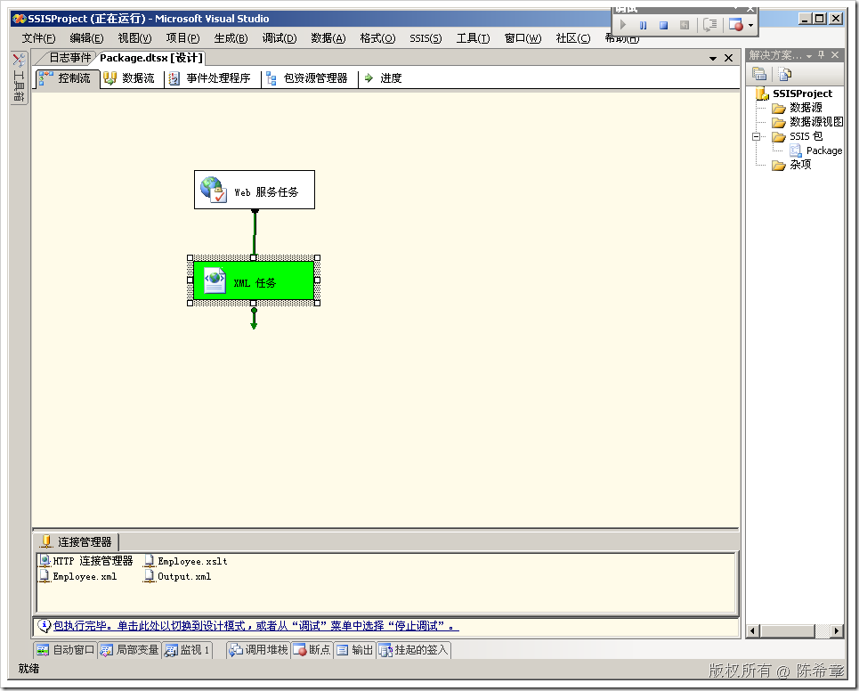](http://images.cnblogs.com/cnblogs_com/chenxizhang/WindowsLiveWriter/SSISXMLXML_A113/image_30.png) 


 


6. 检查输出文件。我们可以去打开那个Output.xml。这个文件显然更加易于理解和处理了


[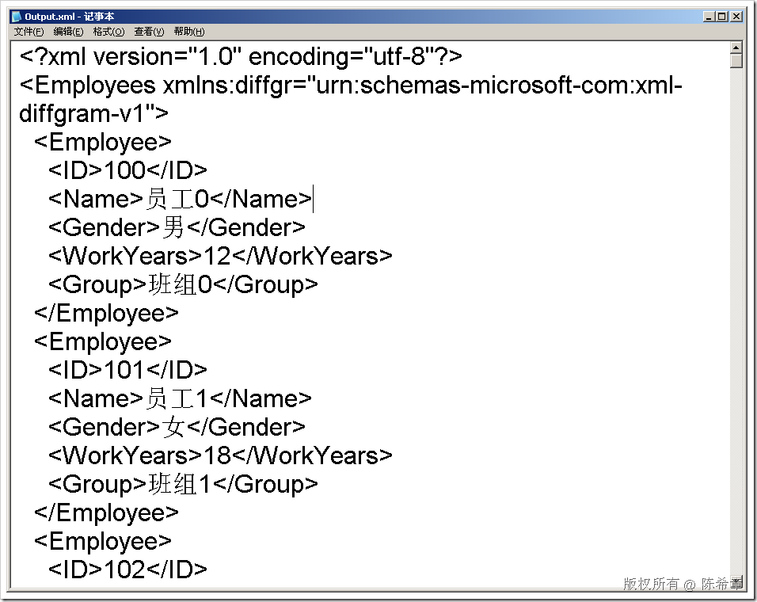](http://images.cnblogs.com/cnblogs_com/chenxizhang/WindowsLiveWriter/SSISXMLXML_A113/image_32.png) 


  
结语：这一篇，我们通过XML任务对一个XML数据文件进行了转换。那么怎么把这个数据最终提交打数据库去呢？下一篇将介绍使用XML源来实现该需求


本文由作者：[陈希章](http://www.xizhang.com) 于 2009/6/20 11:54:49 
发布在：<http://www.cnblogs.com/chenxizhang/>  

本文版权归作者所有，可以转载，但未经作者同意必须保留此段声明，且在文章页面明显位置给出原文连接，否则保留追究法律责任的权利。   
