# 在SSIS中使用XML源加载数据 
> 原文发表于 2009-06-20, 地址: http://www.cnblogs.com/chenxizhang/archive/2009/06/20/1507293.html 

上一篇我们讲到了如何实现XML文档的转换。那么如何将这些规范的数据导入到数据库中去呢？本节我们讲解使用XML源来实现该需求

 1. 添加数据流任务，并设置其与XML任务的优先约束

 [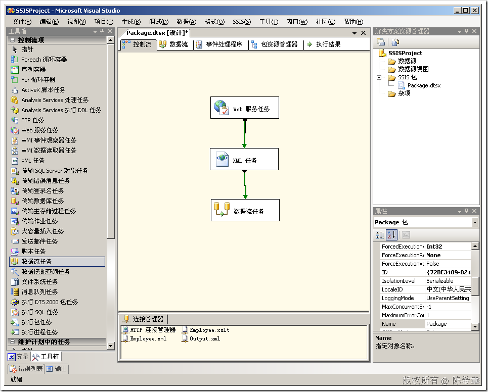](http://images.cnblogs.com/cnblogs_com/chenxizhang/WindowsLiveWriter/SSISXML_AB93/image_2.png) 

 2. 编辑数据流任务

 双击该任务

 [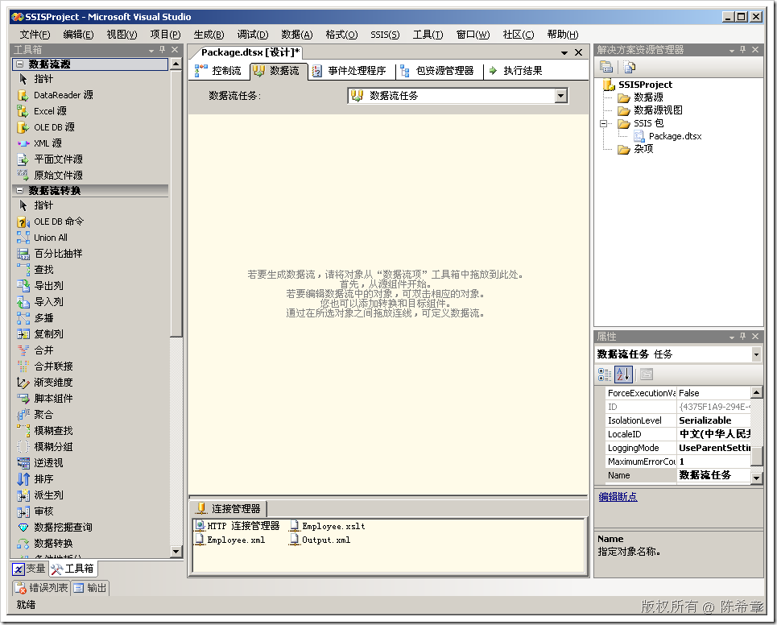](http://images.cnblogs.com/cnblogs_com/chenxizhang/WindowsLiveWriter/SSISXML_AB93/image_4.png) 

 3. 添加XML源

 [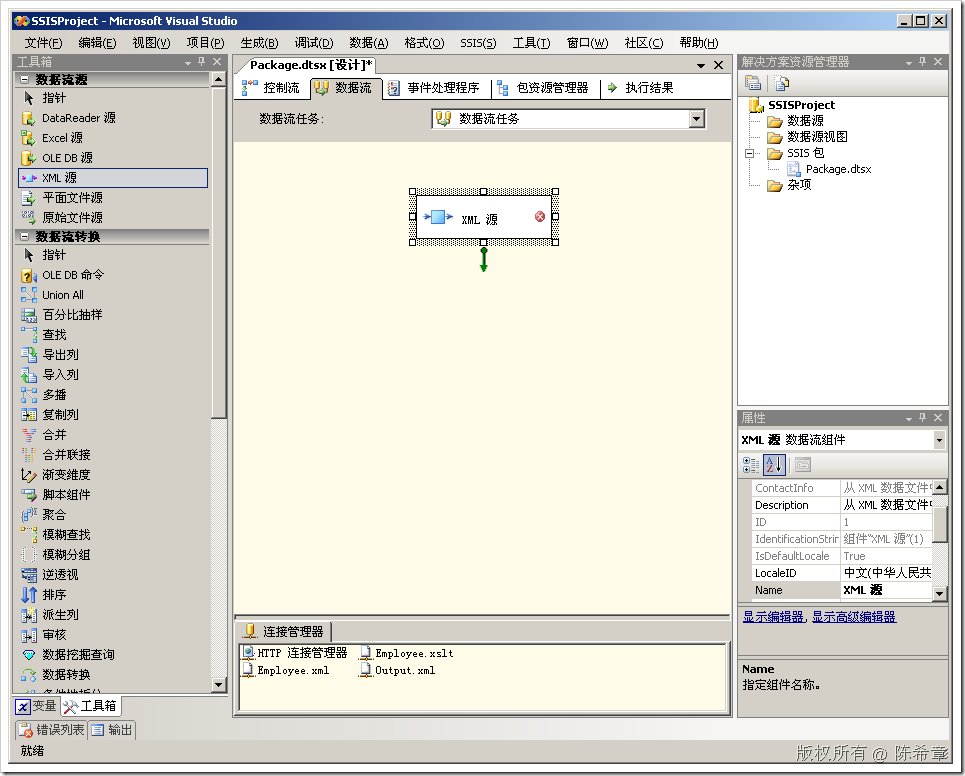](http://images.cnblogs.com/cnblogs_com/chenxizhang/WindowsLiveWriter/SSISXML_AB93/image_6.png) 

 4. 编辑该组件

 [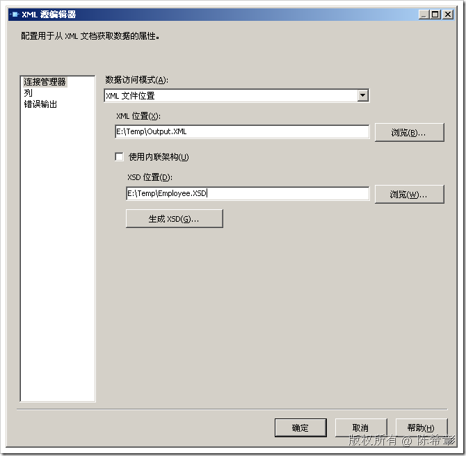](http://images.cnblogs.com/cnblogs_com/chenxizhang/WindowsLiveWriter/SSISXML_AB93/image_8.png) 

 点击“生成XSD”。然后点击“列”

 [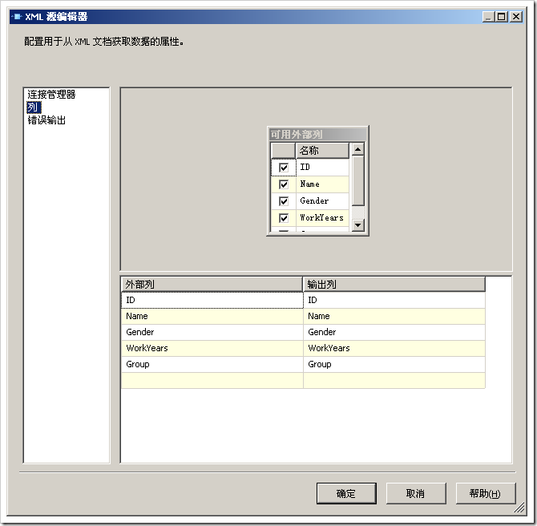](http://images.cnblogs.com/cnblogs_com/chenxizhang/WindowsLiveWriter/SSISXML_AB93/image_10.png) 

 可以看到，它现在检测到了五个列。

 到这里为止，我们就完成了XML源的设置

  

 5. 添加数据目标

 我们希望将这些数据传输到其他数据存储中去。作为演示目的，我们这里直接使用简单一点的Excel作为目标

 [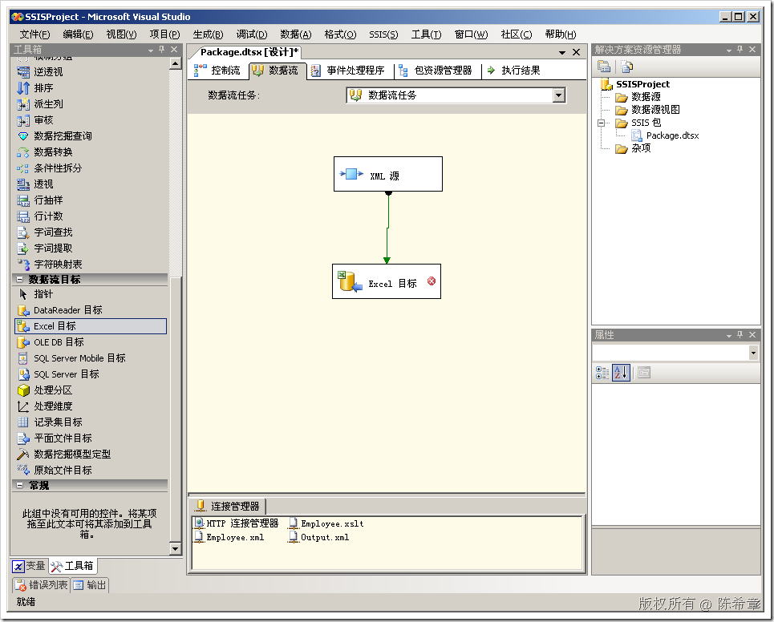](http://images.cnblogs.com/cnblogs_com/chenxizhang/WindowsLiveWriter/SSISXML_AB93/image_12.png) 

 编辑该目标

 [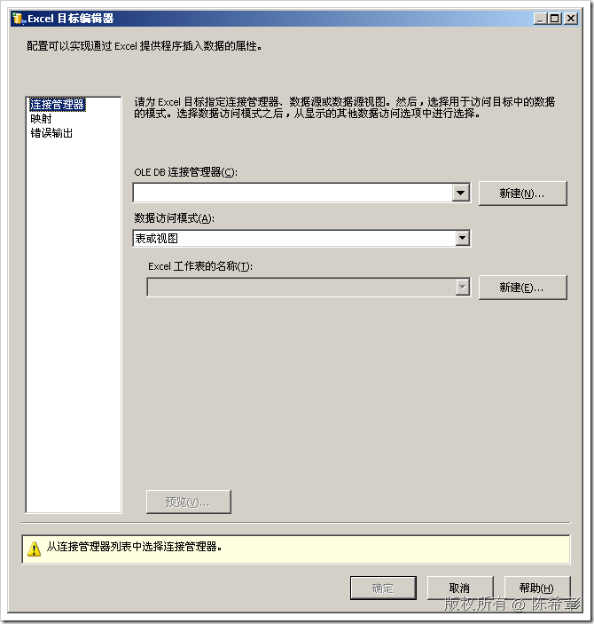](http://images.cnblogs.com/cnblogs_com/chenxizhang/WindowsLiveWriter/SSISXML_AB93/image_14.png) 

 在“OLEDB连接管理器”这边点击“新建”

 [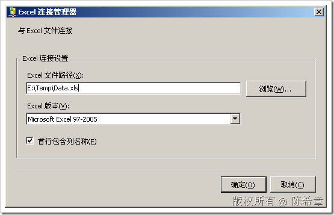](http://images.cnblogs.com/cnblogs_com/chenxizhang/WindowsLiveWriter/SSISXML_AB93/image_16.png) 

 点击“确定”

 在”Excel工作表名称”这边点击“新建”

 [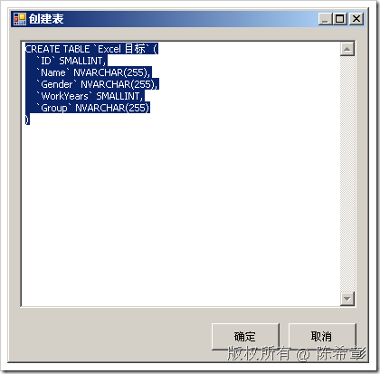](http://images.cnblogs.com/cnblogs_com/chenxizhang/WindowsLiveWriter/SSISXML_AB93/image_18.png) 

 点击“确定”

 点击一下左侧的“映射”

 [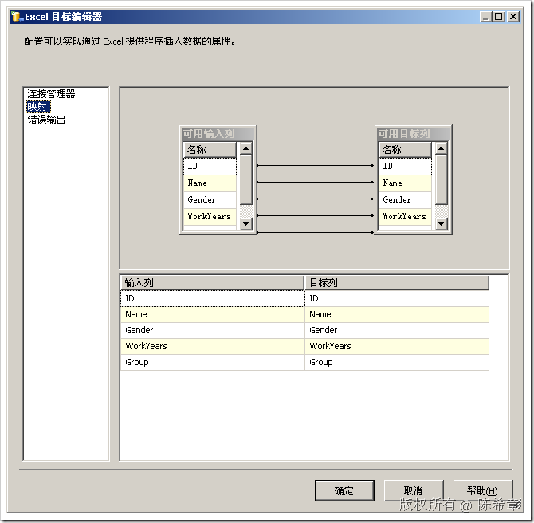](http://images.cnblogs.com/cnblogs_com/chenxizhang/WindowsLiveWriter/SSISXML_AB93/image_20.png) 

 然后点击“确定”

  

 6. 测试数据流

 我们回到“控制流”的界面，选中“数据流任务”，右键，“执行任务”

  

  

 7. 查看结果。我们去打开那个 Data.xls

 [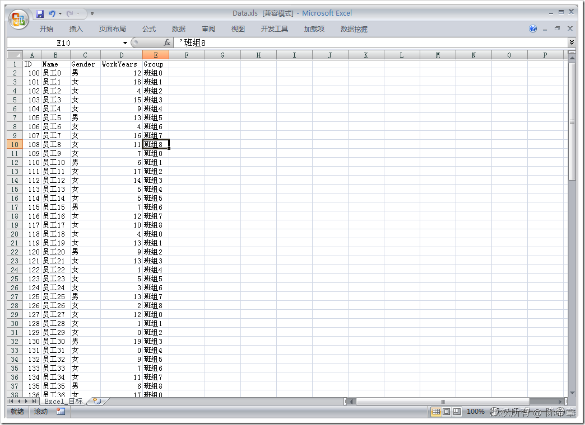](http://images.cnblogs.com/cnblogs_com/chenxizhang/WindowsLiveWriter/SSISXML_AB93/image_24.png) 

 在这里，我们看到的是一条一条的记录。

  

 到这里为止，我们就完成了一个完整的流程：

 * 使用“Web服务任务”从远程服务读取数据
* 使用“XML任务”对数据进行转换
* 使用“XML源”对数据进行读取

 本文由作者：[陈希章](http://www.xizhang.com) 于 2009/6/20 12:12:04 发布在：<http://www.cnblogs.com/chenxizhang/>  
 本文版权归作者所有，可以转载，但未经作者同意必须保留此段声明，且在文章页面明显位置给出原文连接，否则保留追究法律责任的权利。   
 更多博客文章，以及作者对于博客引用方面的完整声明以及合作方面的政策，请参考以下站点：[陈希章的博客中心](http://www.xizhang.com/blog.htm) 