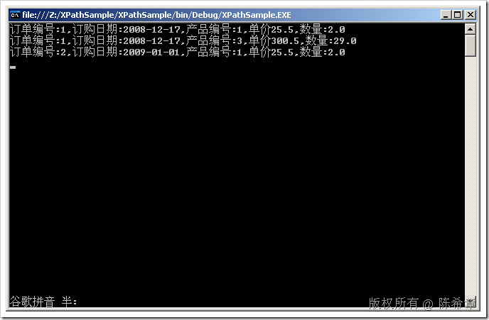
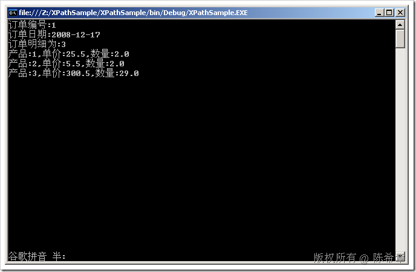
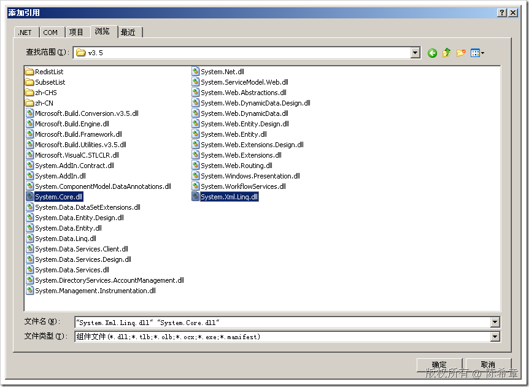
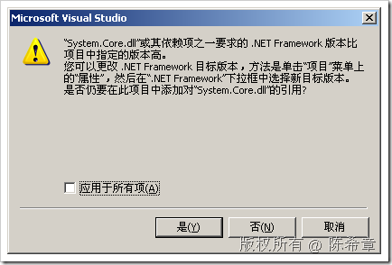
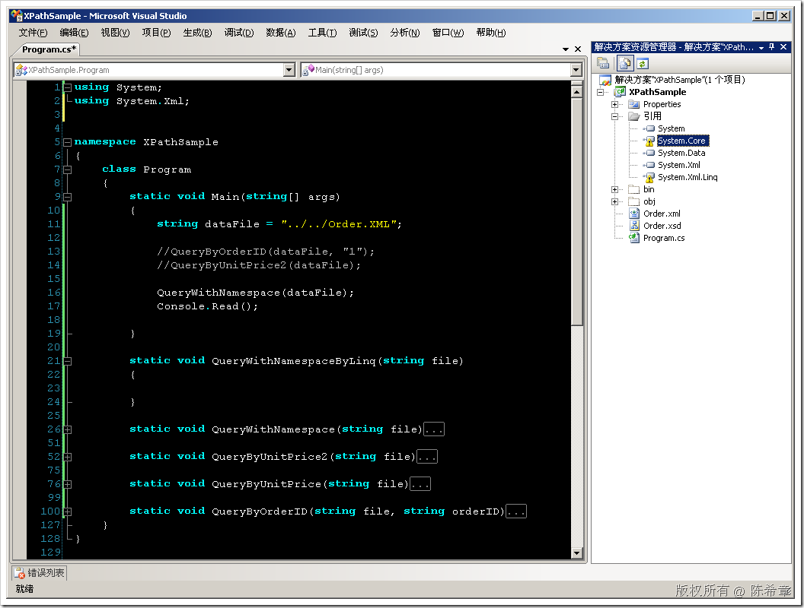
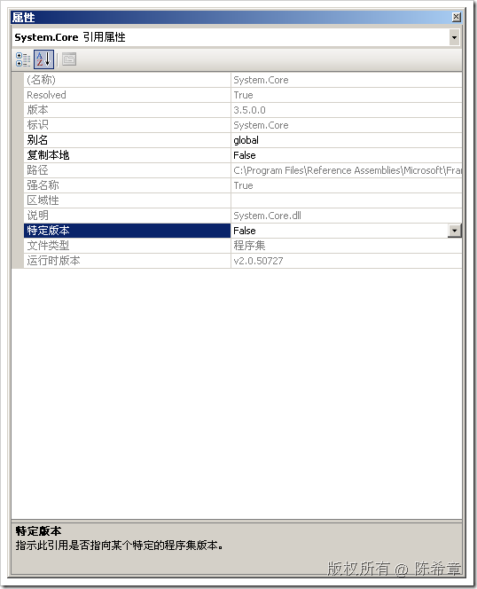
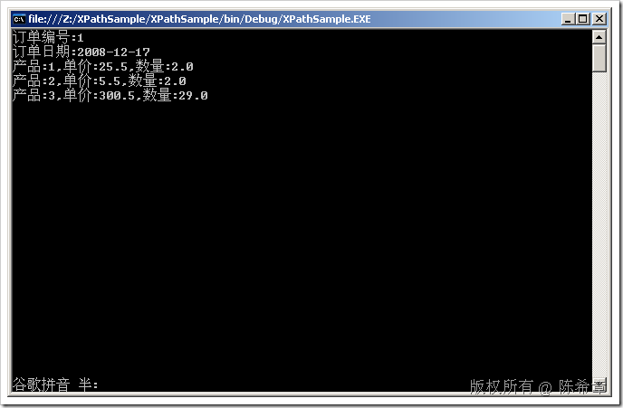

# 使用XPATH对XML数据进行解析 
> 原文发表于 2009-06-20, 地址: http://www.cnblogs.com/chenxizhang/archive/2009/06/20/1507352.html 


这一篇我总结一下，如何利用XPATH及相关技术对XML数据文档进行查询和处理

 1. 首先还是来看一下范例数据


```
<?xml version="1.0" encoding="utf-8" ?>
<Orders><!--所有订单-->
  <Order OrderID="1" OrderDate="2008-12-17"><!--一个订单-->
    <OrderItems><!--订单的明细-->
      <Item>
        <ProductID>1</ProductID>
        <Quantity>2.0</Quantity>
        <UnitPrice>25.5</UnitPrice>
      </Item>
      <Item>
        <ProductID>2</ProductID>
        <Quantity>2.0</Quantity>
        <UnitPrice>5.5</UnitPrice>
      </Item>
      <Item>
        <ProductID>3</ProductID>
        <Quantity>29.0</Quantity>
        <UnitPrice>300.5</UnitPrice>
      </Item>
    </OrderItems>
  </Order>

  <Order OrderID="2" OrderDate="2009-01-01">
    <OrderItems>
      <Item>
        <ProductID>1</ProductID>
        <Quantity>2.0</Quantity>
        <UnitPrice>25.5</UnitPrice>
      </Item>
    </OrderItems>
  </Order>
</Orders>
```

.csharpcode, .csharpcode pre
{
 font-size: small;
 color: black;
 font-family: consolas, "Courier New", courier, monospace;
 background-color: #ffffff;
 /*white-space: pre;*/
}
.csharpcode pre { margin: 0em; }
.csharpcode .rem { color: #008000; }
.csharpcode .kwrd { color: #0000ff; }
.csharpcode .str { color: #006080; }
.csharpcode .op { color: #0000c0; }
.csharpcode .preproc { color: #cc6633; }
.csharpcode .asp { background-color: #ffff00; }
.csharpcode .html { color: #800000; }
.csharpcode .attr { color: #ff0000; }
.csharpcode .alt 
{
 background-color: #f4f4f4;
 width: 100%;
 margin: 0em;
}
.csharpcode .lnum { color: #606060; }

这是一个典型的订单数据。Orders下面可以有一个或者多个Order，每个Order有两个属性：OrderID,OrderDate,同时，每个Order都有一个或者多个OrderItem


2. 这个数据文件的架构如下


```
<?xml version="1.0" encoding="utf-8"?>
<xs:schema attributeFormDefault="unqualified" elementFormDefault="qualified" xmlns:xs="http://www.w3.org/2001/XMLSchema">
  <xs:element name="Orders">
    <xs:complexType>
      <xs:sequence>
        <xs:element maxOccurs="unbounded" name="Order">
          <xs:complexType>
            <xs:sequence>
              <xs:element name="OrderItems">
                <xs:complexType>
                  <xs:sequence>
                    <xs:element maxOccurs="unbounded" name="Item" minOccurs="1">
                      <xs:complexType>
                        <xs:sequence>
                          <xs:element name="ProductID" type="xs:unsignedByte" />
                          <xs:element name="Quantity" type="xs:decimal" />
                          <xs:element name="UnitPrice" type="xs:decimal" />
                        </xs:sequence>
                      </xs:complexType>
                    </xs:element>
                  </xs:sequence>
                </xs:complexType>
              </xs:element>
            </xs:sequence>
            <xs:attribute name="OrderID" type="xs:unsignedByte" use="required" />
            <xs:attribute name="OrderDate" type="xs:date" use="required" />
          </xs:complexType>
        </xs:element>
      </xs:sequence>
    </xs:complexType>
  </xs:element>
</xs:schema>
```


.csharpcode, .csharpcode pre
{
 font-size: small;
 color: black;
 font-family: consolas, "Courier New", courier, monospace;
 background-color: #ffffff;
 /*white-space: pre;*/
}
.csharpcode pre { margin: 0em; }
.csharpcode .rem { color: #008000; }
.csharpcode .kwrd { color: #0000ff; }
.csharpcode .str { color: #006080; }
.csharpcode .op { color: #0000c0; }
.csharpcode .preproc { color: #cc6633; }
.csharpcode .asp { background-color: #ffff00; }
.csharpcode .html { color: #800000; }
.csharpcode .attr { color: #ff0000; }
.csharpcode .alt 
{
 background-color: #f4f4f4;
 width: 100%;
 margin: 0em;
}
.csharpcode .lnum { color: #606060; }


3. 下面来看看，我们如何查询某个订单


需求1：查询OrderID=1的订单，显示出来它的所有OrderItem


```
using System;
using System.Xml;

namespace XPathSample
{
    class Program
    {
        static void Main(string[] args)
        {
            string dataFile = "../../Order.XML";

            QueryByOrderID(dataFile, "1");

            Console.Read();

        }

        static void QueryByOrderID(string file, string orderID)
        {
            XmlDocument doc = new XmlDocument();
            doc.Load(file);

            XmlNode node = doc.SelectSingleNode("/Orders/Order[@OrderID=" + orderID + "]");
            if (node != null)
            {
                Console.WriteLine("订单编号为:{0}", node.Attributes["OrderID"].Value);
                Console.WriteLine("订单日期为:{0}", node.Attributes["OrderDate"].Value);


                XmlNodeList items = node.SelectNodes("OrderItems/Item");
                if (items != null)
                {
                    Console.WriteLine("订单明细为:{0}", items.Count);
                    foreach (XmlNode n in items)
                    {
                        Console.WriteLine("产品:{0},单价:{1},数量:{2}",
                            n.SelectSingleNode("ProductID").InnerText,
                            n.SelectSingleNode("UnitPrice").InnerText,
                            n.SelectSingleNode("Quantity").InnerText
                            );
                    }
                }
            }
        }
    }
}
```

```
[](http://images.cnblogs.com/cnblogs_com/chenxizhang/WindowsLiveWriter/XPATHXML_D4DB/image_2.png) 
```

```
关于更多语法，请参考 <http://www.w3school.com.cn/xpath/xpath_syntax.asp>
```

.csharpcode, .csharpcode pre
{
 font-size: small;
 color: black;
 font-family: consolas, "Courier New", courier, monospace;
 background-color: #ffffff;
 /*white-space: pre;*/
}
.csharpcode pre { margin: 0em; }
.csharpcode .rem { color: #008000; }
.csharpcode .kwrd { color: #0000ff; }
.csharpcode .str { color: #006080; }
.csharpcode .op { color: #0000c0; }
.csharpcode .preproc { color: #cc6633; }
.csharpcode .asp { background-color: #ffff00; }
.csharpcode .html { color: #800000; }
.csharpcode .attr { color: #ff0000; }
.csharpcode .alt 
{
 background-color: #f4f4f4;
 width: 100%;
 margin: 0em;
}
.csharpcode .lnum { color: #606060; }

需求2：查询所有单价大于20的订单明细记录


```
        static void QueryByUnitPrice(string file)
        { 
            //查询所有单价大于20的订单明细记录

            XmlDocument doc = new XmlDocument();
            doc.Load(file);

            XmlNodeList list = doc.SelectNodes("//Item[UnitPrice>20]");
            if (list != null)
            {
                foreach (XmlNode node in list)
                {
                    Console.WriteLine("订单编号:{0},订购日期:{1},产品编号:{2},单价{3},数量:{4}",
                        node.ParentNode.ParentNode.Attributes["OrderID"].Value,
                        node.ParentNode.ParentNode.Attributes["OrderDate"].Value,
                        node.SelectSingleNode("ProductID").InnerText,
                        node.SelectSingleNode("UnitPrice").InnerText,
                        node.SelectSingleNode("Quantity").InnerText
                        );
                }
            }

        }
```
[](http://images.cnblogs.com/cnblogs_com/chenxizhang/WindowsLiveWriter/XPATHXML_D4DB/image_4.png)
.csharpcode, .csharpcode pre
{
 font-size: small;
 color: black;
 font-family: consolas, "Courier New", courier, monospace;
 background-color: #ffffff;
 /*white-space: pre;*/
}
.csharpcode pre { margin: 0em; }
.csharpcode .rem { color: #008000; }
.csharpcode .kwrd { color: #0000ff; }
.csharpcode .str { color: #006080; }
.csharpcode .op { color: #0000c0; }
.csharpcode .preproc { color: #cc6633; }
.csharpcode .asp { background-color: #ffff00; }
.csharpcode .html { color: #800000; }
.csharpcode .attr { color: #ff0000; }
.csharpcode .alt 
{
 background-color: #f4f4f4;
 width: 100%;
 margin: 0em;
}
.csharpcode .lnum { color: #606060; }

 


需求3：多个条件查询。我们查询单价大于20并且数量也大于20的订单明细。


```
XmlNodeList list = doc.SelectNodes("//Item[UnitPrice>20 and Quantity>20]");
```

.csharpcode, .csharpcode pre
{
 font-size: small;
 color: black;
 font-family: consolas, "Courier New", courier, monospace;
 background-color: #ffffff;
 /*white-space: pre;*/
}
.csharpcode pre { margin: 0em; }
.csharpcode .rem { color: #008000; }
.csharpcode .kwrd { color: #0000ff; }
.csharpcode .str { color: #006080; }
.csharpcode .op { color: #0000c0; }
.csharpcode .preproc { color: #cc6633; }
.csharpcode .asp { background-color: #ffff00; }
.csharpcode .html { color: #800000; }
.csharpcode .attr { color: #ff0000; }
.csharpcode .alt 
{
 background-color: #f4f4f4;
 width: 100%;
 margin: 0em;
}
.csharpcode .lnum { color: #606060; }

有关其他更多的运算符，请参考<http://www.w3school.com.cn/xpath/xpath_operators.asp>


 


4. 如何处理命名空间的问题。


假设，我们的数据文件含有命名空间，那么在查询的时候应该如何处理呢？


```
<?xml version="1.0" encoding="utf-8" ?>
<Orders xmlns:d="http://www.xizhang.com"><!--所有订单-->
  **<d:Order OrderID="1" OrderDate="2008-12-17"><!--一个订单-->**
    <OrderItems><!--订单的明细-->
      <Item>
        <ProductID>1</ProductID>
        <Quantity>2.0</Quantity>
        <UnitPrice>25.5</UnitPrice>
      </Item>
      <Item>
        <ProductID>2</ProductID>
        <Quantity>2.0</Quantity>
        <UnitPrice>5.5</UnitPrice>
      </Item>
      <Item>
        <ProductID>3</ProductID>
        <Quantity>29.0</Quantity>
        <UnitPrice>300.5</UnitPrice>
      </Item>
    </OrderItems>
  </d:Order>

 **<Order OrderID="2" OrderDate="2009-01-01">**
    <OrderItems>
      <Item>
        <ProductID>1</ProductID>
        <Quantity>2.0</Quantity>
        <UnitPrice>25.5</UnitPrice>
      </Item>
    </OrderItems>
  </Order>
</Orders>
```

```
我们添加了一个命名空间，请注意，此时第一个订单（带d前缀的）和第二个订单（不带d前缀的）就不同了。
```

```
 
```

```
如果我们要查询第一个订单的所有Item，那么该如何写代码呢？
```

```
        static void QueryWithNamespace(string file)
        {
            XmlDocument doc = new XmlDocument();
            doc.Load(file);

      **XmlNamespaceManager xnm = new XmlNamespaceManager(doc.NameTable);
 xnm.AddNamespace("d", "http://www.xizhang.com");**
            **XmlNode order = doc.SelectSingleNode("/Orders/d:Order[@OrderID=1]",xnm);**
            Console.WriteLine("订单编号:{0}", order.Attributes["OrderID"].Value);
            Console.WriteLine("订单日期:{0}", order.Attributes["OrderDate"].Value);
            XmlNodeList items = order.SelectNodes("OrderItems/Item");
            if (items != null)
            {
                Console.WriteLine("订单明细为:{0}", items.Count);
                foreach (XmlNode n in items)
                {
                    Console.WriteLine("产品:{0},单价:{1},数量:{2}",
                        n.SelectSingleNode("ProductID").InnerText,
                        n.SelectSingleNode("UnitPrice").InnerText,
                        n.SelectSingleNode("Quantity").InnerText
                        );
                }
            }
        }
```

```
 
```

```
[](http://images.cnblogs.com/cnblogs_com/chenxizhang/WindowsLiveWriter/XPATHXML_D4DB/image_6.png) 
```

.csharpcode, .csharpcode pre
{
 font-size: small;
 color: black;
 font-family: consolas, "Courier New", courier, monospace;
 background-color: #ffffff;
 /*white-space: pre;*/
}
.csharpcode pre { margin: 0em; }
.csharpcode .rem { color: #008000; }
.csharpcode .kwrd { color: #0000ff; }
.csharpcode .str { color: #006080; }
.csharpcode .op { color: #0000c0; }
.csharpcode .preproc { color: #cc6633; }
.csharpcode .asp { background-color: #ffff00; }
.csharpcode .html { color: #800000; }
.csharpcode .attr { color: #ff0000; }
.csharpcode .alt 
{
 background-color: #f4f4f4;
 width: 100%;
 margin: 0em;
}
.csharpcode .lnum { color: #606060; }

.csharpcode, .csharpcode pre
{
 font-size: small;
 color: black;
 font-family: consolas, "Courier New", courier, monospace;
 background-color: #ffffff;
 /*white-space: pre;*/
}
.csharpcode pre { margin: 0em; }
.csharpcode .rem { color: #008000; }
.csharpcode .kwrd { color: #0000ff; }
.csharpcode .str { color: #006080; }
.csharpcode .op { color: #0000c0; }
.csharpcode .preproc { color: #cc6633; }
.csharpcode .asp { background-color: #ffff00; }
.csharpcode .html { color: #800000; }
.csharpcode .attr { color: #ff0000; }
.csharpcode .alt 
{
 background-color: #f4f4f4;
 width: 100%;
 margin: 0em;
}
.csharpcode .lnum { color: #606060; }

 


5. 如何使用LINQ TO XML查询


LINQ TO XML是.NET 3.5中的一个重大增强，极大地方便了我们编写对XML文档的查询


要使用该功能，必须引用两个程序集（如果你当前的项目并没有使用最新的.NET Framework 3.5的话）


[](http://images.cnblogs.com/cnblogs_com/chenxizhang/WindowsLiveWriter/XPATHXML_D4DB/image_8.png) 


这两个程序集在如下的目录：C:\Program Files\Reference Assemblies\Microsoft\Framework\v3.5


[](http://images.cnblogs.com/cnblogs_com/chenxizhang/WindowsLiveWriter/XPATHXML_D4DB/image_10.png) 


出现这个警告，请点击 “是”


[](http://images.cnblogs.com/cnblogs_com/chenxizhang/WindowsLiveWriter/XPATHXML_D4DB/image_12.png) 


但是，仍然有个警告。要想去除这个警告，请选中该程序集，按F4


[](http://images.cnblogs.com/cnblogs_com/chenxizhang/WindowsLiveWriter/XPATHXML_D4DB/image_14.png) 


将“特定版本”设置为false。


这样就可以了。


然后，我们需要添加两个using语句，导入两个命名空间


```
using System.Linq;
using System.Xml.Linq;
```

编写查询的方法


```
        static void QueryWithNamespaceByLinq(string file)
        {
            XDocument doc = XDocument.Load(file);
            **XNamespace xnamespace = "http://www.xizhang.com";**

            

            var query = from order in doc.Element("Orders").Elements(**xnamespace + "Order"**)
                        select order;

            foreach (var item in query)
            {
                Console.WriteLine("订单编号:{0}", item.Attribute("OrderID").Value);
                Console.WriteLine("订单日期:{0}", item.Attribute("OrderDate").Value);

                var items = from orderitem in item.Descendants("Item")
                            select orderitem;

                foreach (var subitem in items)
                {
                    Console.WriteLine("产品:{0},单价:{1},数量:{2}",
                        subitem.Element("ProductID").Value,
                        subitem.Element("UnitPrice").Value,
                        subitem.Element("Quantity").Value
                        );
                }

            }
        }
```

[](http://images.cnblogs.com/cnblogs_com/chenxizhang/WindowsLiveWriter/XPATHXML_D4DB/image_16.png) 


大家可能会说，这样看起来LINQ TO XML的语法并没有太多优势，因为几乎差不多。但其实LINQ TO XML还是有很多很好的特性的，例如排序，聚合，分组，联接等等，而且在构造XML文档这一方面可以说是很好，很强大。有兴趣的朋友可以参考有关的学习资料


.csharpcode, .csharpcode pre
{
 font-size: small;
 color: black;
 font-family: consolas, "Courier New", courier, monospace;
 background-color: #ffffff;
 /*white-space: pre;*/
}
.csharpcode pre { margin: 0em; }
.csharpcode .rem { color: #008000; }
.csharpcode .kwrd { color: #0000ff; }
.csharpcode .str { color: #006080; }
.csharpcode .op { color: #0000c0; }
.csharpcode .preproc { color: #cc6633; }
.csharpcode .asp { background-color: #ffff00; }
.csharpcode .html { color: #800000; }
.csharpcode .attr { color: #ff0000; }
.csharpcode .alt 
{
 background-color: #f4f4f4;
 width: 100%;
 margin: 0em;
}
.csharpcode .lnum { color: #606060; }


本文由作者：[陈希章](http://www.xizhang.com) 于 2009/6/20 15:08:13 
发布在：<http://www.cnblogs.com/chenxizhang/>  

本文版权归作者所有，可以转载，但未经作者同意必须保留此段声明，且在文章页面明显位置给出原文连接，否则保留追究法律责任的权利。   

更多博客文章，以及作者对于博客引用方面的完整声明以及合作方面的政策，请参考以下站点：[陈希章的博客中心](http://www.xizhang.com/blog.htm)
