# 为SSIS编写自定义任务项(Task)之高级篇 
> 原文发表于 2009-06-20, 地址: http://www.cnblogs.com/chenxizhang/archive/2009/06/20/1507449.html 


上一篇我们已经实现了一个自定义的编辑窗口，但里面没有任何内容，我们也没有真正为其保存属性。这一篇我们将完成这个任务项。

 1. 为任务添加几个自定义属性


```
        #region 属性

        private string source = string.Empty;
        public string Source { get{return source;} set{source=value;}}
        private string target = string.Empty;
        public string Target { get { return target; } set { target = value; } }
        private string xpath = string.Empty;
        public string Xpath { get { return xpath; } set { xpath = value; } }
        private string defs = string.Empty;
        public string Namespacedefs { get { return defs; } set { defs = value; } }


        #endregion
```

【特别注意】这里的属性必须是按照上面的写法。如果用VS2008的简写方式，则会无效


所谓VS 2008的简写方式，是类似下面这样。 我测试发现这样写是不行的，总是报告未将对象设置到引用实例。
.csharpcode, .csharpcode pre
{
 font-size: small;
 color: black;
 font-family: consolas, "Courier New", courier, monospace;
 background-color: #ffffff;
 /*white-space: pre;*/
}
.csharpcode pre { margin: 0em; }
.csharpcode .rem { color: #008000; }
.csharpcode .kwrd { color: #0000ff; }
.csharpcode .str { color: #006080; }
.csharpcode .op { color: #0000c0; }
.csharpcode .preproc { color: #cc6633; }
.csharpcode .asp { background-color: #ffff00; }
.csharpcode .html { color: #800000; }
.csharpcode .attr { color: #ff0000; }
.csharpcode .alt 
{
 background-color: #f4f4f4;
 width: 100%;
 margin: 0em;
}
.csharpcode .lnum { color: #606060; }


```
public string Source { get; set; }
```

.csharpcode, .csharpcode pre
{
 font-size: small;
 color: black;
 font-family: consolas, "Courier New", courier, monospace;
 background-color: #ffffff;
 /*white-space: pre;*/
}
.csharpcode pre { margin: 0em; }
.csharpcode .rem { color: #008000; }
.csharpcode .kwrd { color: #0000ff; }
.csharpcode .str { color: #006080; }
.csharpcode .op { color: #0000c0; }
.csharpcode .preproc { color: #cc6633; }
.csharpcode .asp { background-color: #ffff00; }
.csharpcode .html { color: #800000; }
.csharpcode .attr { color: #ff0000; }
.csharpcode .alt 
{
 background-color: #f4f4f4;
 width: 100%;
 margin: 0em;
}
.csharpcode .lnum { color: #606060; }

 


2. 为任务项添加持久化支持


方法是，为任务项实现IDTSComponentPersist接口


```
        #region IDTSComponentPersist 成员
        /// <summary>
        /// 从包的那个XML文件中加载属性
        /// </summary>
        /// <param name="node"></param>
        /// <param name="infoEvents"></param>
        public void LoadFromXML(System.Xml.XmlElement node, IDTSInfoEvents infoEvents)
        {
            try
            {
                Source = node.SelectSingleNode("Source").InnerText;
                Target = node.SelectSingleNode("Target").InnerText;
                Xpath = node.SelectSingleNode("Xpath").InnerText;
                Namespacedefs = node.SelectSingleNode("NamespaceDefs").InnerText;
            }
            catch
            {
                throw;
            }
        }
        /// <summary>
        /// 将自定义属性保存到包中
        /// </summary>
        /// <param name="doc"></param>
        /// <param name="infoEvents"></param>
        public void SaveToXML(System.Xml.XmlDocument doc, IDTSInfoEvents infoEvents)
        {
            XmlElement taskElement = doc.CreateElement("MyXMLTask");
            XmlElement source = doc.CreateElement(string.Empty, "Source", string.Empty);
            source.InnerText = this.Source;

            XmlElement target = doc.CreateElement(string.Empty, "Target", string.Empty);
            target.InnerText = this.Target;

            XmlElement xpath = doc.CreateElement(string.Empty, "Xpath", string.Empty);
            xpath.InnerText = this.Xpath;

            XmlElement def = doc.CreateElement(string.Empty, "NamespaceDefs", string.Empty);
            def.InnerText = this.Namespacedefs;

            taskElement.AppendChild(source);
            taskElement.AppendChild(target);
            taskElement.AppendChild(xpath);
            taskElement.AppendChild(def);
            doc.AppendChild(taskElement);

        }

        #endregion
```


.csharpcode, .csharpcode pre
{
 font-size: small;
 color: black;
 font-family: consolas, "Courier New", courier, monospace;
 background-color: #ffffff;
 /*white-space: pre;*/
}
.csharpcode pre { margin: 0em; }
.csharpcode .rem { color: #008000; }
.csharpcode .kwrd { color: #0000ff; }
.csharpcode .str { color: #006080; }
.csharpcode .op { color: #0000c0; }
.csharpcode .preproc { color: #cc6633; }
.csharpcode .asp { background-color: #ffff00; }
.csharpcode .html { color: #800000; }
.csharpcode .attr { color: #ff0000; }
.csharpcode .alt 
{
 background-color: #f4f4f4;
 width: 100%;
 margin: 0em;
}
.csharpcode .lnum { color: #606060; }


也就是说，任务项的自定义属性肯定是要保存起来的。它保存在哪里呢？保存在包的定义文件中。这其实就是一个XML文件


3. 为任务项添加一个验证输入的方法


```
        /// <summary>
        /// 验证输入
        /// </summary>
        /// <param name="connections"></param>
        /// <param name="variableDispenser"></param>
        /// <param name="componentEvents"></param>
        /// <param name="log"></param>
        /// <returns></returns>
        public override DTSExecResult Validate(Connections connections, VariableDispenser variableDispenser, IDTSComponentEvents componentEvents, IDTSLogging log)
        {

            if (string.IsNullOrEmpty(source) || string.IsNullOrEmpty(target) || string.IsNullOrEmpty(xpath))
            {
                componentEvents.FireError(0, "MyXMLTask", "来源文件，目标文件，以及查询表达式不可以为空", string.Empty, 0);
                return DTSExecResult.Failure;
            }

            if (!File.Exists(source))
            {
                componentEvents.FireError(0, "MyXMLTask", "来源文件不存在", string.Empty, 0);
                return DTSExecResult.Failure;
            }

            return DTSExecResult.Success;
        }
```

.csharpcode, .csharpcode pre
{
 font-size: small;
 color: black;
 font-family: consolas, "Courier New", courier, monospace;
 background-color: #ffffff;
 /*white-space: pre;*/
}
.csharpcode pre { margin: 0em; }
.csharpcode .rem { color: #008000; }
.csharpcode .kwrd { color: #0000ff; }
.csharpcode .str { color: #006080; }
.csharpcode .op { color: #0000c0; }
.csharpcode .preproc { color: #cc6633; }
.csharpcode .asp { background-color: #ffff00; }
.csharpcode .html { color: #800000; }
.csharpcode .attr { color: #ff0000; }
.csharpcode .alt 
{
 background-color: #f4f4f4;
 width: 100%;
 margin: 0em;
}
.csharpcode .lnum { color: #606060; }

4. 为任务项实现Execute方法


```
        /// <summary>
        /// 这个方法真正执行操作
        /// </summary>
        /// <param name="connections"></param>
        /// <param name="variableDispenser"></param>
        /// <param name="componentEvents"></param>
        /// <param name="log"></param>
        /// <param name="transaction"></param>
        /// <returns></returns>
        public override DTSExecResult Execute(Connections connections, 
            VariableDispenser variableDispenser, 
            IDTSComponentEvents componentEvents, 
            IDTSLogging log, object transaction)
        {

            try
            {
                XmlDocument doc = new XmlDocument();
                doc.Load(source);

                XmlNamespaceManager xnm = new XmlNamespaceManager(doc.NameTable);

                if (!string.IsNullOrEmpty(defs))
                {
                    string[] def = defs.Split('\n');
                    foreach (var item in def)
                    {
                        xnm.AddNamespace(item.Split(',')[0].Trim(), item.Split(',')[1].Trim());
                    }
                }

                XmlNode result = doc.SelectSingleNode(xpath, xnm);
                File.WriteAllText(target, result.OuterXml);

                return DTSExecResult.Success;
            }
            catch(Exception ex) {
                componentEvents.FireError(0, "MyXMLTask", ex.Message, string.Empty, 0);
                return DTSExecResult.Failure;
            }
        }
```

.csharpcode, .csharpcode pre
{
 font-size: small;
 color: black;
 font-family: consolas, "Courier New", courier, monospace;
 background-color: #ffffff;
 /*white-space: pre;*/
}
.csharpcode pre { margin: 0em; }
.csharpcode .rem { color: #008000; }
.csharpcode .kwrd { color: #0000ff; }
.csharpcode .str { color: #006080; }
.csharpcode .op { color: #0000c0; }
.csharpcode .preproc { color: #cc6633; }
.csharpcode .asp { background-color: #ffff00; }
.csharpcode .html { color: #800000; }
.csharpcode .attr { color: #ff0000; }
.csharpcode .alt 
{
 background-color: #f4f4f4;
 width: 100%;
 margin: 0em;
}
.csharpcode .lnum { color: #606060; }

.csharpcode, .csharpcode pre
{
 font-size: small;
 color: black;
 font-family: consolas, "Courier New", courier, monospace;
 background-color: #ffffff;
 /*white-space: pre;*/
}
.csharpcode pre { margin: 0em; }
.csharpcode .rem { color: #008000; }
.csharpcode .kwrd { color: #0000ff; }
.csharpcode .str { color: #006080; }
.csharpcode .op { color: #0000c0; }
.csharpcode .preproc { color: #cc6633; }
.csharpcode .asp { background-color: #ffff00; }
.csharpcode .html { color: #800000; }
.csharpcode .attr { color: #ff0000; }
.csharpcode .alt 
{
 background-color: #f4f4f4;
 width: 100%;
 margin: 0em;
}
.csharpcode .lnum { color: #606060; }

5. 设计编辑窗体


[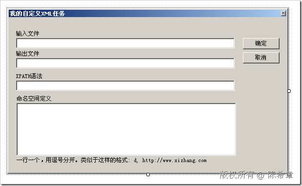](http://images.cnblogs.com/cnblogs_com/chenxizhang/WindowsLiveWriter/SSISTask_1097D/image_2.png) 


为了让大家做练习的时候和我这边是一样的。我把窗体设计器的代码贴在下面


```
namespace MySSISTaskSample
{
    partial class MyTaskEditor
    {
        /// <summary>
        /// Required designer variable.
        /// </summary>
        private System.ComponentModel.IContainer components = null;

        /// <summary>
        /// Clean up any resources being used.
        /// </summary>
        /// <param name="disposing">true if managed resources should be disposed; otherwise, false.</param>
        protected override void Dispose(bool disposing)
        {
            if (disposing && (components != null))
            {
                components.Dispose();
            }
            base.Dispose(disposing);
        }

        #region Windows Form Designer generated code

        /// <summary>
        /// Required method for Designer support - do not modify
        /// the contents of this method with the code editor.
        /// </summary>
        private void InitializeComponent()
        {
            this.label1 = new System.Windows.Forms.Label();
            this.txtSource = new System.Windows.Forms.TextBox();
            this.txtOutput = new System.Windows.Forms.TextBox();
            this.label2 = new System.Windows.Forms.Label();
            this.txtxpath = new System.Windows.Forms.TextBox();
            this.label3 = new System.Windows.Forms.Label();
            this.txtDef = new System.Windows.Forms.RichTextBox();
            this.label4 = new System.Windows.Forms.Label();
            this.label5 = new System.Windows.Forms.Label();
            this.btOk = new System.Windows.Forms.Button();
            this.btCancel = new System.Windows.Forms.Button();
            this.SuspendLayout();
            // 
            // label1
            // 
            this.label1.AutoSize = true;
            this.label1.Location = new System.Drawing.Point(13, 27);
            this.label1.Name = "label1";
            this.label1.Size = new System.Drawing.Size(53, 12);
            this.label1.TabIndex = 0;
            this.label1.Text = "输入文件";
            // 
            // txtSource
            // 
            this.txtSource.Location = new System.Drawing.Point(15, 42);
            this.txtSource.Name = "txtSource";
            this.txtSource.Size = new System.Drawing.Size(448, 21);
            this.txtSource.TabIndex = 1;
            // 
            // txtOutput
            // 
            this.txtOutput.Location = new System.Drawing.Point(15, 83);
            this.txtOutput.Name = "txtOutput";
            this.txtOutput.Size = new System.Drawing.Size(448, 21);
            this.txtOutput.TabIndex = 3;
            // 
            // label2
            // 
            this.label2.AutoSize = true;
            this.label2.Location = new System.Drawing.Point(13, 68);
            this.label2.Name = "label2";
            this.label2.Size = new System.Drawing.Size(53, 12);
            this.label2.TabIndex = 2;
            this.label2.Text = "输出文件";
            // 
            // txtxpath
            // 
            this.txtxpath.Location = new System.Drawing.Point(15, 129);
            this.txtxpath.Name = "txtxpath";
            this.txtxpath.Size = new System.Drawing.Size(448, 21);
            this.txtxpath.TabIndex = 5;
            // 
            // label3
            // 
            this.label3.AutoSize = true;
            this.label3.Location = new System.Drawing.Point(13, 114);
            this.label3.Name = "label3";
            this.label3.Size = new System.Drawing.Size(59, 12);
            this.label3.TabIndex = 4;
            this.label3.Text = "XPATH语法";
            // 
            // txtDef
            // 
            this.txtDef.Location = new System.Drawing.Point(16, 175);
            this.txtDef.Name = "txtDef";
            this.txtDef.Size = new System.Drawing.Size(450, 108);
            this.txtDef.TabIndex = 6;
            this.txtDef.Text = "";
            // 
            // label4
            // 
            this.label4.AutoSize = true;
            this.label4.Location = new System.Drawing.Point(14, 160);
            this.label4.Name = "label4";
            this.label4.Size = new System.Drawing.Size(77, 12);
            this.label4.TabIndex = 7;
            this.label4.Text = "命名空间定义";
            // 
            // label5
            // 
            this.label5.AutoSize = true;
            this.label5.Location = new System.Drawing.Point(14, 286);
            this.label5.Name = "label5";
            this.label5.Size = new System.Drawing.Size(395, 12);
            this.label5.TabIndex = 8;
            this.label5.Text = "一行一个，用逗号分开。类似于这样的格式: d, http://www.xizhang.com";
            // 
            // btOk
            // 
            this.btOk.DialogResult = System.Windows.Forms.DialogResult.OK;
            this.btOk.Location = new System.Drawing.Point(480, 42);
            this.btOk.Name = "btOk";
            this.btOk.Size = new System.Drawing.Size(75, 23);
            this.btOk.TabIndex = 9;
            this.btOk.Text = "确定";
            this.btOk.UseVisualStyleBackColor = true;
            this.btOk.Click += new System.EventHandler(this.btOk\_Click);
            // 
            // btCancel
            // 
            this.btCancel.Location = new System.Drawing.Point(480, 71);
            this.btCancel.Name = "btCancel";
            this.btCancel.Size = new System.Drawing.Size(75, 23);
            this.btCancel.TabIndex = 10;
            this.btCancel.Text = "取消";
            this.btCancel.UseVisualStyleBackColor = true;
            // 
            // MyTaskEditor
            // 
            this.AutoScaleDimensions = new System.Drawing.SizeF(6F, 12F);
            this.AutoScaleMode = System.Windows.Forms.AutoScaleMode.Font;
            this.ClientSize = new System.Drawing.Size(570, 317);
            this.Controls.Add(this.btCancel);
            this.Controls.Add(this.btOk);
            this.Controls.Add(this.label5);
            this.Controls.Add(this.label4);
            this.Controls.Add(this.txtDef);
            this.Controls.Add(this.txtxpath);
            this.Controls.Add(this.label3);
            this.Controls.Add(this.txtOutput);
            this.Controls.Add(this.label2);
            this.Controls.Add(this.txtSource);
            this.Controls.Add(this.label1);
            this.FormBorderStyle = System.Windows.Forms.FormBorderStyle.FixedToolWindow;
            this.MaximizeBox = false;
            this.MinimizeBox = false;
            this.Name = "MyTaskEditor";
            this.StartPosition = System.Windows.Forms.FormStartPosition.CenterParent;
            this.Text = "我的自定义XML任务";
            this.ResumeLayout(false);
            this.PerformLayout();

        }

        #endregion

        private System.Windows.Forms.Label label1;
        private System.Windows.Forms.TextBox txtSource;
        private System.Windows.Forms.TextBox txtOutput;
        private System.Windows.Forms.Label label2;
        private System.Windows.Forms.TextBox txtxpath;
        private System.Windows.Forms.Label label3;
        private System.Windows.Forms.RichTextBox txtDef;
        private System.Windows.Forms.Label label4;
        private System.Windows.Forms.Label label5;
        private System.Windows.Forms.Button btOk;
        private System.Windows.Forms.Button btCancel;
    }
}
```

.csharpcode, .csharpcode pre
{
 font-size: small;
 color: black;
 font-family: consolas, "Courier New", courier, monospace;
 background-color: #ffffff;
 /*white-space: pre;*/
}
.csharpcode pre { margin: 0em; }
.csharpcode .rem { color: #008000; }
.csharpcode .kwrd { color: #0000ff; }
.csharpcode .str { color: #006080; }
.csharpcode .op { color: #0000c0; }
.csharpcode .preproc { color: #cc6633; }
.csharpcode .asp { background-color: #ffff00; }
.csharpcode .html { color: #800000; }
.csharpcode .attr { color: #ff0000; }
.csharpcode .alt 
{
 background-color: #f4f4f4;
 width: 100%;
 margin: 0em;
}
.csharpcode .lnum { color: #606060; }

.csharpcode, .csharpcode pre
{
 font-size: small;
 color: black;
 font-family: consolas, "Courier New", courier, monospace;
 background-color: #ffffff;
 /*white-space: pre;*/
}
.csharpcode pre { margin: 0em; }
.csharpcode .rem { color: #008000; }
.csharpcode .kwrd { color: #0000ff; }
.csharpcode .str { color: #006080; }
.csharpcode .op { color: #0000c0; }
.csharpcode .preproc { color: #cc6633; }
.csharpcode .asp { background-color: #ffff00; }
.csharpcode .html { color: #800000; }
.csharpcode .attr { color: #ff0000; }
.csharpcode .alt 
{
 background-color: #f4f4f4;
 width: 100%;
 margin: 0em;
}
.csharpcode .lnum { color: #606060; }

 


6. 修改窗体代码


```
using System;
using System.Windows.Forms;

using Microsoft.SqlServer.Dts.Runtime;

namespace MySSISTaskSample
{
    public partial class MyTaskEditor : Form
    {
        public MyTaskEditor()
        {
            InitializeComponent();
        }

        private TaskHost taskHost;

        public MyTaskEditor(TaskHost host):this()
        {
            taskHost = host;//这里接受传递过来的宿主,其实就是那个MyXmlTask的实例

            //读取属性

            txtSource.Text = taskHost.Properties["Source"].GetValue(host).ToString();
            txtOutput.Text = taskHost.Properties["Target"].GetValue(host).ToString();
            txtxpath.Text = taskHost.Properties["Xpath"].GetValue(host).ToString();
            txtDef.Text = taskHost.Properties["Namespacedefs"].GetValue(host).ToString();

        }

        private void btOk\_Click(object sender, EventArgs e)
        {
            //写入属性
            //TODO:这里还可以做得更好一些，例如添加验证代码
            taskHost.Properties["Source"].SetValue(taskHost, txtSource.Text);
            taskHost.Properties["Target"].SetValue(taskHost, txtOutput.Text);
            taskHost.Properties["Xpath"].SetValue(taskHost, txtxpath.Text);
            taskHost.Properties["Namespacedefs"].SetValue(taskHost, txtDef.Text);

            //如果验证无法通过，则将窗体的DialogResult设置为None，阻止其退出
        }

    }
}

```


.csharpcode, .csharpcode pre
{
 font-size: small;
 color: black;
 font-family: consolas, "Courier New", courier, monospace;
 background-color: #ffffff;
 /*white-space: pre;*/
}
.csharpcode pre { margin: 0em; }
.csharpcode .rem { color: #008000; }
.csharpcode .kwrd { color: #0000ff; }
.csharpcode .str { color: #006080; }
.csharpcode .op { color: #0000c0; }
.csharpcode .preproc { color: #cc6633; }
.csharpcode .asp { background-color: #ffff00; }
.csharpcode .html { color: #800000; }
.csharpcode .attr { color: #ff0000; }
.csharpcode .alt 
{
 background-color: #f4f4f4;
 width: 100%;
 margin: 0em;
}
.csharpcode .lnum { color: #606060; }


7. 重新生成项目，并且进行部署


8. 测试该任务项


为了做练习，我们预先准备一份XML文件


```
<?xml version="1.0" encoding="utf-8" ?>
<Orders>
  <!--所有订单-->
  <Order OrderID="1" OrderDate="2008-12-17">
    <!--一个订单-->
    <OrderItems>
      <!--订单的明细-->
      <Item>
        <ProductID>1</ProductID>
        <Quantity>2.0</Quantity>
        <UnitPrice>25.5</UnitPrice>
      </Item>
      <Item>
        <ProductID>2</ProductID>
        <Quantity>2.0</Quantity>
        <UnitPrice>5.5</UnitPrice>
      </Item>
      <Item>
        <ProductID>3</ProductID>
        <Quantity>29.0</Quantity>
        <UnitPrice>300.5</UnitPrice>
      </Item>
    </OrderItems>
  </Order>

  <Order OrderID="2" OrderDate="2009-01-01">
    <OrderItems>
      <Item>
        <ProductID>1</ProductID>
        <Quantity>2.0</Quantity>
        <UnitPrice>25.5</UnitPrice>
      </Item>
    </OrderItems>
  </Order>
</Orders>
```

```
将该文件保存在一个目录下面，如E:\Temp\Order.xml
```

```
重新打开BI Studio，在一个新建的包中，使用我们这个自定义的任务
```

```
[](http://images.cnblogs.com/cnblogs_com/chenxizhang/WindowsLiveWriter/SSISTask_1097D/image_4.png) 
```

```
把鼠标放在任务上面，会看到错误消息。这是为什么呢？因为我们有一个Validate方法在起作用
```

```
[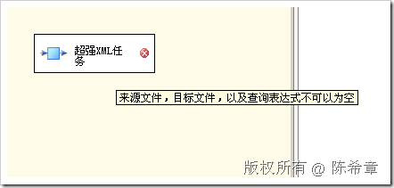](http://images.cnblogs.com/cnblogs_com/chenxizhang/WindowsLiveWriter/SSISTask_1097D/image_6.png) 
```

```
右键点击该任务，选择“编辑”
```

```
[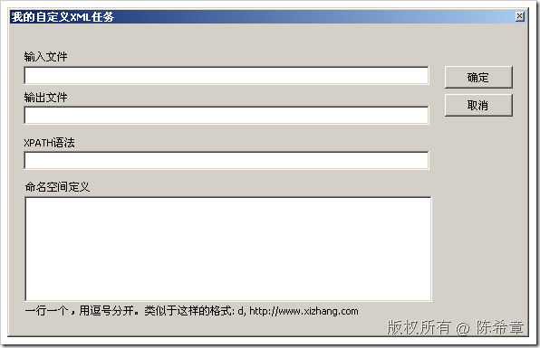](http://images.cnblogs.com/cnblogs_com/chenxizhang/WindowsLiveWriter/SSISTask_1097D/image_8.png) 
```

```
我们先不考虑命名空间的问题，输入前三个选项
```

```
[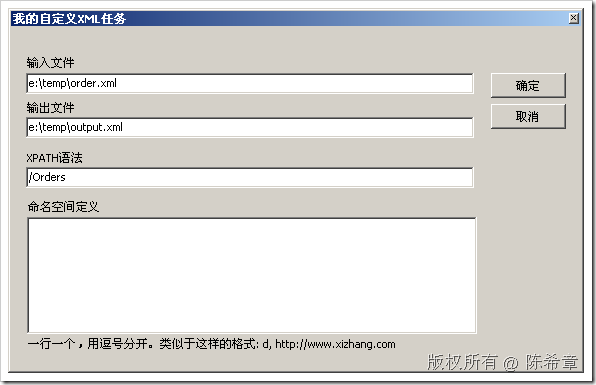](http://images.cnblogs.com/cnblogs_com/chenxizhang/WindowsLiveWriter/SSISTask_1097D/image_10.png) 
```

.csharpcode, .csharpcode pre
{
 font-size: small;
 color: black;
 font-family: consolas, "Courier New", courier, monospace;
 background-color: #ffffff;
 /*white-space: pre;*/
}
.csharpcode pre { margin: 0em; }
.csharpcode .rem { color: #008000; }
.csharpcode .kwrd { color: #0000ff; }
.csharpcode .str { color: #006080; }
.csharpcode .op { color: #0000c0; }
.csharpcode .preproc { color: #cc6633; }
.csharpcode .asp { background-color: #ffff00; }
.csharpcode .html { color: #800000; }
.csharpcode .attr { color: #ff0000; }
.csharpcode .alt 
{
 background-color: #f4f4f4;
 width: 100%;
 margin: 0em;
}
.csharpcode .lnum { color: #606060; }


点击“确定”之后，回到设计器界面，我们看到任务没有警告了


[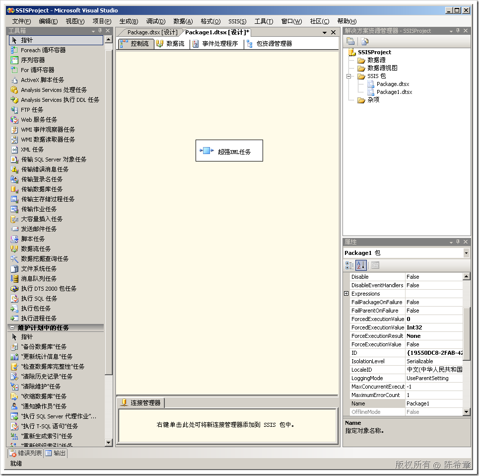](http://images.cnblogs.com/cnblogs_com/chenxizhang/WindowsLiveWriter/SSISTask_1097D/image_12.png) 


我们来了解一下这些属性被存放到哪里去了。选中Package1.dtsx，右键，查看代码


[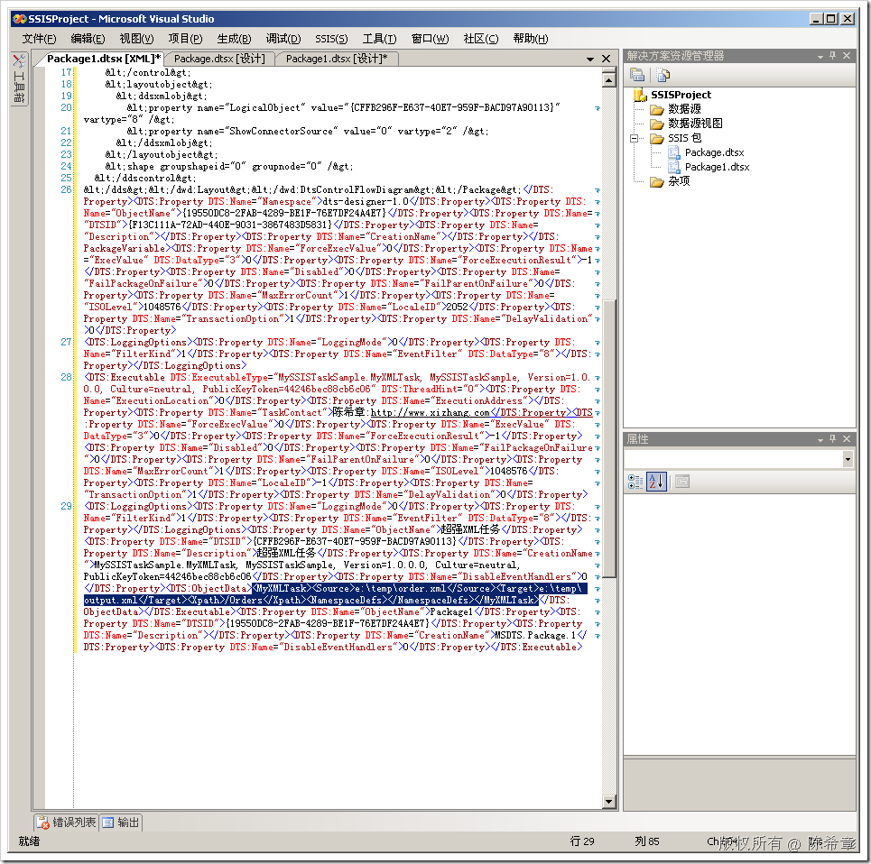](http://images.cnblogs.com/cnblogs_com/chenxizhang/WindowsLiveWriter/SSISTask_1097D/image_14.png) 


好了，激动人心的时刻终于到来了。我们现在去运行这个任务


[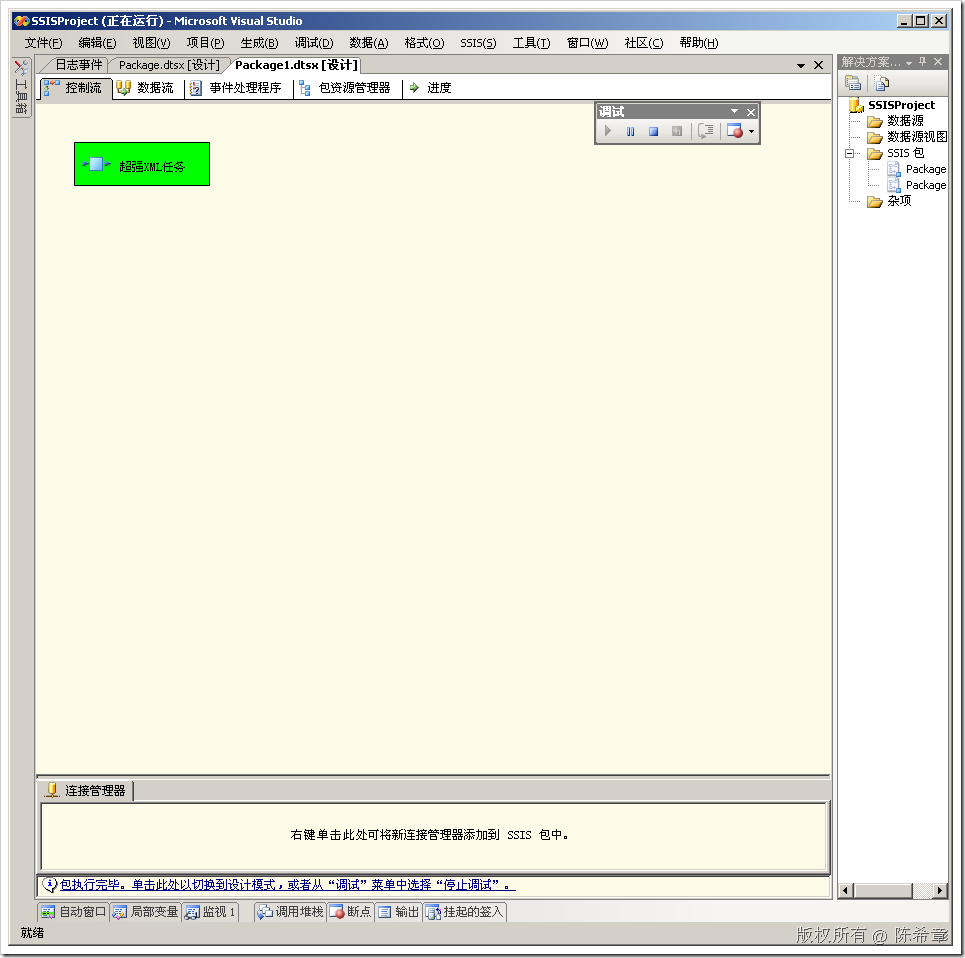](http://images.cnblogs.com/cnblogs_com/chenxizhang/WindowsLiveWriter/SSISTask_1097D/image_16.png) 


我们去查看一下生成的那个output.xml文件


[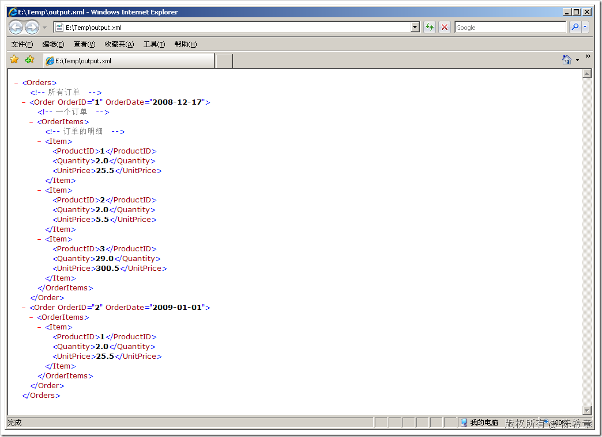](http://images.cnblogs.com/cnblogs_com/chenxizhang/WindowsLiveWriter/SSISTask_1097D/image_18.png) 


 


最后，我们来加入一点复杂性，例如我们的来源文档是有命名空间的


```
<?xml version="1.0" encoding="utf-8" ?>
<Orders xmlns:d="http://www.xizhang.com">
  <!--所有订单-->
  <d:Order OrderID="1" OrderDate="2008-12-17">
    <!--一个订单-->
    <OrderItems>
      <!--订单的明细-->
      <Item>
        <ProductID>1</ProductID>
        <Quantity>2.0</Quantity>
        <UnitPrice>25.5</UnitPrice>
      </Item>
      <Item>
        <ProductID>2</ProductID>
        <Quantity>2.0</Quantity>
        <UnitPrice>5.5</UnitPrice>
      </Item>
      <Item>
        <ProductID>3</ProductID>
        <Quantity>29.0</Quantity>
        <UnitPrice>300.5</UnitPrice>
      </Item>
    </OrderItems>
  </d:Order>

  <Order OrderID="2" OrderDate="2009-01-01">
    <OrderItems>
      <Item>
        <ProductID>1</ProductID>
        <Quantity>2.0</Quantity>
        <UnitPrice>25.5</UnitPrice>
      </Item>
    </OrderItems>
  </Order>
</Orders>
```

```
第一个订单是带有命名空间前缀的
```

```
我们修改一下自定义XML任务的属性
```

```
[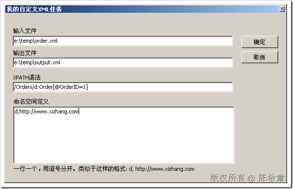](http://images.cnblogs.com/cnblogs_com/chenxizhang/WindowsLiveWriter/SSISTask_1097D/image_22.png)   

```

```
再次执行该任务
```

```
[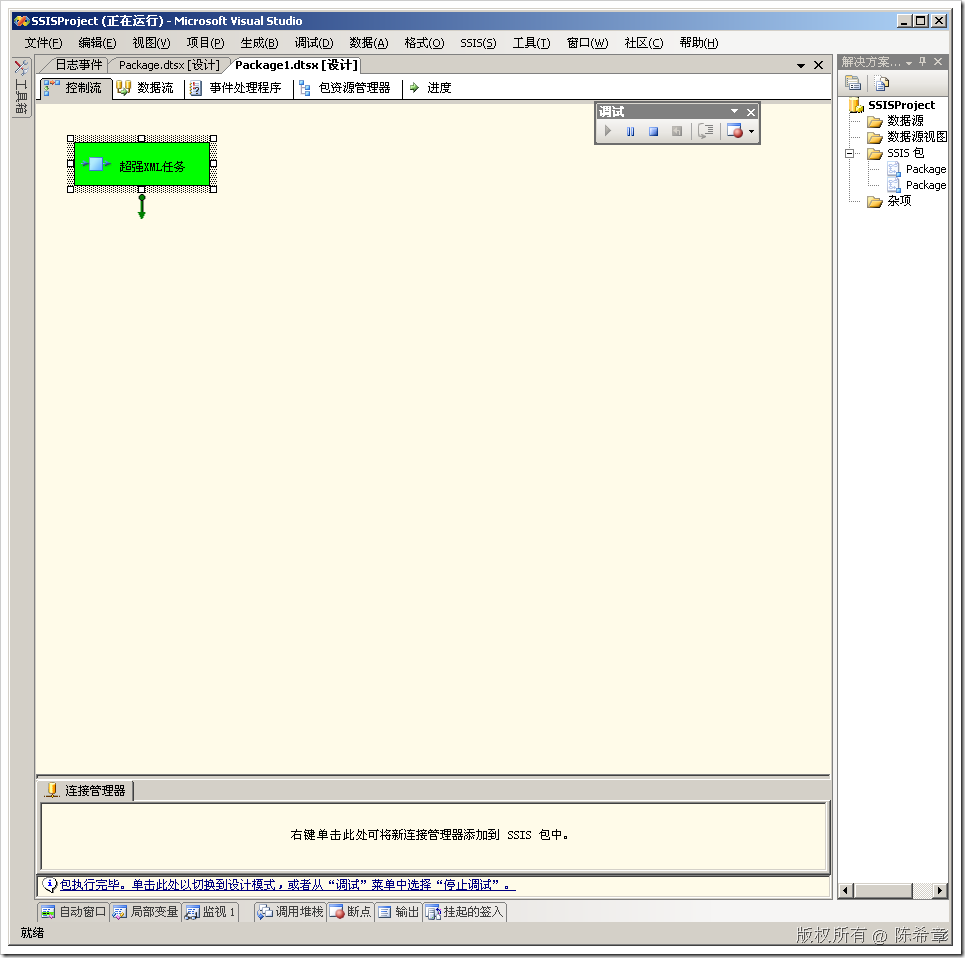](http://images.cnblogs.com/cnblogs_com/chenxizhang/WindowsLiveWriter/SSISTask_1097D/image_24.png) 
```

```
最后查看结果如下
```

```
[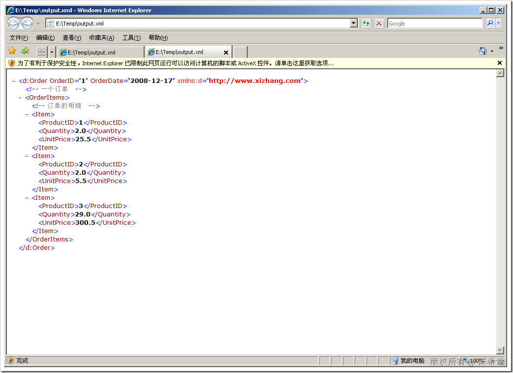](http://images.cnblogs.com/cnblogs_com/chenxizhang/WindowsLiveWriter/SSISTask_1097D/image_26.png) 
```

```
到这里为止，我们就完整地实现了一个自定义的任务项。这个任务项与标准的XML任务有一个区别，就是它可以根据命名空间自动去进行处理。看起来不错吧
```

```
 
```

.csharpcode, .csharpcode pre
{
 font-size: small;
 color: black;
 font-family: consolas, "Courier New", courier, monospace;
 background-color: #ffffff;
 /*white-space: pre;*/
}
.csharpcode pre { margin: 0em; }
.csharpcode .rem { color: #008000; }
.csharpcode .kwrd { color: #0000ff; }
.csharpcode .str { color: #006080; }
.csharpcode .op { color: #0000c0; }
.csharpcode .preproc { color: #cc6633; }
.csharpcode .asp { background-color: #ffff00; }
.csharpcode .html { color: #800000; }
.csharpcode .attr { color: #ff0000; }
.csharpcode .alt 
{
 background-color: #f4f4f4;
 width: 100%;
 margin: 0em;
}
.csharpcode .lnum { color: #606060; }

本文由作者：[陈希章](http://www.xizhang.com) 于 2009/6/20 18:52:47 
发布在：<http://www.cnblogs.com/chenxizhang/>  

本文版权归作者所有，可以转载，但未经作者同意必须保留此段声明，且在文章页面明显位置给出原文连接，否则保留追究法律责任的权利。   
