# 为SSIS编写自定义数据流组件(DataFlow Component)之入门篇 
> 原文发表于 2009-06-20, 地址: http://www.cnblogs.com/chenxizhang/archive/2009/06/20/1507467.html 


这一篇开始介绍一下如何为SSIS编写自定义的数据流组件，包括源、转换、和目标三种。

 在SSIS的开发中，我们都知道数据流是最有意思的，也是最富有挑战性的部分。现有的数据流组件已经很丰富了，即便某些特殊功能，我们也可以通过脚本组件来完成工作。

 但是，脚本组件有一个问题，就是它很难在包之间重复利用。这样就促使我们想办法开发一些通用的组件来加快开发需要。

 编写自定义数据流组件的步骤与编写自定义任务的思路和步骤都比较类似。这一篇，我们来演示一下如何创建三个组件，分别对应源、转换和目标

  

 1. 创建一个类库项目，修改默认的Class1为Component,然后在这个代码文件中，添加三个类型

 [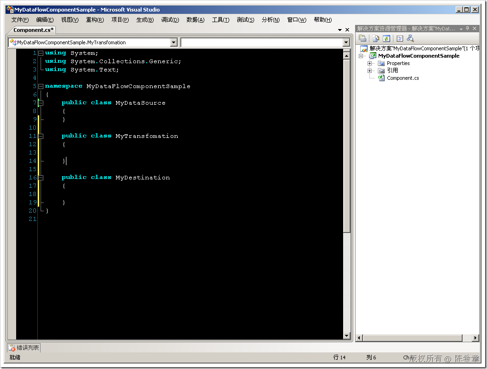](http://images.cnblogs.com/cnblogs_com/chenxizhang/WindowsLiveWriter/SSISDataFlowComponent_111C6/image_2.png) 

 2. 添加引用

 [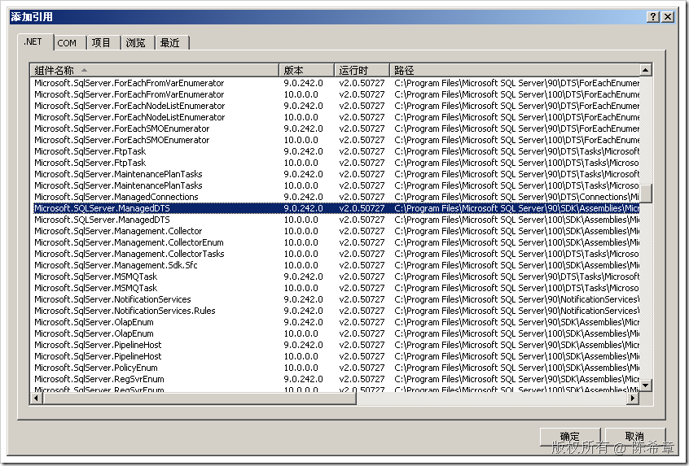](http://images.cnblogs.com/cnblogs_com/chenxizhang/WindowsLiveWriter/SSISDataFlowComponent_111C6/image_4.png) 

 [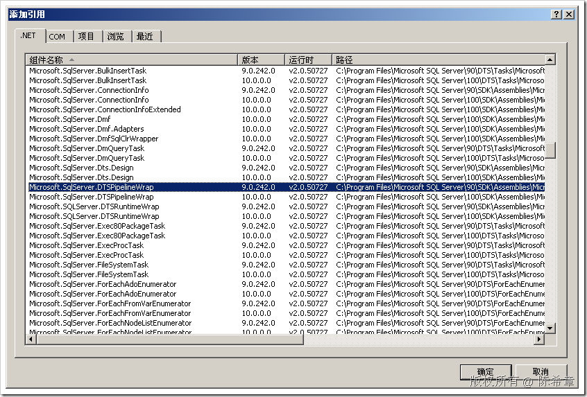](http://images.cnblogs.com/cnblogs_com/chenxizhang/WindowsLiveWriter/SSISDataFlowComponent_111C6/image_6.png) 

 [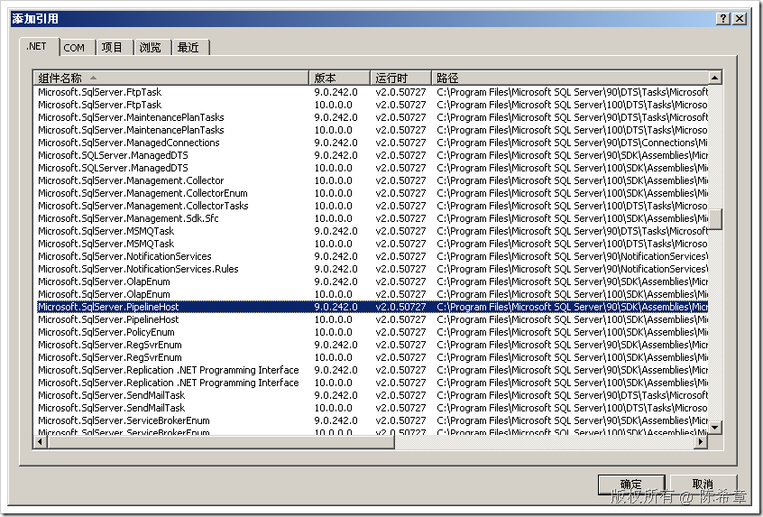](http://images.cnblogs.com/cnblogs_com/chenxizhang/WindowsLiveWriter/SSISDataFlowComponent_111C6/image_8.png) 

 3. 实现三个类型


```
using Microsoft.SqlServer.Dts.Pipeline;

namespace MyDataFlowComponentSample
{
    [DtsPipelineComponent(
          ComponentType=ComponentType.SourceAdapter,
          Description="这是我的一个自定义数据源组件",
          DisplayName="超强数据源")]
    public class MyDataSource:PipelineComponent
    {
    }

    [DtsPipelineComponent(
          ComponentType=ComponentType.Transform,
          Description="这是我的一个自定义数据转换",
          DisplayName="超强数据转换")]
    public class MyTransfomation:PipelineComponent
    { 
    
    }

    [DtsPipelineComponent(
        ComponentType=ComponentType.DestinationAdapter,
        Description="这是我的一个自定义数据目标组件",
        DisplayName="超强数据目标")]
    public class MyDestination:PipelineComponent
    { 
    
    }
}

```

.csharpcode, .csharpcode pre
{
 font-size: small;
 color: black;
 font-family: consolas, "Courier New", courier, monospace;
 background-color: #ffffff;
 /*white-space: pre;*/
}
.csharpcode pre { margin: 0em; }
.csharpcode .rem { color: #008000; }
.csharpcode .kwrd { color: #0000ff; }
.csharpcode .str { color: #006080; }
.csharpcode .op { color: #0000c0; }
.csharpcode .preproc { color: #cc6633; }
.csharpcode .asp { background-color: #ffff00; }
.csharpcode .html { color: #800000; }
.csharpcode .attr { color: #ff0000; }
.csharpcode .alt 
{
 background-color: #f4f4f4;
 width: 100%;
 margin: 0em;
}
.csharpcode .lnum { color: #606060; }


现在是最简单的代码，不作任何其他的实现


4. 为程序集签名


[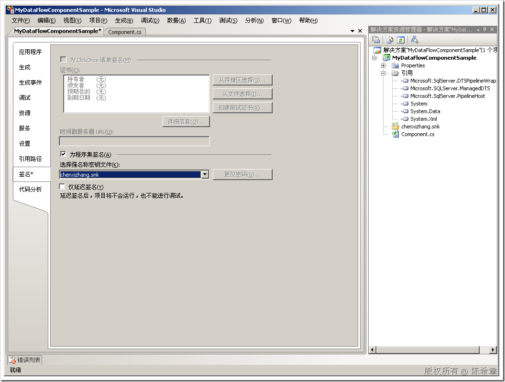](http://images.cnblogs.com/cnblogs_com/chenxizhang/WindowsLiveWriter/SSISDataFlowComponent_111C6/image_10.png) 


5. 添加生成后事件


[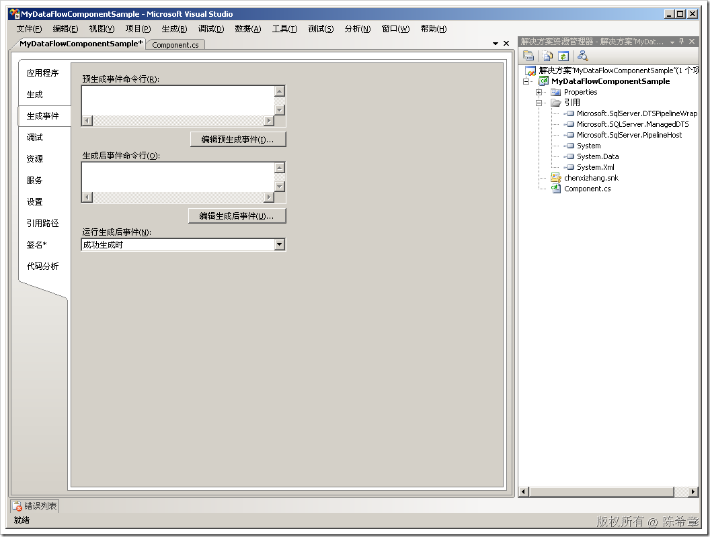](http://images.cnblogs.com/cnblogs_com/chenxizhang/WindowsLiveWriter/SSISDataFlowComponent_111C6/image_12.png) 


```
COPY "$(TargetPath)" "C:\Program Files\Microsoft SQL Server\90\DTS\PipelineComponents\$(TargetFileName)"
"C:\Program Files\Microsoft SDKs\Windows\v6.0A\Bin\GACUTIL.exe" -u "C:\Program Files\Microsoft SQL Server\90\DTS\PipelineComponents\$(TargetFileName)"
"C:\Program Files\Microsoft SDKs\Windows\v6.0A\Bin\GACUTIL.exe" -i "C:\Program Files\Microsoft SQL Server\90\DTS\PipelineComponents\$(TargetFileName)"
```

```
[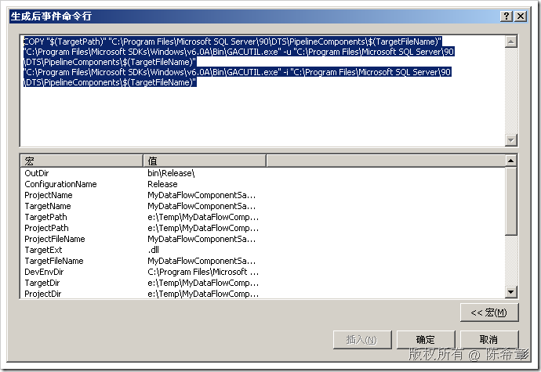](http://images.cnblogs.com/cnblogs_com/chenxizhang/WindowsLiveWriter/SSISDataFlowComponent_111C6/image_14.png) 
```

.csharpcode, .csharpcode pre
{
 font-size: small;
 color: black;
 font-family: consolas, "Courier New", courier, monospace;
 background-color: #ffffff;
 /*white-space: pre;*/
}
.csharpcode pre { margin: 0em; }
.csharpcode .rem { color: #008000; }
.csharpcode .kwrd { color: #0000ff; }
.csharpcode .str { color: #006080; }
.csharpcode .op { color: #0000c0; }
.csharpcode .preproc { color: #cc6633; }
.csharpcode .asp { background-color: #ffff00; }
.csharpcode .html { color: #800000; }
.csharpcode .attr { color: #ff0000; }
.csharpcode .alt 
{
 background-color: #f4f4f4;
 width: 100%;
 margin: 0em;
}
.csharpcode .lnum { color: #606060; }


6. 生成项目，并在下面的目录查看


[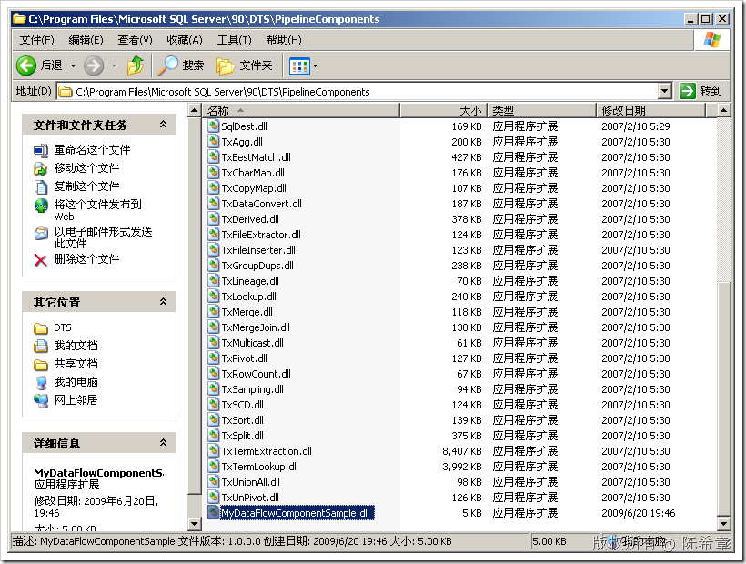](http://images.cnblogs.com/cnblogs_com/chenxizhang/WindowsLiveWriter/SSISDataFlowComponent_111C6/image_16.png) 


[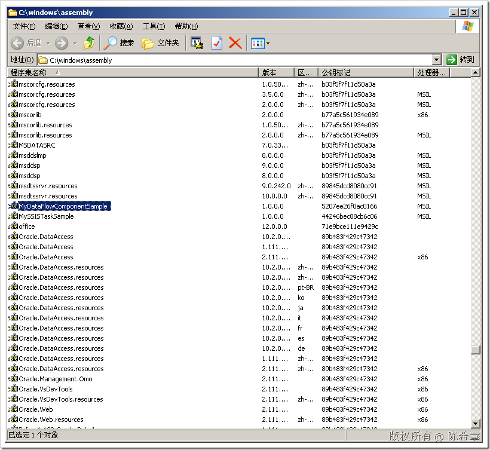](http://images.cnblogs.com/cnblogs_com/chenxizhang/WindowsLiveWriter/SSISDataFlowComponent_111C6/image_18.png) 


7. 在BI Studio中添加这三个组件


[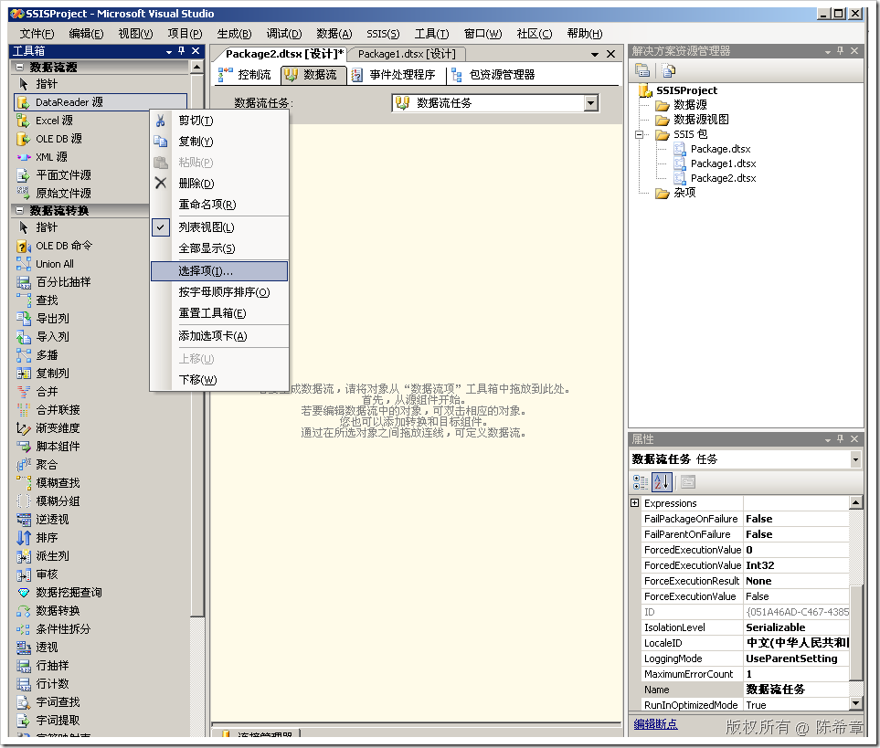](http://images.cnblogs.com/cnblogs_com/chenxizhang/WindowsLiveWriter/SSISDataFlowComponent_111C6/image_20.png) 


[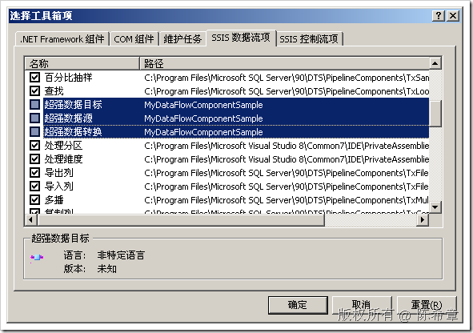](http://images.cnblogs.com/cnblogs_com/chenxizhang/WindowsLiveWriter/SSISDataFlowComponent_111C6/image_22.png) 


全部选中这三个组件，然后点击“确定”，三个组件会出现在工具箱中。然后，我们将其拖放在数据流的视图中，看起来像下面这样


[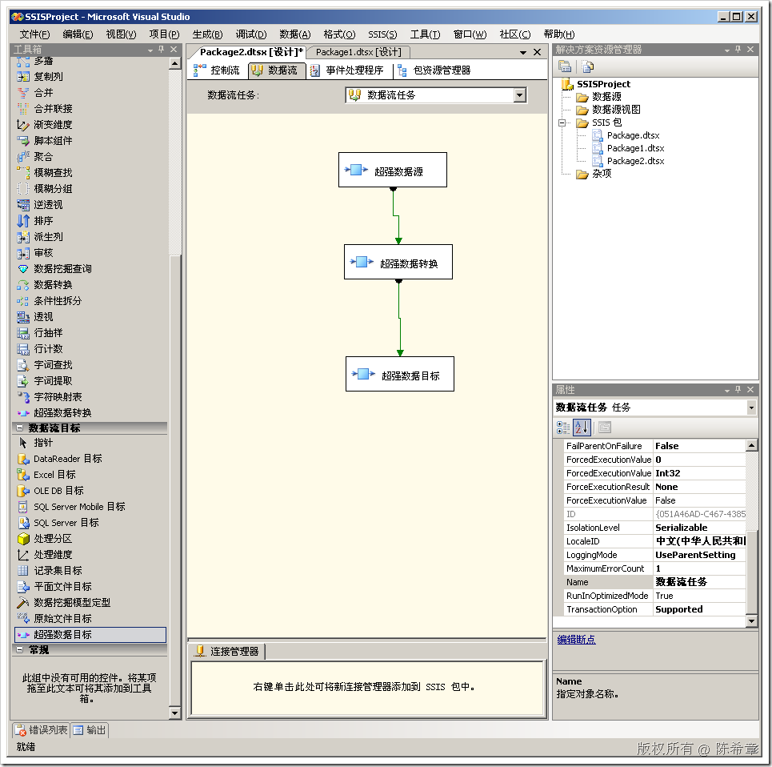](http://images.cnblogs.com/cnblogs_com/chenxizhang/WindowsLiveWriter/SSISDataFlowComponent_111C6/image_24.png) 


到这里为止，我们创建了一个新的项目，里面包含了三个自定义的数据流组件。当然，他们还没有任何功能。这个下面会有介绍


本文由作者：[陈希章](http://www.xizhang.com) 于 2009/6/20 19:54:52 
发布在：<http://www.cnblogs.com/chenxizhang/>  

本文版权归作者所有，可以转载，但未经作者同意必须保留此段声明，且在文章页面明显位置给出原文连接，否则保留追究法律责任的权利。   

更多博客文章，以及作者对于博客引用方面的完整声明以及合作方面的政策，请参考以下站点：[陈希章的博客中心](http://www.xizhang.com/blog.htm)
