# 为SSIS编写自定义数据流组件(DataFlow Component)之进阶篇:数据源组件 
> 原文发表于 2009-06-21, 地址: http://www.cnblogs.com/chenxizhang/archive/2009/06/21/1507631.html 


上一篇，我们讲到了一个简单的步骤，包括创建项目，部署和测试。这一节，首先来探讨一下数据源组件的设计

 1. 添加几个引用。请确保添加了下图所示的四个引用，以及添加了相应的using语句

 [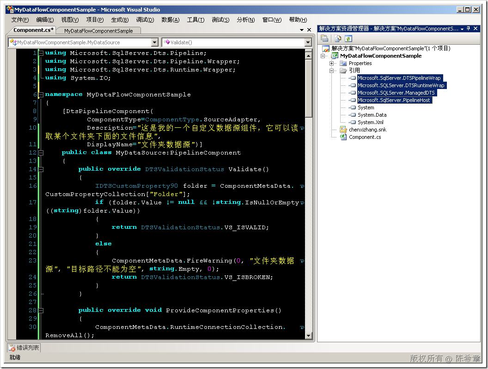](http://images.cnblogs.com/cnblogs_com/chenxizhang/WindowsLiveWriter/SSISDataFlowComponent_869B/image_2.png) 

 【注意】为了更好地表达我的目的，我已经修改了该组件的名字。它现在是一个“文件夹数据源”，目的是用来读取一个文件夹的文件信息。想想看，你是不是正好有这样的需求呢

  

  

 2. 添加输出列的定义

 作为一个数据源，很显然，它需要定义到底输出哪些列。那么这个是在哪里定义的呢？ 我们需要做的是重写ProvideComponentProperties方法


```
        public override void ProvideComponentProperties()
        {
            ComponentMetaData.RuntimeConnectionCollection.RemoveAll();
            RemoveAllInputsOutputsAndCustomProperties();

            IDTSCustomProperty90 folder = ComponentMetaData.CustomPropertyCollection.New();
            folder.Name = "Folder";//怎么样设置该属性让他可以绑定表达式？
            

            IDTSOutput90 output = ComponentMetaData.OutputCollection.New();
            output.Name = "MyOutput";
            

            //初始化的时候，准备几个输出列
            IDTSOutputColumn90 fileNameColumn = output.OutputColumnCollection.New();
            fileNameColumn.Name = "FileName";
            fileNameColumn.SetDataTypeProperties(DataType.DT\_WSTR, 256, 0, 0, 0);
            //如果是非Unicode则要提供CodePage，其他的类型可以设置为0


            IDTSOutputColumn90 fileSizeColumn = output.OutputColumnCollection.New();
            fileSizeColumn.Name = "FileSize";
            fileSizeColumn.SetDataTypeProperties(DataType.DT\_I8, 0, 0, 0, 0);


            IDTSOutputColumn90 fileExtensionColumn = output.OutputColumnCollection.New();
            fileExtensionColumn.Name = "FileExtension";
            fileExtensionColumn.SetDataTypeProperties(DataType.DT\_WSTR, 50, 0, 0, 0);

            //怎么让用户无法编辑这个输出和列的信息呢？
        }
```

.csharpcode, .csharpcode pre
{
 font-size: small;
 color: black;
 font-family: consolas, "Courier New", courier, monospace;
 background-color: #ffffff;
 /*white-space: pre;*/
}
.csharpcode pre { margin: 0em; }
.csharpcode .rem { color: #008000; }
.csharpcode .kwrd { color: #0000ff; }
.csharpcode .str { color: #006080; }
.csharpcode .op { color: #0000c0; }
.csharpcode .preproc { color: #cc6633; }
.csharpcode .asp { background-color: #ffff00; }
.csharpcode .html { color: #800000; }
.csharpcode .attr { color: #ff0000; }
.csharpcode .alt 
{
 background-color: #f4f4f4;
 width: 100%;
 margin: 0em;
}
.csharpcode .lnum { color: #606060; }

在这个方法里面，我们添加了一个自定义属性，这是为了增加该组件的灵活性。同时，我们添加了一个特定的输出，该输出有三个列


3. 为组件添加验证规则


因为有自定义属性，所以我们在执行之前应该对其进行验证，以确保它被正确进行了设置


```
        public override DTSValidationStatus Validate()
        {
            IDTSCustomProperty90 folder = ComponentMetaData.CustomPropertyCollection["Folder"];
            if (folder.Value != null && Directory.Exists(folder.Value.ToString()))
            {
                return DTSValidationStatus.VS\_ISVALID;
            }
            else
            {
                ComponentMetaData.FireWarning(0, "文件夹数据源", "目标路径不能为空,而且必须存在", string.Empty, 0);
                return DTSValidationStatus.VS\_ISBROKEN;
            }
        }

```


.csharpcode, .csharpcode pre
{
 font-size: small;
 color: black;
 font-family: consolas, "Courier New", courier, monospace;
 background-color: #ffffff;
 /*white-space: pre;*/
}
.csharpcode pre { margin: 0em; }
.csharpcode .rem { color: #008000; }
.csharpcode .kwrd { color: #0000ff; }
.csharpcode .str { color: #006080; }
.csharpcode .op { color: #0000c0; }
.csharpcode .preproc { color: #cc6633; }
.csharpcode .asp { background-color: #ffff00; }
.csharpcode .html { color: #800000; }
.csharpcode .attr { color: #ff0000; }
.csharpcode .alt 
{
 background-color: #f4f4f4;
 width: 100%;
 margin: 0em;
}
.csharpcode .lnum { color: #606060; }


在这个方法中，我们确保Folder属性有被设置，而且必须是一个合法的路径


4. 有如上的准备后，我们就可以进入实质问题了，那就是：我们如何根据这个Folder的设置，读取所有文件信息并且输出到后续的管道组件呢


```

        public override void PrimeOutput(int outputs, int[] outputIDs, PipelineBuffer[] buffers)
        {
            IDTSCustomProperty90 folder = ComponentMetaData.CustomPropertyCollection["Folder"];
            string path = folder.Value.ToString();

            IDTSOutput90 output = ComponentMetaData.OutputCollection["MyOutput"];
            PipelineBuffer buffer = buffers[0];

            try
            {
                foreach (var item in Directory.GetFiles(path))
                {
                    buffer.AddRow();

                    FileInfo info = new FileInfo(item);
                    buffer[0] = info.Name;
                    buffer[1] = info.Length;
                    buffer[2] = info.Extension;
                }
            }
            finally
            {
                buffer.SetEndOfRowset();
            }

            
        }
```


.csharpcode, .csharpcode pre
{
 font-size: small;
 color: black;
 font-family: consolas, "Courier New", courier, monospace;
 background-color: #ffffff;
 /*white-space: pre;*/
}
.csharpcode pre { margin: 0em; }
.csharpcode .rem { color: #008000; }
.csharpcode .kwrd { color: #0000ff; }
.csharpcode .str { color: #006080; }
.csharpcode .op { color: #0000c0; }
.csharpcode .preproc { color: #cc6633; }
.csharpcode .asp { background-color: #ffff00; }
.csharpcode .html { color: #800000; }
.csharpcode .attr { color: #ff0000; }
.csharpcode .alt 
{
 background-color: #f4f4f4;
 width: 100%;
 margin: 0em;
}
.csharpcode .lnum { color: #606060; }


太棒了，我们完成了数据源的设计。当然，到目前为止它的功能非常简单。


5. 生成项目，部署。


6. 在BI Studio中进行测试


[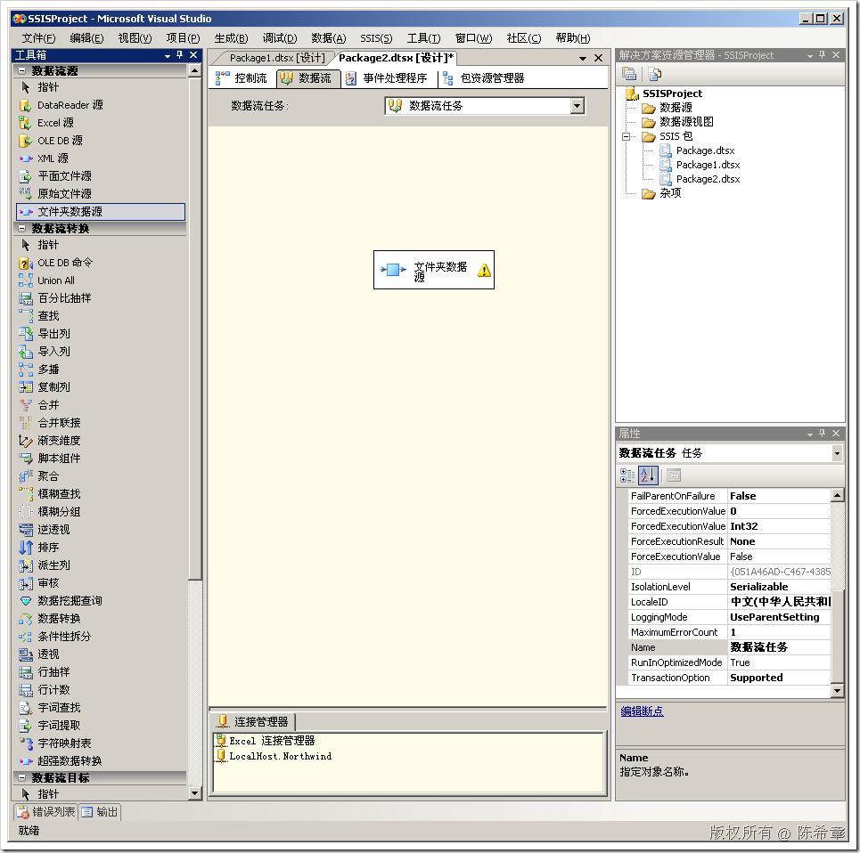](http://images.cnblogs.com/cnblogs_com/chenxizhang/WindowsLiveWriter/SSISDataFlowComponent_869B/image_4.png) 


我们从工具箱中将其拖放在数据源设计视图的时候，它上面有一个警告图标，这是因为它还没有进行配置


[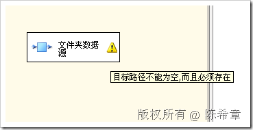](http://images.cnblogs.com/cnblogs_com/chenxizhang/WindowsLiveWriter/SSISDataFlowComponent_869B/image_10.png) 


点击该组件，右键，编辑


[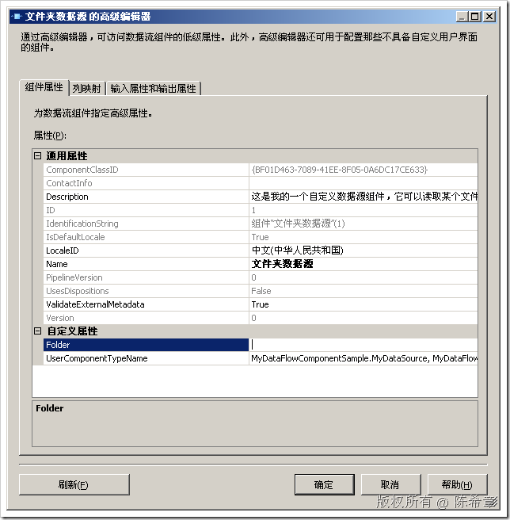](http://images.cnblogs.com/cnblogs_com/chenxizhang/WindowsLiveWriter/SSISDataFlowComponent_869B/image_12.png) 


我们的Folder属性自动显示在“自定义属性”中


我们在“输入属性和输出属性”页面中还可以看到我们定义的列


[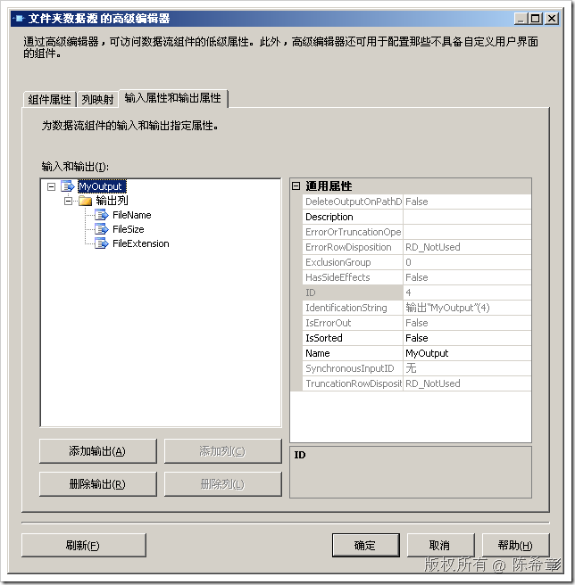](http://images.cnblogs.com/cnblogs_com/chenxizhang/WindowsLiveWriter/SSISDataFlowComponent_869B/image_14.png) 


好了，我们该看的都看完了，现在在Folder属性中输入一个路径，例如c:\windows


[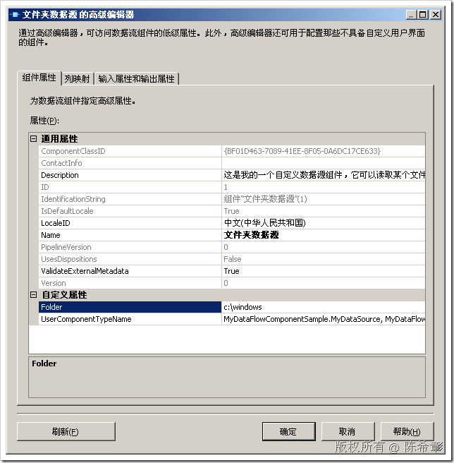](http://images.cnblogs.com/cnblogs_com/chenxizhang/WindowsLiveWriter/SSISDataFlowComponent_869B/image_16.png) 


点击“确定”即可完成配置。我们的数据源可以提供数据了。


[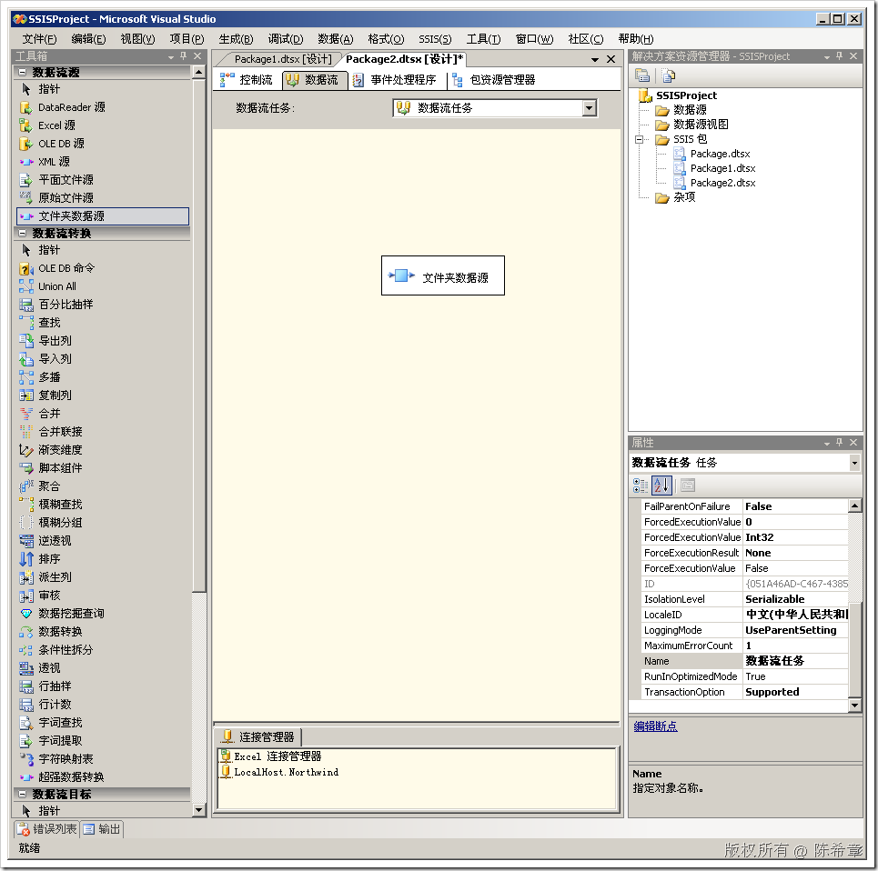](http://images.cnblogs.com/cnblogs_com/chenxizhang/WindowsLiveWriter/SSISDataFlowComponent_869B/image_18.png) 


【注意】如果此处输入的路径不存在，则无法通过验证


[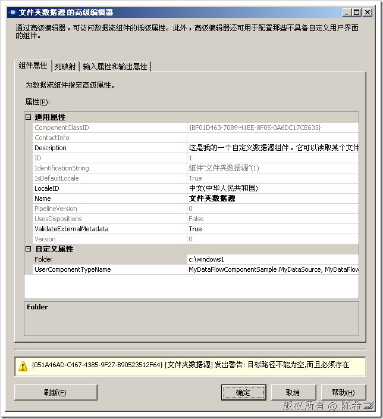](http://images.cnblogs.com/cnblogs_com/chenxizhang/WindowsLiveWriter/SSISDataFlowComponent_869B/image_28.png) 


为了让这个例子更有趣味性，我们添加一个“排序”转换（按照文件大小降序排列），同时添加一个Excel数据目标作为接收。这两个组件是标准的，我这里就不赘述了


[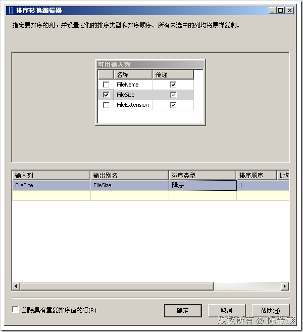](http://images.cnblogs.com/cnblogs_com/chenxizhang/WindowsLiveWriter/SSISDataFlowComponent_869B/image_20.png) 


[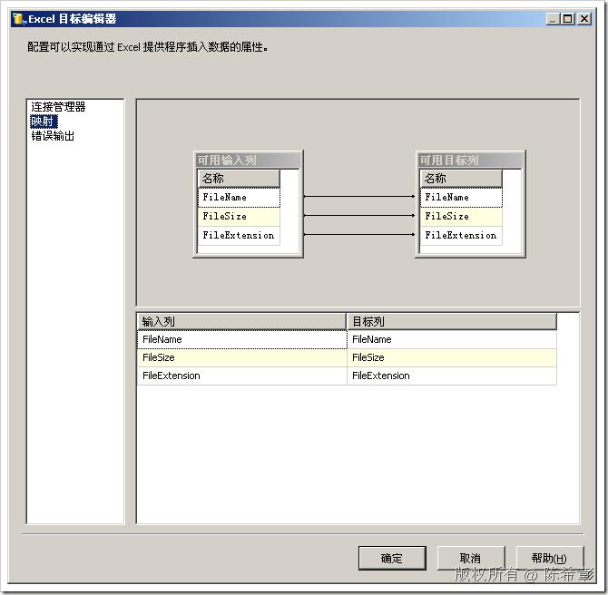](http://images.cnblogs.com/cnblogs_com/chenxizhang/WindowsLiveWriter/SSISDataFlowComponent_869B/image_22.png) 


 


接下来，我们就可以执行任务了


[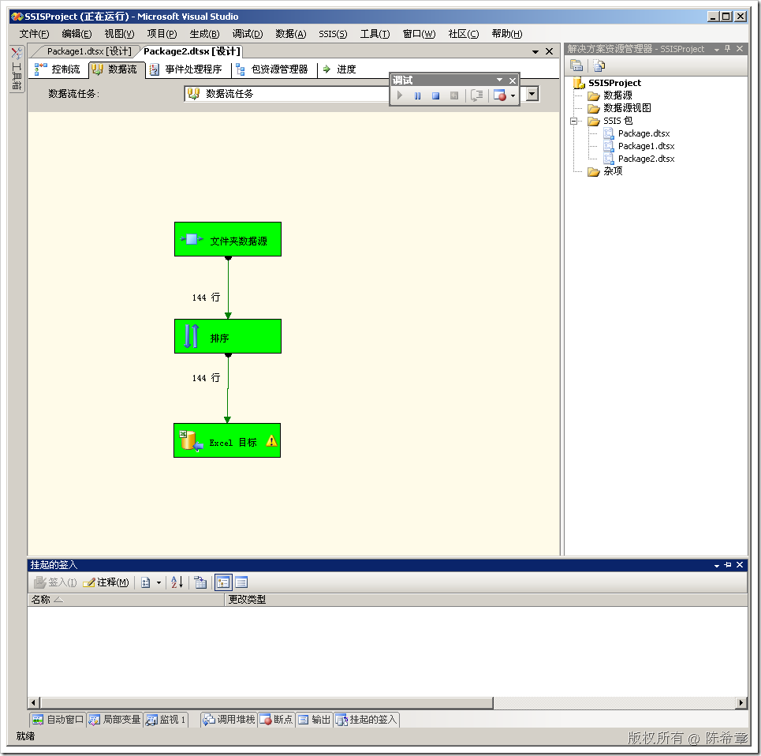](http://images.cnblogs.com/cnblogs_com/chenxizhang/WindowsLiveWriter/SSISDataFlowComponent_869B/image_24.png) 


太棒了，我们成功地执行了任务。现在我们来看一下输出来的那个Excel文件


[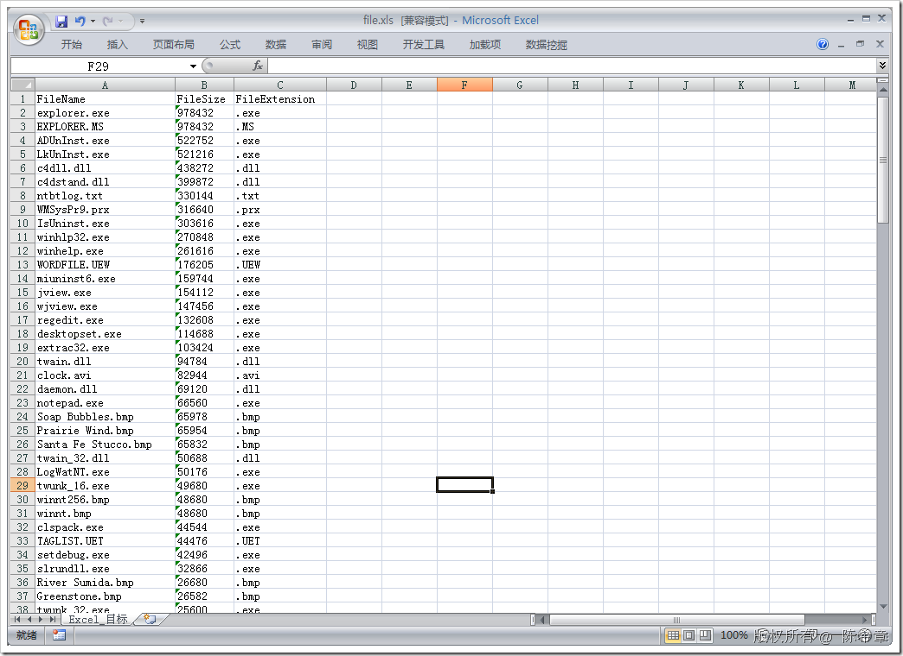](http://images.cnblogs.com/cnblogs_com/chenxizhang/WindowsLiveWriter/SSISDataFlowComponent_869B/image_26.png) 


 


小结：这一篇我们讲解了如何设计一个最简单的数据源组件。它可以读取某个文件夹的文件信息。设计一个数据源的步骤大致如下


* 准备组件的属性（一般是定义自定义属性，自定义输出和列）
* 编写验证规则
* 重写输出方法


本文由作者：[陈希章](http://www.xizhang.com) 于 2009/6/21 9:50:10 
发布在：<http://www.cnblogs.com/chenxizhang/>  

本文版权归作者所有，可以转载，但未经作者同意必须保留此段声明，且在文章页面明显位置给出原文连接，否则保留追究法律责任的权利。   

更多博客文章，以及作者对于博客引用方面的完整声明以及合作方面的政策，请参考以下站点：[陈希章的博客中心](http://www.xizhang.com/blog.htm)
