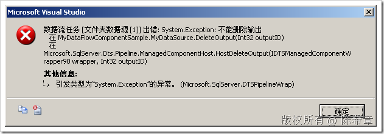
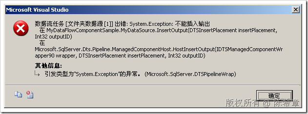
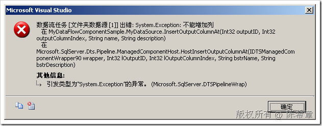
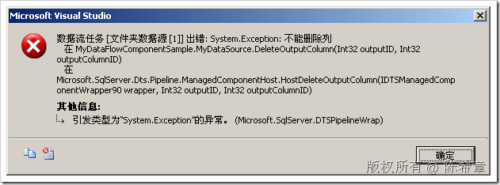
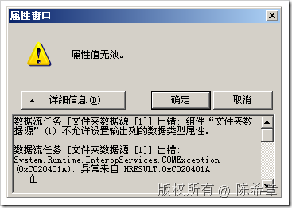

# 如何在自定义数据源组件中限制用户的更改 
> 原文发表于 2009-06-21, 地址: http://www.cnblogs.com/chenxizhang/archive/2009/06/21/1507645.html 


上一篇我们讲到了如何开发一个自定义的数据源组件，期间提到了一个疑问：

 如何避免用户去修改我们设计好的输出，以及列的属性呢？

 其实方法也比较简单，我们添加下面的代码即可

 
```
 1:         public override void DeleteOutput(int outputID)
```

```
 2:         {
```

```
 3:             throw new Exception("不能删除输出");
```

```
 4:         }
```

```
 5:  
```

```
 6:         public override IDTSOutput90 InsertOutput(DTSInsertPlacement insertPlacement, 
```

```
 7:             int outputID)
```

```
 8:         {
```

```
 9:             throw new Exception("不能插入输出");
```

```
 10:         }
```

```
 11:  
```

```
 12:         public override void DeleteOutputColumn(int outputID, int outputColumnID)
```

```
 13:         {
```

```
 14:             throw new Exception("不能删除列");
```

```
 15:         }
```

```
 16:  
```

```
 17:         public override IDTSOutputColumn90 InsertOutputColumnAt(int outputID, 
```

```
 18:             int outputColumnIndex, string name, string description)
```

```
 19:         {
```

```
 20:             throw new Exception("不能增加列");
```

```
 21:         }
```

```
 22:         public override IDTSCustomProperty90 SetOutputColumnProperty(int outputID, 
```

```
 23:             int outputColumnID, string propertyName, object propertyValue)
```

```
 24:         {
```

```
 25:             throw new Exception("不能修改列的属性");
```

```
 26:         }
```

.csharpcode, .csharpcode pre
{
 font-size: small;
 color: black;
 font-family: consolas, "Courier New", courier, monospace;
 background-color: #ffffff;
 /*white-space: pre;*/
}
.csharpcode pre { margin: 0em; }
.csharpcode .rem { color: #008000; }
.csharpcode .kwrd { color: #0000ff; }
.csharpcode .str { color: #006080; }
.csharpcode .op { color: #0000c0; }
.csharpcode .preproc { color: #cc6633; }
.csharpcode .asp { background-color: #ffff00; }
.csharpcode .html { color: #800000; }
.csharpcode .attr { color: #ff0000; }
.csharpcode .alt 
{
 background-color: #f4f4f4;
 width: 100%;
 margin: 0em;
}
.csharpcode .lnum { color: #606060; }

也就是是重写有关的方法，当用户尝试增加，或者删除，或者修改的时候，抛出相应的异常。这个我们一般称为“设计时支持”


测试结果如下


```
[](http://images.cnblogs.com/cnblogs_com/chenxizhang/WindowsLiveWriter/f04c145dbda8_9724/image_2.png) 
```

```
[](http://images.cnblogs.com/cnblogs_com/chenxizhang/WindowsLiveWriter/f04c145dbda8_9724/image_4.png) 
```

```
[](http://images.cnblogs.com/cnblogs_com/chenxizhang/WindowsLiveWriter/f04c145dbda8_9724/image_6.png) 
```

```
[](http://images.cnblogs.com/cnblogs_com/chenxizhang/WindowsLiveWriter/f04c145dbda8_9724/image_8.png) 
```

.csharpcode, .csharpcode pre
{
 font-size: small;
 color: black;
 font-family: consolas, "Courier New", courier, monospace;
 background-color: #ffffff;
 /*white-space: pre;*/
}
.csharpcode pre { margin: 0em; }
.csharpcode .rem { color: #008000; }
.csharpcode .kwrd { color: #0000ff; }
.csharpcode .str { color: #006080; }
.csharpcode .op { color: #0000c0; }
.csharpcode .preproc { color: #cc6633; }
.csharpcode .asp { background-color: #ffff00; }
.csharpcode .html { color: #800000; }
.csharpcode .attr { color: #ff0000; }
.csharpcode .alt 
{
 background-color: #f4f4f4;
 width: 100%;
 margin: 0em;
}
.csharpcode .lnum { color: #606060; }


[](http://images.cnblogs.com/cnblogs_com/chenxizhang/WindowsLiveWriter/f04c145dbda8_9724/image_10.png)


本文由作者：[陈希章](http://www.xizhang.com) 于 2009/6/21 10:44:53 
发布在：<http://www.cnblogs.com/chenxizhang/>  

本文版权归作者所有，可以转载，但未经作者同意必须保留此段声明，且在文章页面明显位置给出原文连接，否则保留追究法律责任的权利。   

更多博客文章，以及作者对于博客引用方面的完整声明以及合作方面的政策，请参考以下站点：[陈希章的博客中心](http://www.xizhang.com/blog.htm)
