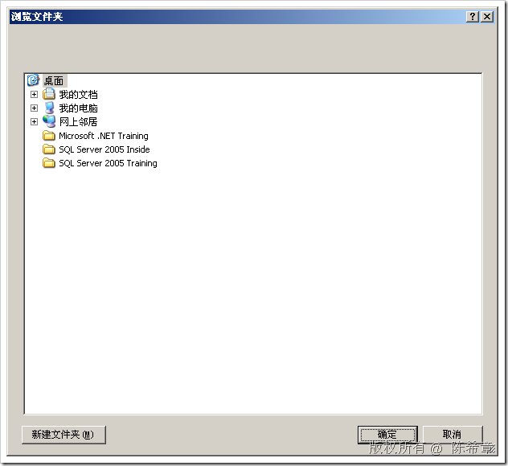
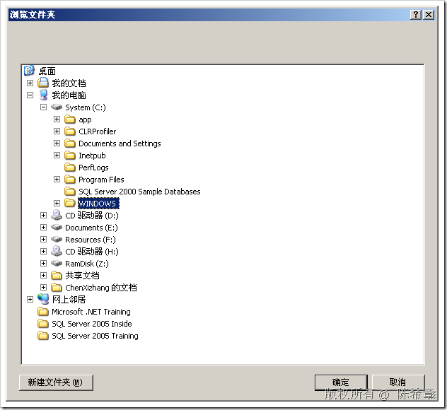
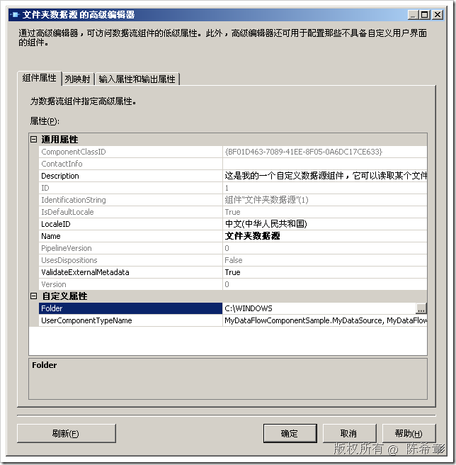
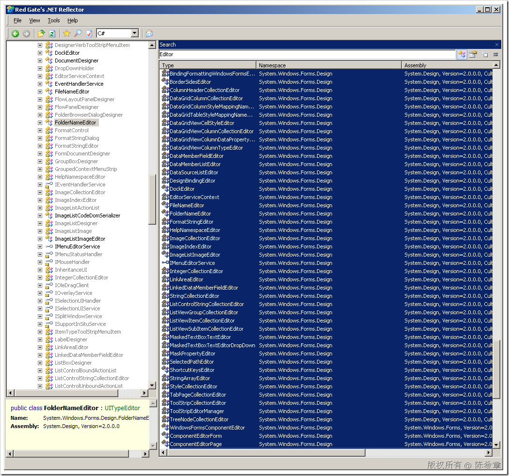
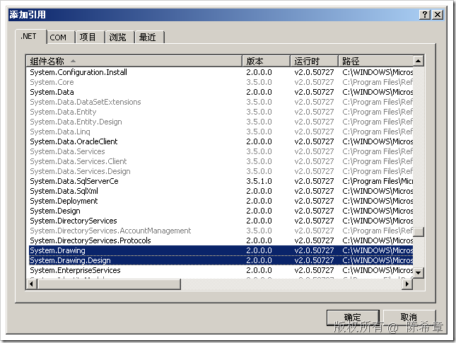
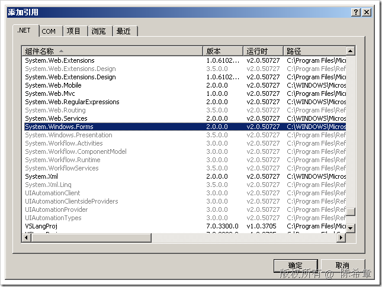
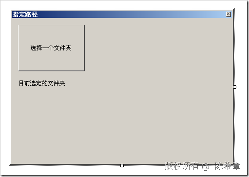
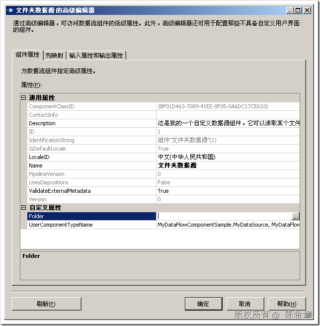
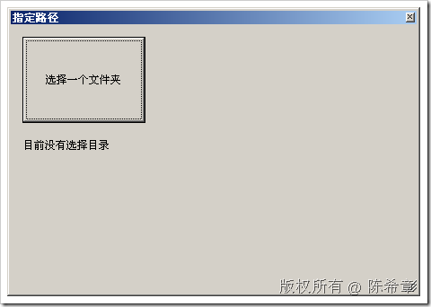
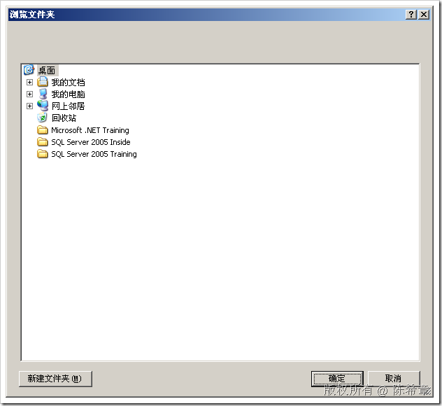

# 如何在自定义数据源组件中为自定义属性提供UIEditor 
> 原文发表于 2009-06-21, 地址: http://www.cnblogs.com/chenxizhang/archive/2009/06/21/1507680.html 


我们上一篇讲到了开发一个简单的数据源组件。大家应该还记得，我们有一个自定义属性：Folder。这个属性代表的是我们要遍历的目录。

 但有一点美中不足的是，Folder按理说最好是让用户去选择文件夹，而不应该手工输入才算比较好。因为手工输入有可能会输错，也比较麻烦。

 那么，如何添加这样的支持呢？

 我们可以修改一下下面的方法。红色的部分是我添加到


```
        public override void ProvideComponentProperties()
        {
            ComponentMetaData.RuntimeConnectionCollection.RemoveAll();
            RemoveAllInputsOutputsAndCustomProperties();

            IDTSCustomProperty90 folder = ComponentMetaData.CustomPropertyCollection.New();
            folder.Name = "Folder";
            **folder.UITypeEditor = 
 "System.Windows.Forms.Design.FolderNameEditor, System.Design, Version=1.0.3300.0,"+ 
 "Culture=neutral, PublicKeyToken=b03f5f7f11d50a3a";** 
            

            IDTSOutput90 output = ComponentMetaData.OutputCollection.New();
            output.Name = "MyOutput";
            

            //初始化的时候，准备几个输出列
            IDTSOutputColumn90 fileNameColumn = output.OutputColumnCollection.New();
            fileNameColumn.Name = "FileName";
            fileNameColumn.SetDataTypeProperties(DataType.DT\_WSTR, 256, 0, 0, 0);
            //如果是非Unicode则要提供CodePage，其他的类型可以设置为0


            IDTSOutputColumn90 fileSizeColumn = output.OutputColumnCollection.New();
            fileSizeColumn.Name = "FileSize";
            fileSizeColumn.SetDataTypeProperties(DataType.DT\_I8, 0, 0, 0, 0);


            IDTSOutputColumn90 fileExtensionColumn = output.OutputColumnCollection.New();
            fileExtensionColumn.Name = "FileExtension";
            fileExtensionColumn.SetDataTypeProperties(DataType.DT\_WSTR, 50, 0, 0, 0);

   
        }
```

.csharpcode, .csharpcode pre
{
 font-size: small;
 color: black;
 font-family: consolas, "Courier New", courier, monospace;
 background-color: #ffffff;
 /*white-space: pre;*/
}
.csharpcode pre { margin: 0em; }
.csharpcode .rem { color: #008000; }
.csharpcode .kwrd { color: #0000ff; }
.csharpcode .str { color: #006080; }
.csharpcode .op { color: #0000c0; }
.csharpcode .preproc { color: #cc6633; }
.csharpcode .asp { background-color: #ffff00; }
.csharpcode .html { color: #800000; }
.csharpcode .attr { color: #ff0000; }
.csharpcode .alt 
{
 background-color: #f4f4f4;
 width: 100%;
 margin: 0em;
}
.csharpcode .lnum { color: #606060; }

 


也就是说，我们为这个属性指定了一个所谓的Editor。


现在，我们可以在BI Studio中查看一下效果


[](http://images.cnblogs.com/cnblogs_com/chenxizhang/WindowsLiveWriter/UIEditor_A7E7/image_2.png) 


【注意】此时，Folder属性的右侧有一个小按钮。点击该按钮


[](http://images.cnblogs.com/cnblogs_com/chenxizhang/WindowsLiveWriter/UIEditor_A7E7/image_4.png) 


我们可以选择一个目录，例如c:\windows


[](http://images.cnblogs.com/cnblogs_com/chenxizhang/WindowsLiveWriter/UIEditor_A7E7/image_6.png) 


点击“确定”


[](http://images.cnblogs.com/cnblogs_com/chenxizhang/WindowsLiveWriter/UIEditor_A7E7/image_8.png) 


很不错，不是吗？


那么，除了这个Editor之外，是否还有其他现成的Editor呢


[](http://images.cnblogs.com/cnblogs_com/chenxizhang/WindowsLiveWriter/UIEditor_A7E7/image_10.png) 


另外一个用得最多的编辑器是：FileNameEditor，顾名思义，这是选择文件的


 


但是，除此之外，我们自己能不能提供一个自定义的编辑器呢？答案是可以的，我们可以继承UITypeEdit这个类型


首先，添加System.Draming和System.Drawing.Design的引用


[](http://images.cnblogs.com/cnblogs_com/chenxizhang/WindowsLiveWriter/UIEditor_A7E7/image_16.png) 


然后，编写一个类型


```
    public class MyTypeUIEditor : System.Drawing.Design.UITypeEditor {
        /// <summary>
        /// 这个方法会被自动调用。
        /// </summary>
        /// <param name="context"></param>
        /// <param name="provider"></param>
        /// <param name="value">这是组件现有值</param>
        /// <returns>要返回给组件的值</returns>
        public override object EditValue(System.ComponentModel.ITypeDescriptorContext context, IServiceProvider provider, object value)
        {
            return base.EditValue(context, provider, value);
        }
    }
```

.csharpcode, .csharpcode pre
{
 font-size: small;
 color: black;
 font-family: consolas, "Courier New", courier, monospace;
 background-color: #ffffff;
 /*white-space: pre;*/
}
.csharpcode pre { margin: 0em; }
.csharpcode .rem { color: #008000; }
.csharpcode .kwrd { color: #0000ff; }
.csharpcode .str { color: #006080; }
.csharpcode .op { color: #0000c0; }
.csharpcode .preproc { color: #cc6633; }
.csharpcode .asp { background-color: #ffff00; }
.csharpcode .html { color: #800000; }
.csharpcode .attr { color: #ff0000; }
.csharpcode .alt 
{
 background-color: #f4f4f4;
 width: 100%;
 margin: 0em;
}
.csharpcode .lnum { color: #606060; }

我们需要编写一个继承自UITypeEditor的类型，然后重写EditValue方法即可。一般这里可以传递一个窗体过来


为此，我们添加System.Windows.Forms的引用，并且准备一个简单的窗体，大致如下


[](http://images.cnblogs.com/cnblogs_com/chenxizhang/WindowsLiveWriter/UIEditor_A7E7/image_18.png) 


[](http://images.cnblogs.com/cnblogs_com/chenxizhang/WindowsLiveWriter/UIEditor_A7E7/image_20.png) 


窗体的代码如下


```
using System;
using System.Windows.Forms;

namespace MyDataFlowComponentSample
{
    public partial class MyUIEditorForm : Form
    {
        public MyUIEditorForm()
        {
            InitializeComponent();
        }

        public MyUIEditorForm(string current)
            : this()
        {
            lbCurrentFolder.Text = current;
        }

        private string \_path = string.Empty;
        public string Path { get { return \_path; } set { \_path = value; } }
        private void btSelect\_Click(object sender, EventArgs e)
        {
            FolderBrowserDialog dialog = new FolderBrowserDialog();
            if (dialog.ShowDialog() == DialogResult.OK)
            {
                Path = dialog.SelectedPath;
                return;
            }
            this.DialogResult = DialogResult.None;
        }
    }
}

```

.csharpcode, .csharpcode pre
{
 font-size: small;
 color: black;
 font-family: consolas, "Courier New", courier, monospace;
 background-color: #ffffff;
 /*white-space: pre;*/
}
.csharpcode pre { margin: 0em; }
.csharpcode .rem { color: #008000; }
.csharpcode .kwrd { color: #0000ff; }
.csharpcode .str { color: #006080; }
.csharpcode .op { color: #0000c0; }
.csharpcode .preproc { color: #cc6633; }
.csharpcode .asp { background-color: #ffff00; }
.csharpcode .html { color: #800000; }
.csharpcode .attr { color: #ff0000; }
.csharpcode .alt 
{
 background-color: #f4f4f4;
 width: 100%;
 margin: 0em;
}
.csharpcode .lnum { color: #606060; }

到这里为止，我们准备好了一个用于编辑的窗体，现在回到MyTypeUIEditor这个类型，修改它的EditValue方法


```
    public class MyTypeUIEditor : System.Drawing.Design.UITypeEditor {
        /// <summary>
        /// 这个方法会被自动调用。
        /// </summary>
        /// <param name="context"></param>
        /// <param name="provider"></param>
        /// <param name="value">这是组件现有值</param>
        /// <returns>要返回给组件的值</returns>
        public override object EditValue(
            System.ComponentModel.ITypeDescriptorContext context, 
            IServiceProvider provider, 
            object value)
        {
            string current = "目前没有选择目录";
            if (value != null)
                current = value.ToString();

            MyUIEditorForm form = new MyUIEditorForm(current);
            if (form.ShowDialog() == System.Windows.Forms.DialogResult.OK)
            {
                return form.Path;
            }

            return current;
        }

        public override UITypeEditorEditStyle GetEditStyle(System.ComponentModel.ITypeDescriptorContext context)
        {
            return UITypeEditorEditStyle.Modal;
        }

        
    }
```

```
 
```

我们实现了EditValue方法，并且指定了我们的编辑器是一个模态对话框。（本文的尾部还将介绍另外一种方式：下拉列表）


.csharpcode, .csharpcode pre
{
 font-size: small;
 color: black;
 font-family: consolas, "Courier New", courier, monospace;
 background-color: #ffffff;
 /*white-space: pre;*/
}
.csharpcode pre { margin: 0em; }
.csharpcode .rem { color: #008000; }
.csharpcode .kwrd { color: #0000ff; }
.csharpcode .str { color: #006080; }
.csharpcode .op { color: #0000c0; }
.csharpcode .preproc { color: #cc6633; }
.csharpcode .asp { background-color: #ffff00; }
.csharpcode .html { color: #800000; }
.csharpcode .attr { color: #ff0000; }
.csharpcode .alt 
{
 background-color: #f4f4f4;
 width: 100%;
 margin: 0em;
}
.csharpcode .lnum { color: #606060; }

我们最后需要将这个Editor指定给数据源组件的Folder属性


```
            IDTSCustomProperty90 folder = ComponentMetaData.CustomPropertyCollection.New();
            folder.Name = "Folder";
 **folder.UITypeEditor = typeof(MyTypeUIEditor).AssemblyQualifiedName;**
```

.csharpcode, .csharpcode pre
{
 font-size: small;
 color: black;
 font-family: consolas, "Courier New", courier, monospace;
 background-color: #ffffff;
 /*white-space: pre;*/
}
.csharpcode pre { margin: 0em; }
.csharpcode .rem { color: #008000; }
.csharpcode .kwrd { color: #0000ff; }
.csharpcode .str { color: #006080; }
.csharpcode .op { color: #0000c0; }
.csharpcode .preproc { color: #cc6633; }
.csharpcode .asp { background-color: #ffff00; }
.csharpcode .html { color: #800000; }
.csharpcode .attr { color: #ff0000; }
.csharpcode .alt 
{
 background-color: #f4f4f4;
 width: 100%;
 margin: 0em;
}
.csharpcode .lnum { color: #606060; }


```
 
```

因为我们的编辑器类型就在程序集内部，所以可以像上面这样指定


我们来测试一下最后在BI Studio中的效果


```
[](http://images.cnblogs.com/cnblogs_com/chenxizhang/WindowsLiveWriter/UIEditor_A7E7/image_22.png) 
```

点击右侧的小图标


.csharpcode, .csharpcode pre
{
 font-size: small;
 color: black;
 font-family: consolas, "Courier New", courier, monospace;
 background-color: #ffffff;
 /*white-space: pre;*/
}
.csharpcode pre { margin: 0em; }
.csharpcode .rem { color: #008000; }
.csharpcode .kwrd { color: #0000ff; }
.csharpcode .str { color: #006080; }
.csharpcode .op { color: #0000c0; }
.csharpcode .preproc { color: #cc6633; }
.csharpcode .asp { background-color: #ffff00; }
.csharpcode .html { color: #800000; }
.csharpcode .attr { color: #ff0000; }
.csharpcode .alt 
{
 background-color: #f4f4f4;
 width: 100%;
 margin: 0em;
}
.csharpcode .lnum { color: #606060; }

[](http://images.cnblogs.com/cnblogs_com/chenxizhang/WindowsLiveWriter/UIEditor_A7E7/image_24.png) 


点击“选择一个文件夹”按钮


[](http://images.cnblogs.com/cnblogs_com/chenxizhang/WindowsLiveWriter/UIEditor_A7E7/image_26.png) 


[](http://images.cnblogs.com/cnblogs_com/chenxizhang/WindowsLiveWriter/UIEditor_A7E7/image_28.png) 


大功告成，呵呵


 


 


.csharpcode, .csharpcode pre
{
 font-size: small;
 color: black;
 font-family: consolas, "Courier New", courier, monospace;
 background-color: #ffffff;
 /*white-space: pre;*/
}
.csharpcode pre { margin: 0em; }
.csharpcode .rem { color: #008000; }
.csharpcode .kwrd { color: #0000ff; }
.csharpcode .str { color: #006080; }
.csharpcode .op { color: #0000c0; }
.csharpcode .preproc { color: #cc6633; }
.csharpcode .asp { background-color: #ffff00; }
.csharpcode .html { color: #800000; }
.csharpcode .attr { color: #ff0000; }
.csharpcode .alt 
{
 background-color: #f4f4f4;
 width: 100%;
 margin: 0em;
}
.csharpcode .lnum { color: #606060; }

本文由作者：[陈希章](http://www.xizhang.com) 于 2009/6/21 12:23:44 
发布在：<http://www.cnblogs.com/chenxizhang/>  

本文版权归作者所有，可以转载，但未经作者同意必须保留此段声明，且在文章页面明显位置给出原文连接，否则保留追究法律责任的权利。   

更多博客文章，以及作者对于博客引用方面的完整声明以及合作方面的政策，请参考以下站点：[陈希章的博客中心](http://www.xizhang.com/blog.htm)
