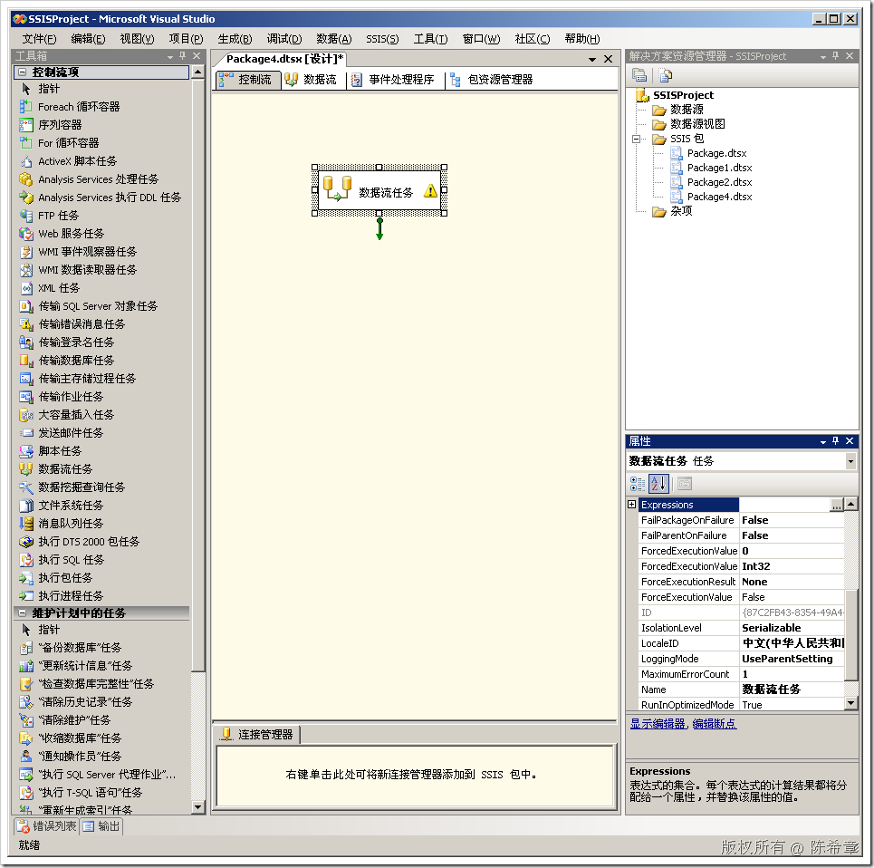
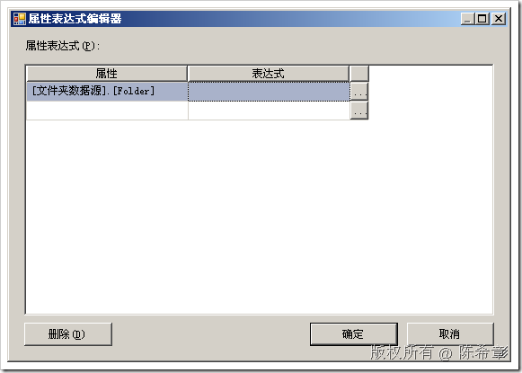
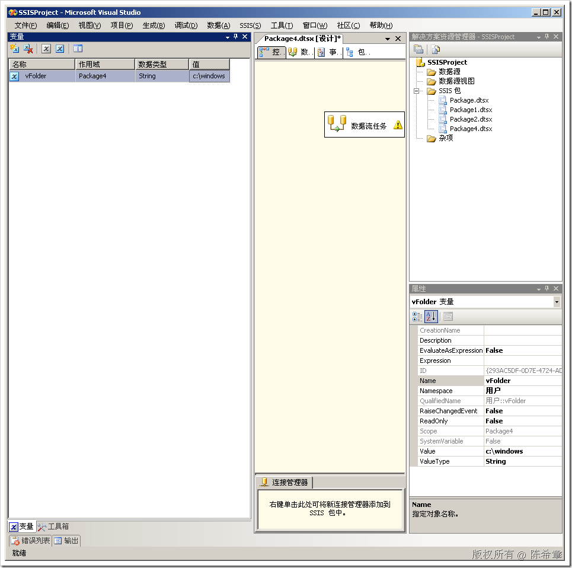
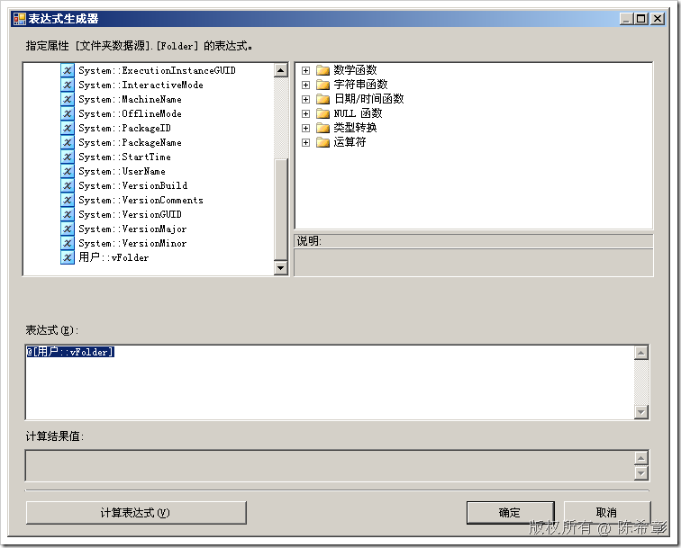
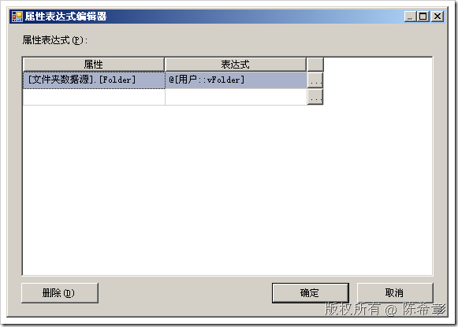
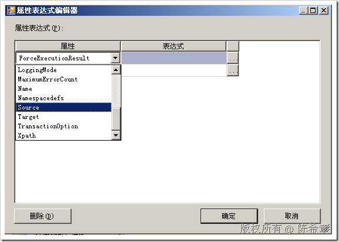

# 如何为自定义属性提供表达式绑定支持 
> 原文发表于 2009-06-21, 地址: http://www.cnblogs.com/chenxizhang/archive/2009/06/21/1507699.html 


我们在SSIS的设计过程中，经常会用到表达式。我也经常在讲课的时候提到：变量和表达式是SSIS包的灵魂，只有掌握了这两个东西的使用，才能设计足够灵活的包。

 那么，我们怎么样给自定义组件的自定义属性实现表达式绑定支持呢？

 其实比较简单，我们只需要一句代码就可以了。不需要其他任何的具体实现

  

 
```
            IDTSCustomProperty90 folder = ComponentMetaData.CustomPropertyCollection.New();
```

```
            folder.Name = "Folder";
```

```
            //folder.TypeConverter = typeof(FolderEnum).AssemblyQualifiedName;
```

```
            folder.UITypeEditor = typeof(MyTypeUIEditor).AssemblyQualifiedName;
```

```
 **folder.ExpressionType = DTSCustomPropertyExpressionType.CPET\_NOTIFY;**
```

 
注意，只要给自定义属性指定一个ExpressionType即可。指定为NOTIFY


在BI Studio中测试效果


[](http://images.cnblogs.com/cnblogs_com/chenxizhang/WindowsLiveWriter/088eeb62df23_B611/image_2.png) 


选中“数据流任务”，在属性窗口中，点击“Expressions”右侧的一个小按钮


[](http://images.cnblogs.com/cnblogs_com/chenxizhang/WindowsLiveWriter/088eeb62df23_B611/image_4.png) 


在这里就可以与变量进行绑定。为了演示，我们准备一个变量:vFolder


[](http://images.cnblogs.com/cnblogs_com/chenxizhang/WindowsLiveWriter/088eeb62df23_B611/image_6.png)   


[](http://images.cnblogs.com/cnblogs_com/chenxizhang/WindowsLiveWriter/088eeb62df23_B611/image_8.png) 


[](http://images.cnblogs.com/cnblogs_com/chenxizhang/WindowsLiveWriter/088eeb62df23_B611/image_10.png) 
 
到这里为止，我们就实现了自定义属性的表达式绑定
.csharpcode, .csharpcode pre
{
 font-size: small;
 color: black;
 font-family: consolas, "Courier New", courier, monospace;
 background-color: #ffffff;
 /*white-space: pre;*/
}
.csharpcode pre { margin: 0em; }
.csharpcode .rem { color: #008000; }
.csharpcode .kwrd { color: #0000ff; }
.csharpcode .str { color: #006080; }
.csharpcode .op { color: #0000c0; }
.csharpcode .preproc { color: #cc6633; }
.csharpcode .asp { background-color: #ffff00; }
.csharpcode .html { color: #800000; }
.csharpcode .attr { color: #ff0000; }
.csharpcode .alt 
{
 background-color: #f4f4f4;
 width: 100%;
 margin: 0em;
}
.csharpcode .lnum { color: #606060; }

 


题外话：


我们之前探讨过自定义任务项（Task）的开发。这些自定义任务项的属性是如何与表达式绑定呢？


好消息是：自定义任务项（Task）的属性是自动可以与表达式绑定的。无需任何设计。例如我们来看一下我们之前写的那个“超强XML任务”


[](http://images.cnblogs.com/cnblogs_com/chenxizhang/WindowsLiveWriter/088eeb62df23_B611/image_12.png)


本文由作者：[陈希章](http://www.xizhang.com) 于 2009/6/21 12:56:50 
发布在：<http://www.cnblogs.com/chenxizhang/>  

本文版权归作者所有，可以转载，但未经作者同意必须保留此段声明，且在文章页面明显位置给出原文连接，否则保留追究法律责任的权利。   
