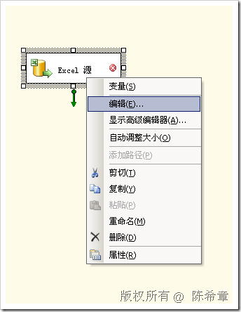
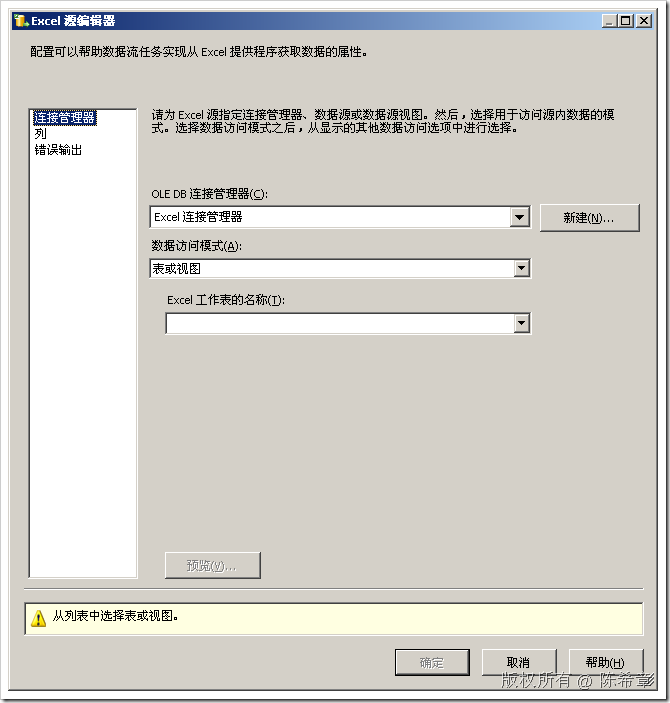
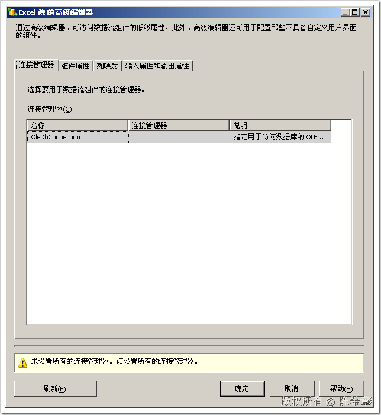
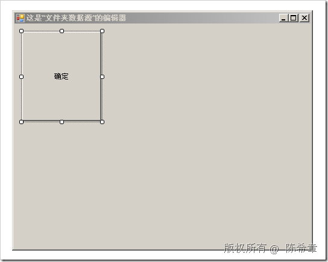
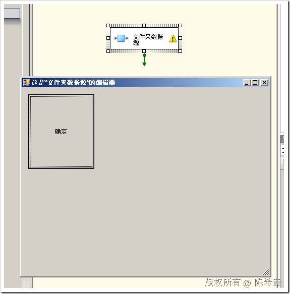
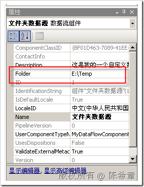

# 为SSIS编写自定义数据流组件(DataFlow Component)之进阶篇:自定义编辑器 
> 原文发表于 2009-06-21, 地址: http://www.cnblogs.com/chenxizhang/archive/2009/06/21/1507775.html 


我们之前几篇讨论过自定义数据流组件的一些技术，分别如下

 * 入门篇 <http://www.cnblogs.com/chenxizhang/archive/2009/06/20/1507467.html>
* 数据流组件 <http://www.cnblogs.com/chenxizhang/archive/2009/06/21/1507631.html>
* 如何在自定义数据源组件中限制用户的更改  <http://www.cnblogs.com/chenxizhang/archive/2009/06/21/1507645.html>
* 如何在自定义数据源组件中为自定义属性提供UIEditor <http://www.cnblogs.com/chenxizhang/archive/2009/06/21/1507680.html>
* 如何为自定义属性提供下拉选项 <http://www.cnblogs.com/chenxizhang/archive/2009/06/21/1507686.html>
* 如何为自定义属性提供表达式绑定支持 <http://www.cnblogs.com/chenxizhang/archive/2009/06/21/1507699.html>

 本节，将继续讨论最有一个话题，就是说除了像如上那样提供自定义属性之外，是否还可以提供一个专门的组件编辑器。

 为什么需要说这个问题呢？

 如果大家对SSIS数据流组件比较熟悉的话，就知道每个组件都有两个编辑器。我们分别来看一下。下面我以Excel源为例

 [](http://images.cnblogs.com/cnblogs_com/chenxizhang/WindowsLiveWriter/SSISDataFlowComponent_D23E/image_2.png) 

 选择“编辑”之后

 [](http://images.cnblogs.com/cnblogs_com/chenxizhang/WindowsLiveWriter/SSISDataFlowComponent_D23E/image_4.png) 

 而选择“显示高级编辑器”之后

 [](http://images.cnblogs.com/cnblogs_com/chenxizhang/WindowsLiveWriter/SSISDataFlowComponent_D23E/image_6.png) 

  

 如果看过之前的几篇文章，大家对于“高级编辑器”应该是比较熟悉的。就是说，如果我们直接在ProvideComponentProperties方法中通过下面这样的方式添加属性的话，这些属性就会出现在高级编辑器的“组件属性”中。

 IDTSCustomProperty90 folder = ComponentMetaData.CustomPropertyCollection.New();  
folder.Name = "Folder";  

 那么，我们回到这次讨论的问题。就是说，除了这个高级编辑器，另外一个编辑器应该怎么实现呢？当然，前提在于你的组件确实比较复杂，高级编辑器不能满足要求。（这句话说起来有点拗口，因为高级编辑器按理说应该是很高级的，呵呵）

 【注意】我倒是推荐你把所谓的高级编辑器理解为默认编辑器。

  

 根据我们之前为自定义任务项（Task）开发编辑器的经验，我们不难理解下面的一些步骤

 1. 创建一个实现了IDTSComponentUI接口的类型.该接口位于Microsoft.SqlServer.Dts.Pipeline.Design这个命名空间


```
    public class MyDataSourceUIEditor : IDtsComponentUI {

        #region IDtsComponentUI 成员

        public void Delete(System.Windows.Forms.IWin32Window parentWindow)
        {

        }

        public bool Edit(System.Windows.Forms.IWin32Window parentWindow, 
            Microsoft.SqlServer.Dts.Runtime.Variables variables, 
            Microsoft.SqlServer.Dts.Runtime.Connections connections)
        {
            //这里可以创建一个窗体，供用户去进行编辑
            return true;
        }

        public void Help(System.Windows.Forms.IWin32Window parentWindow)
        {
            System.Windows.Forms.Help.ShowHelp(null, "http://www.xizhang.com");
        }


        public void Initialize(IDTSComponentMetaData90 dtsComponentMetadata, 
            IServiceProvider serviceProvider)
        {
            
        }

        public void New(System.Windows.Forms.IWin32Window parentWindow)
        {
        }

        #endregion
    }
```

.csharpcode, .csharpcode pre
{
 font-size: small;
 color: black;
 font-family: consolas, "Courier New", courier, monospace;
 background-color: #ffffff;
 /*white-space: pre;*/
}
.csharpcode pre { margin: 0em; }
.csharpcode .rem { color: #008000; }
.csharpcode .kwrd { color: #0000ff; }
.csharpcode .str { color: #006080; }
.csharpcode .op { color: #0000c0; }
.csharpcode .preproc { color: #cc6633; }
.csharpcode .asp { background-color: #ffff00; }
.csharpcode .html { color: #800000; }
.csharpcode .attr { color: #ff0000; }
.csharpcode .alt 
{
 background-color: #f4f4f4;
 width: 100%;
 margin: 0em;
}
.csharpcode .lnum { color: #606060; }

2. 然后，在组件类上面进行指定关联


```
    [DtsPipelineComponent(
          ComponentType=ComponentType.SourceAdapter,
          Description="这是我的一个自定义数据源组件，它可以读取某个文件夹下面的文件信息",
          DisplayName="文件夹数据源",
          UITypeName = "MyDataFlowComponentSample.MyDataSourceUIEditor, MyDataFlowComponentSample, Version=1.0.0.0, 
```

```
Culture=neutral, PublicKeyToken=5207ee26f0ac0166"
          )]
```


.csharpcode, .csharpcode pre
{
 font-size: small;
 color: black;
 font-family: consolas, "Courier New", courier, monospace;
 background-color: #ffffff;
 /*white-space: pre;*/
}
.csharpcode pre { margin: 0em; }
.csharpcode .rem { color: #008000; }
.csharpcode .kwrd { color: #0000ff; }
.csharpcode .str { color: #006080; }
.csharpcode .op { color: #0000c0; }
.csharpcode .preproc { color: #cc6633; }
.csharpcode .asp { background-color: #ffff00; }
.csharpcode .html { color: #800000; }
.csharpcode .attr { color: #ff0000; }
.csharpcode .alt 
{
 background-color: #f4f4f4;
 width: 100%;
 margin: 0em;
}
.csharpcode .lnum { color: #606060; }


确实就是如上的步骤。其实并不复杂，对吧。很多技术都是想通的。


下面我来简单地实现一下这个编辑器。为此我需要添加一个新的窗体。


[](http://images.cnblogs.com/cnblogs_com/chenxizhang/WindowsLiveWriter/SSISDataFlowComponent_D23E/image_8.png) 


窗体代码大致如下


```
using System;
using System.Windows.Forms;
using Microsoft.SqlServer.Dts.Pipeline.Wrapper;
using Microsoft.SqlServer.Dts.Runtime;


namespace MyDataFlowComponentSample
{
    public partial class MyDatasourceUIEditorForm : Form
    {
        public MyDatasourceUIEditorForm()
        {
            InitializeComponent();
        }


        IDTSComponentMetaData90 metaValue;
        Variables vars;
        Connections conns;

        /// <summary>
        /// 这个特殊的构造器可以让编辑器与具体的组件进行联系
        /// </summary>
        /// <param name="meta">这个代表了组件的元数据</param>
        /// <param name="variables">这是包中的变量</param>
        /// <param name="connections">这是包中的连接管理器</param>
        public MyDatasourceUIEditorForm(IDTSComponentMetaData90 meta, 
            Variables variables, Connections connections)
            : this()
        {
            metaValue = meta;
            vars = variables;
            conns = connections;
        }

        private void btOk\_Click(object sender, EventArgs e)
        {
            metaValue.CustomPropertyCollection["Folder"].Value=@"E:\Temp";
            //作为演示目的，这里直接用代码给某个属性赋值
        }
    }
}

```

.csharpcode, .csharpcode pre
{
 font-size: small;
 color: black;
 font-family: consolas, "Courier New", courier, monospace;
 background-color: #ffffff;
 /*white-space: pre;*/
}
.csharpcode pre { margin: 0em; }
.csharpcode .rem { color: #008000; }
.csharpcode .kwrd { color: #0000ff; }
.csharpcode .str { color: #006080; }
.csharpcode .op { color: #0000c0; }
.csharpcode .preproc { color: #cc6633; }
.csharpcode .asp { background-color: #ffff00; }
.csharpcode .html { color: #800000; }
.csharpcode .attr { color: #ff0000; }
.csharpcode .alt 
{
 background-color: #f4f4f4;
 width: 100%;
 margin: 0em;
}
.csharpcode .lnum { color: #606060; }

准备好这个窗体之后，我们再回过来修改一下UIEditor这个类型。


```
    public class MyDataSourceUIEditor : IDtsComponentUI {

        #region IDtsComponentUI 成员

        public void Delete(System.Windows.Forms.IWin32Window parentWindow)
        {

        }


        public bool Edit(System.Windows.Forms.IWin32Window parentWindow, 
            Microsoft.SqlServer.Dts.Runtime.Variables variables, 
            Microsoft.SqlServer.Dts.Runtime.Connections connections)
        {
            //这里可以创建一个窗体，供用户去进行编辑

            using (MyDatasourceUIEditorForm form = 
                new MyDatasourceUIEditorForm(meta, variables, connections))
            {
                return form.ShowDialog() == DialogResult.OK;
            }
        }

        public void Help(System.Windows.Forms.IWin32Window parentWindow)
        {
            System.Windows.Forms.Help.ShowHelp(null, "http://www.xizhang.com");
        }


        private IDTSComponentMetaData90 meta;
        public void Initialize(IDTSComponentMetaData90 dtsComponentMetadata, 
            IServiceProvider serviceProvider)
        {
            meta = dtsComponentMetadata;
            //这个dtsComponentMetadata可以连接到组件的元数据，这样就可以传递给编辑器窗口，进行属性的读写
        }

        public void New(System.Windows.Forms.IWin32Window parentWindow)
        {
        }

        #endregion
    }
```

.csharpcode, .csharpcode pre
{
 font-size: small;
 color: black;
 font-family: consolas, "Courier New", courier, monospace;
 background-color: #ffffff;
 /*white-space: pre;*/
}
.csharpcode pre { margin: 0em; }
.csharpcode .rem { color: #008000; }
.csharpcode .kwrd { color: #0000ff; }
.csharpcode .str { color: #006080; }
.csharpcode .op { color: #0000c0; }
.csharpcode .preproc { color: #cc6633; }
.csharpcode .asp { background-color: #ffff00; }
.csharpcode .html { color: #800000; }
.csharpcode .attr { color: #ff0000; }
.csharpcode .alt 
{
 background-color: #f4f4f4;
 width: 100%;
 margin: 0em;
}
.csharpcode .lnum { color: #606060; }

 


重新编译项目，然后部署。


接下来我们在BI Studio中来看一下效果。我们选中组件，然后右键，编辑。果然看到了我们的窗体


[](http://images.cnblogs.com/cnblogs_com/chenxizhang/WindowsLiveWriter/SSISDataFlowComponent_D23E/image_10.png) 


点击“确定”按钮之后，该组件的Folder属性也确实修改为了“E:\Temp”


[](http://images.cnblogs.com/cnblogs_com/chenxizhang/WindowsLiveWriter/SSISDataFlowComponent_D23E/image_12.png) 


到这里为止，我们就为数据源组件实现了独立的编辑器。


本文由作者：[陈希章](http://www.xizhang.com) 于 2009/6/21 14:57:03 
发布在：<http://www.cnblogs.com/chenxizhang/>  

本文版权归作者所有，可以转载，但未经作者同意必须保留此段声明，且在文章页面明显位置给出原文连接，否则保留追究法律责任的权利。   


