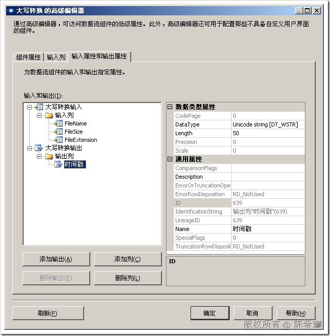
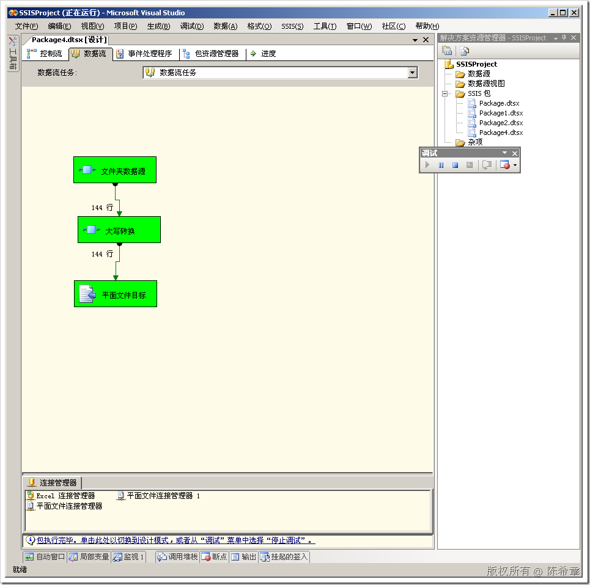
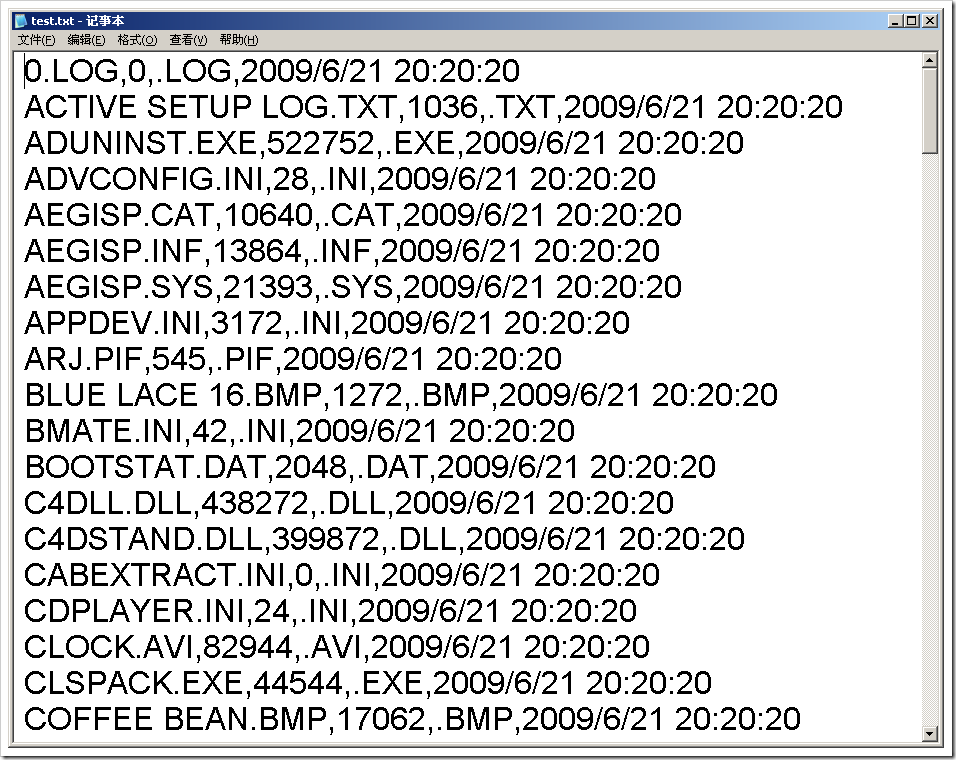

# 如何在同步转换组件中增加输出列 
> 原文发表于 2009-06-21, 地址: http://www.cnblogs.com/chenxizhang/archive/2009/06/21/1507911.html 


上一篇我们演示了一个比较简单的同步转换组件的开发，它的功能甚至都用不着我们开发这个组件：它是把字符转成大写。

 这样的需求的确可以通过派生列的方式来完成。我们讲解这个简单的例子主要是演示开发同步转换组件的流程。

 这一篇我们还需要继续讨论开发同步转换组件的问题。

 问题就是：我们能不能在转换之时添加自己的输出列？答案是：可以

 下面演示的例子是在每一行中加一个列，显示时间戳信息。

  

 1. 修改ProvideComponentProperties 方法。黑色大字体的部分，是增加了一个输出列的定义


```
        /// <summary>
        /// 这个方法提供组件必须的一些属性。
        /// 这里主要给默认的输入和输出重命名，让它更加形象
        /// </summary>
        public override void ProvideComponentProperties()
        {
            base.ProvideComponentProperties();
            ComponentMetaData.InputCollection[0].Name = "大写转换输入";
            ComponentMetaData.OutputCollection[0].Name = "大写转换输出";
            //ComponentMetaData.OutputCollection[1].SynchronousInputID = ComponentMetaData.InputCollection[0].ID;
            //如果调用了base.ProvideComponentProperties，则可以省略这句代码


   **IDTSOutputColumn90 timestampColumn = ComponentMetaData
 .OutputCollection[0].OutputColumnCollection.New();

 timestampColumn.Name = "时间戳";
 timestampColumn.SetDataTypeProperties(DataType.DT\_WSTR, 50, 0, 0, 0);**

        }
```

2. 修改PreExecute方法


```
        List<int> \_columns = new List<int>();//这个集合来保存需要处理的列的索引号
        int timestampColumnindex;
        /// <summary>
        /// 这个方法是ProcessInput之前的准备工作。
        /// 我们检测所有输入列中类型为字符型的，并将它的索引号记录起来
        /// 为了让ProcessInput能使用到这个信息，我们定义一个公用变量
        /// </summary>
        public override void PreExecute()
        {
            IDTSInput90 input = ComponentMetaData.InputCollection[0];
            IDTSInputColumnCollection90 columns = input.InputColumnCollection;

            foreach (IDTSInputColumn90 item in columns)
            {
                if (item.DataType == DataType.DT\_WSTR || item.DataType == DataType.DT\_STR)
                {
                    \_columns.Add(BufferManager.FindColumnByLineageID(input.Buffer, item.LineageID));
                }
            }

            IDTSOutput90 output = ComponentMetaData.OutputCollection[0];
            IDTSOutputColumn90 column = output.OutputColumnCollection[0];
            timestampColumnindex = BufferManager.FindColumnByLineageID(input.Buffer, column.LineageID);
            **//一定要注意，因为是同步输出，所以这里查找仍热是在input.buffer里面找，而不是output.buffer**
```


> 
> ```
> **//也就是说，至于遇到了异步转换，才会另外创建一个buffer，否则是使用同一个buffer**
> 
>         }
> ```
> 


.csharpcode, .csharpcode pre
{
 font-size: small;
 color: black;
 font-family: consolas, "Courier New", courier, monospace;
 background-color: #ffffff;
 /*white-space: pre;*/
}
.csharpcode pre { margin: 0em; }
.csharpcode .rem { color: #008000; }
.csharpcode .kwrd { color: #0000ff; }
.csharpcode .str { color: #006080; }
.csharpcode .op { color: #0000c0; }
.csharpcode .preproc { color: #cc6633; }
.csharpcode .asp { background-color: #ffff00; }
.csharpcode .html { color: #800000; }
.csharpcode .attr { color: #ff0000; }
.csharpcode .alt 
{
 background-color: #f4f4f4;
 width: 100%;
 margin: 0em;
}
.csharpcode .lnum { color: #606060; }

3.  修改ProcessInput方法


 


```
        public override void ProcessInput(int inputID, PipelineBuffer buffer)
        {
            while (buffer.NextRow())
            {
                foreach (int index in \_columns)
                {
                    string str = buffer.GetString(index);
                    
                    buffer.SetString(index, str.ToUpper());
                    
                }
                **buffer.SetString(timestampColumnindex, DateTime.Now.ToString());**


            }
        }

```

.csharpcode, .csharpcode pre
{
 font-size: small;
 color: black;
 font-family: consolas, "Courier New", courier, monospace;
 background-color: #ffffff;
 /*white-space: pre;*/
}
.csharpcode pre { margin: 0em; }
.csharpcode .rem { color: #008000; }
.csharpcode .kwrd { color: #0000ff; }
.csharpcode .str { color: #006080; }
.csharpcode .op { color: #0000c0; }
.csharpcode .preproc { color: #cc6633; }
.csharpcode .asp { background-color: #ffff00; }
.csharpcode .html { color: #800000; }
.csharpcode .attr { color: #ff0000; }
.csharpcode .alt 
{
 background-color: #f4f4f4;
 width: 100%;
 margin: 0em;
}
.csharpcode .lnum { color: #606060; }

4. 重新编译，部署


[](http://images.cnblogs.com/cnblogs_com/chenxizhang/WindowsLiveWriter/807c57c991ac_11E56/image_2.png) 


[](http://images.cnblogs.com/cnblogs_com/chenxizhang/WindowsLiveWriter/807c57c991ac_11E56/image_6.png) 


最后输出的文本文件如下


[](http://images.cnblogs.com/cnblogs_com/chenxizhang/WindowsLiveWriter/807c57c991ac_11E56/image_8.png) 


.csharpcode, .csharpcode pre
{
 font-size: small;
 color: black;
 font-family: consolas, "Courier New", courier, monospace;
 background-color: #ffffff;
 /*white-space: pre;*/
}
.csharpcode pre { margin: 0em; }
.csharpcode .rem { color: #008000; }
.csharpcode .kwrd { color: #0000ff; }
.csharpcode .str { color: #006080; }
.csharpcode .op { color: #0000c0; }
.csharpcode .preproc { color: #cc6633; }
.csharpcode .asp { background-color: #ffff00; }
.csharpcode .html { color: #800000; }
.csharpcode .attr { color: #ff0000; }
.csharpcode .alt 
{
 background-color: #f4f4f4;
 width: 100%;
 margin: 0em;
}
.csharpcode .lnum { color: #606060; }

本文由作者：[陈希章](http://www.xizhang.com) 于 2009/6/21 20:21:42 
发布在：<http://www.cnblogs.com/chenxizhang/>  

本文版权归作者所有，可以转载，但未经作者同意必须保留此段声明，且在文章页面明显位置给出原文连接，否则保留追究法律责任的权利。   

更多博客文章，以及作者对于博客引用方面的完整声明以及合作方面的政策，请参考以下站点：[陈希章的博客中心](http://www.xizhang.com/blog.htm)
