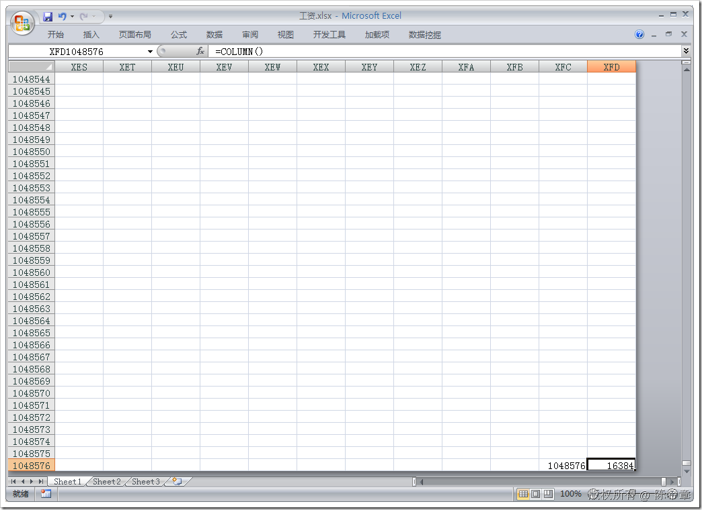
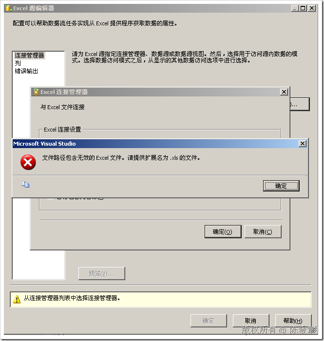
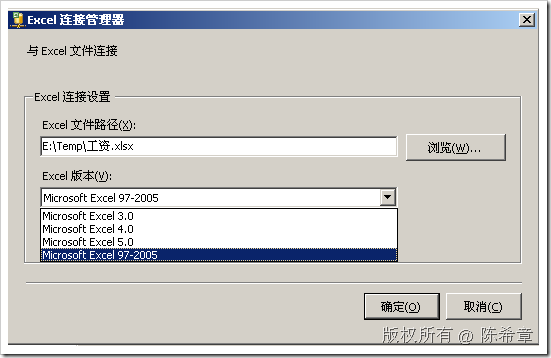
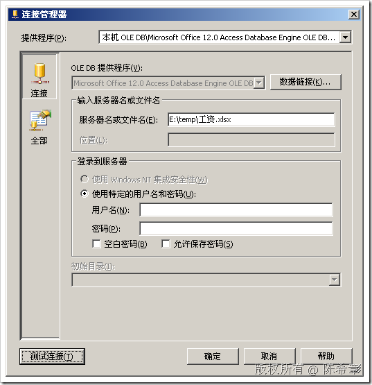
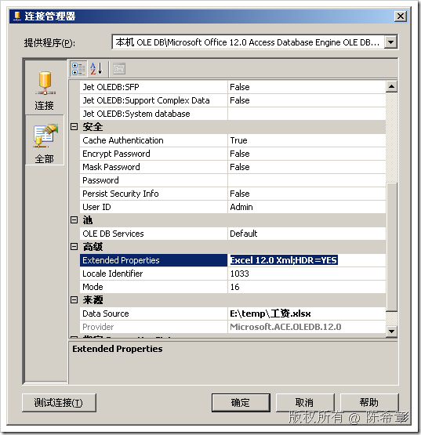
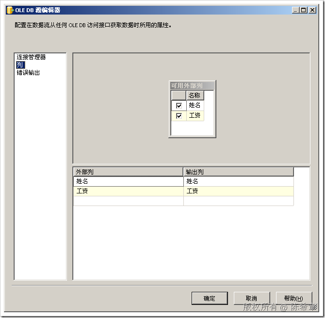
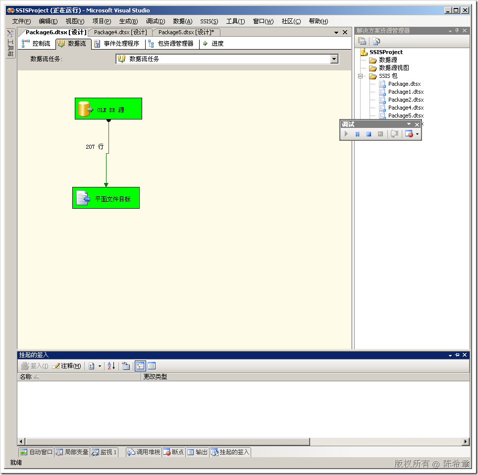
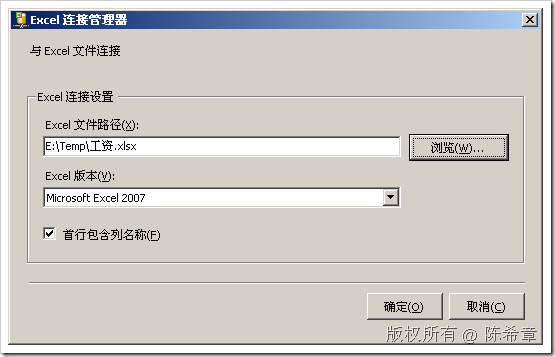
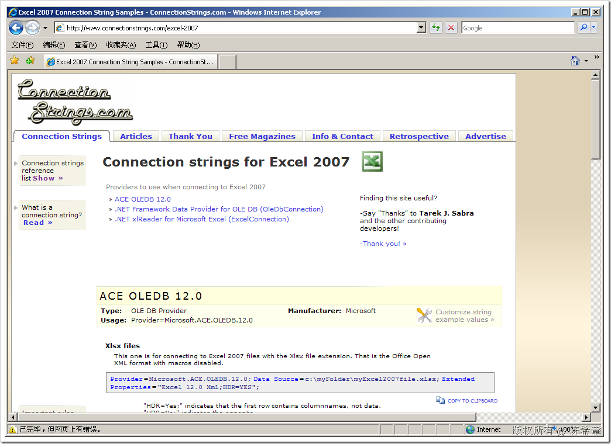

# SSIS 2008开始支持直接将Excel 2007文件作为数据源和目标 
> 原文发表于 2009-06-22, 地址: http://www.cnblogs.com/chenxizhang/archive/2009/06/22/1508129.html 

有不少朋友问到这个问题：SSIS能不能支持Excel 2007的文件作为数据源或者目标呢？答案是：SSIS 2005不可以（但有变通办法），而SSIS 2008直接可以

 首先，我们大致说一下为什么有人想用Excel 2007做数据源。因为Excel 2007的行数和列数都大大增加了。

 * 截至Excel 2003的版本，都是65536行×256列 * Excel 2007中，行数最大可以到达1048576（增加了16倍），而列数则多达16384（增加了64倍）。实在是一个恐怖的数目

  

 言归正传，我们来看一下SSIS对他们的支持情况

 在SSIS 2005中，如果试图这么做，就会收到一个错误提示

  

 因为这个连接管理器所支持的版本没有包含2007.

  

 【注意】这里的Excel 97～2005应该是有问题的。应该是97～2003才对

 那么，是不是就一定不可以做到呢？当然不是啦，世上无难事嘛

 我们还是可以通过OLEDB的方式来连接到它，请参考下面的步骤

  

 【注意】这里使用到提供程序是一个专门的Office 12 ACE。这个提供程序默认是去连接Access 2007的，所以我们还需要添加一些扩展属性

  

 

  

  我们看到，确实是可以的。

  

 下面我们再来看一下在SSIS 2008中，是如何支持的

  

 其他的我就不用多说了吧

  

  

 附录：

 关于如何连接到Excel 2007,有兴趣的朋友还可以参考下面的站点

 

 本文由作者：[陈希章](http://www.xizhang.com) 于 2009/6/22 10:43:46 发布在：<http://www.cnblogs.com/chenxizhang/>  
 本文版权归作者所有，可以转载，但未经作者同意必须保留此段声明，且在文章页面明显位置给出原文连接，否则保留追究法律责任的权利。   
 更多博客文章，以及作者对于博客引用方面的完整声明以及合作方面的政策，请参考以下站点：[陈希章的博客中心](http://www.xizhang.com/blog.htm) 