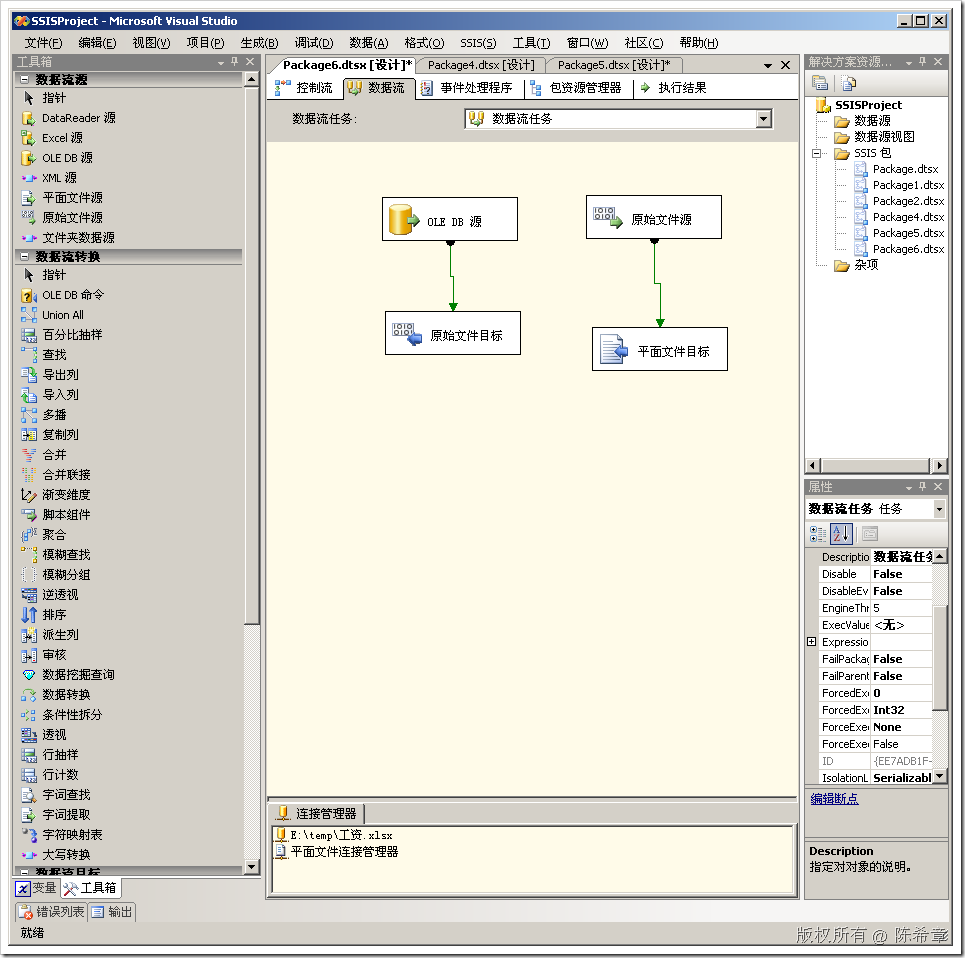
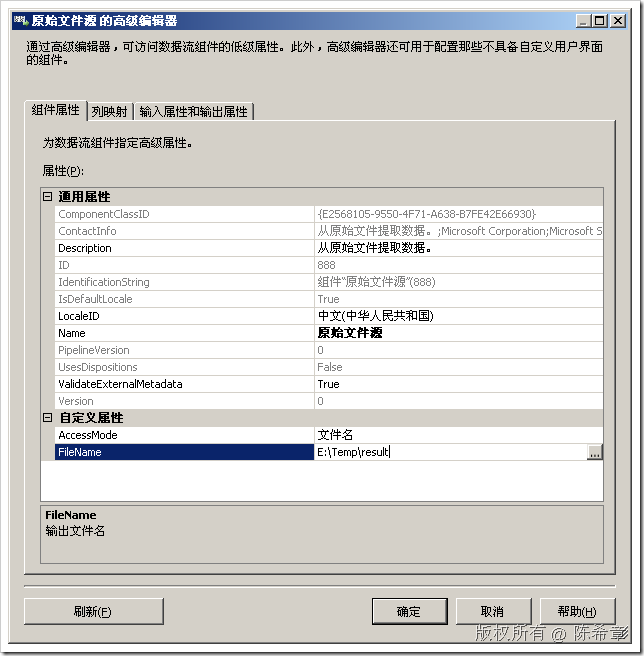
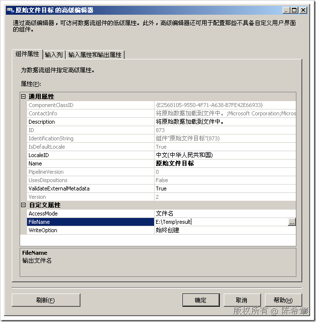
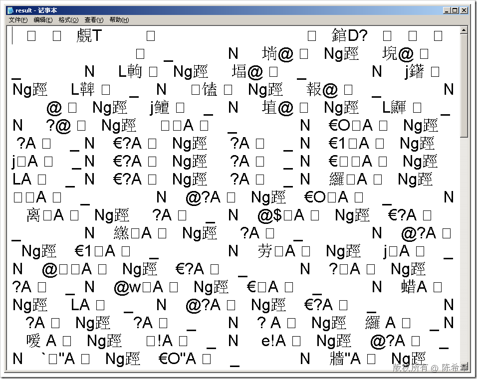

# SSIS中的原始文件源和目标 
> 原文发表于 2009-06-22, 地址: http://www.cnblogs.com/chenxizhang/archive/2009/06/22/1508139.html 

在SSIS中有两个比较特殊的数据源和目标：原始文件源和原始文件目标。

 我们这一篇对他们做一些介绍

  

 从它们的图标，我们可以猜到一些信息：它们是二进制文件。二进制是计算机本身能懂的语言，也就是说二进制是最接近计算机格式的格式。

 所以，为什么要所谓的原始文件源或者目标呢？就是想尽量减少从计算机的二进制格式再转换成其他的格式的过程。

 **从这个意义上，原始文件源或者目标的好处是速度快，因为它们都不需要任何其他的转换，直接写入文件即可。**

 它们的配置也很简单，一般都只需要指定一个文件名即可。这个文件甚至连扩展名都不需要。

  

  

 那么，它们的格式到底是怎么样的呢?

  

 头晕对吧，不要紧。这就是传说中的二进制文件。它们还有一个好处，就是通常情况下，体积比较小。

 其实，对这样的文件我们不应该感到陌生。还是那句话，我们应该了解二进制。

 有同学可能会问，这个格式是怎么解析的呢？或者它是根据什么写成这样的格式的呢？

 我的理解就是：原理和序列化是一样的。只不过，它根本用不着序列化，因为它本身就在内存中，直接将字节写出来就可以了

 本文由作者：[陈希章](http://www.xizhang.com) 于 2009/6/22 10:57:21 发布在：<http://www.cnblogs.com/chenxizhang/>  
 本文版权归作者所有，可以转载，但未经作者同意必须保留此段声明，且在文章页面明显位置给出原文连接，否则保留追究法律责任的权利。   
 更多博客文章，以及作者对于博客引用方面的完整声明以及合作方面的政策，请参考以下站点：[陈希章的博客中心](http://www.xizhang.com/blog.htm) 