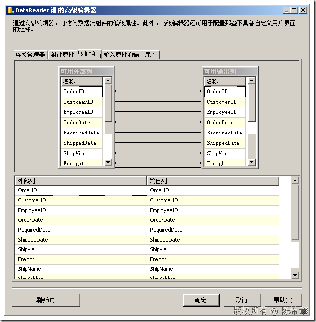
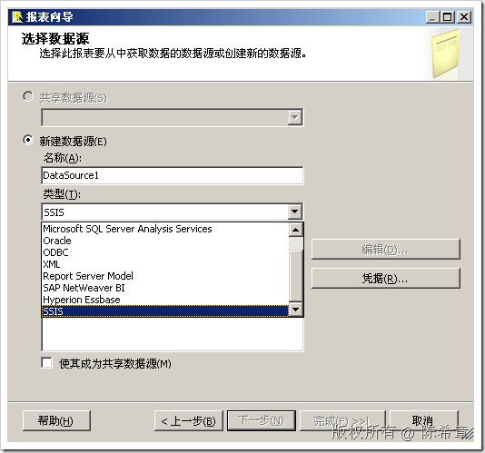
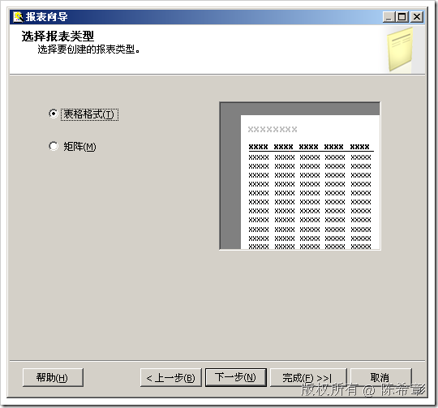

# SSIS中的DataReader源和目标 
> 原文发表于 2009-06-22, 地址: http://www.cnblogs.com/chenxizhang/archive/2009/06/22/1508163.html 

这一篇来讲解一下，SSIS中中的DataReader源和目标。这两个组件与标准的OLEDB源和OLEDB目标的区别在于它直接使用.NET 提供程序。即便仍然是使用OLEDB，也是ADO.NET 里面的OLEDB这个提供程序。

 一般来说，它可能用到的提供程序是

 * ODBC
* OLEDB
* SQLCLIENT

 1. 数据源的配置

  

  

  

 数据源没有太多需要介绍的，你就是可以理解它为一个专门使用.NET 提供程序的数据访问Adapter即可。

  

 相对来说，DataReader目标是让人费解的。

 因为你要是从字面上说，它应该是一个DataReader，也就是读数据，为什么要作为目标呢? 如果它作为目标，那么到底放在什么地方呢？

 放在内存对吧？很好，答对了。但是，如果放在内存，那么干什么用呢？

 我们来看看它的编辑器页面

  

 这里看不到任何可以配置的。但从它的Description中可以看到，这确实是一个在内存中的数据集。

 【注意】这里请记下Name，因为后面会用到

     

  

 问题的关键在于：这个内存中的数据集是用来干什么的？

 原来这是一项新功能，旨在让SSIS与SSRS能够协调工作。简单地说，就是可以把SSIS作为报表设计的数据源

 * 配置 Reporting Services 以使用 SSIS 包数据 [http://msdn.microsoft.com/zh-cn/library/ms345250(SQL.90).aspx](http://msdn.microsoft.com/zh-cn/library/ms345250(SQL.90).aspx "http://msdn.microsoft.com/zh-cn/library/ms345250(SQL.90).aspx")
* 为 SQL Server Integration Services 中的包数据定义报表数据集 [http://msdn.microsoft.com/zh-cn/library/ms159215(SQL.90).aspx](http://msdn.microsoft.com/zh-cn/library/ms159215(SQL.90).aspx "http://msdn.microsoft.com/zh-cn/library/ms159215(SQL.90).aspx")

 这是一项实验功能，还有待观察，要慎重使用

 请先按照上面第一个链接的要求进行配置。

 然后，在新建报表的时候，选择数据源类型为SSIS

  

 完成配置之后，大致是下面这样

  

  

 【注意】这里的名字就是DataReader目标的名称

  

  

  

  

 最后，我们确实能看到报表。鼓掌 ～～

  

  

 小结：DataReader源使用.NET提供程序读取数据。而DataReader目标则设计用来作为Reporting Service的数据源。这是一项新功能

 本文由作者：[陈希章](http://www.xizhang.com) 于 2009/6/22 11:27:29 发布在：<http://www.cnblogs.com/chenxizhang/>  
 本文版权归作者所有，可以转载，但未经作者同意必须保留此段声明，且在文章页面明显位置给出原文连接，否则保留追究法律责任的权利。   
 更多博客文章，以及作者对于博客引用方面的完整声明以及合作方面的政策，请参考以下站点：[陈希章的博客中心](http://www.xizhang.com/blog.htm) 