# SSIS中的SQL Server目标，OLEDB目标以及SQL Server Mobile目标 
> 原文发表于 2009-06-22, 地址: http://www.cnblogs.com/chenxizhang/archive/2009/06/22/1508202.html 


这一篇来讲解一下三个有关联的目标组件。它们分别是：SQL Server目标，OLEDB 目标，和SQL Server Mobile目标

 我的总结如下

 1. SQL Server目标是专门针对SQL Server的，性能较好

 2. OLEDB 目标可以针对包括SQL Server 在内的所有支持OLEDB访问接口的目标，兼容性较好

 3. SQL Server Mobile目标是针对用于手机设备的移动数据库的。它的数据文件个是sdf

  

 下面我们主要来看一下SQL Server Mobile的配置

 我们首先准备一个空白的数据库。可以通过SSMS来实现该需求

 [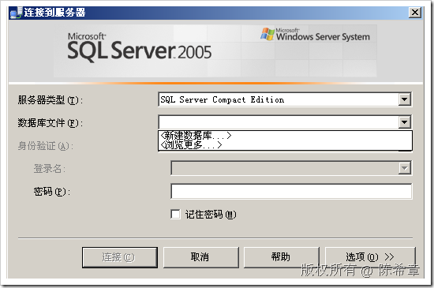](http://images.cnblogs.com/cnblogs_com/chenxizhang/WindowsLiveWriter/SSISSQLServerOLEDBSQLServerMobile_ACE0/image_8.png) 

 点击“新建数据库”

 [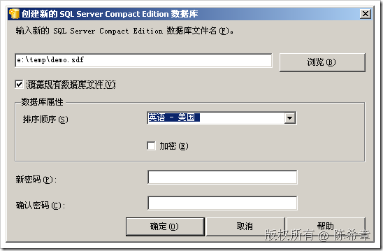](http://images.cnblogs.com/cnblogs_com/chenxizhang/WindowsLiveWriter/SSISSQLServerOLEDBSQLServerMobile_ACE0/image_10.png) 

 [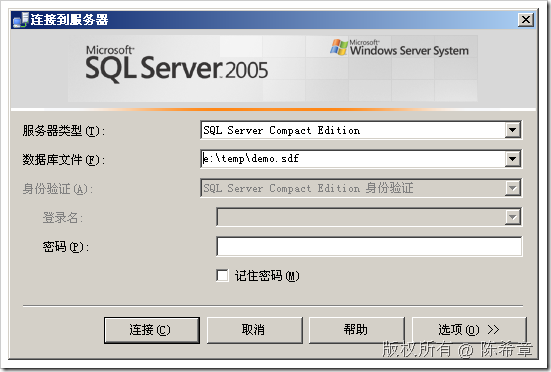](http://images.cnblogs.com/cnblogs_com/chenxizhang/WindowsLiveWriter/SSISSQLServerOLEDBSQLServerMobile_ACE0/image_12.png) 

 [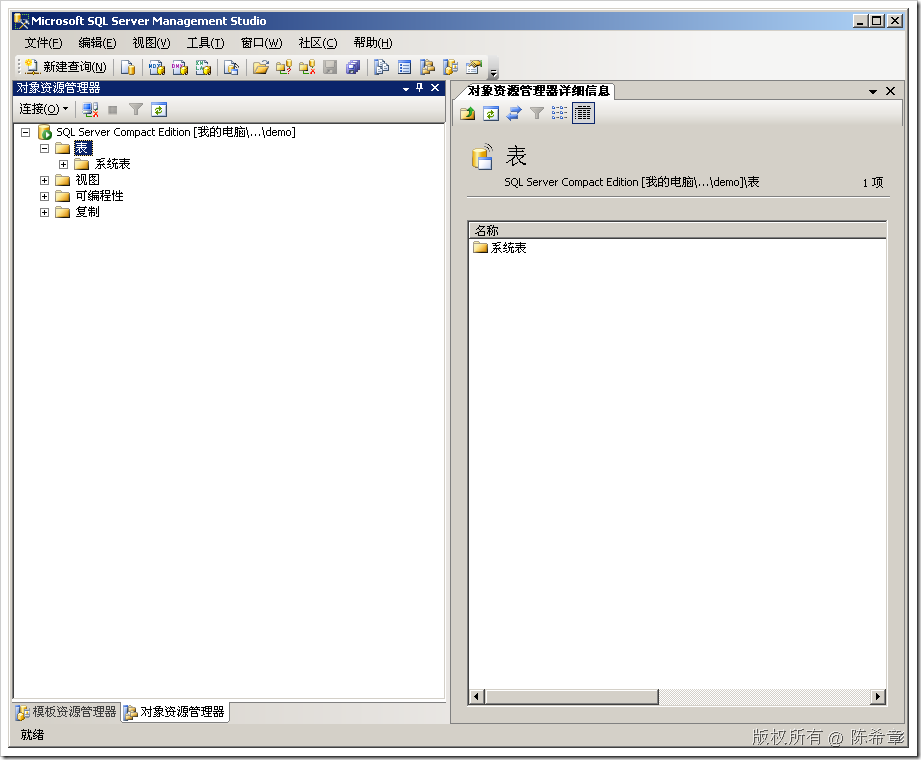](http://images.cnblogs.com/cnblogs_com/chenxizhang/WindowsLiveWriter/SSISSQLServerOLEDBSQLServerMobile_ACE0/image_14.png) 

 使用下面的脚本创建一个表


```
CREATE TABLE Orders
(OrderID INT NOT NULL,
CustomerID NCHAR(5) NULL,
EmployeeID INT,
OrderDate datetime,
RequiredDate Datetime,
ShippedDate Datetime,
ShipVia INT,
Freight money,
ShipName NVARCHAR(40),
    ShipAddress nvarchar(60) NULL,
    ShipCity nvarchar(15) NULL,
    ShipRegion nvarchar(15) NULL,
    ShipPostalCode nvarchar(10) NULL,
    ShipCountry nvarchar(15) NULL
)
```

.csharpcode, .csharpcode pre
{
 font-size: small;
 color: black;
 font-family: consolas, "Courier New", courier, monospace;
 background-color: #ffffff;
 /*white-space: pre;*/
}
.csharpcode pre { margin: 0em; }
.csharpcode .rem { color: #008000; }
.csharpcode .kwrd { color: #0000ff; }
.csharpcode .str { color: #006080; }
.csharpcode .op { color: #0000c0; }
.csharpcode .preproc { color: #cc6633; }
.csharpcode .asp { background-color: #ffff00; }
.csharpcode .html { color: #800000; }
.csharpcode .attr { color: #ff0000; }
.csharpcode .alt 
{
 background-color: #f4f4f4;
 width: 100%;
 margin: 0em;
}
.csharpcode .lnum { color: #606060; }

 


 


准备好数据库之后，我们回到BI Studio中，来设计SQL Server Mobile目标组件


首先，建立一个连接


[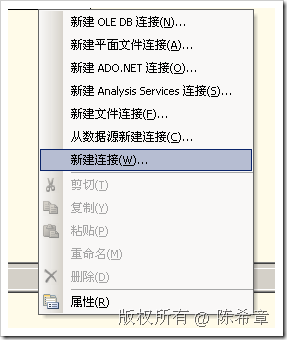](http://images.cnblogs.com/cnblogs_com/chenxizhang/WindowsLiveWriter/SSISSQLServerOLEDBSQLServerMobile_ACE0/image_2.png) 


[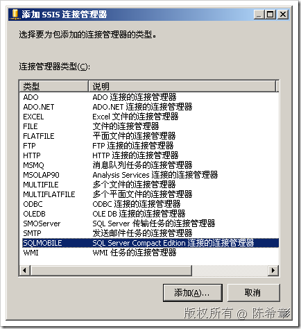](http://images.cnblogs.com/cnblogs_com/chenxizhang/WindowsLiveWriter/SSISSQLServerOLEDBSQLServerMobile_ACE0/image_4.png) 


选择“SQLMOBILE”，点击“添加”


[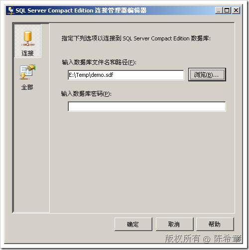](http://images.cnblogs.com/cnblogs_com/chenxizhang/WindowsLiveWriter/SSISSQLServerOLEDBSQLServerMobile_ACE0/image_16.png) 


然后，我们选择“SQL Server Mobile目标”，右键，编辑


[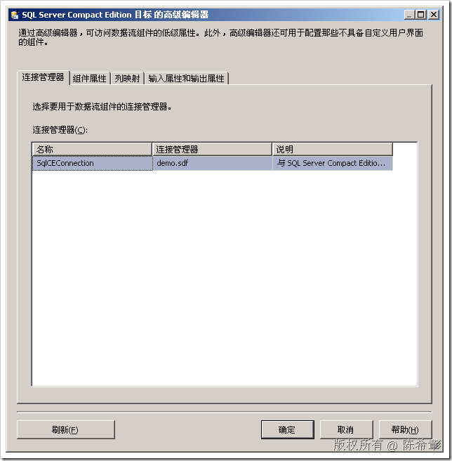](http://images.cnblogs.com/cnblogs_com/chenxizhang/WindowsLiveWriter/SSISSQLServerOLEDBSQLServerMobile_ACE0/image_18.png) 


[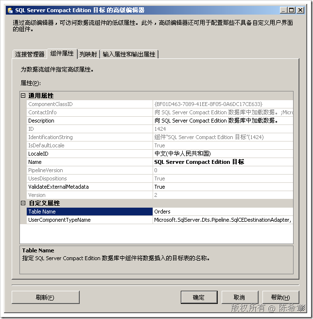](http://images.cnblogs.com/cnblogs_com/chenxizhang/WindowsLiveWriter/SSISSQLServerOLEDBSQLServerMobile_ACE0/image_20.png) 


[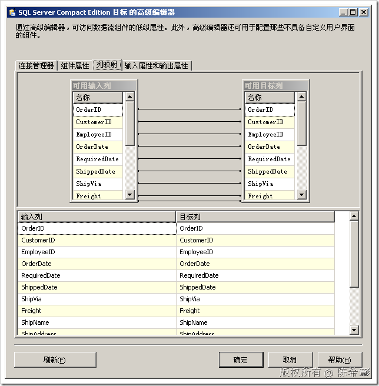](http://images.cnblogs.com/cnblogs_com/chenxizhang/WindowsLiveWriter/SSISSQLServerOLEDBSQLServerMobile_ACE0/image_26.png) 


配置好的数据流任务大致如下


[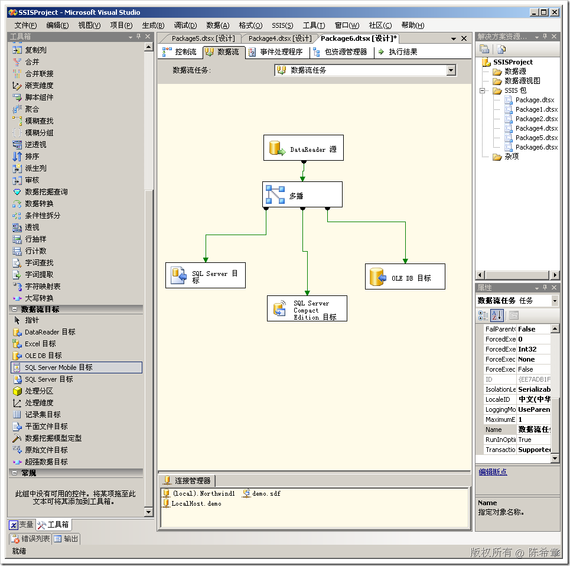](http://images.cnblogs.com/cnblogs_com/chenxizhang/WindowsLiveWriter/SSISSQLServerOLEDBSQLServerMobile_ACE0/image_24.png) 


[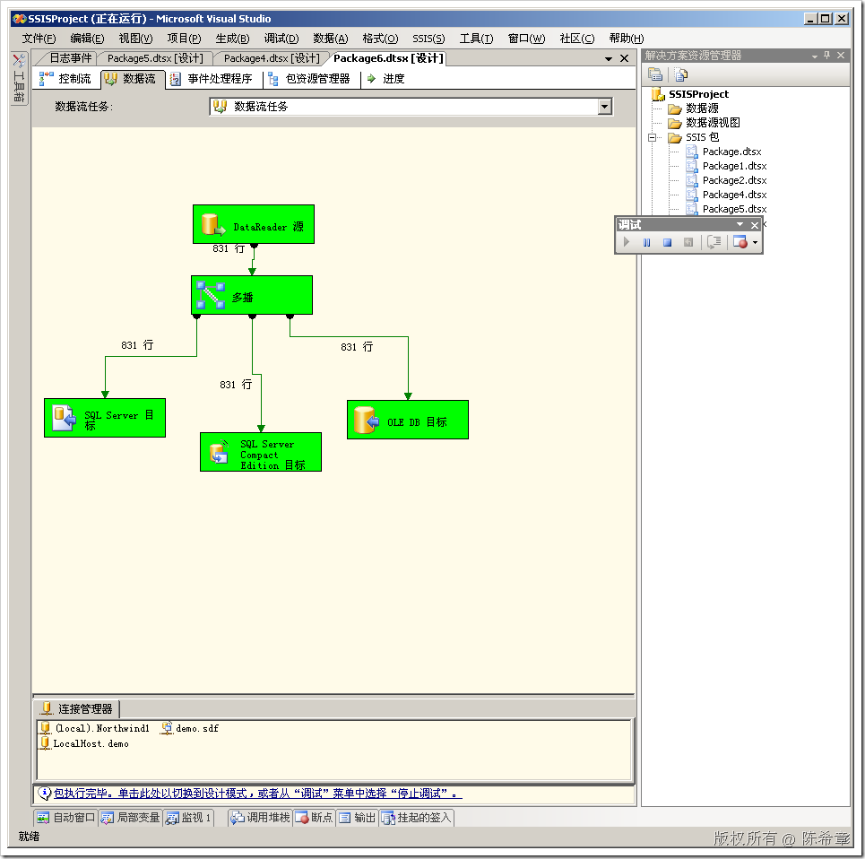](http://images.cnblogs.com/cnblogs_com/chenxizhang/WindowsLiveWriter/SSISSQLServerOLEDBSQLServerMobile_ACE0/image_28.png) 


通过工具查看里面的数据如下


[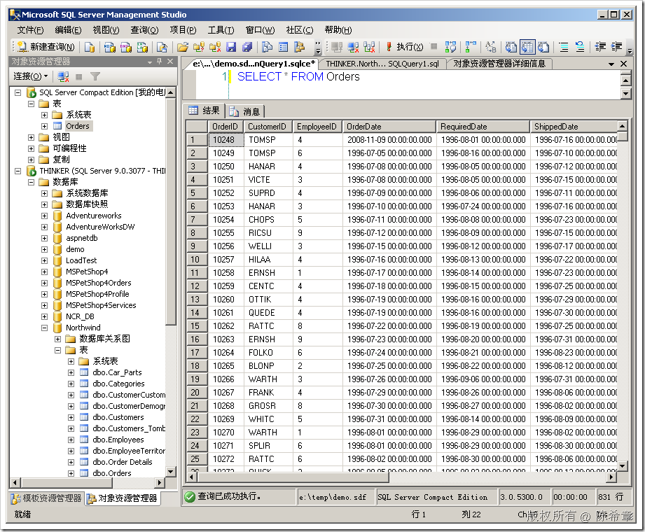](http://images.cnblogs.com/cnblogs_com/chenxizhang/WindowsLiveWriter/SSISSQLServerOLEDBSQLServerMobile_ACE0/image_30.png)


本文由作者：[陈希章](http://www.xizhang.com) 于 2009/6/22 12:17:38 
发布在：<http://www.cnblogs.com/chenxizhang/>  

本文版权归作者所有，可以转载，但未经作者同意必须保留此段声明，且在文章页面明显位置给出原文连接，否则保留追究法律责任的权利。   

更多博客文章，以及作者对于博客引用方面的完整声明以及合作方面的政策，请参考以下站点：[陈希章的博客中心](http://www.xizhang.com/blog.htm)
